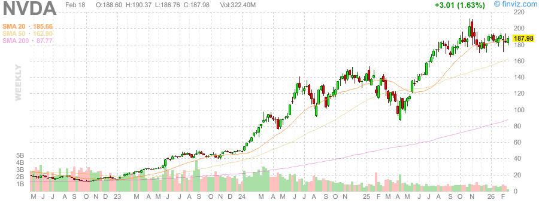
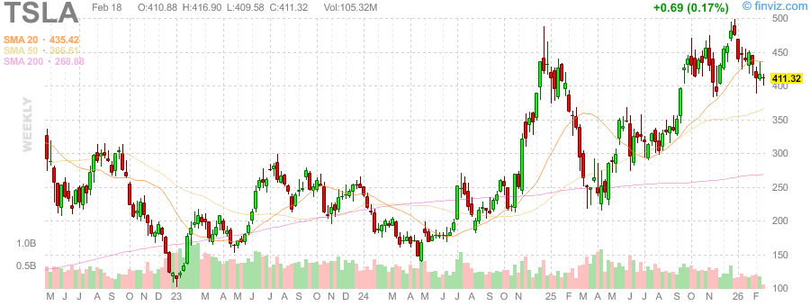
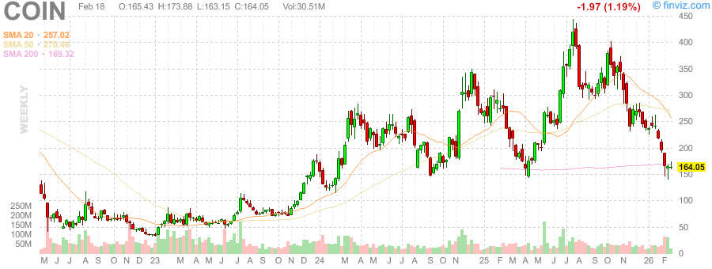
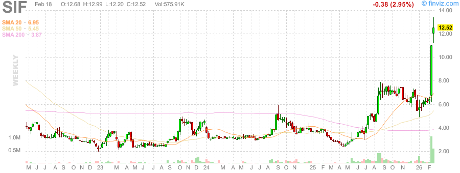

# 2026年2月18日 深度股票研究报告

**市场状态**: ✅ 美股正常交易

---

## 📊 市场概览

| 指数 | 状态 |
|------|------|
| SPY (S&P 500) | 周线收于高位 |
| QQQ (纳斯达克) | 科技股强劲 |
| VIX | 波动率回落 |

### 关键观察
- 市场情绪偏乐观，但需警惕短期回调
- 科技股继续领涨，NVDA创新高

---

## 🥇 黄金/白银比率分析

### 当前数据
- **黄金 (XAU/USD)**: $4,996.10
- **白银 (XAG/USD)**: $77.13
- **金/银比率**: **64.78**

### 历史对比
| 时期 | 比率 |
|------|------|
| 2020年 COVID 峰值 | ~125 |
| 1991年 历史高位 | ~100 |
| 长期均值 | 50-60 |
| **当前** | **64.78** |

### 解读
- 当前比率高于长期均值(50-60)，表明白银相对黄金被低估
- 距离历史极值(100+)仍有空间
- 若避险需求上升，黄金可能继续领涨
- 若风险偏好回升，白银可能追赶涨幅

---

## 📈 个股技术分析

### NVDA (英伟达)

- **走势**: 强劲上升趋势
- **关键位**: 关注150美元支撑

### TSLA (特斯拉)

- **走势**: 震荡上行
- **风险**: 估值偏高

### COIN (Coinbase)

- **走势**: 突破整理区间
- **关注**: 加密市场情绪

---

## 🛡️ 贵金属走势

### 黄金期货 (GC=F)

### 白银期货 (SI=F)

---

## ⚠️ 异常信号

1. **黄金/白银比率**: 64.78，高于均值但未达极值
2. **VIX回落**: 市场恐慌情绪缓解
3. **科技股轮动**: NVDA领涨后需关注获利了结

---

## 💡 策略建议

### 短期 (1-2周)
- 保持谨慎，关注SPY 580-590支撑
- 可适度配置贵金属对冲风险

### 中期 (1-3个月)
- **黄金/白银比率策略**: 若比率回落至60以下，可考虑多白银空黄金套利
- 关注科技股财报季

### 风险提示
- 美股估值处于历史高位
- 地缘政治不确定性仍存

---

*报告生成时间: 2026-02-18 15:00 PST*
