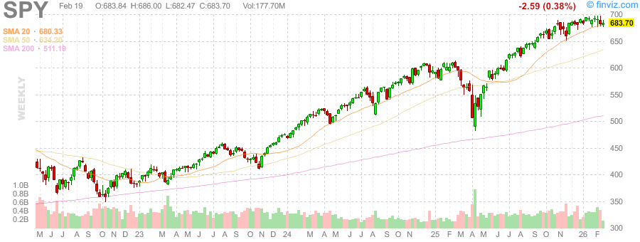
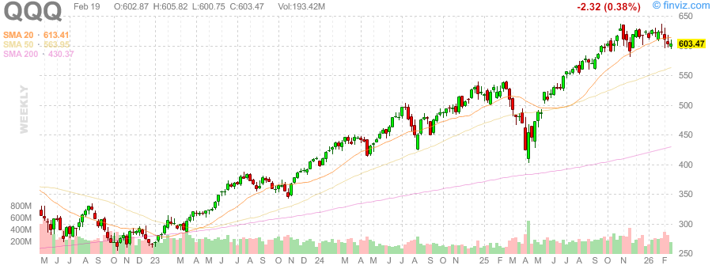
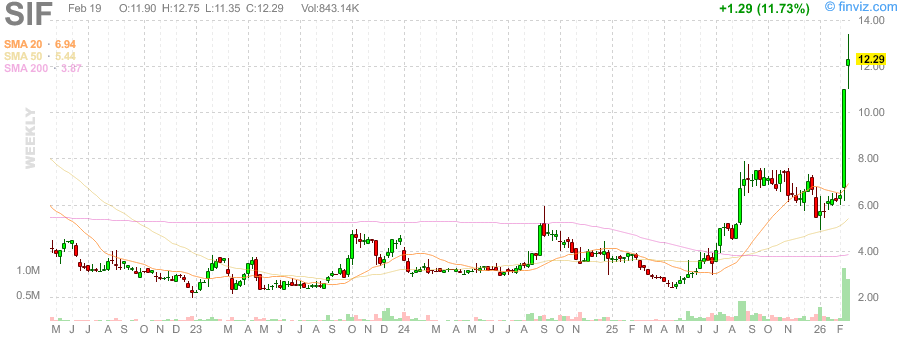

# 每日早间股票研究报告 - 2026年02月19日

## 1. 市场趋势与热点摘要
- **美股盘前**: U.S. stocks softened on Thursday following mixed economic data and Walmart’s report. Geopolitical tensions between the US and Iran are boosting crude oil and gold prices.
- **数据发布**: Philly Fed Manufacturing Index (Feb) actual 16.30 vs 7.50 forecast (Positive). Initial Jobless Claims actual 206K vs 223K forecast (Positive).
- **主要动态**: Gold prices holding near $5,000/oz level. Solar industry is looking for alternatives to silver due to soaring costs.

## 2. 黄金/白银比率 (Gold/Silver Ratio)
- **黄金 (Spot)**: $4,995.89 / oz
- **白银 (Spot)**: $77.47 / oz
- **黄金/白银比率**: **64.49**

## 3. 市场图表回顾 (周线)

### 大盘指数 (SPY & QQQ)

### 波动率指数 (VIX)

### 贵金属 (黄金 & 白银)

---
*报告生成于: 2026-02-19 09:00 AM PST*
