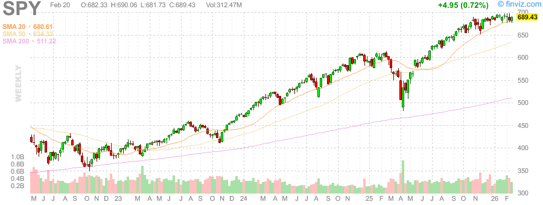
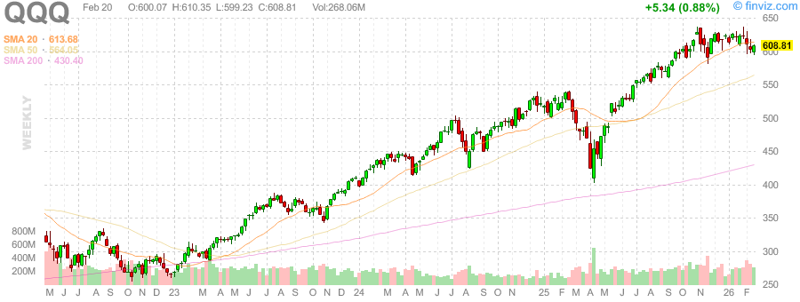
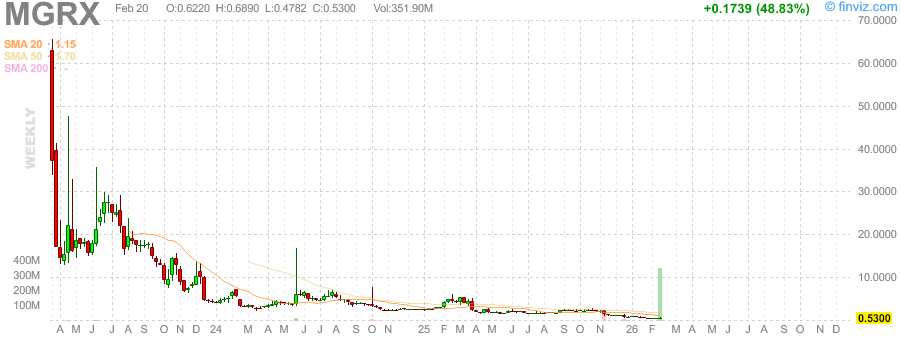
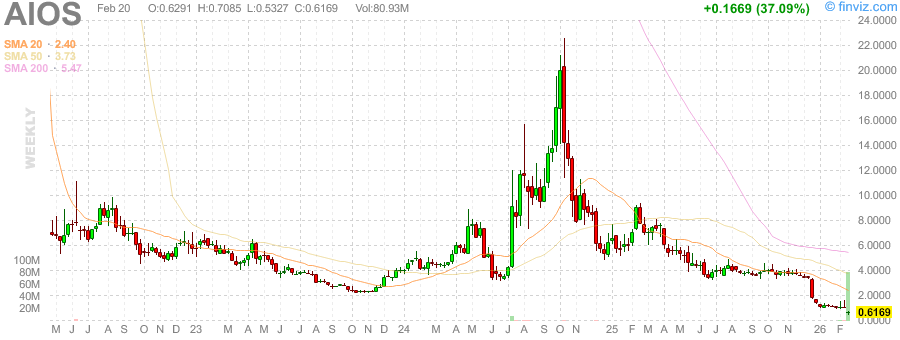
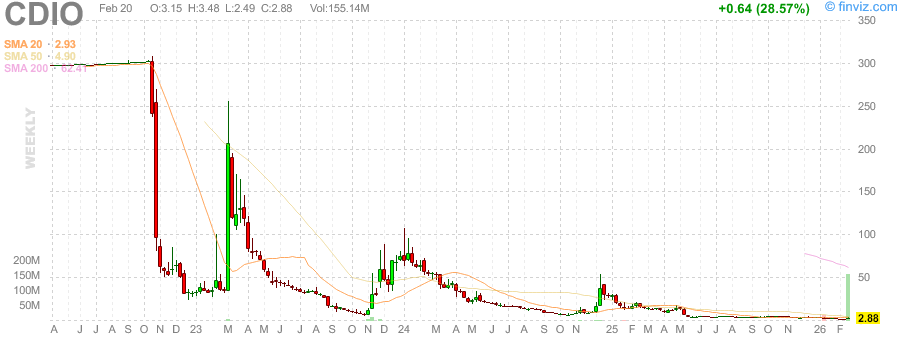

# 每日早间股票研究报告 (2026-02-21)

## 1. 市场热点与趋势
今日为周六，美股休市。以下为周五收盘及盘前部分热门股动态：
- **市场情绪**: 投资者关注通胀数据与美联储动向。
- **热门股 (Pre-market Movers)**:
  - **MGRX** (Mangoceuticals, Inc.): +75.79% (盘前活跃)
  - **AIOS** (AIOS Tech Inc.): +39.82%
  - **CDIO** (Cardio Diagnostics): +35.27%
  - **GFAI** (Guardforce AI): +25.94%
  - **TNDM** (Tandem Diabetes): +22.79%

## 2. 贵金属动态与黄金/白银比率
- **黄金价格 (GC=F)**: $5,105.90 (+2.22%)
- **白银价格 (SI=F)**: $84.52 (+7.77%)
- **黄金/白银比率**: **60.41**
  - *比率下降，显示白银表现强于黄金。*

## 3. 市场 K 线图 (周线)
### 大盘与波动率

### 贵金属

### 热门股

---
*注：今日为周末，市场休市，以上数据反映最新交易日及实时金属行情。*
