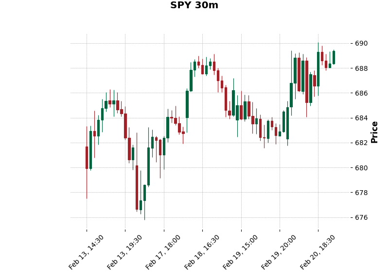
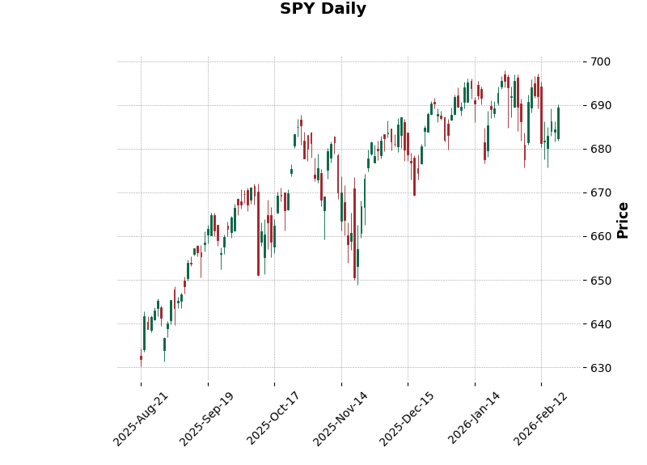
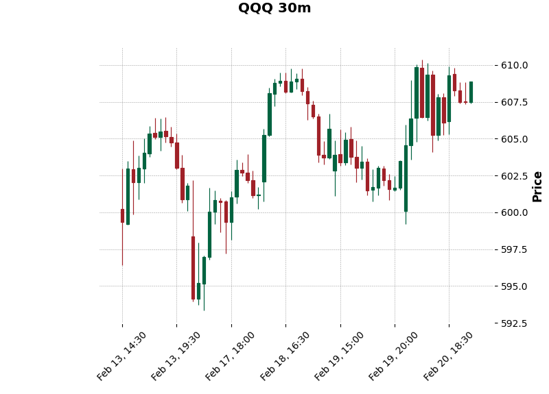
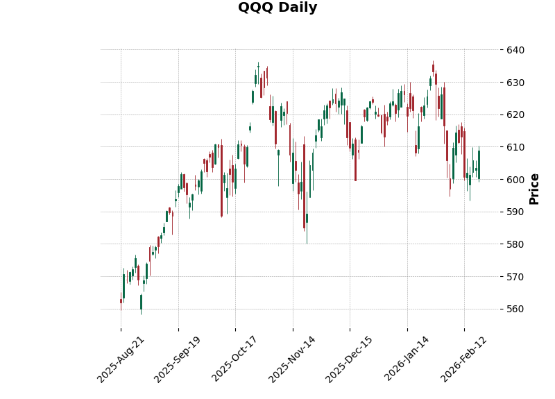
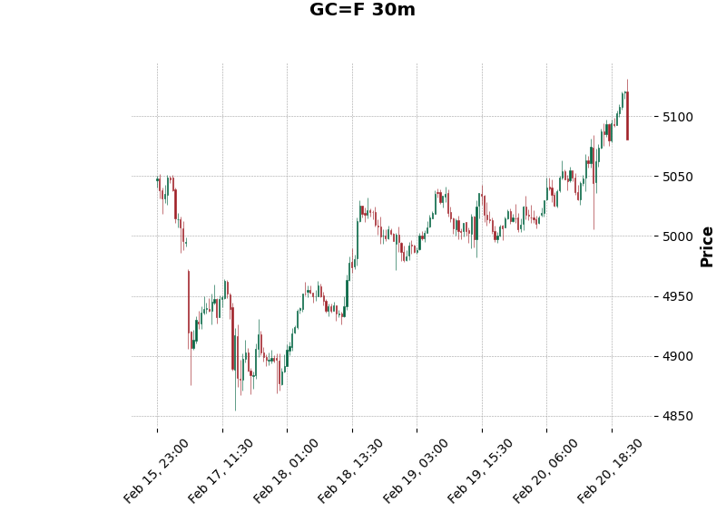
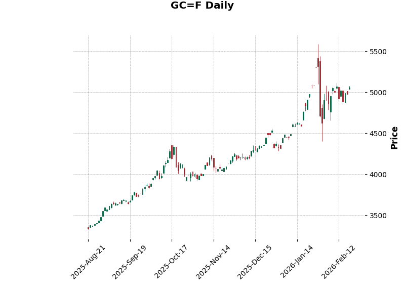
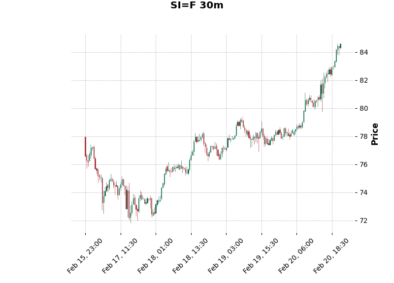
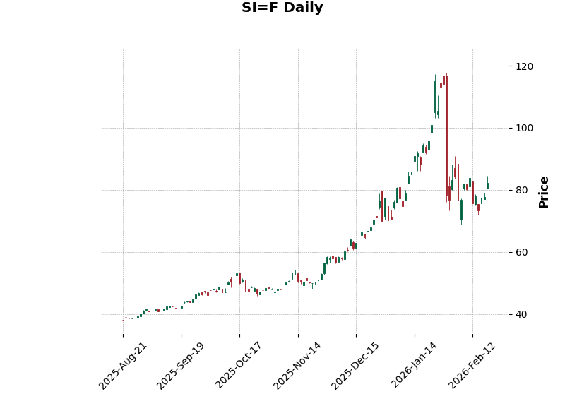

# 📊 2026-02-21 周末特刊：大盘与金银多周期分析

**报告时间:** 2026年2月21日 (周末)
**分析周期:** 30分钟 K 线 (近5日) & 日线 (近6个月)

---

## 1. 市场核心指数 (SPY / QQQ)

### 标普 500 (SPY)

*上图：SPY 30分钟线（显示近5个交易日走势）*

*上图：SPY 日线（显示近6个月走势）*

### 纳指 100 (QQQ)

*上图：QQQ 30分钟线（显示近5个交易日走势）*

*上图：QQQ 日线（显示近6个月走势）*

---

## 2. 贵金属市场 (黄金 GC / 白银 SI)

### 黄金期货 (Gold)

*上图：黄金 30分钟线。当前金价在高位维持强势震荡。*

*上图：黄金 日线。展示过去半年的牛市通道。*

### 白银期货 (Silver)

*上图：白银 30分钟线。显示近期补涨动能。*

*上图：白银 日线。底部抬升明显，关注能否突破前期阻力。*

---

## 3. 分析与总结
- **短期视角 (30min)**: 本周最后两个交易日波动加剧，金银在避险情绪带动下表现优于大盘。
- **中期视角 (Daily)**: 过去半年大盘维持上涨趋势，但金银的斜率在近期明显变陡，显示资金正在流入避险资产。

---
*Generated by Sammy AI (Weekend Special Edition)*
