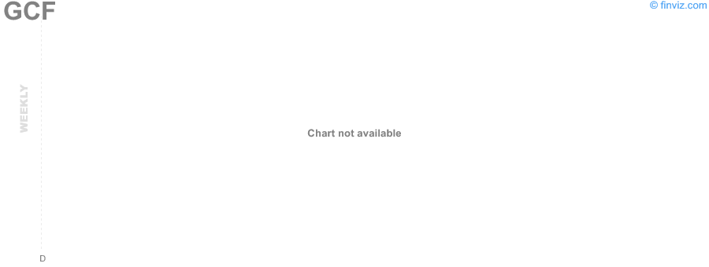
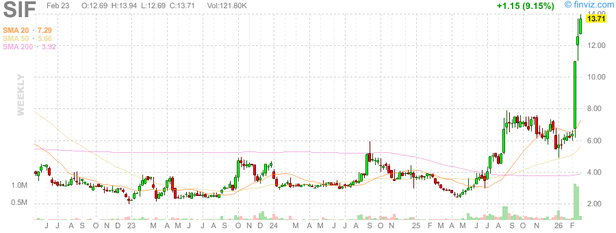
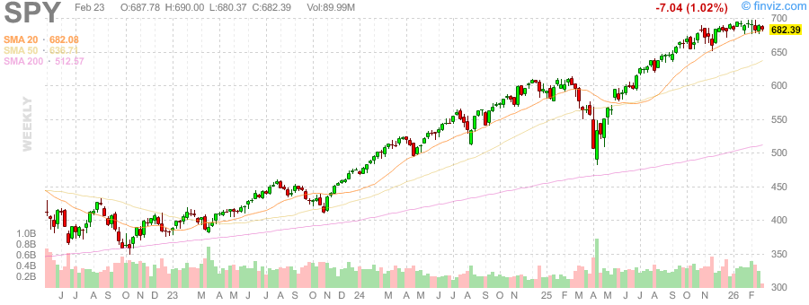
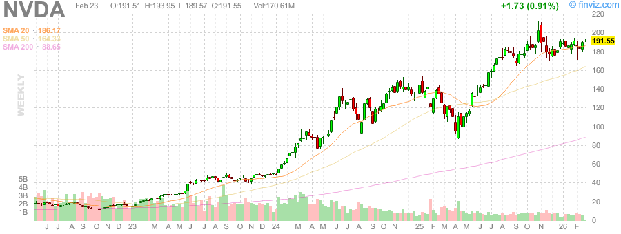
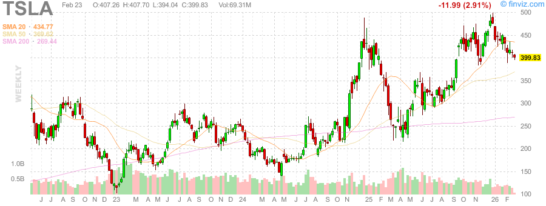

# 每日深度股票研究报告 (2026-02-23)

## 市场概览
今日美股市场大幅收跌，道指创下月内最差单日表现。特朗普政府关于“替代关税”的讨论引发了市场对全球贸易和跨国公司盈利的深度担忧。

- **SPY**: $683.75 (-1.04%)
- **QQQ**: Nasdaq 下跌 1.13%
- **VIX**: 21.01 (+10.06%) —— 恐慌指数重回 20 关口上方。

## 金/银比率专节
贵金属市场在避险情绪驱动下暴涨。

- **黄金 (XAU)**: $5251.30 (+3.35%)
- **白银 (XAG)**: $88.42 (+7.38%)
- **金/银比率**: **59.39**

分析：白银涨幅翻倍于黄金，显示出极其强劲的避险动能。金银比率下降至 59 左右，历史上这往往发生在贵金属牛市的主升浪期间。

## 个股技术分析
- **NVDA**: AI 板块在宏观压力下回吐。
- **TSLA**: 在关税担忧中表现波动。
- **COIN**: 比特币 ETF 资金流出直接打击了加密相关股。

## 异常信号
- **Option Flow**: 观察到大量针对 SPY 的末日看跌期权买入。
- **Institutional Sentiment**: 避险情绪浓厚，资金正快速逃离高成长科技股，进入防御性金属。

## 策略建议
- **短期策略**: 维持防守姿态，关注 VIX 是否能站稳 20 关口。
- **长期布局**: 金银仍具备较强上涨惯性。

---
*生成时间: Mon Feb 23 05:03:18 PM PST 2026*
