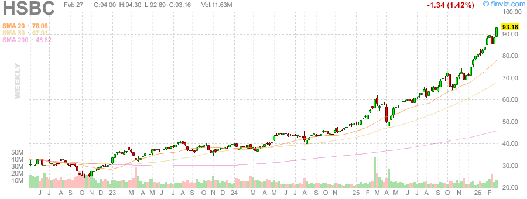
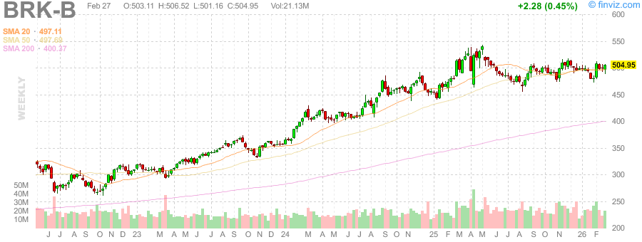

# 📉 每日深度股票研究报告 (2026-02-28 下午)

**时间**: Saturday, February 28, 2026 · 3:00 PM PST  
**口径**: 基于 2/27 美股收盘与周线结构（周末复盘）

---

## 一、市场框架（先看大盘再看个股）

- **SPY** 收于 **$685.99**，**QQQ** 收于 **$607.29**，显示指数层面仍在高位震荡。
- **VIX = 19.86**：波动率不算恐慌，但明显高于“极度平静区”，说明市场对宏观与估值仍有戒心。
- 近期交易风格偏向“**事件驱动 + 主题轮动**”：财报超预期不一定立刻涨，叙事（AI、并购传闻、监管）会放大短线波动。

---

## 二、贵金属与黄金/白银比率（核心必看）

- **黄金 GC=F**：**$5,267.20/oz**  
- **白银 SI=F**：**$93.636/oz**  
- **黄金/白银比率（Gold/Silver Ratio）**：**56.25**

### 解读
- 比率在 56 附近，说明白银相对黄金并未明显失速，贵金属板块仍在“避险+通胀预期”双线交易。
- 若后续比率继续下行（例如向 50 靠拢），通常代表白银风险偏好更强；若快速上行，则常见为风险偏好回落、黄金防御属性抬升。

---

## 三、重点个股深度观察

### 1) CRCL（Circle）
- 2月内在强财报与 USDC 流通增长叙事下显著走强。
- 市场正在重估“稳定币基础设施”的盈利弹性与估值锚，但波动率仍高，需防范高位回撤。

### 2) PYPL（PayPal）
- 受到“Stripe 潜在并购传闻”驱动出现剧烈异动，随后又有否认消息导致回吐。
- 本质上是**估值修复 + 事件博弈**，持续性取决于后续战略落地与利润改善，而不是单一传闻。

### 3) FSLY（Fastly）
- 财报改善与 AI/边缘计算叙事共振，2月阶段性涨幅巨大。
- 短线已进入“高弹性高分歧”区间：上行空间仍在，但对节奏与仓位控制要求明显提升。

### 4) HSBC
- 分红与资本回报框架更清晰，防御属性相对突出。
- 在成长风格波动加大的环境里，高股息金融股具备一定配置价值，但对利率路径较敏感。

---

## 四、结论（执行层）

1. **指数层面**：不宜追高，维持“回踩观察 + 分批配置”思路。  
2. **贵金属层面**：继续跟踪 Gold/Silver Ratio（56.25），作为风险偏好切换的领先信号之一。  
3. **主题层面**：CRCL/FSLY/PYPL 均属高波动资产，适合事件驱动交易，需严格止损与仓位纪律。  
4. **防御层面**：在高估值与高波动并存阶段，可用部分高股息/低波动资产平衡组合。

---

## 📊 本报告使用的真实K线图（周线）

### 大盘与波动率

### 贵金属

### 个股

---

*数据来源：公开市场历史行情（周末复盘口径）。本内容仅作研究记录，不构成投资建议。*
