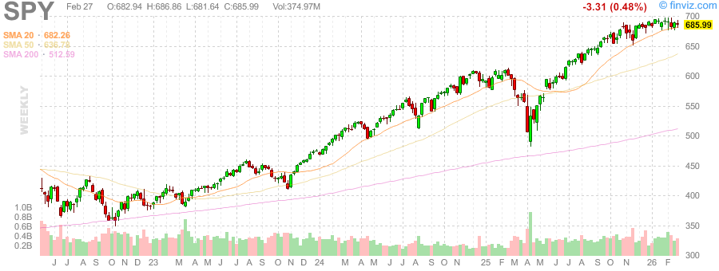
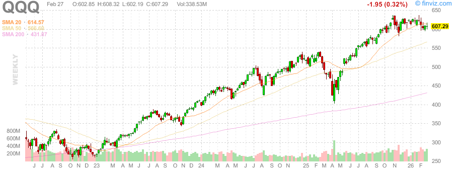
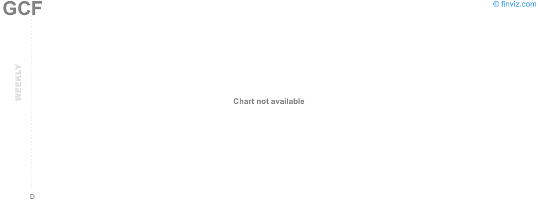
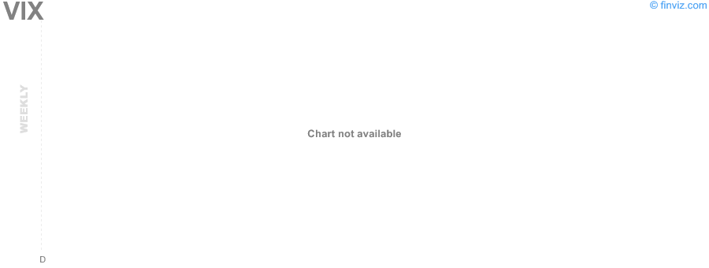
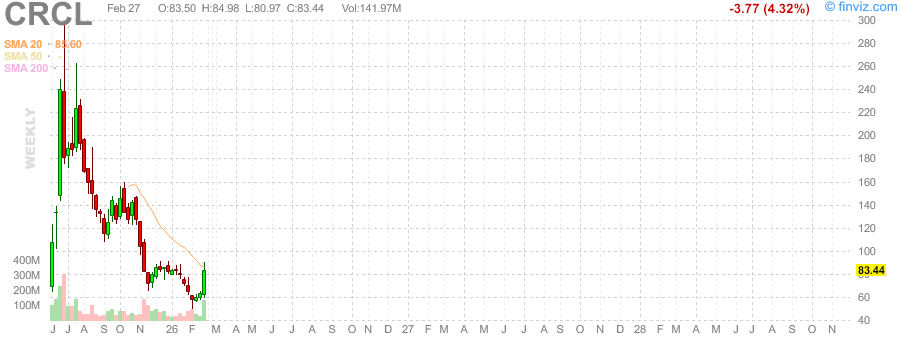
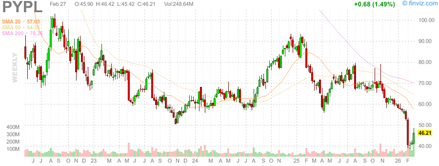
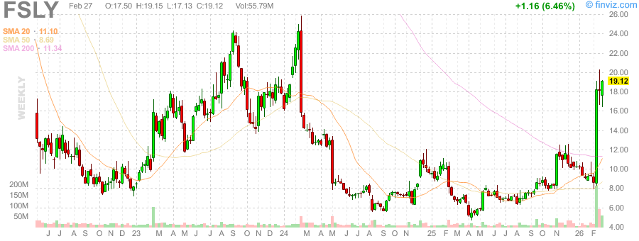

# 📈 每日股票研究报告 (2026-02-28)

## 📊 市场概览
2026年2月收盘，主要指数本月收益为负。S&P 500 指数 (SPY) 收于 6,878.84，较上周下跌 0.44%。

### 市场趋势
- **AI 担忧**: AI 引发的失业担忧对科技股造成沉重压力。
- **地缘政治**: 美国-伊朗紧张局势推高了避险资产，特别是贵金属。
- **小盘股崛起**: Russell 2000 在1月飙升 5.4%，显示出市场领导地位的转变。

## 💰 贵金属与比率
- **黄金 (GC=F)**: $5,292.66 / oz
- **白银 (SI=F)**: $94.50 / oz
- **黄金/白银比率 (Gold/Silver Ratio)**: **56.01**

## 🇺🇸 US Treasury Yields
- **3M (^IRX)**: 3.58%
- **5Y (^FVX)**: 3.51%
- **10Y (^TNX)**: 3.96%
- **30Y (^TYX)**: 4.63%

## 🚀 热门股观察
- **CRCL (Circle Internet Group)**: 周涨幅 +32.40%，受 USDC 流通量增长 72% 及强劲 Q4 财报推动。
- **PYPL (PayPal)**: 上涨 10.95%，市场传闻 Stripe 考虑收购其部分或全部业务。
- **FSLY (Fastly)**: 2月涨幅达 107.2%，成为全月最大赢家之一。
- **HSBC (汇丰控股)**: 上涨 5.68%，上调股息并发布新财务目标。

## 📈 K线图 (周线)

### 大盘指数

### 避险资产与波动率

### 热门个股

