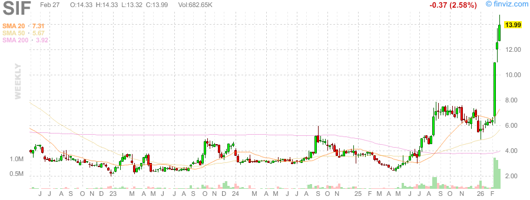
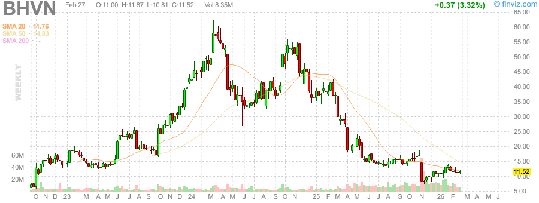
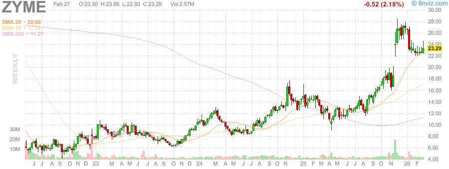
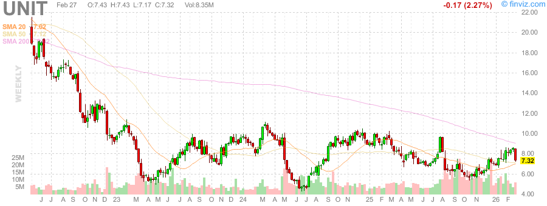
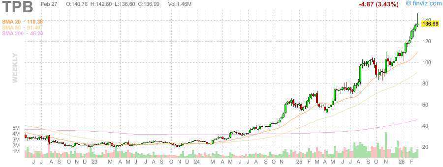
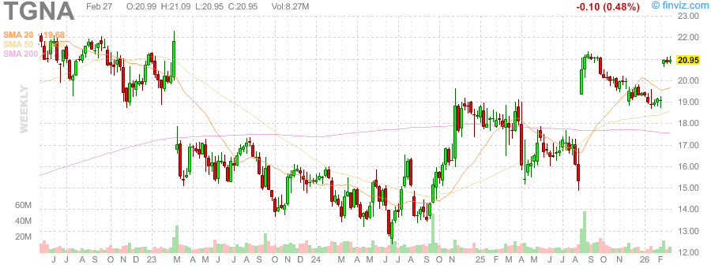

# 📊 每日深度股票研究报告 (2026-03-01 下午)

**时间**: Sunday, March 1, 2026 · 3:00 PM PST  
**口径**: 周末深度复盘（基于 2/27 收盘 + 周线结构 + 周末舆情）

---

## 一、市场框架（先看风险，再看机会）

- **SPY / QQQ** 周线仍在高位区间内运行，趋势未破，但短线性价比下降。
- 市场当前核心矛盾不是“是否有趋势”，而是“在高估值位置能否继续扩张估值”。
- 周末资金风格偏向：
  1) 有事件催化的中小盘（高波动）
  2) 贵金属相关（对冲地缘与通胀不确定性）

**策略含义**：下周一更适合“看确认后跟随”，而不是盲目抢跑。

---

## 二、黄金/白银比率（Gold/Silver Ratio）

- 黄金（GC=F）: **5247.90**  
- 白银（SI=F）: **89.665**  
- **黄金/白银比率 = 58.53**

### 解读
- 比率处于偏中高区，显示黄金仍有相对防御优势，但白银并未全面失速。
- 若比率后续持续上行（>60），通常意味着市场更偏防守；
- 若比率回落（向55甚至更低），常见于风险偏好回暖、白银弹性占优。

---

## 三、重点标的深度观察（周末热度 + 结构）

### 1) BHVN
- 生物医药高弹性标的，资金博弈特征明显。
- 适合事件驱动交易，不适合无催化重仓。
- **关注点**：若放量突破周线压力，可能出现趋势延展；若缩量冲高，需防假突破。

### 2) ZYME
- 同属医药赛道，估值弹性高但回撤也快。
- **关注点**：是否形成“高低点同步抬升”的结构确认。

### 3) UNIT
- REITs/高股息属性在波动环境下具防守价值。
- **关注点**：利率预期变化对估值的压制/释放。

### 4) TPB
- 消费防御属性+个股事件预期并存。
- **关注点**：若放量站稳关键均线，可看修复延续；否则偏震荡。

### 5) TGNA
- 传媒板块，受广告周期与事件窗口影响较大。
- **关注点**：是否获得基本面或并购相关新催化来支撑估值再定价。

---

## 四、执行建议（下周一）

1. **指数层面**：优先观察开盘30–60分钟后方向确认，再决定节奏。  
2. **贵金属层面**：继续跟踪 Gold/Silver Ratio（58.53）作为风险偏好温度计。  
3. **个股层面**：BHVN/ZYME/TPB/TGNA 属于高波动交易标的，严格仓位与止损纪律。  
4. **组合层面**：保留部分防御仓位（现金或低波动资产），避免单一叙事暴露过大。

---

## 📉 本报告使用的真实K线图（周线）

### 大盘与贵金属

### 重点个股

---

*数据来源：公开市场历史行情与周末信息汇总；图表为真实下载的周线K线图。本内容仅作研究记录，不构成投资建议。*
