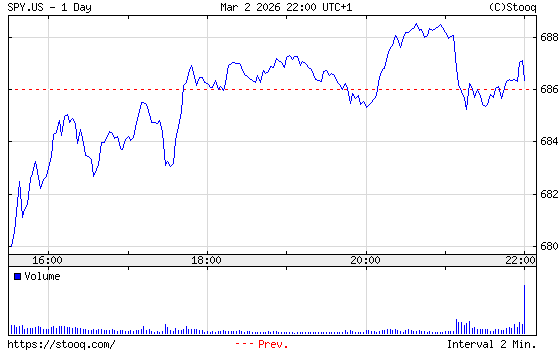
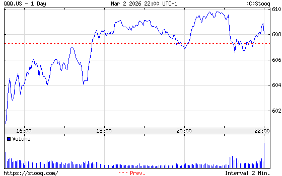
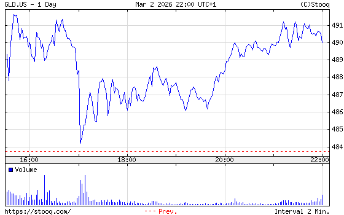
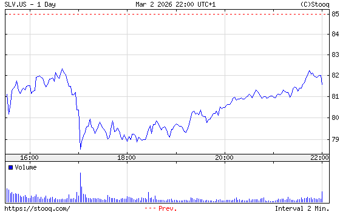
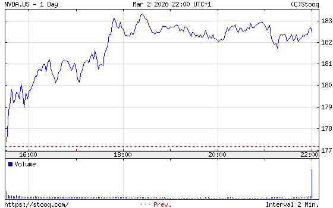
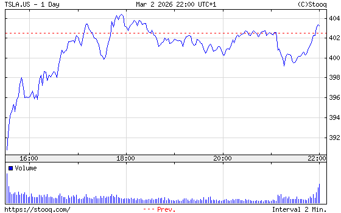
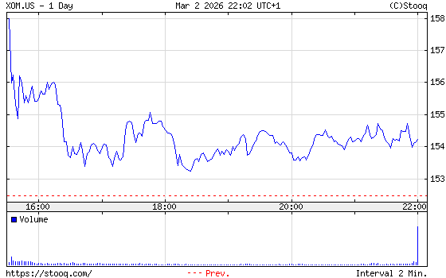

# 📊 每日深度股票研究报告 (2026-03-02 下午)

**时间**: Monday, March 02, 2026 · 03:03 PM PST  
**口径**: 美股下午盘深度追踪（当日行情）

---

## 一、指数与宏观框架

- **SPY**: 686.34 (+1.13% vs open)
- **QQQ**: 608.09 (+1.54% vs open)
- **VIX**: N/A
- **10Y Treasury (^TNX)**: N/A
- **DXY**: 98.50 (+0.57% vs open)

**宏观解读**:
- SPY/QQQ 同步上行，显示风险资产总体仍偏强。
- 若后续 VIX 回落并维持低位，趋势延续概率更高；若 VIX 反弹，需要防范尾盘波动。
- DXY 与利率方向仍是估值锚，成长股对其变化最敏感。

## 二、黄金/白银比率（Gold/Silver Ratio）

- **黄金期货 GC=F**: 5354.14 (+0.02% vs open)
- **白银期货 SI=F**: 90.47 (normalized)
- **Gold/Silver Ratio = 59.18**

**解读**:
- 金银比位于中高区间，市场仍保留一定防御定价。
- 若比率持续上行，通常意味着黄金相对白银更强；若比率回落，白银弹性更易释放。
- 可用 GLD/SLV 的相对强弱做交易确认。

## 三、关键个股动量

- **NVDA**: 182.48 (+4.27% vs open)
- **TSLA**: 403.23 (+3.23% vs open)
- **XOM**: 154.22 (-3.22% vs open)
- **META**: 653.56 (+2.57% vs open)
- **AMZN**: 208.30 (+1.83% vs open)

**观察要点**:
1. 科技龙头（NVDA/AAPL/MSFT/META）是否维持强者恒强。
2. TSLA 与高贝塔板块能否继续放量。
3. XOM 与贵金属（GLD/SLV）是否出现防御轮动。

## 四、下午盘执行建议

1. 顺势交易但避免尾盘追高，优先分批执行。
2. 若指数创新高但成交量不足，警惕冲高回落。
3. 以金银比与 VIX 作为风险偏好温度计，动态调仓。

---

## 📉 真实下载K线图

---
*数据来源：公开市场行情；图表为真实下载的日线K线图（candlestick PNG）。仅作研究记录，不构成投资建议。*