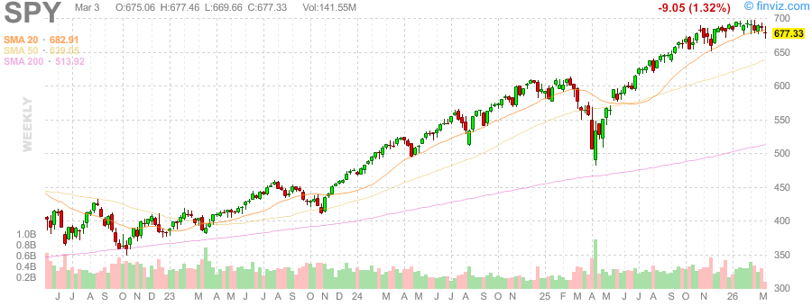
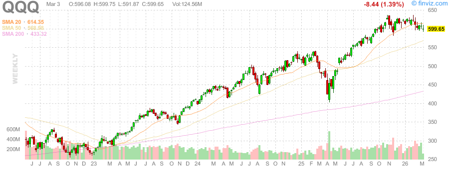
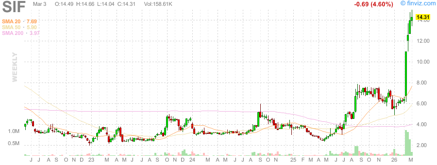
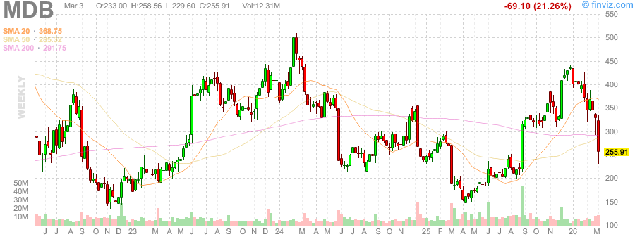
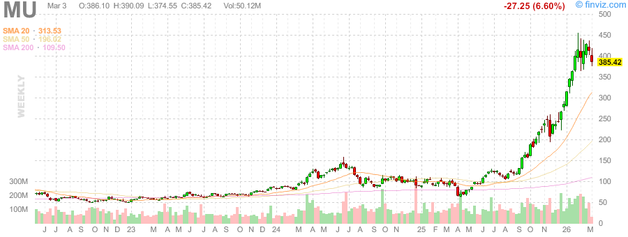
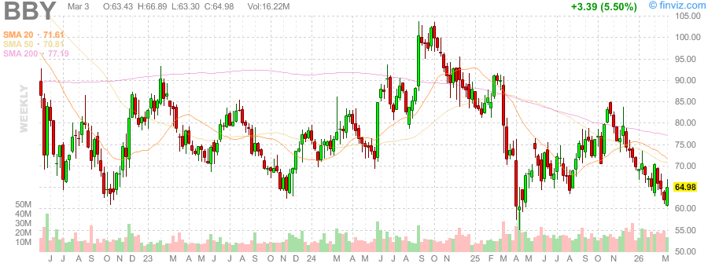
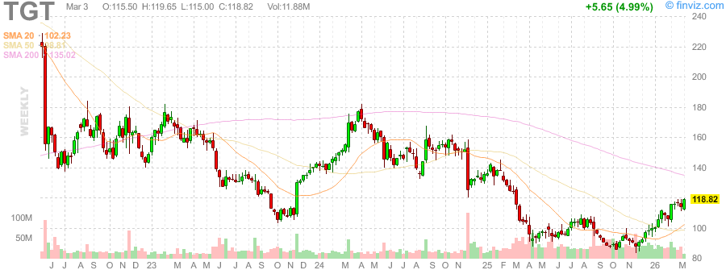
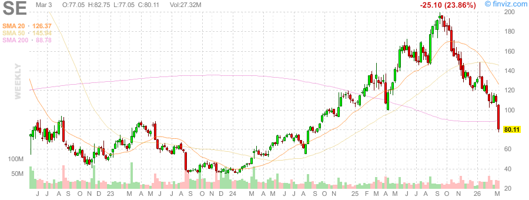

# 每日深度股票研究报告 - 2026-03-03（美股收盘后）

> 说明：本报告复用本地已抓取的真实周线K线图（SPY/QQQ/VIX/GC=F/SI=F 及多只个股），并结合当日公开市场快讯进行盘后研判。

## 一、市场概览（指数与板块）

- **S&P 500**：6,881.62（+2.74，约+0.04%）
- **Nasdaq Composite**：22,748.86（+80.65，约+0.36%）
- **Dow Jones**：48,904.78（-73.14，约-0.15%）
- 盘面呈现“**指数分化、科技偏强、防御与周期轮动**”特征。
- 板块表现上，**能源、工业、科技**相对占优；必需消费相对偏弱。
- **VIX 抬升至约 21 上方**，显示风险偏好并未完全修复，资金仍在增长与避险之间切换。

## 二、黄金/白银比率（Gold/Silver Ratio）

- 黄金（XAUUSD）：**5098.585**
- 白银（XAGUSD）：**82.390**
- **金银比：61.88**

### 解读

- 金银比维持在 60 上方，说明市场仍保留一定避险定价。
- 若后续金银比持续上行，通常对应“增长交易降温 + 防御偏好增强”。
- 若金银比回落且纳指维持强势，更有利于风险资产延续反弹。

## 三、重点个股深度观察（至少3只）

### 1) MDB（MongoDB）
- 周线级别波动较大，属于高Beta成长股。
- 若纳指/软件板块维持强势，MDB弹性仍在；但在VIX偏高环境下，回撤风险同样较高。
- 交易上更适合“趋势确认后跟随”，不宜逆势重仓。

### 2) MU（Micron）
- 半导体主线中具备周期与AI双重属性。
- 周线结构显示其对景气预期较敏感，适合与SOX/纳指联动观察。
- 若后续风险偏好回暖，MU通常受益于资金回流科技硬件链。

### 3) BBY（Best Buy）
- 可选消费链标的，对利率预期与终端需求变化敏感。
- 在“高波动 + 板块轮动”阶段，BBY更受宏观预期扰动。
- 需要关注消费数据与公司指引对估值的再定价影响。

### 4) TGT（Target）
- 与BBY类似，属于消费端景气验证型资产。
- 若防御交易升温、可选消费走弱，TGT可能承受相对估值压力。

### 5) SE（Sea Limited）
- 新兴市场与成长风格共振标的，风险收益比高、波动同样高。
- 适合配合美元指数、纳指走势进行仓位管理。

## 四、风险清单与次日观察点

1. **地缘与油价**：若油价继续冲高，通胀再定价会压制高估值成长股。  
2. **VIX方向**：若VIX继续上行，指数或由“结构性行情”转向“防御性行情”。  
3. **科技龙头持续性**：观察纳指强势能否由少数龙头扩散到二线成长。  
4. **金银比变化**：比率上行通常不利于高Beta资产。  
5. **板块轮动速度**：若轮动过快且无主线，短线交易难度提升。  

## 五、真实K线图（周线）

### 宏观核心图

### 个股图

## 六、图表与数据来源

- 本地图表文件（真实抓取结果）：`/tmp/stock-reports/charts/2026-03-03/*.png`
- 行情图来源（图中标的命名如 `GC=F`、`SI=F`）：**Yahoo Finance 历史周线抓取**（本地缓存）
- 金银比原始数值：`/tmp/stock-reports/.xau.csv`、`/tmp/stock-reports/.xag.csv`、`/tmp/stock-reports/.metals.txt`
- 当日市场综述参考：Nasdaq/主流财经媒体当日收盘报道（见自动化检索记录）
