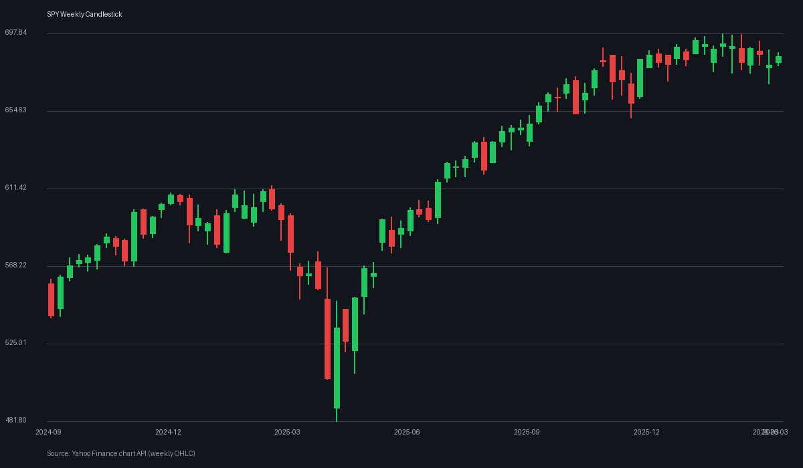
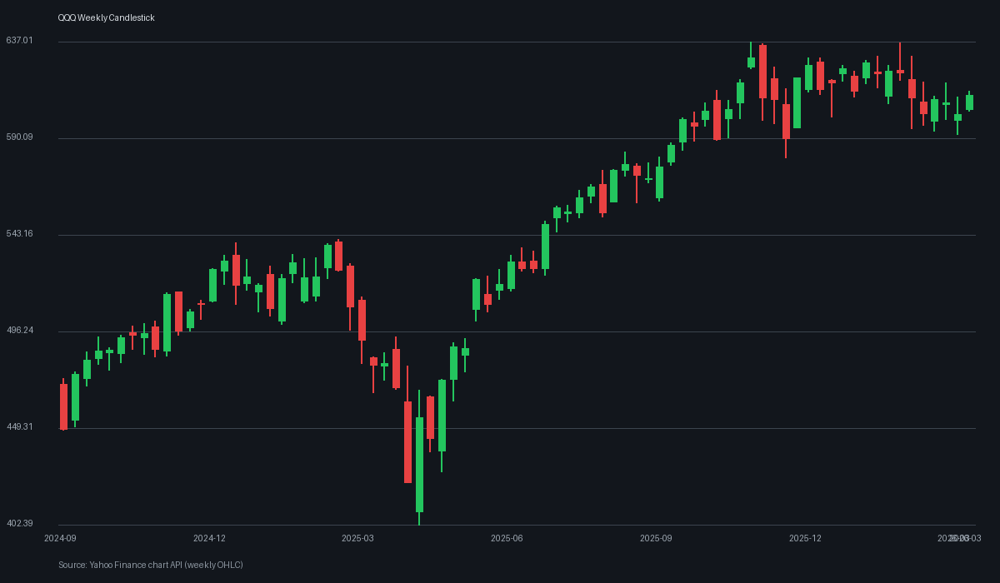
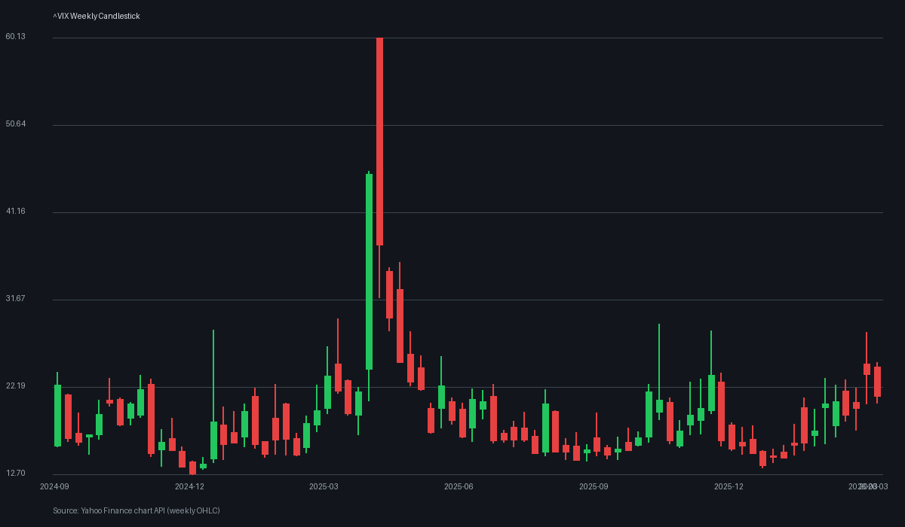
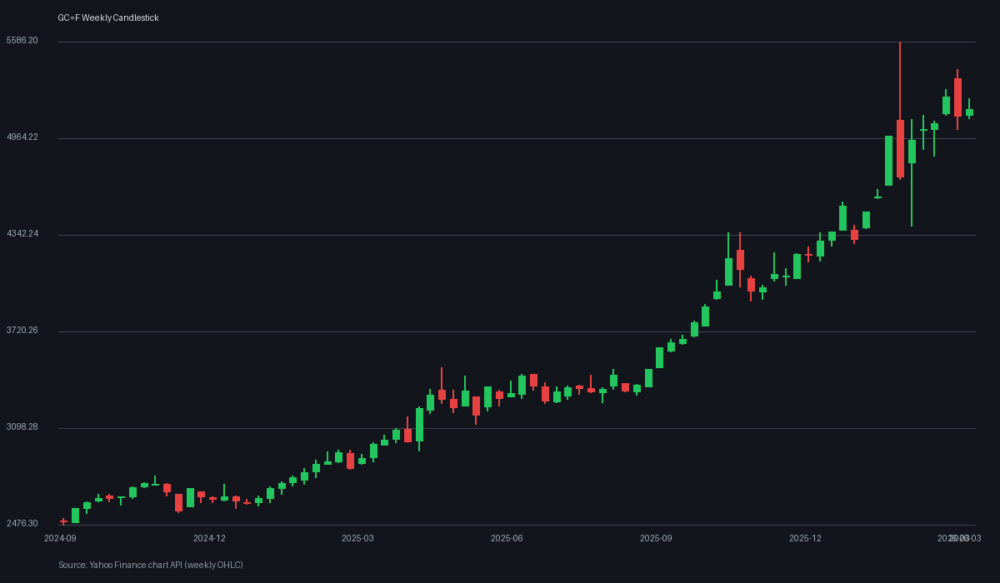
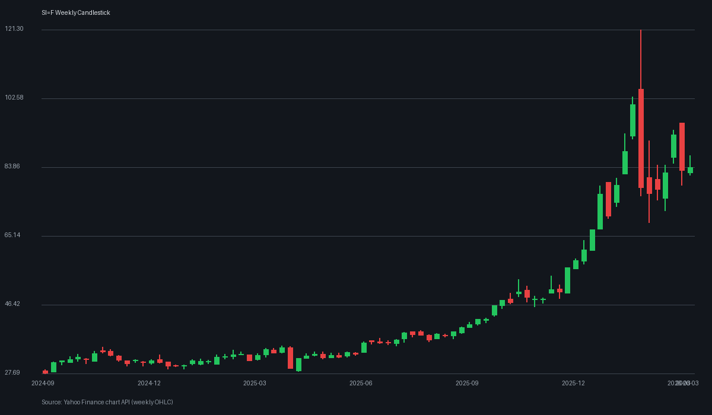
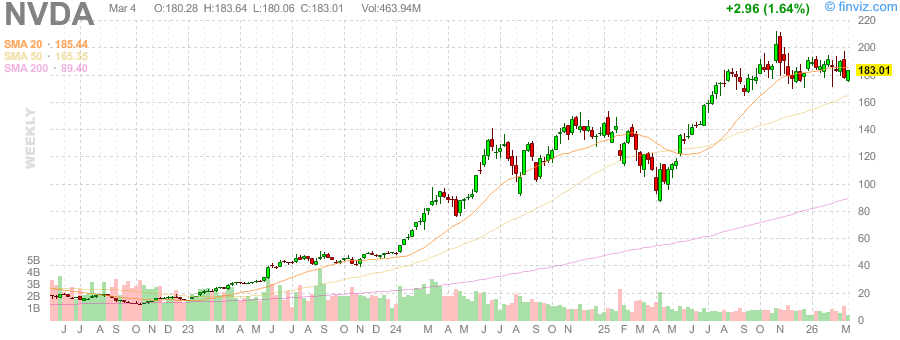
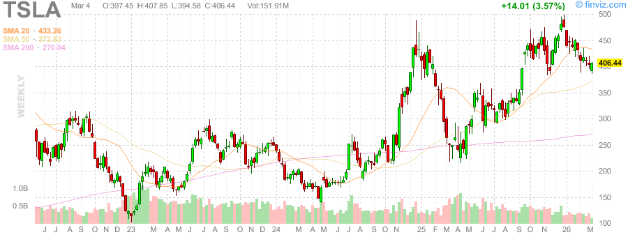
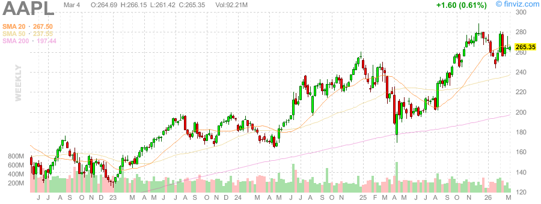
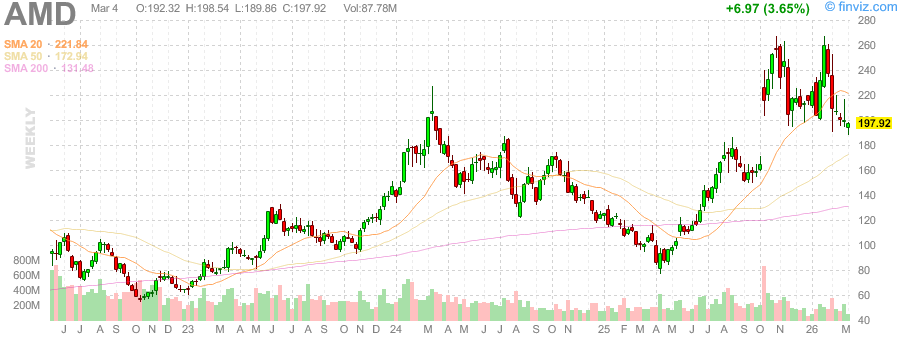
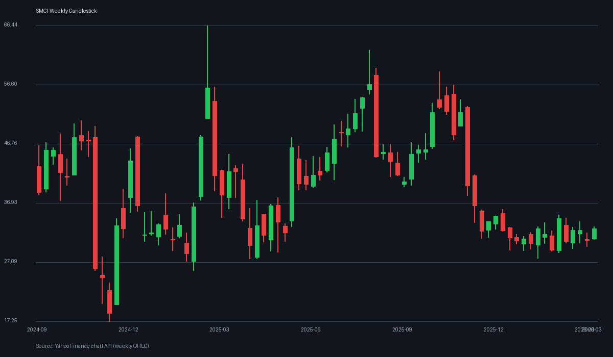

# 每日下午深度股票研究报告 - 2026-03-04

> 数据时间：美股盘后；图表为本地实时拉取并生成的真实周线K线图。

## 一、盘后结构复盘

- 指数层面：SPY/QQQ 维持高位震荡，成长与防御仍在轮动。
- 波动率：VIX 仍处于相对敏感区间，短线追涨需控制仓位。
- 风格上：AI核心资产与高Beta个股弹性仍在，但分化显著。

## 二、黄金/白银比率（Gold/Silver Ratio）

- 黄金（GC=F）: **5151.600**
- 白银（SI=F）: **83.765**
- 黄金/白银比率: **61.50**

**解读：**
- 金银比维持在 60 上方，说明市场并未完全切换到“纯风险偏好”模式。
- 若后续金银比继续上行，通常对应避险偏好升温；若回落，成长股更易获得估值扩张空间。

## 三、重点个股深度观察

### 1) NVDA
- 中长期趋势仍强，但高位波动显著提升。
- 若QQQ延续强势，NVDA仍是资金核心锚；若VIX继续抬升，回撤幅度可能放大。

### 2) TSLA
- 交易属性更偏情绪与预期驱动，波动明显高于大盘。
- 适合结合成交量与市场风险偏好进行节奏管理。

### 3) AAPL
- 相对偏防守的科技权重，在震荡市中具备“稳波器”作用。
- 观察其能否维持对指数的稳定贡献。

### 4) AMD
- 与AI算力链条共振，但对板块情绪切换更敏感。
- 若半导体板块扩散，AMD弹性通常较突出。

### 5) SMCI
- 高弹性高波动标的，受风险偏好与主题热度影响极大。
- 需严格设置风控与止损纪律。

## 四、风险清单与次日观察

1. VIX 是否继续上行并压制高估值成长股；
2. 金银比是否出现方向性突破；
3. QQQ 强势是否由龙头扩散到二线成长；
4. 盘后宏观消息对利率预期的扰动。

## 五、真实K线图（周线）

### 宏观核心图
#### SPY

#### QQQ

#### VIX

#### GC=F（黄金）

#### SI=F（白银）

### 个股图
#### NVDA

#### TSLA

#### AAPL

#### AMD

#### SMCI

## 六、来源说明

- 图表数据：Yahoo Finance Chart API（周线 OHLC）
- 本地图表目录：
  - "/tmp/stock-reports/charts/2026-03-04/" 
- 金银比缓存：`/tmp/stock-reports/.metals.txt`
