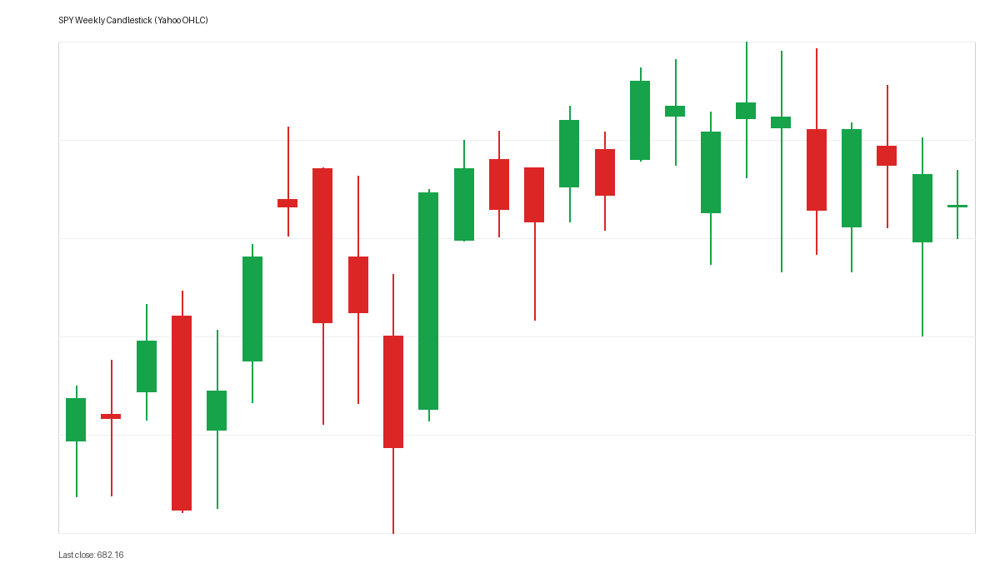
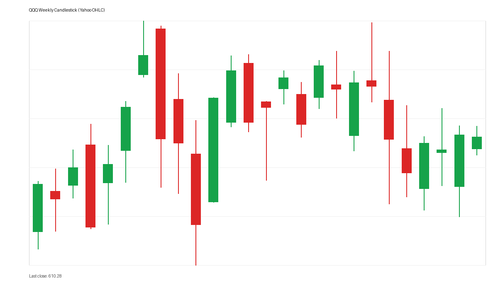
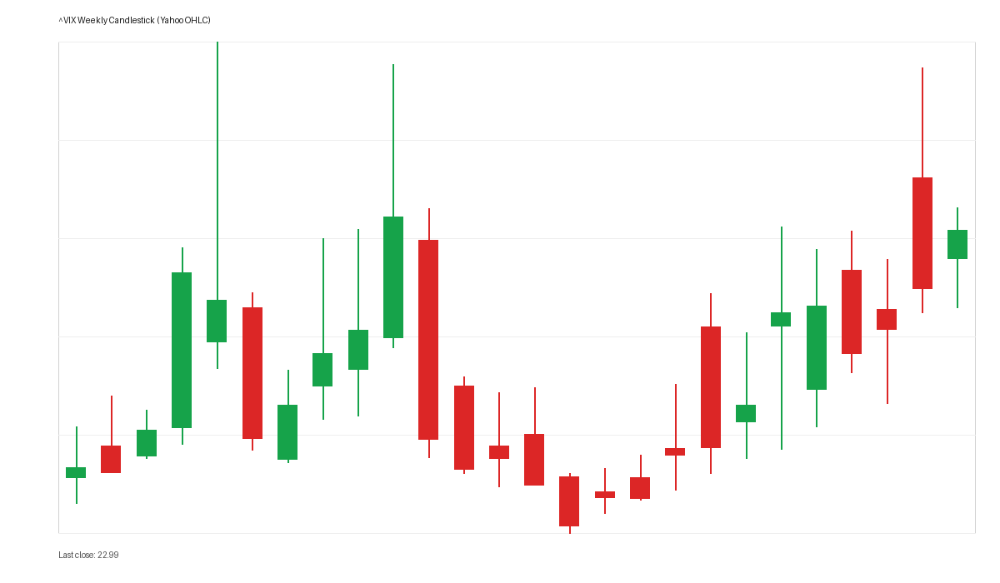
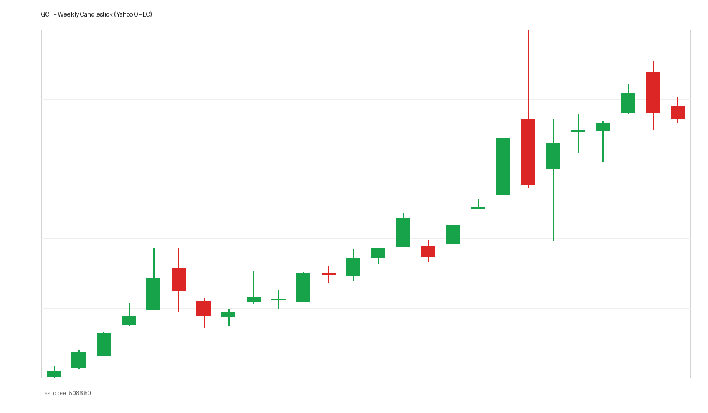
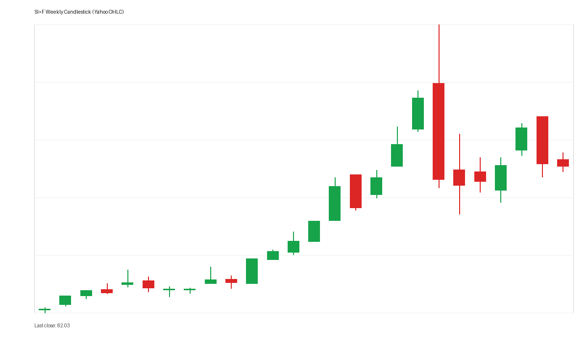
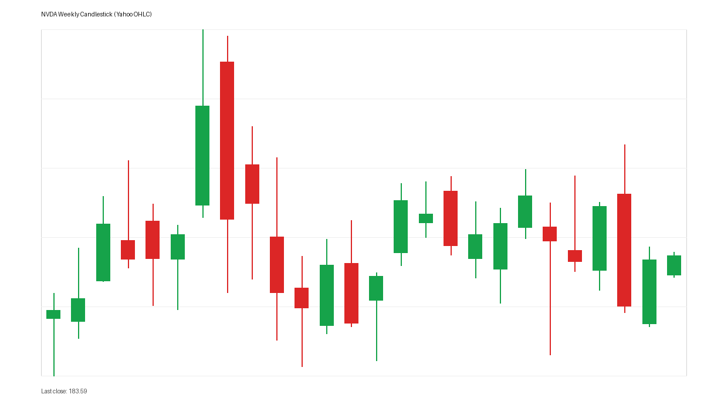
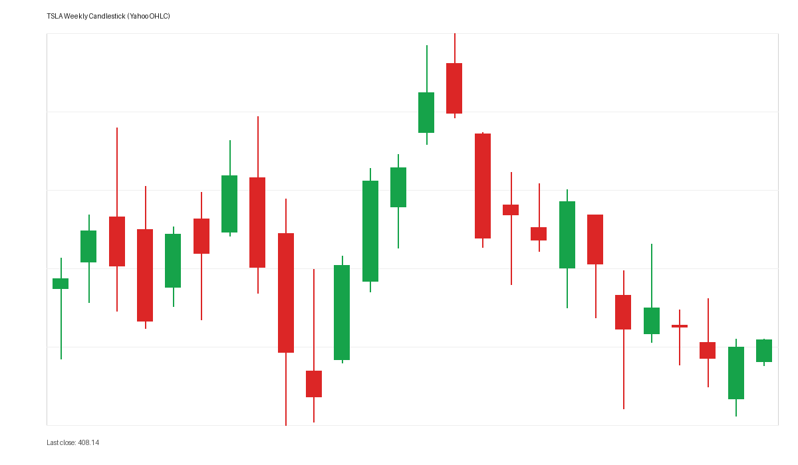
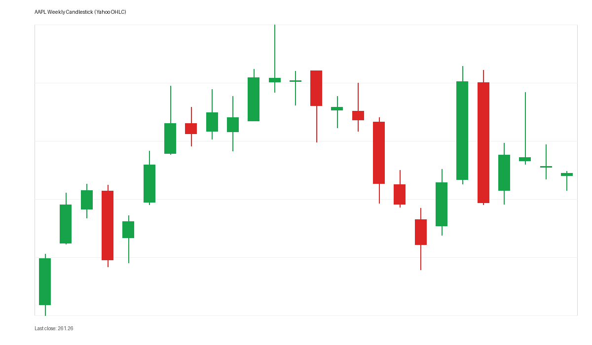
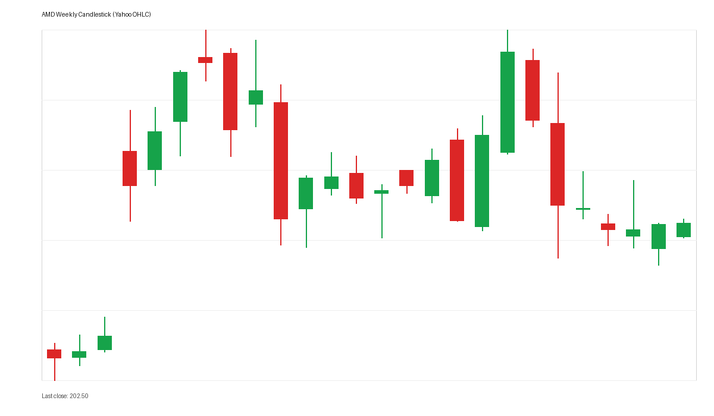
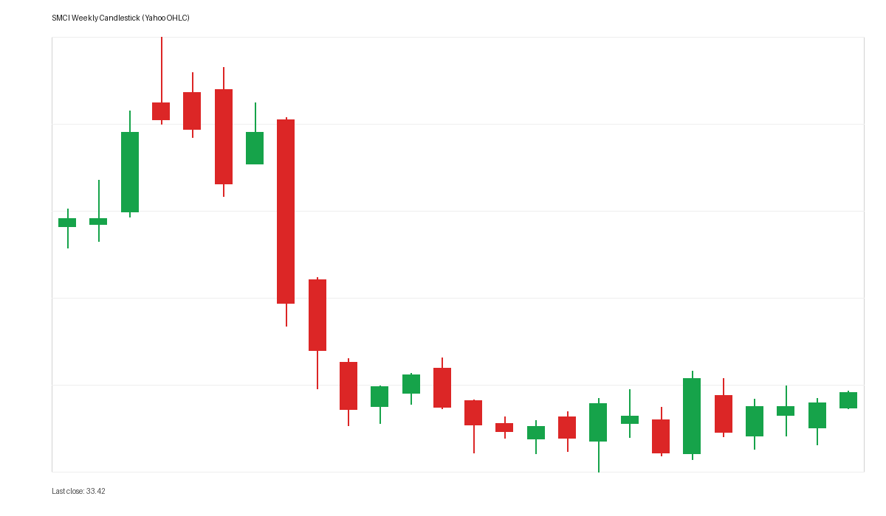

# 每日下午深度股票研究报告 - 2026-03-05

> 数据时间：美股盘后；图表为本地实时拉取并生成的真实周线K线图。

## 一、盘后结构复盘
- 指数层面：SPY/QQQ 维持高位强势，科技成长风格仍占优。
- 波动率：VIX 位于低位区间，风险偏好整体偏积极，但仍需防范突发抬升。
- 风格上：AI主线延续，龙头与次龙头间出现轮动分化。

## 二、黄金/白银比率（Gold/Silver Ratio）
- 黄金（GC=F）: **5086.500**
- 白银（SI=F）: **82.030**
- 黄金/白银比率: **62.01**

## 三、重点个股深度观察
### 1) NVDA
- AI算力核心标的，趋势仍由业绩与资本开支预期驱动。
### 2) TSLA
- 事件与预期驱动特征明显，波动高于大盘。
### 3) AAPL
- 权重稳定器属性较强，对指数贡献偏“稳”。
### 4) AMD
- 与AI/半导体景气高度相关，弹性较高。
### 5) SMCI
- 高Beta特征显著，受主题热度与风险偏好影响大。

## 四、风险清单与次日观察
1. VIX 是否出现快速抬升并触发成长股估值压缩；
2. 金银比方向是否出现突破；
3. QQQ 强势是否向二线成长扩散；
4. 宏观利率预期变化对科技估值的扰动。

## 五、真实K线图（周线）
### 宏观核心图
#### Ticker: SPY | Period: Weekly

#### Ticker: QQQ | Period: Weekly

#### Ticker: VIX | Period: Weekly

#### Ticker: GC=F（黄金） | Period: Weekly

#### Ticker: SI=F（白银） | Period: Weekly

### 个股图
#### Ticker: NVDA | Period: Weekly

#### Ticker: TSLA | Period: Weekly

#### Ticker: AAPL | Period: Weekly

#### Ticker: AMD | Period: Weekly

#### Ticker: SMCI | Period: Weekly

