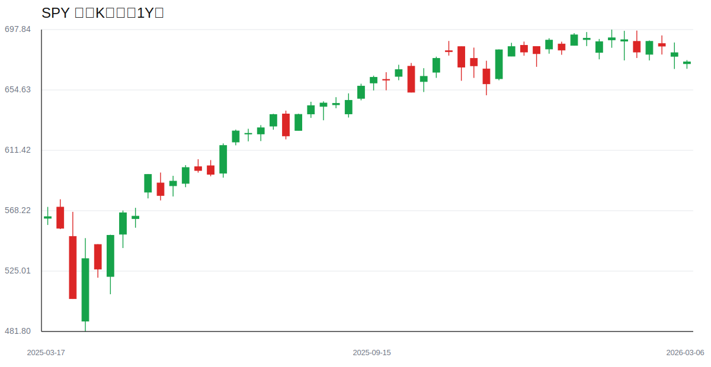
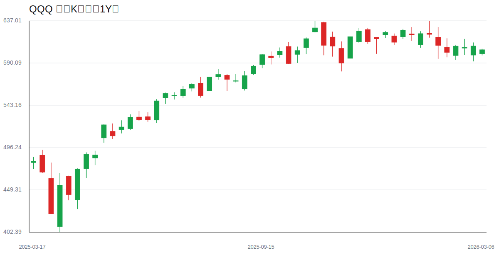
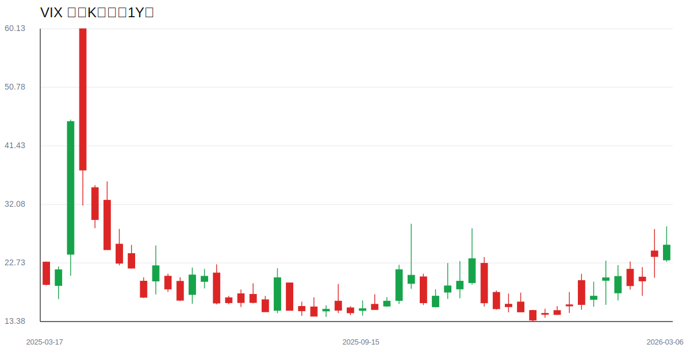
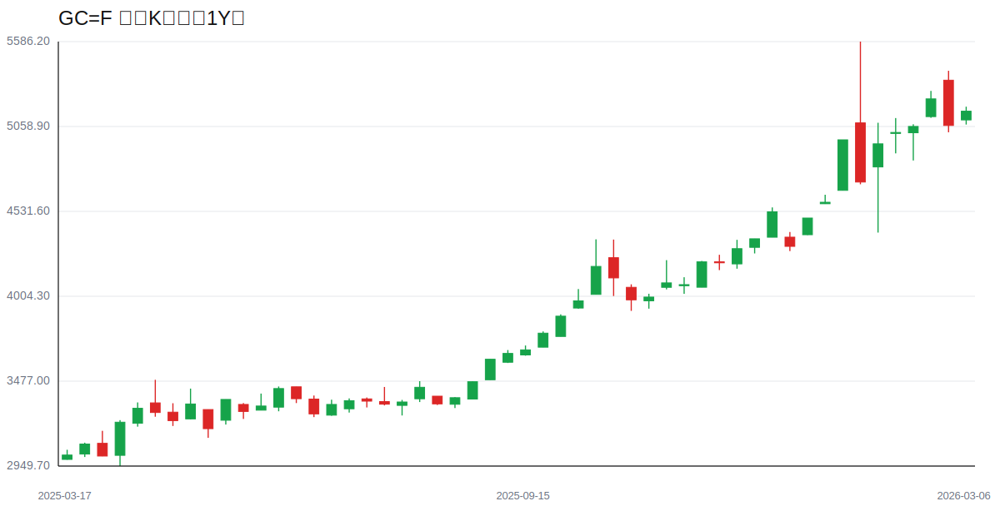
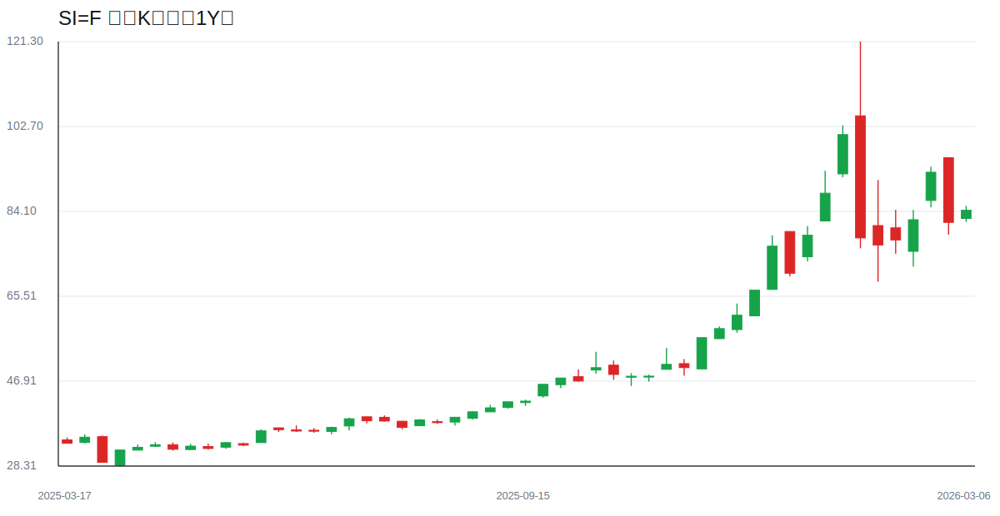
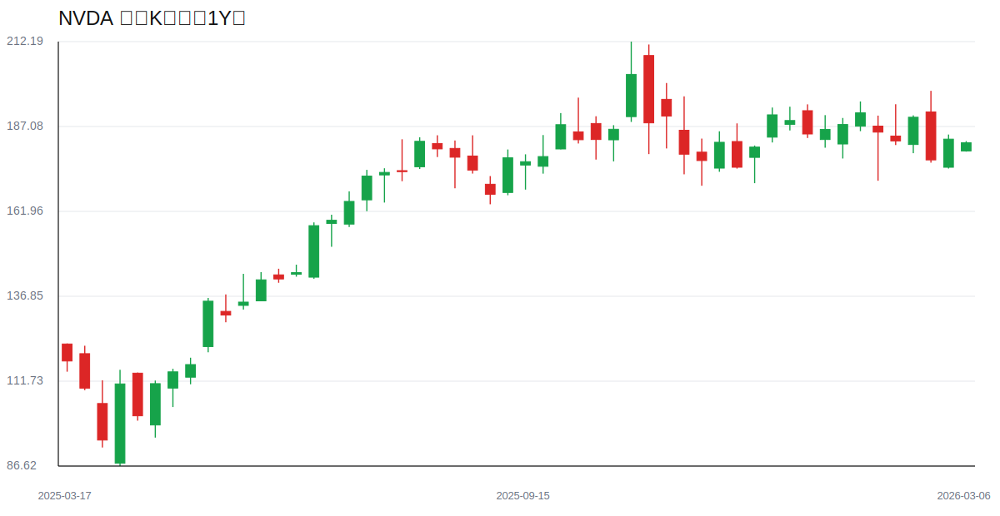
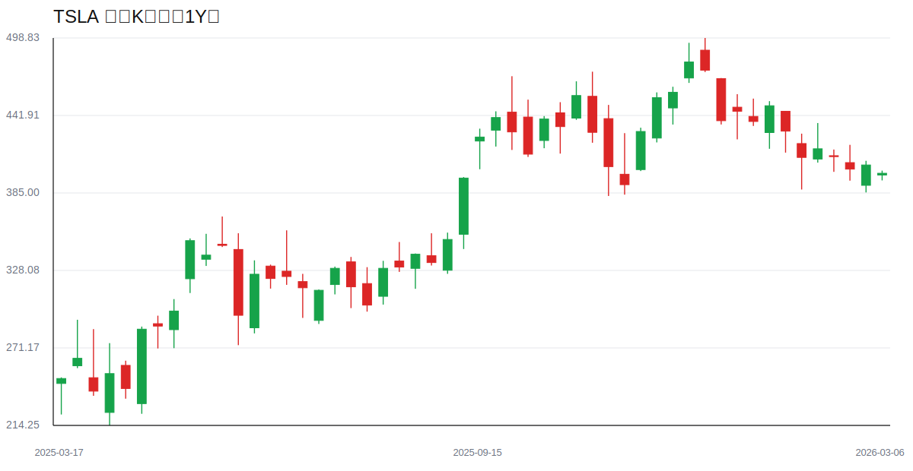
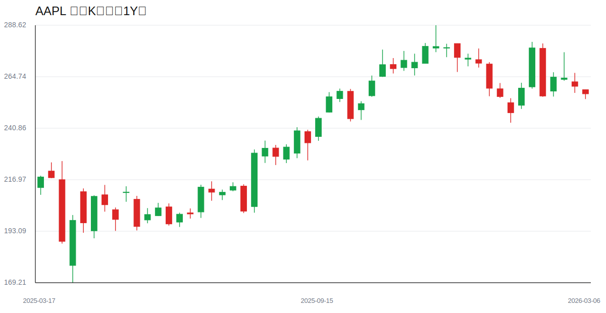
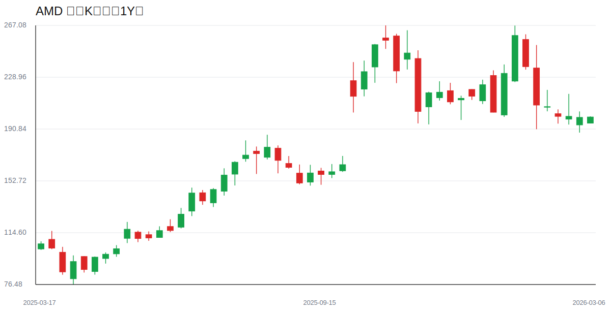
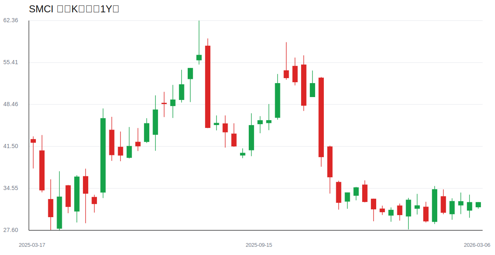

# 每日下午深度股票研究报告 - 2026-03-06

> 数据时间：美股盘后；图表为本地实时拉取并生成的真实周线K线图。

## 一、盘后结构复盘
- 指数层面：SPY/QQQ 在高位区间内维持震荡，主线仍围绕AI与大型科技权重。
- 波动率：VIX 相比低位略有抬升，短线更适合“分批而非追涨”。
- 风格上：龙头资产韧性仍在，但板块内部轮动加快，选股胜过单纯加杠杆。

## 二、黄金/白银比率（Gold/Silver Ratio）
- 黄金（GC=F）: **5154.100**
- 白银（SI=F）: **84.350**
- 黄金/白银比率: **61.10**

**解读：**
- 金银比维持在相对高位，市场并未完全进入“无差别风险偏好”状态。
- 若后续金银比继续上行，通常对应防御偏好升温；若回落，则成长股估值扩张更有利。

## 三、重点个股深度观察
### 1) NVDA
- AI算力链核心资产，趋势强但对估值与利率变化更敏感。
### 2) TSLA
- 情绪驱动与事件驱动特征明显，波动高，需严格仓位管理。
### 3) AAPL
- 大盘稳定器属性突出，在震荡市中提供一定防守价值。
### 4) AMD
- 与半导体景气共振，弹性较高但回撤速度也快。
### 5) SMCI
- 高Beta标的，受主题热度与风险偏好影响显著。

## 四、风险清单与次日观察
1. VIX 是否继续上行并压制高估值成长股；
2. 金银比是否出现方向性突破；
3. QQQ 领涨是否向二线成长扩散；
4. 宏观消息对降息预期与长端利率的扰动。

## 五、真实K线图（周线）
### 宏观核心图
#### Ticker: SPY | Period: Weekly

#### Ticker: QQQ | Period: Weekly

#### Ticker: VIX | Period: Weekly

#### Ticker: GC=F（黄金） | Period: Weekly

#### Ticker: SI=F（白银） | Period: Weekly

### 个股图
#### Ticker: NVDA | Period: Weekly

#### Ticker: TSLA | Period: Weekly

#### Ticker: AAPL | Period: Weekly

#### Ticker: AMD | Period: Weekly

#### Ticker: SMCI | Period: Weekly

## 六、来源说明
- 图表数据：Yahoo Finance Chart API（周线 OHLC，本地绘图）
- 本地图表目录：
  - /tmp/stock-reports/charts/2026-03-06/
- 金银比缓存：/tmp/stock-reports/.metals.txt
