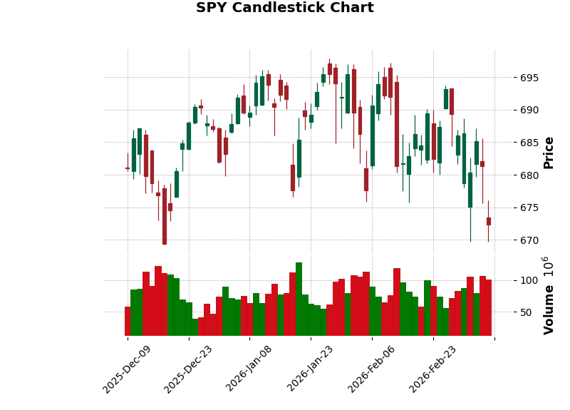
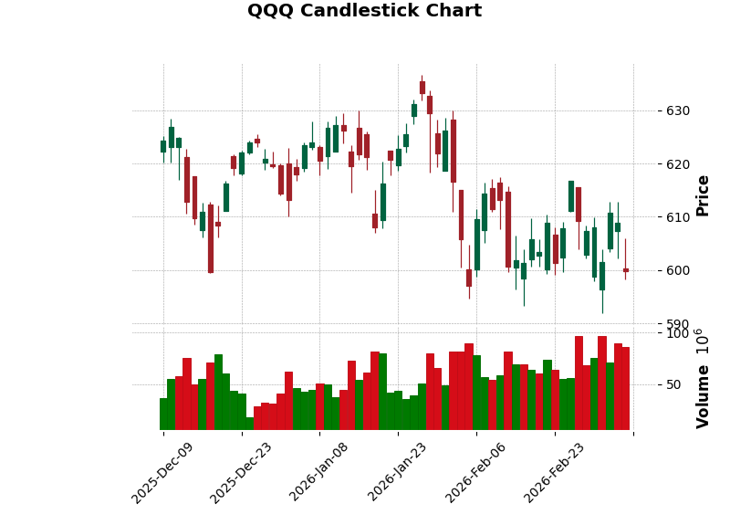
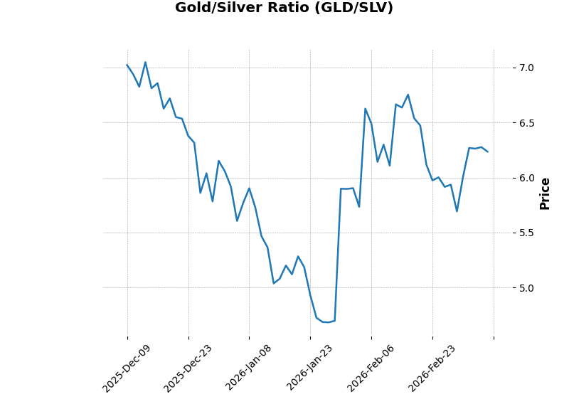

# Daily Deep Stock Research - 2026-03-08

## Market Overview (Week Ending 2026-03-06)

- **SPY**: $672.38 (-1.31%)
- **QQQ**: $599.75 (-1.50%)
- **Gold/Silver Ratio**: 6.24 (-0.65%)

## Technical Analysis & Charts

### SPY (S&P 500 ETF)

### QQQ (Nasdaq 100 ETF)

### Gold/Silver Ratio

## Analysis
The market showed mixed signals leading into the weekend. The Gold/Silver ratio decreased, indicating a potential increase in risk appetite or industrial demand expectations for silver.

---