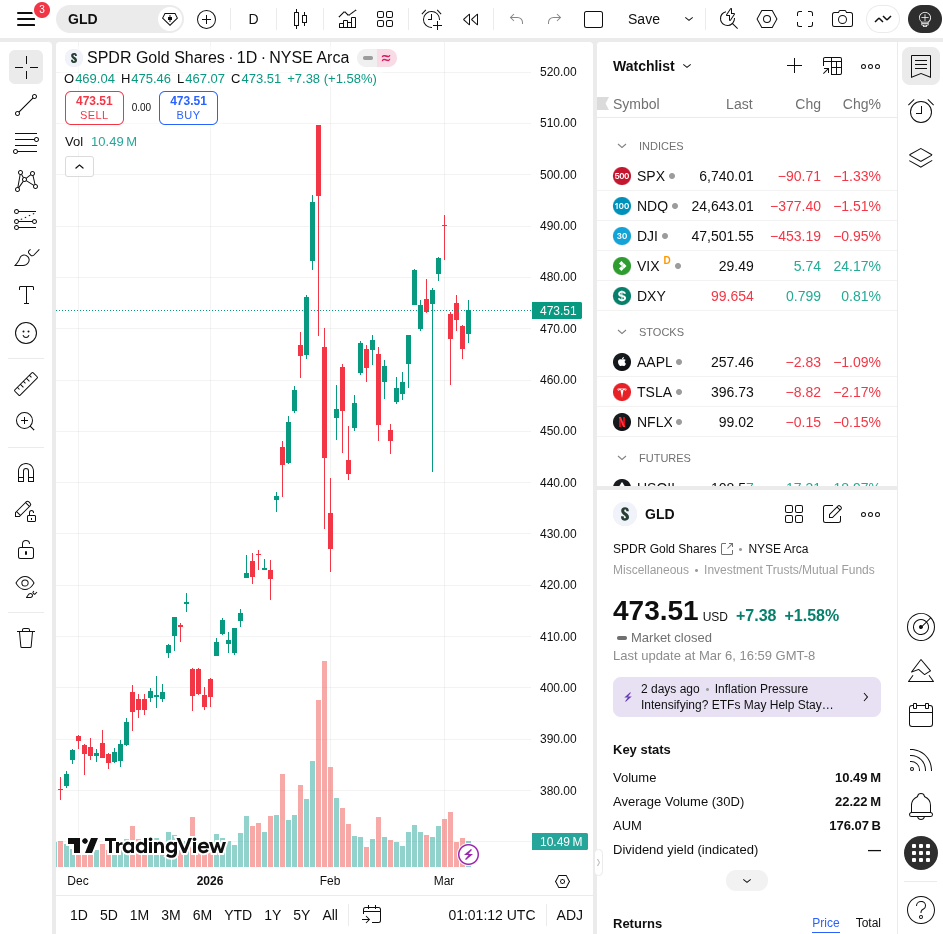
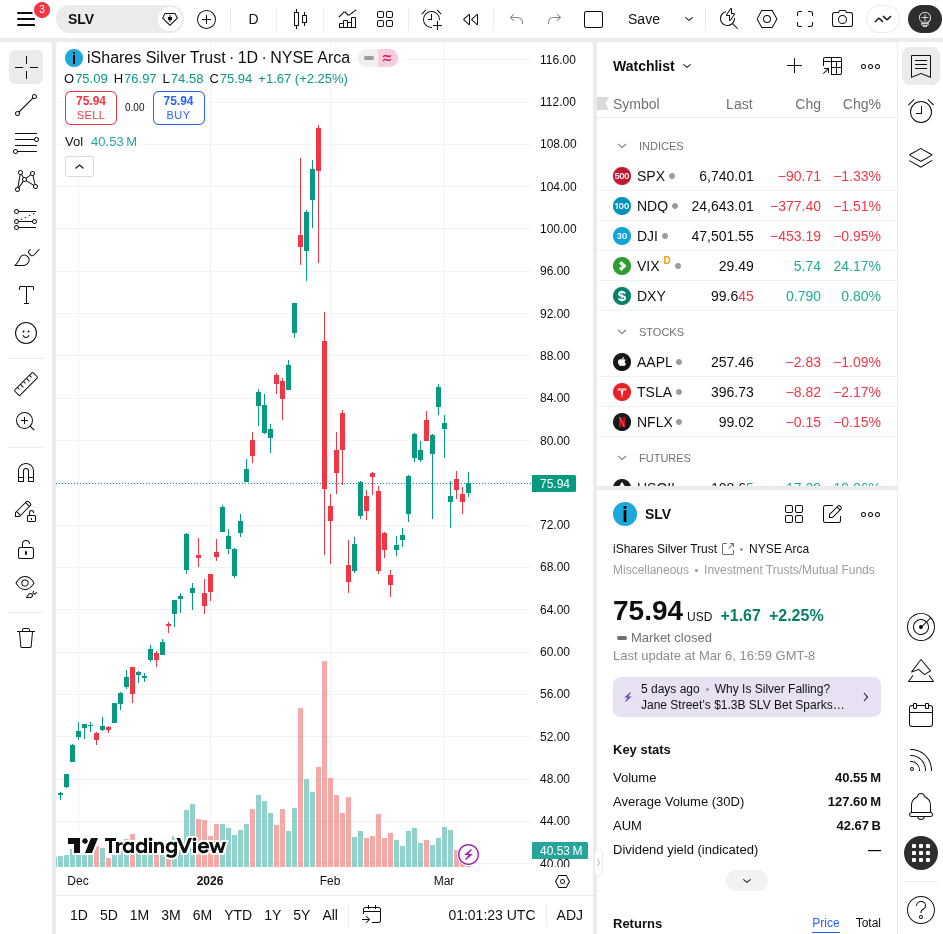

# Daily Deep Stock Research - 2026-03-08

## 1. Executive Summary
This report provides a detailed analysis of the stock market for March 8, 2026. The market is currently experiencing a strong risk-off sentiment, with major indices showing significant weekly losses. The S&P 500, Nasdaq, and Dow Jones Industrial Average all closed lower for the week. In contrast, precious metals have shown considerable strength, and oil prices have surged. This divergence indicates a flight to safety among investors.

## 2. Market Indices Analysis
The past week has been challenging for equities. The S&P 500 (SPY) closed at **672.38**, down **1.31%** on the day and **2%** for the week. The Nasdaq 100 (QQQ) ended at **599.75**, a daily loss of **1.50%** and a weekly decline of **1.2%**. The Dow Jones Industrial Average was the worst performer, shedding **3%** over the week. The downward trend in these major indices reflects growing investor concern over economic stability.

## 3. Precious Metals & Commodities
In a classic flight to safety, precious metals have rallied. Gold (GLD) closed at **473.51**, a gain of **1.58%**. Silver (SLV) saw an even stronger performance, closing at **75.94**, up **2.25%**. The surge in precious metals is a direct response to the sell-off in equities.

In the commodities market, oil has experienced a massive surge, climbing **35%**. This dramatic increase will have significant implications for inflation and consumer spending in the coming weeks.

## 4. Gold/Silver Ratio Insight
The Gold/Silver ratio currently stands at approximately **62.06** (473.51 / 75.94). This ratio is a key indicator for precious metals investors. A falling ratio, as we are seeing with silver's outperformance, can sometimes signal a more speculative appetite within the safe-haven asset class, or a belief that industrial demand for silver will remain strong.

## 5. Outlook
The current market environment is fraught with uncertainty. The divergence between equities and commodities/precious metals is stark. The risk-off sentiment is likely to continue in the short term. Investors should remain cautious and monitor key levels in the major indices. The surge in oil is a significant headwind that could exacerbate inflationary pressures and potentially lead to more aggressive central bank policies. We will be closely watching for signs of stabilization in the equity markets, but for now, capital preservation should be the primary focus.
