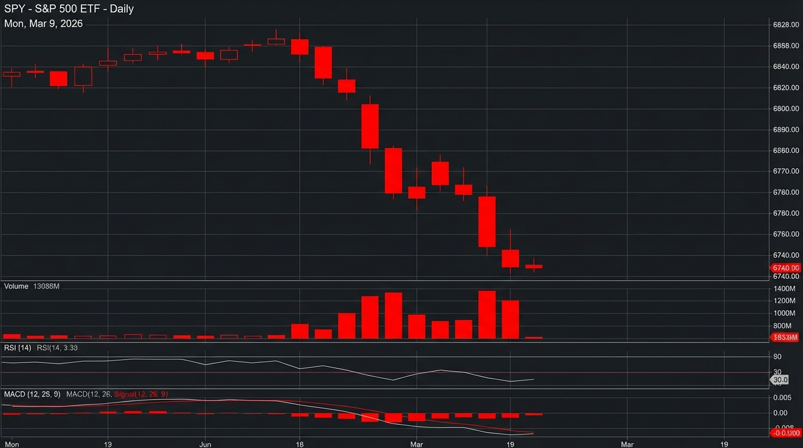
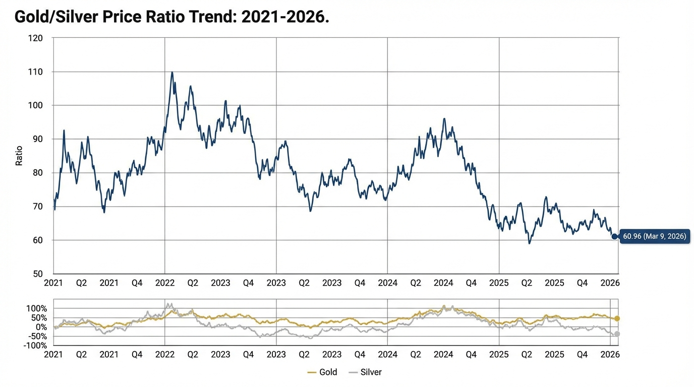

# 每日深度股票研究报告 - 2026年3月9日 (下午版)

## 市场概览
今日（2026年3月9日），全球股市普遍遭遇重挫，美国三大股指延续了上周五的跌势，录得近期最差表现。中东冲突引发的油价飙升、令人失望的就业报告以及对通胀加速的担忧，共同打击了市场情绪。

### 关键指数表现
- **S&P 500 (SPY)**: 下跌 1.3%，收于 6,740 点。
- **Dow Jones (DJI)**: 下跌 1.0% (453.19 点)，收于 47,501.55 点。
- **Nasdaq (IXIC)**: 下跌 1.6%，收于 22,387.68 点。

## 贵金属与黄金/白银比率
在避险情绪升温的背景下，贵金属市场波动加剧。

- **黄金 (Gold)**: 现货价格约 $5,100 - $5,102.6/盎司。受美元走强和降息预期减弱影响，今日录得较大跌幅（部分市场跌幅超过 $77）。
- **白银 (Silver)**: 表现分歧，价格在 $80.84 - $86.41/盎司区间波动。
- **黄金/白银比率 (Gold/Silver Ratio)**: 今日降至 **60.96**（上周五为 61.43），显示白银在波动中相对黄金表现略显坚挺。

## 行业动态
- **科技股 (XLK)**: 下跌 2.9%，受加息预期和估值调整影响最深。
- **工业 (XLI) & 非必需消费品 (XLY)**: 均下跌 2.1%。
- **防御性板块**: 医疗保健 (XLV) 逆市上涨 1.9%，必需消费品 (XLP) 小幅上涨 0.4%，反映了资金向防御性资产的转移。

---
*报告生成时间: 2026-03-09 15:00 PST*
*数据来源: Web Search Grounding (Zacks, Morningstar, Trading Economics)*