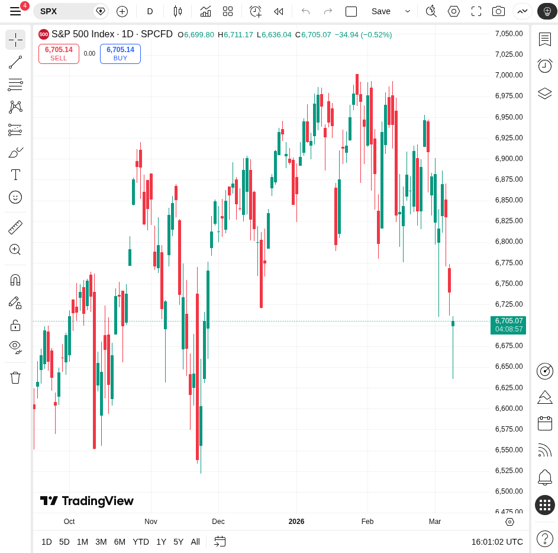

# 每日早间股票研究报告 (2026-03-09)

## 市场综述
今日（2026年3月9日，周一）美股盘前市场呈现显著下跌态势。受中东局势进一步升级及原油价格飙升（布伦特原油突破100美元/桶）影响，全球风险偏好急剧降温。

### 主要指数表现 (盘前)
- **S&P 500 Futures**: 下跌
- **Nasdaq Futures**: 下跌
- **Dow Futures**: 下跌
- **日经 225**: 暴跌超过 5%

## 黄金与白银分析
避险情绪虽有抬头，但受美元走强及美联储降息预期降温压制，贵金属波动剧烈。

- **现货黄金**: 约 $5,172/盎司
- **现货白银**: 约 $84.37/盎司
- **金银比 (Gold-Silver Ratio)**: **约 61.3**
  - *分析*: 该比率较上周五 (61.43) 略有下降，显示白银在当前价格水平下相对于黄金仍具有一定的估值吸引力。

## 热点板块与个股
1. **能源板块**: 原油突破 $100，能源股表现强劲。
2. **航空板块**: 受燃油成本压力，股价集体下挫。
3. **个股焦点**: **Hims & Hers (HIMS)** 盘前大涨 54%，受益于与诺和诺德 (Novo Nordisk) 的减重药合作。

## 技术图表

*图：S&P 500 指数日线 K 线图 (截至 2026-03-09)*

---
*报告生成时间: 2026-03-09 09:15 AM PST*
