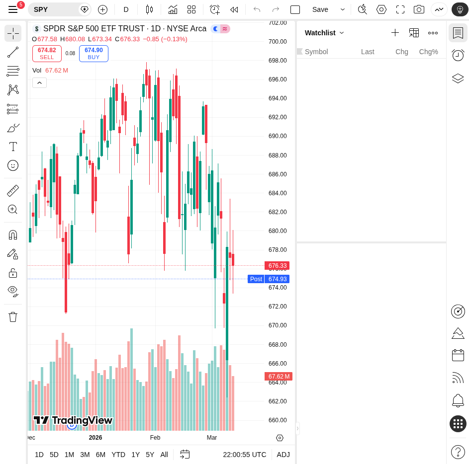
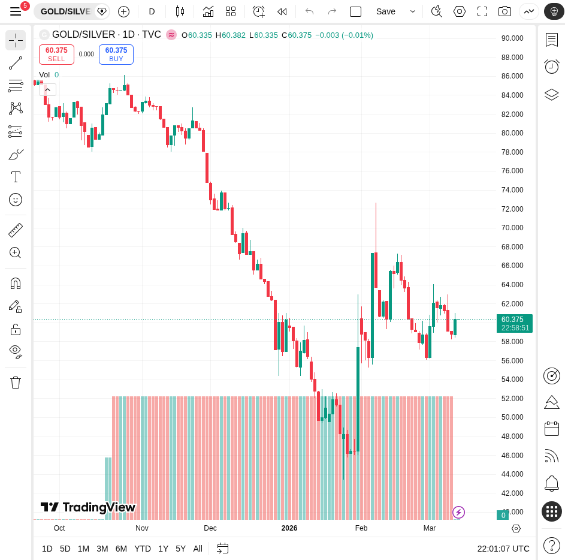

# 每日深度股票研究报告 - 2026年3月11日

## 市场综述 (Market Overview)

2026年3月初，美国股市表现错综复杂。道琼斯工业平均指数展现出较强的韧性，历史上首次收于50,000点大关之上。然而，广义市场面临逆风：
- **S&P 500 (SPY)**: 年初至今下跌约1.5%，但指数内平均股票上涨3.2%，显示出市场领导地位正从巨型科技股转向更广泛的板块。
- **Nasdaq Composite**: 2月下跌3.38%，主要受AI行业估值重估及地缘政治紧张局势影响。

### 关键驱动因素
1. **AI 行业波动**: 投资者开始重新评估AI对传统商业模式的颠覆性，导致科技板块压力增大。
2. **地缘政治**: 中东局势持续紧张，油价波动加剧了通胀担忧。
3. **经济数据**: 2025年第四季度GDP增速放缓至1.4%，而PCE物价指数仍高于美联储2.0%的目标。

---

## 贵金属：黄金/白银比率分析

黄金/白银比率是衡量金属相对价值的重要指标。
- **当前比率**: 约为 **60.37** (根据今日 TradingView 数据)。
- **趋势分析**: 该比率在2026年初一度跌至近47的多年低点（主要受白银工业需求推动），近期回升至60左右。
- **工业需求**: 白银约60%的需求来自工业，特别是可再生能源基础设施。这种结构性短缺为白银提供了长期支撑。

---

## 技术图表 (Technical Charts)

### S&P 500 ETF (SPY) - 日线图

### 黄金/白银比率 (GOLD/SILVER) - 日线图

---

## 投资建议与展望
当前市场正处于领导地位转换期。建议关注：
- **能源与公用事业**: 2月表现强劲，具有较好的防御性。
- **白银**: 尽管短期波动，但强劲的工业基本面使其在贵金属配置中具有吸引力。
- **防御性资产**: 在地缘政治不确定性下，保持一定比例的现金或黄金头寸。
