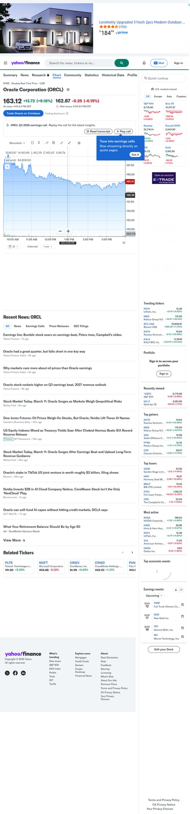
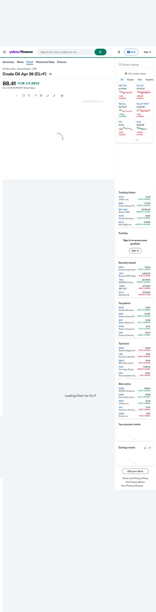
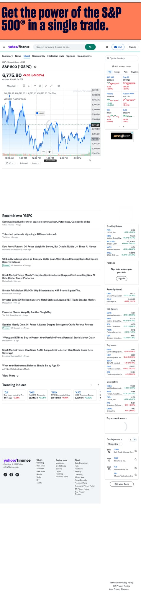
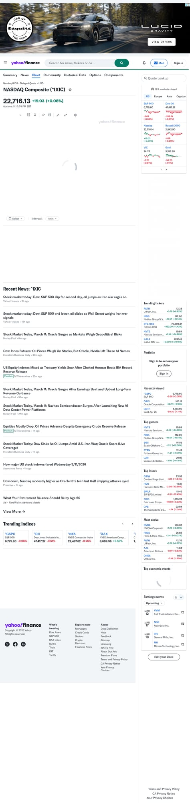
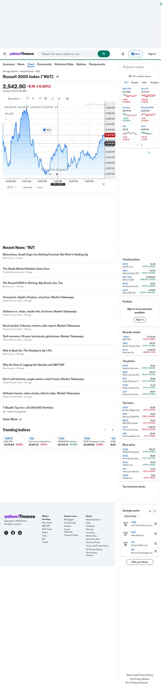

# 2026-03-11 Afternoon Stock Report

## Market Overview
- **Regime**: Volatile / Geopolitical Pressure
- **Key drivers**: Escalating US-Iran conflict, skyrocketing crude oil prices (Brent near $90), and a surge in the 10-year Treasury yield to 4.23% (highest in nearly a year).
- **Risk flags**: Stagflation concerns as energy prices spike while CPI remains above target (2.4%). Tech and growth sectors are sensitive to the rising cost of capital.

## High-Priority Setups

1. **ORCL (Oracle Corporation)**
   - **Thesis**: Strong AI and Cloud demand decoupling from macro headwinds.
   - **Catalyst**: Q3 earnings beat + 20% revenue growth + upbeat 2027 guidance.
   - **Risk**: Aggressive AI capex spending and broader tech sell-off.
   - **Bias**: Bullish (momentum leader).
   - **Invalidation**: Close below $155.
   - **Chart**: 

2. **OIL (Crude Oil Futures)**
   - **Thesis**: Supply shock due to the closure of the Strait of Hormuz.
   - **Catalyst**: US strikes on Iranian infrastructure + geopolitical risk premium.
   - **Risk**: Global release of emergency reserves.
   - **Bias**: Bullish (parabolic).
   - **Invalidation**: De-escalation headlines or Brent below $82.
   - **Chart**: 

## Market Context (Indices)
- **SPY (S&P 500)**: Slipped 0.10% as oil gains were offset by yield pressure.
  - 
- **QQQ (Nasdaq)**: Edged up 0.08% thanks to Oracle and Nvidia support.
  - 
- **IWM (Small Caps)**: Flat at -0.02%, struggling with higher-for-longer yield narratives.
  - 

## Watchlist / What Changed Today
- **NVDA**: Held firm despite macro weakness, buoyed by the "Oracle effect" on AI cloud demand.
- **PATH**: Surged 6.8% on high relative volume; seeing strong momentum in AI-adjacent software.
- **Yields**: 10-year Treasury hitting 4.23% is the primary headwind for equities.

## Bottom Line
The market is currently a "tale of two tapes": Oil and Geopolitical hedges are surging, while AI leaders like Oracle provide a floor for tech. Broad indices remain vulnerable to further yield spikes. Focus on relative strength leaders (ORCL, NVDA) or direct energy plays.
