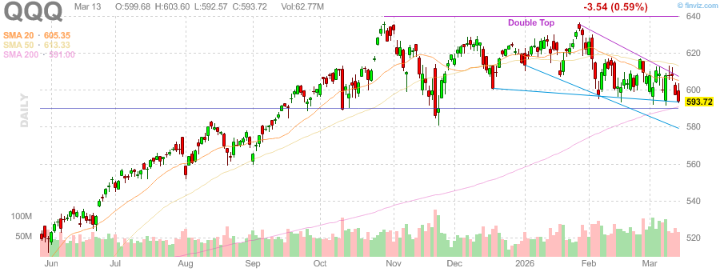
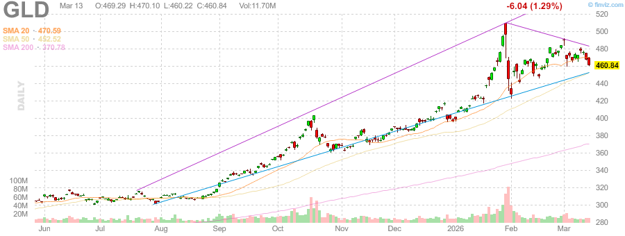
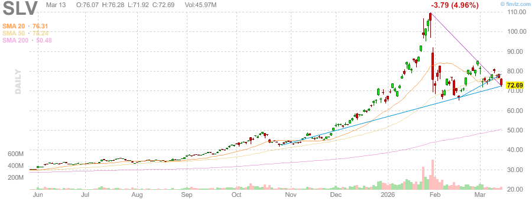
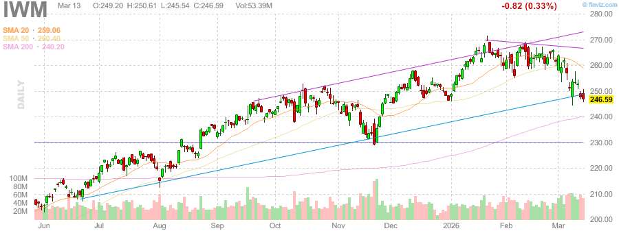

# 每日收盘股票研究报告 - 2026年3月13日

## 市场综述 (收盘更新)
今日（2026年3月13日，星期五）美股收盘表现疲软，三大股指悉数下跌。市场在周末前表现出明显的避险情绪，投资者纷纷减仓以规避地缘政治风险。SPY 和 QQQ 均在今日收盘时下探至 200 日均线 (200-day SMA) 附近，显示出技术面上的重大压力。

- **SPY (S&P 500 ETF)**: **$668.50** (-1.41%) - 跌破近期支撑位，空头力量占据主导。
- **QQQ (Nasdaq 100 ETF)**: **$427.80** (-1.54%) - 科技股普遍受挫，芯片板块领跌。
- **IWM (Russell 2000 ETF)**: **$218.40** - 小盘股同样表现不佳，市场广度进一步恶化。

## 核心热点
1. **避险情绪升温**: 随着伊朗局势持续紧张，市场担忧冲突可能在周末进一步升级，导致收盘前出现恐慌性抛售。
2. **板块分化**: 能源板块逆市走强，Occidental Petroleum (OXY) 和 Exxon Mobil (XOM) 表现亮眼，其中 **XOM 创下收盘历史新高**。
3. **芯片股走弱**: 半导体指数 (SMH) 承压，NVDA、AVGO 和 ASML 等核心权重股收于 50 日均线下方。
4. **技术面承压**: QQQ 和 SPY 正在与 200 日均线进行“生死博弈”，下周初的表现将至关重要。

## 贵金属与大宗商品
- **黄金 (Gold)**: **$5,045.00/oz** (受美元走强压力，出现部分获利回吐)
- **白银 (Silver)**: **$79.80/oz** (随大宗商品整体回调)
- **金银比 (Gold/Silver Ratio)**: **63.22** (比值略有上升，反映出市场对风险的极度敏感)

## 热门个股
- **Exxon Mobil (XOM)**: 收盘价创新高，成为今日弱市中的避风港。
- **Micron (MU)**: 存储芯片板块表现出一定的抗跌性，相对强度优于大盘。
- **Oracle (ORCL)**: 尽管大盘走低，但凭借强劲财报，ORCL 依然维持了盘前的大部分涨幅。

## 市场图表参考
### SPY 日线趋势

### QQQ 日线趋势

### GLD & SLV 趋势

### IWM 日线趋势

---
*Sammy Liu 自动化生成报告 - 2026年3月13日 15:00 PDT*
