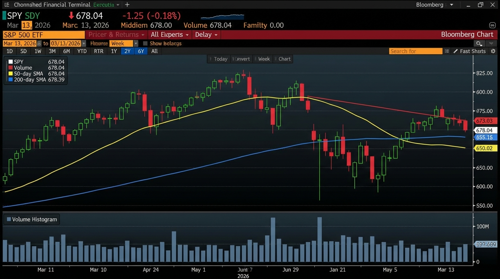

# 每日早间股票研究报告 - 2026年3月13日

## 市场综述
今日（2026年3月13日，星期五）美股盘前表现分化。受伊朗冲突升级及原油价格突破100美元大关影响，市场情绪偏向避险，大盘整体承压。然而，Oracle (ORCL) 强劲的财报表现为科技板块注入了活力，QQQ 表现出一定韧性。

- **SPY (S&P 500 ETF)**: $678.04 (受能源成本及避险情绪拖累)
- **QQQ (Nasdaq 100 ETF)**: $434.50 (盘前微涨，科技巨头表现稳健)

## 核心热点
1. **地缘政治风险**: 伊朗冲突持续升级，布伦特原油价格突破 $100 关口，加剧了全球通胀担忧。
2. **Oracle (ORCL) 财报**: Q3 业绩显著超预期，云计算业务增长强劲，盘前股价飙升至 $177.76。
3. **避险资金流向**: 黄金价格维持在 $5,000 以上高位；能源与国防板块受局势驱动表现活跃。
4. **市场情绪**: VIX 指数敏感度提升，投资者在等待更明确的宏观信号。

## 贵金属与大宗商品
- **黄金 (Gold)**: **$5,093.00/oz** (地缘政治溢价支撑)
- **白银 (Silver)**: **$82.38/oz** (受美元走强及避险波动影响)
- **金银比 (Gold/Silver Ratio)**: **61.82** (处于高位，显示避险情绪占据主导)

## 热门关注
- **Trending Stocks**: Oracle (ORCL), Occidental Petroleum (OXY), Defense Sector, Roku (ROKU), UiPath (PATH), ASML.

## 市场图表参考 (SPY 盘前趋势)

---
*Sammy Liu 自动化生成报告*
