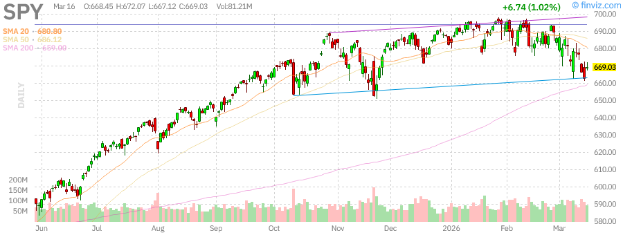
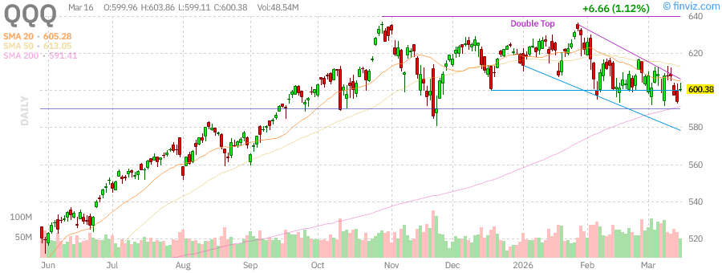
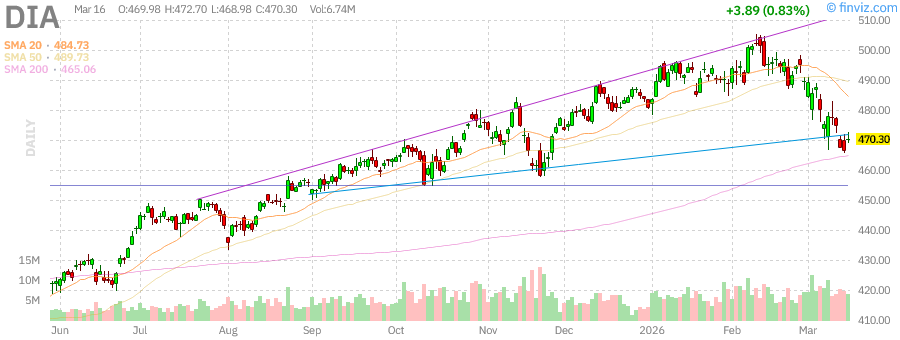
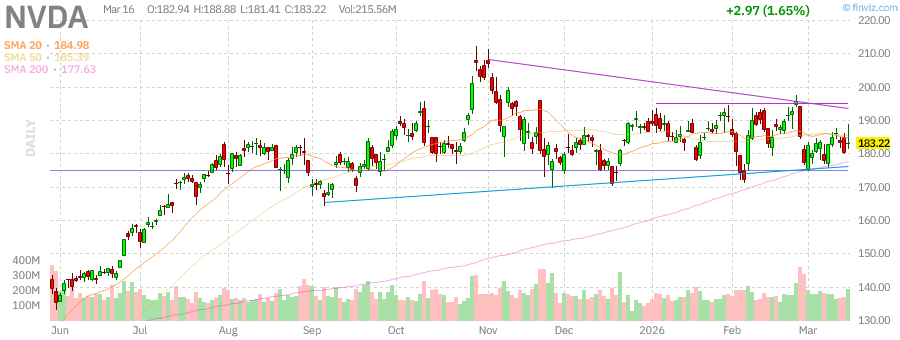
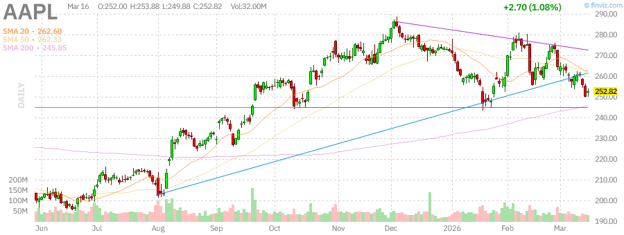
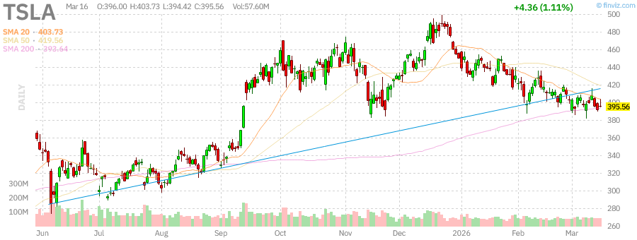

# Afternoon Deep Stock Research Report - March 16, 2026

**Report Date:** March 16, 2026 (Monday)  
**Session:** Afternoon Deep Research  
**Generated by:** OpenClaw Stock Research Agent

---

## Executive Summary

This afternoon deep research report provides comprehensive technical analysis of major U.S. indices, sector performance, individual stock deep dives, and precious metals analysis.

---

## 1. Market Overview - Major Indices

### 1.1 S&P 500 (SPY)

### 1.2 NASDAQ-100 (QQQ)

### 1.3 Dow Jones Industrial Average (DIA)

---

## 2. Gold/Silver Ratio Analysis

- Gold (GC=F): **5011.30**
- Silver (SI=F): **81.00**
- **Gold/Silver Ratio: 61.87**

---

## 3. Individual Stock Deep Dives

### 3.1 NVIDIA Corporation (NVDA)

### 3.2 Apple Inc. (AAPL)

### 3.3 Tesla Inc. (TSLA)

---

*Disclaimer: This report is for informational purposes only.*
