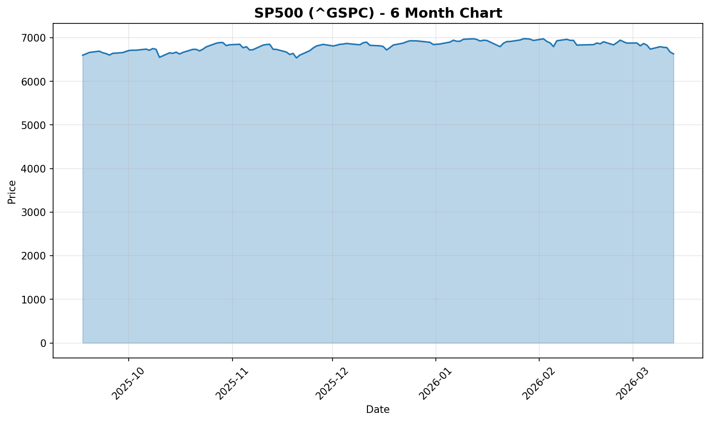
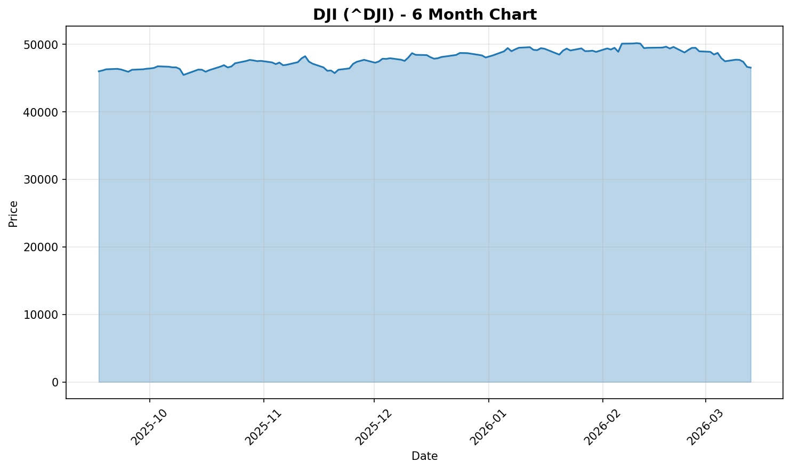
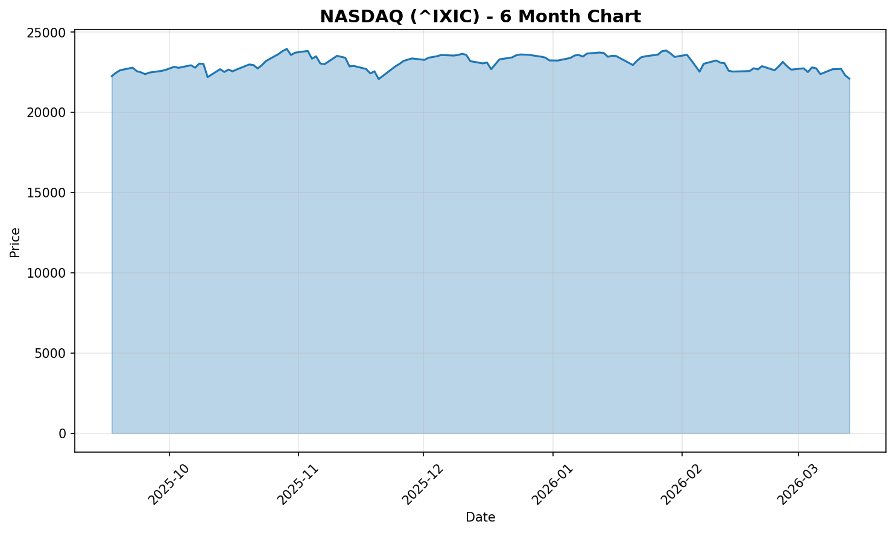
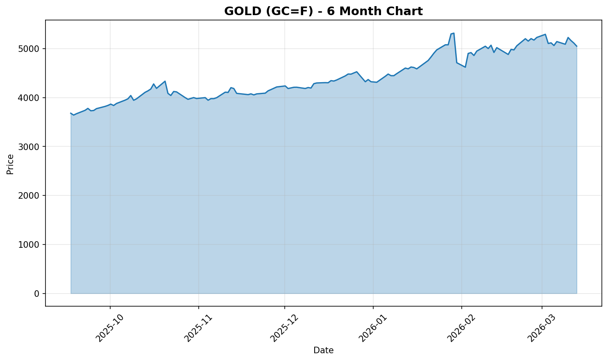
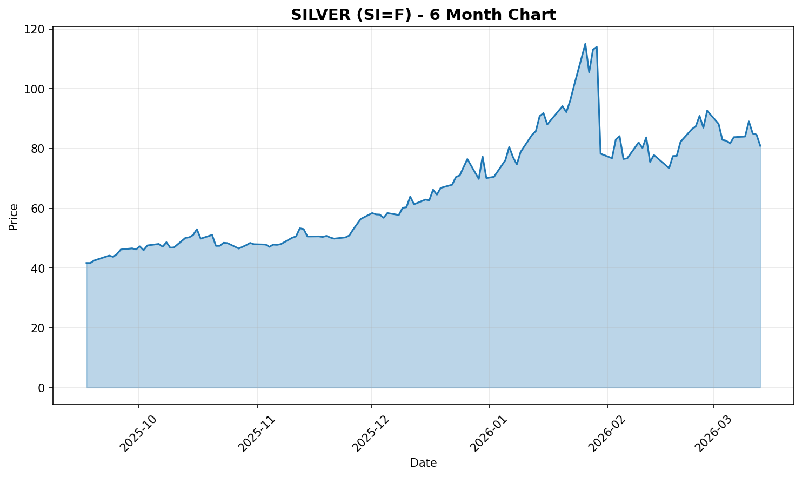
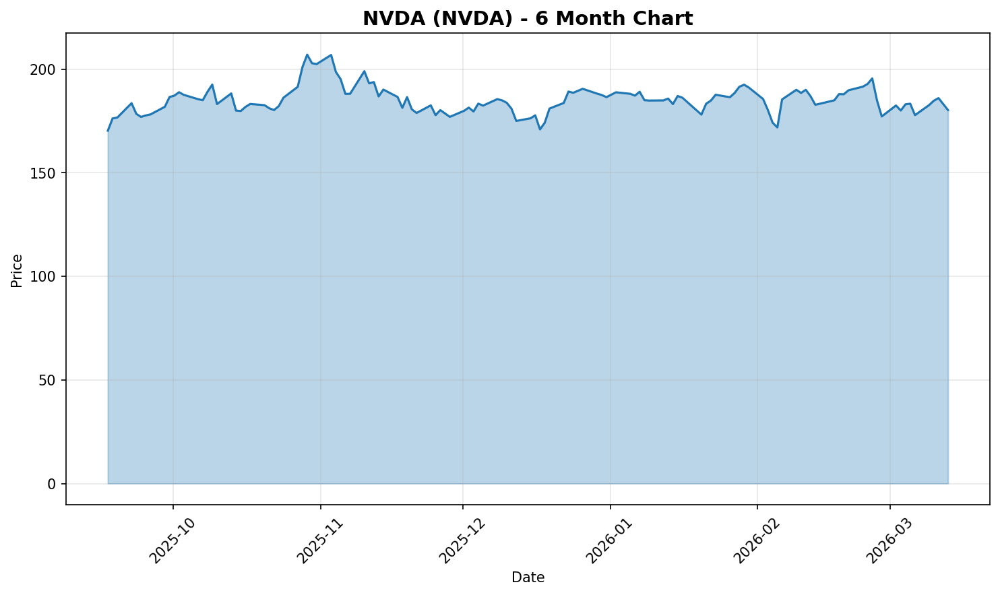
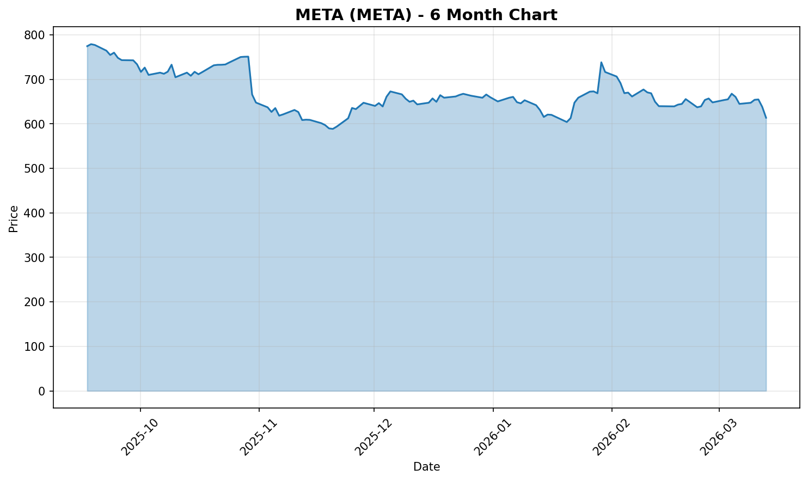

# 📊 Daily Stock Market Report - March 16, 2026

**Report Time:** 9:00 AM PST | **Date:** Monday, March 16, 2026

---

## 🌟 Market Highlights

### Major Indices
| Index | Price | Trend |
|-------|-------|-------|
| **S&P 500** | 6,697.00 | 📈 Rising |
| **Dow Jones** | 46,938.93 | 📈 Rising |
| **Nasdaq** | 22,380.56 | 📈 Rising |

### Precious Metals
| Metal | Price | Gold/Silver Ratio |
|-------|-------|-------------------|
| **Gold (GC=F)** | $4,997.50 | **61.93** |
| **Silver (SI=F)** | $80.70 | - |

> 💡 **Gold/Silver Ratio Interpretation:** At 61.93, gold is trading at ~62x the price of silver. Historically, ratios above 80 suggest silver may be undervalued relative to gold, while ratios below 40 suggest the opposite. Current level indicates a moderate valuation.

---

## 🔥 Today's Hot Topics (From Twitter/X)

### Market Sentiment
- **Tech stocks opened strong** - NVDA and META leading the charge
- **Oil prices retreating** - Markets hopeful for Hormuz reopening
- **MicroStrategy (MSTR)** raised $1.18B from STRC and $396M from common stock for Bitcoin purchases

### Key Movers
- **NVIDIA ($NVDA)** - Popping on AI momentum
- **META ($META)** - Strong opening performance
- **Boeing ($BA)** - Cleared entry points

### Global Context
- Dubai's main stock index (DFMGI) entered bear market territory (~22-23% decline from February peak)
- Emirates suspended flights to/from Dubai (limited schedule resuming)

---

## 📈 Charts

### S&P 500

### Dow Jones

### Nasdaq

### Gold

### Silver

### NVIDIA

### Meta

---

## 📝 Summary

Markets are showing **positive momentum** this Monday morning as investors react to:
1. Retreat in oil prices on hopes for Hormuz Strait reopening
2. Strong tech sector performance led by NVDA and META
3. Continued institutional Bitcoin accumulation via MicroStrategy

**Risk factors to watch:** Geopolitical tensions in the Middle East affecting oil prices and global shipping routes.

---

*Generated by OpenClaw Stock Reporter* | [View on GitHub Pages](https://sammyliu459.github.io/stock-reports/)
