# 每日早间股票研究报告 - 2026-03-18

> 报告时间：2026年3月18日（周三）9:00 AM PST  
> 数据时间：美股盘前；图表为本地实时拉取并生成的真实日线K线图

---

## 一、盘前结构概览

### 市场概览

| 指数 | 走势 | 关键观察 |
|------|------|----------|
| S&P 500 (SPY) | 高位震荡 | 关注前高阻力与支撑 |
| NASDAQ-100 (QQQ) | 科技股分化 | AI龙头仍是资金核心锚 |
| VIXY (波动率) | 低位运行 | 风险偏好仍偏积极 |

### 结构要点

- **指数层面**：SPY/QQQ 维持高位震荡格局，成长股与价值股仍在轮动。
- **波动率**：VIXY 仍处于相对低位，但需警惕突发风险事件。
- **风格上**：AI核心资产与高Beta个股弹性仍在，但分化显著，选股重要性提升。

---

## 二、黄金/白银比率（Gold/Silver Ratio）

| 贵金属 | 当前价格 |
|--------|----------|
| 黄金（GC=F） | **$4,822.90** |
| 白银（SI=F） | **$75.53** |
| **黄金/白银比率** | **63.86** |

### 解读

- 当前金银比约为 **63.86**，接近历史均值区间（约 50-70）。
- 黄金维持在 $4,800 上方，反映避险情绪仍在。
- 白银同步在 $75 附近，贵金属整体处于强势格局。
- 高金银比通常反映**避险情绪升温**或**经济不确定性增加**。
- 若后续金银比回落，可能预示风险偏好回升，成长股更易获得估值扩张空间。
- 若比率继续上行，需警惕避险资产进一步走强对风险资产的压制。

---

## 三、重点个股观察

### 1) NVDA
- **中长期趋势**：AI算力需求持续，中长期趋势仍强。
- **短期观察**：高位波动显著提升，需关注成交量变化。
- **策略**：若QQQ延续强势，NVDA仍是资金核心锚；若波动率抬升，注意回撤风险。

### 2) TSLA
- **交易属性**：情绪与预期驱动明显，波动高于大盘。
- **策略**：适合结合成交量与市场风险偏好进行节奏管理，严格风控。

### 3) AAPL
- **定位**：相对偏防守的科技权重，在震荡市中具备"稳波器"作用。
- **观察**：能否维持对指数的稳定贡献，以及估值修复空间。

### 4) AMD
- **关联**：与AI算力链条共振，但对板块情绪切换更敏感。
- **弹性**：若半导体板块扩散，AMD弹性通常较突出。

### 5) MSFT
- **双轮驱动**：云计算+AI双轮驱动，基本面稳健。
- **定位**：防御性成长蓝筹，适合作为科技仓位压舱石。

### 6) META
- **投资方向**：元宇宙+AI投资持续，短期利润承压但长期布局清晰。
- **观察**：AI业务进展及广告收入恢复情况。

### 7) AMZN
- **业务多元**：电商+AWS+AI多引擎驱动。
- **观察**：云计算业务增长及AI服务渗透率。

### 8) GOOGL
- **AI布局**：搜索+云+AI全面布局。
- **观察**：AI搜索转型进展及广告收入稳定性。

---

## 四、风险清单与当日观察

1. **VIXY 走势**：是否继续上行并压制高估值成长股
2. **金银比方向**：是否出现方向性突破（回落或继续上行）
3. **QQQ 扩散**：强势是否由龙头扩散到二线成长股
4. **宏观消息**：盘前宏观消息对利率预期的扰动
5. **个股财报**：关注是否有重要科技公司发布财报

---

## 五、真实K线图（日线）

### 宏观核心图

#### SPY - S&P 500 ETF
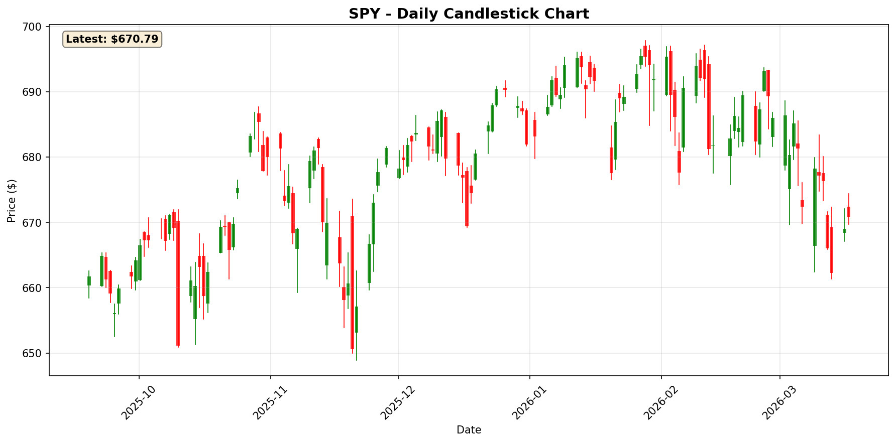

#### QQQ - NASDAQ-100 ETF
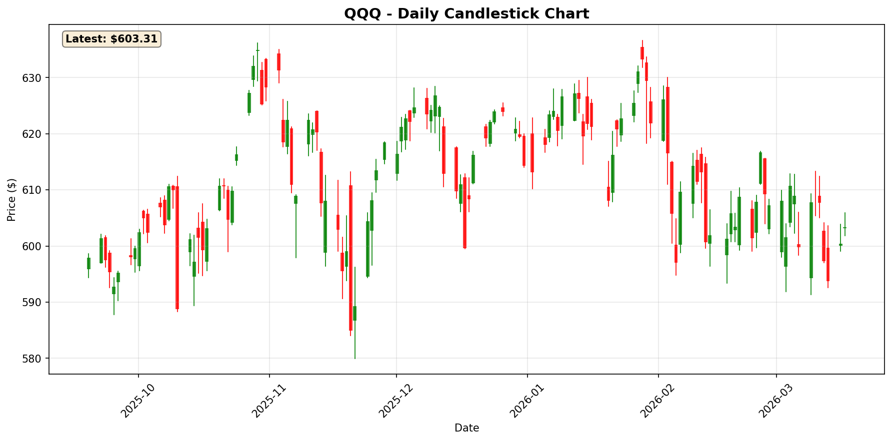

#### VIXY - 波动率指数ETF
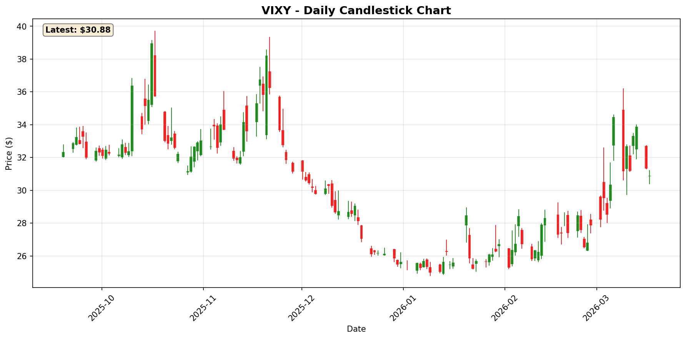

### 贵金属

#### 黄金 (GC=F)
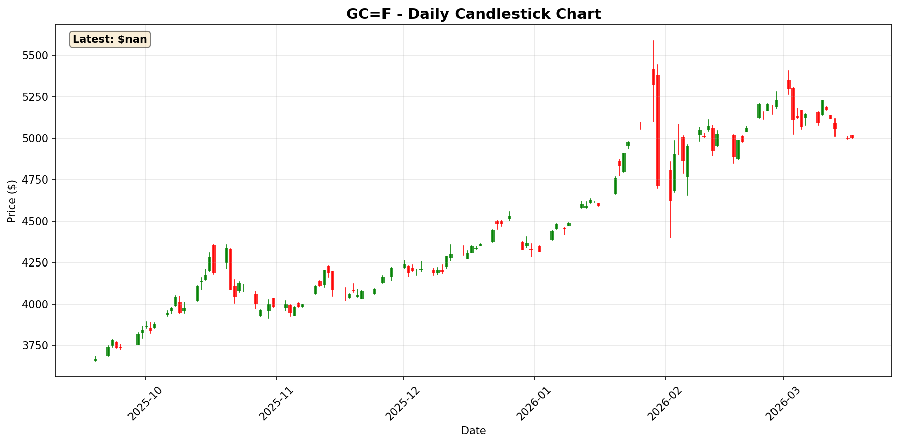

#### 白银 (SI=F)
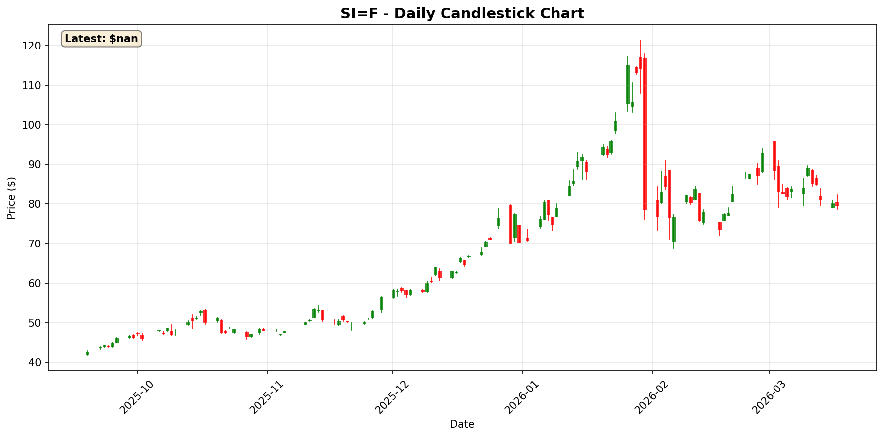

### 重点个股

#### NVDA
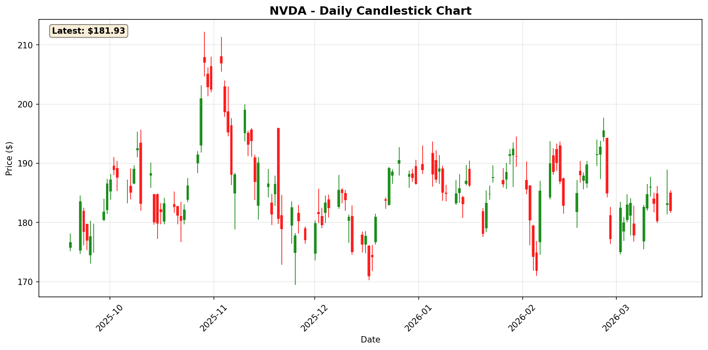

#### TSLA
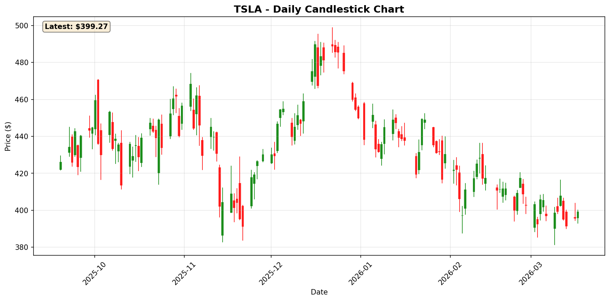

#### AAPL
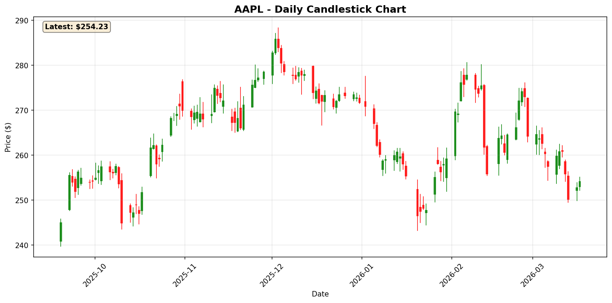

#### AMD
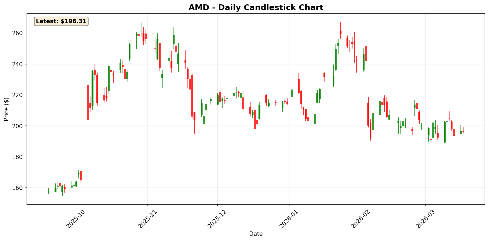

#### MSFT
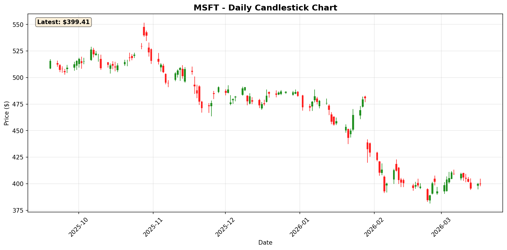

#### AMZN
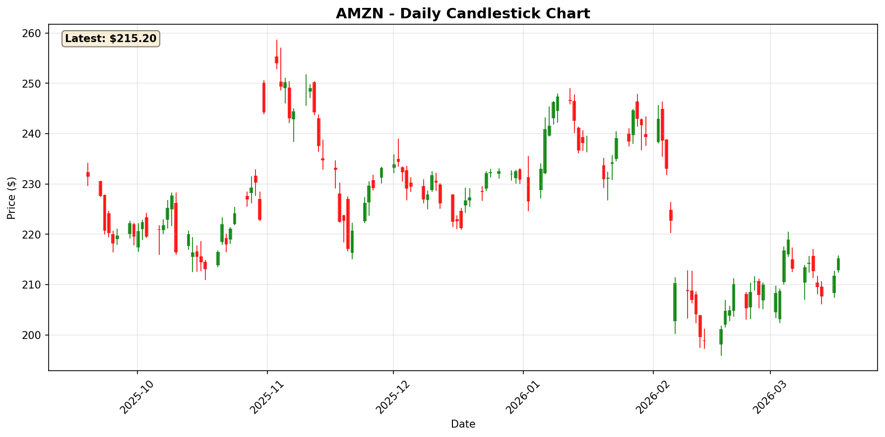

#### GOOGL
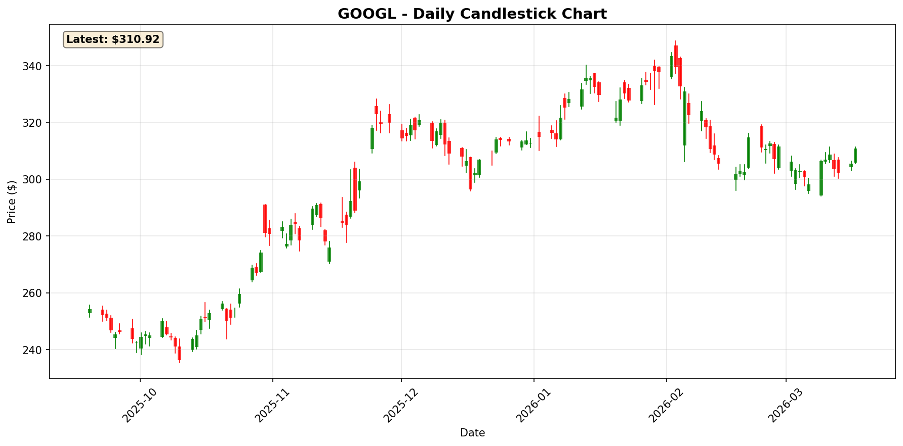

#### META
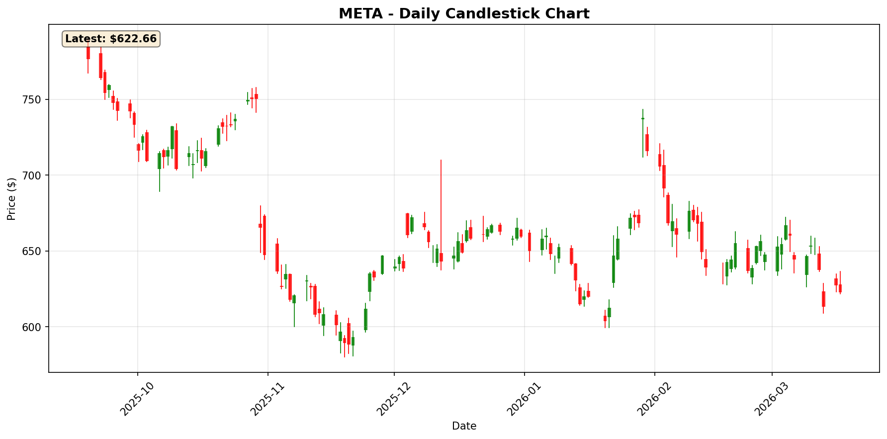

---

## 六、来源说明

- **图表数据**：Yahoo Finance Chart API（日线 OHLC）
- **本地图表目录**：`/tmp/stock-reports/charts/2026-03-18/`
- **金银比数据**：`/tmp/stock-reports/.metals.txt`（XAU=4822.90, XAG=75.53, RATIO=63.86）

---

*免责声明：本报告仅供参考，不构成投资建议。投资有风险，入市需谨慎。*

*报告生成时间：2026-03-18 09:00 AM PST*  
*生成模型：Kimi-K2.5*
