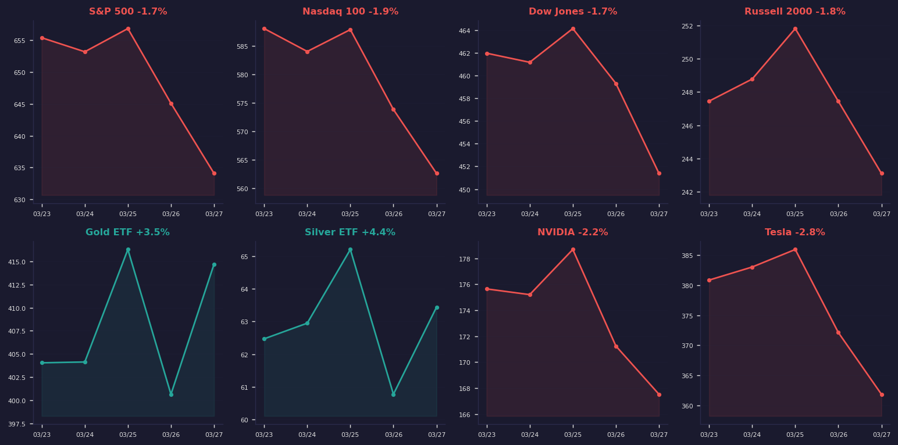

# 每日Morning股票研究报告

**日期:** 2026-03-29
**时间:** 08:26 PM UTC
**生成:** 自动合并价格+情绪数据

## 市场总览

## 指数与主要ETF

| 标的 | 价格 | 涨跌% | 成交量 |
|------|------|-------|--------|
| SPY | $634.09 | 🔴 -1.71% | 102.7M |
| QQQ | $562.58 | 🔴 -1.95% | 82.5M |
| DIA | $451.39 | 🔴 -1.72% | 6.9M |
| IWM | $243.10 | 🔴 -1.75% | 48.1M |
| GLD | $414.70 | 🟢 +3.51% | 16.6M |
| SLV | $63.44 | 🟢 +4.39% | 52.3M |

## 美国国债收益率

| 期限 | 收益率 | 变动 |
|------|--------|------|
| 3M | 3.61% | -0.36% |
| 5Y | 4.07% | -0.61% |
| 10Y | 4.44% | +0.54% |
| 30Y | 4.98% | +0.93% |

## 科技巨头

| 标的 | 价格 | 涨跌% | 成交量 | 走势图 |
|------|------|-------|--------|--------|
| NVDA | $167.52 | 🔴 -2.17% | 195.3M | [📊](../charts/2026-03-29/NVDA_daily.png) |
| TSLA | $361.83 | 🔴 -2.76% | 61.9M | [📊](../charts/2026-03-29/TSLA_daily.png) |
| AAPL | $248.80 | 🔴 -1.62% | 47.8M | [📊](../charts/2026-03-29/AAPL_daily.png) |
| AMD | $201.99 | 🔴 -0.87% | 29.1M | [📊](../charts/2026-03-29/AMD_daily.png) |
| MSFT | $356.77 | 🔴 -2.51% | 37.8M | [📊](../charts/2026-03-29/MSFT_daily.png) |
| AMZN | $199.34 | 🔴 -3.95% | 55.9M | [📊](../charts/2026-03-29/AMZN_daily.png) |
| GOOGL | $274.34 | 🔴 -2.34% | 35.8M | [📊](../charts/2026-03-29/GOOGL_daily.png) |
| META | $525.72 | 🔴 -3.99% | 30.0M | [📊](../charts/2026-03-29/META_daily.png) |

## 板块ETF

| 板块 | ETF | 价格 | 涨跌% |
|------|-----|------|-------|
| 金融 | XLF | $47.81 | 🔴 -2.53% |
| 能源 | XLE | $62.56 | 🟢 +1.69% |
| 科技 | XLK | $129.92 | 🔴 -1.95% |
| 工业 | XLI | $159.20 | 🔴 -1.28% |
| 公用事业 | XLU | $45.59 | 🟢 +0.57% |
| 医疗 | XLV | $143.26 | 🔴 -1.70% |

## Twitter/X 市场情绪

- 总推文: 25
- 看涨: 44.0% | 看跌: 8.0%
- 平均分数: 3.72/5

## 情绪-价格背离分析

| 股票 | 提及次数 | 价格 | 涨跌% | 信号 |
|------|---------|------|-------|------|
| AMZN | 3 | $199.34 | -3.95% | ⚠️ watch: bullish sentiment but price down |
| RKLB | 4 | $60.93 | -7.6% | aligned |
| DOGE | 1 | N/A | N/A |  |
| BBAI | 1 | $3.14 | -5.42% | aligned |
| ONDS | 1 | $8.8 | -6.78% | aligned |
| PDYN | 1 | $5.78 | -7.37% | aligned |
| HAL | 1 | $40.42 | 4.2% | aligned |
| GD | 1 | $346.76 | -2.4% | aligned |
| RCAT | 1 | $12.68 | -9.43% | aligned |
| KRKNF | 1 | $5.97 | 0.67% | aligned |
| LUNR | 1 | $17.52 | -8.89% | aligned |
| RDW | 1 | $8.16 | -8.0% | aligned |
| PL | 1 | $30.86 | -4.75% | aligned |
| RTX | 1 | $189.71 | -1.63% | aligned |
| LMT | 1 | $615.84 | -1.83% | aligned |

### 热门推文

- ⚪ **@amosertwink**: o primeiro cigarro do dia é aquele que te da vida https://t.co/tEXYwchcFJ...
- 🟢 **@nicoso11215**: @drp825_ Well always Bitcoin. But that’s a given. RKLB, AMZN, NBIS, IREN. If they dip more tomorrow, I will be going har...
  相关: AMZN, IREN, NBIS, RKLB
- 🟢 **@Darrykenny2**: DOGE is on the move! SpaceX IPO speculation is sending Dogecoin price into high gear, with investors eyeing a potential ...
  相关: DOGE
- 🟢 **@neonaveed**: WAR ECONOMY 

DEFENSE 
AEROSPACE 
SECURITY 
ENERGY 

$GE $BA $LMT $LHX $NOC $RTX $GD
$RKLB $ASTS $RDW $LUNR $FLY $PL $AV...
  相关: BBAI, ONDS, PDYN, HAL, GD, RCAT, KRKNF, LUNR, RDW, PL, RTX, LMT, AVAV, BKSY, COIN, RKLB, SLB, NOC, LHX, CVX, ASTS, FLY, XOM, CRCL, KTOS, PLTR, GE, MSTR, BA, COP, UMAC
- ⚪ **@RokoMijic**: @grok @kimmonismus @grok but is that realistic? I mean if Britain wanted to re-shore virgin steel, manufacturing, become...

---

*本报告由自动化系统生成，价格数据来自Yahoo Finance，情绪数据来自Twitter/X。仅供参考，不构成投资建议。*