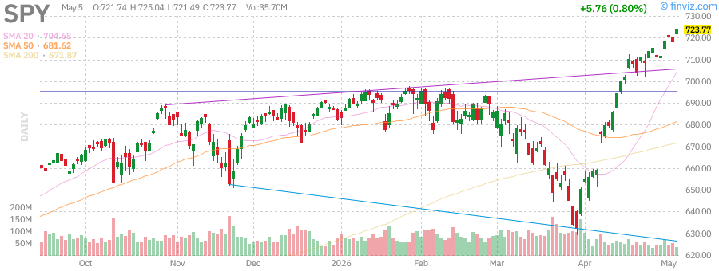
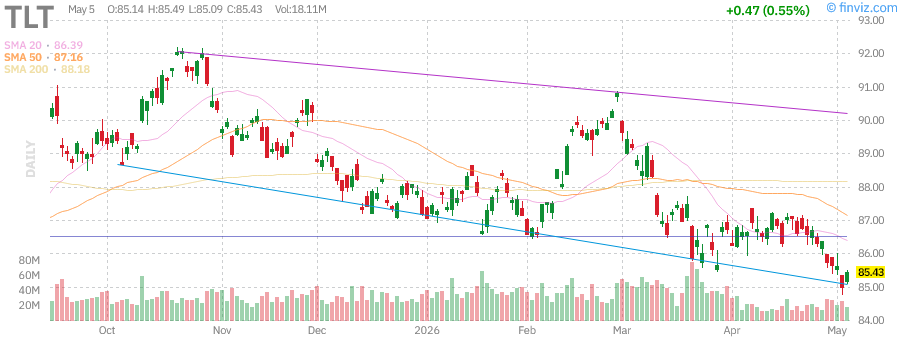
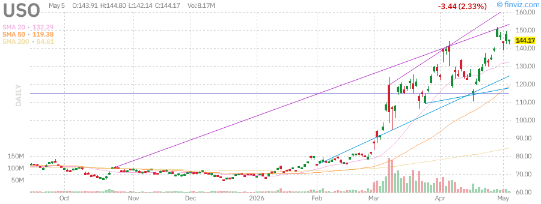
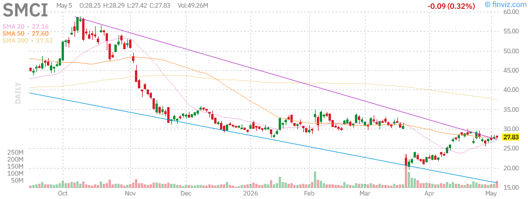

# Afternoon Stock Market Report - May 5, 2026

**Report Date:** Tuesday, May 5, 2026  
**Report Time:** 3:00 PM PDT  
**Market Status:** Markets Closed - After-Hours Trading Active

---

## 📊 Market Overview

U.S. stocks extended their record-breaking rally on Tuesday, with the **S&P 500** and **Nasdaq Composite** notching fresh all-time highs as technology and semiconductor shares led gains. The session was dominated by a massive wave of after-hours earnings reports from major tech companies, headlined by **AMD's strong Q1 2026 results** that sent shares soaring.

**Key Market Themes:**
- AI infrastructure demand continues to drive semiconductor outperformance
- Treasury yields near 5% on long-end as bond market faces pressure
- Oil prices retreat on hopes of Iran deal progress
- VIX volatility index settles at 16.55, indicating complacent market sentiment

---

## 📈 Index Performance

| Index/ETF | Performance | Weekly | Monthly | YTD |
|-----------|-------------|--------|---------|-----|
| **SPY** (S&P 500) | +0.16% | +1.70% | +9.84% | +30.04% |
| **QQQ** (Nasdaq 100) | +0.28% | +3.66% | +15.82% | +40.37% |
| **IWM** (Russell 2000) | -0.20% | +3.16% | +11.97% | +43.25% |
| **DIA** (Dow Jones) | Flat | - | - | - |

### Index Charts

*SPY (S&P 500) - Daily Chart*

*QQQ (Nasdaq 100) - Daily Chart*

*IWM (Russell 2000) - Daily Chart*

**Market Breadth (Finviz):**
- Advancing Issues: 58.7%
- New Highs: 73.8%
- Above SMA50: Mixed signals
- Above SMA200: Mixed signals

---

## 💰 Treasury Yields

| Maturity | Yield | Change |
|----------|-------|--------|
| **3-Month** | 3.70% | - |
| **5-Year** | 4.08% | +6 bps |
| **10-Year** | 4.43% | +3 bps |
| **30-Year** | 4.98% | +1 bp |

**Key Bond Market Developments:**
- The 30-year Treasury bond yield is nearing the psychologically important 5% level
- Bond market facing mounting pressure amid fiscal concerns
- US long bonds rebounding as buyers snap up rare 5% yields
- **TLT** (20+ Year Treasuries): Weekly -1.09%, Monthly -1.41%

*TLT (20+ Year Treasury Bond ETF) - Daily Chart*

---

## 🛢️ Commodities

| Commodity | Performance | Weekly | Monthly | YTD |
|-----------|-------------|--------|---------|-----|
| **GLD** (Gold) | -0.86% | -0.86% | -2.19% | +39.42% |
| **USO** (Oil) | +3.27% | +3.27% | +3.76% | +128.78% |

**Commodity Market Highlights:**
- **Gold** steady as fragile US-Iran truce holds after Hormuz flareup
- **Oil** falls over $2 after Trump pauses Strait opening for possible Iran deal
- Saudi Arabia cuts oil prices for June from record-high premium
- US gasoline supplies on way to seasonal low according to Morgan Stanley

*GLD (Gold ETF) - Daily Chart*

*USO (Oil ETF) - Daily Chart*

---

## 📰 Market News

### Major Headlines

1. **AMD Earnings Beat Expectations** (After Hours)
   - Q1 2026 Revenue: $10.3 billion (+38% YoY)
   - Non-GAAP EPS: $1.37 (vs. $0.96 prior year)
   - Data Center revenue up 57% driven by AI infrastructure demand
   - Shares popped 7% after hours

2. **Super Micro Computer (SMCI) Surges**
   - Stock soars as AI server demand lifts results
   - Margin recovery cheered by Wall Street

3. **Samsung Hits $1 Trillion Valuation**
   - Joins TSMC in elite club of trillion-dollar semiconductor companies
   - Collaboration with AMD on next-gen AI memory technologies

4. **SEC Proposes Ending Mandatory Quarterly Reports**
   - Proposal would usher Wall Street into optional semiannual reporting
   - Follows Trump's call for less frequent reporting

5. **Strait of Hormuz Developments**
   - Trump pauses operation to guide ships through Strait
   - Oil prices fall on renewed hopes for Iran deal
   - Chevron CEO warns economies may have to slow due to supply disruptions

### Earnings Recap

**Morning Reporters:**
- Pfizer (PFE): Q1 EPS $0.73
- PayPal (PYPL): Strong buyback program
- HSBC Holdings, Eaton Corporation, Anheuser-Busch

**After-Hours (Major Tech):**
- **AMD**: Beat expectations, strong guidance
- **Arista Networks (ANET)**: Results pending
- **Super Micro Computer (SMCI)**: Margin recovery
- **MicroStrategy (MSTR)**: Results pending
- **Electronic Arts (EA)**: Results pending

**Tomorrow's Earnings:**
- Novo Nordisk (NVO)
- Walt Disney (DIS)
- Uber Technologies (UBER)
- CVS Health (CVS)
- ARM Holdings (ARM)
- DoorDash (DASH)

---

## 🏢 Individual Stock Analysis

### Semiconductor Leaders

#### AMD (Advanced Micro Devices)

**Q1 2026 Financial Results:**
- Revenue: $10.3B (+38% YoY)
- GAAP EPS: $0.84 (+91% YoY)
- Non-GAAP EPS: $1.37 (+43% YoY)
- Gross Margin: 53% (GAAP), 55% (Non-GAAP)
- Data Center Revenue: $5.8B (+57% YoY)

**Key Highlights:**
- AI infrastructure demand accelerating
- Meta partnership: Up to 6 gigawatts of AMD Instinct GPUs
- AWS, Google Cloud, Microsoft Azure expanding EPYC-powered instances
- Q2 2026 Guidance: Revenue ~$11.2B (+46% YoY)

**After-Hours Performance:** +7%

---

#### NVDA (Nvidia)

- Daily Performance: +0.8%
- Continues to dominate AI infrastructure narrative
- Market bellwether for semiconductor sector

---

#### SMCI (Super Micro Computer)

- After-hours surge on earnings
- AI server demand driving revenue growth
- Margin recovery story gaining traction

---

### Notable Movers

| Stock | Performance | Catalyst |
|-------|-------------|----------|
| **MU** (Micron) | +5.1% | Semiconductor strength |
| **INTC** (Intel) | +% | Breaking major milestones |
| **SMH** (Semiconductor ETF) | +0.93% | Sector-wide rally |
| **CLRB** (Cellectar) | +62.2% | Clinical updates |
| **BLZE** (Backblaze) | +58.0% | High relative volume |
| **BRBR** (BellRing) | -33.6% | Sharp sell-off |
| **PLTR** (Palantir) | -3.7% | Valuation concerns |

---

## 🔮 Market Outlook

### Technical Analysis
- **S&P 500** and **Nasdaq** at fresh record highs
- **Russell 2000** underperforming, down 0.2% (rate-sensitive small caps)
- Semiconductor sector leading with SMH +0.93%
- Market breadth remains healthy with 58.7% advancing issues

### Key Factors to Watch

1. **Earnings Season Continues**
   - Heavyweight reports tomorrow: Disney, Uber, CVS
   - ARM Holdings and DoorDash also reporting
   - Tech earnings driving market sentiment

2. **Fed Policy Outlook**
   - Traders ramping up bets that Warsh's Fed could hike before cutting
   - 30-year Treasury yield nearing 5%
   - Bond market volatility remains elevated

3. **Geopolitical Risks**
   - US-Iran truce holding but fragile
   - Strait of Hormuz situation remains tense
   - Oil prices sensitive to any developments

4. **AI Infrastructure Boom**
   - Data Center revenues surging across chipmakers
   - Meta, AWS, Google, Microsoft all expanding AI infrastructure
   - MI450 Series and Helios demand exceeding expectations

### Analyst Commentary

> "We delivered an outstanding first quarter, driven by accelerating demand for AI infrastructure, with Data Center now the primary driver of our revenue and earnings growth." — **Dr. Lisa Su, AMD CEO**

> "The 30-year Treasury bond yield is nearing 5%. Could it go even higher?" — **MarketWatch**

> "Tech and Semiconductors Lead Gains as Investors Brace for High-Stakes After-Hours Earnings" — **Stock Market Watch**

---

## ⚠️ Risk Factors

- **Volatility:** VIX at 16.55 suggests complacency; risk of sudden spikes
- **Interest Rates:** Long-term yields approaching 5% could pressure equities
- **Geopolitical:** Iran situation remains fluid; oil price volatility
- **Valuations:** Tech sector valuations at elevated levels
- **Earnings:** High bar set for tech earnings; disappointments could trigger selloffs

---

## 📌 Summary

**Today's Session:**
✅ S&P 500 and Nasdaq hit fresh record highs  
✅ AMD earnings beat expectations, shares +7% after hours  
✅ Semiconductor sector leads with SMH +0.93%  
✅ Oil prices fall on Iran deal hopes  
⚠️ Small caps lag (IWM -0.2%)  
⚠️ 30-year Treasury yield nears 5%

**Key Levels:**
- VIX: 16.55 (low volatility regime)
- 10-Year Yield: 4.43%
- Oil: Declining from recent highs

**Tomorrow's Focus:**
- Disney (DIS), Uber (UBER), CVS (CVS) earnings
- ARM Holdings (ARM) and DoorDash (DASH) after hours
- US-Iran developments

---

*Report generated: May 5, 2026 at 3:00 PM PDT*  
*Data sources: Finviz, Stock Market Watch, CNBC, AMD Investor Relations, U.S. Treasury*