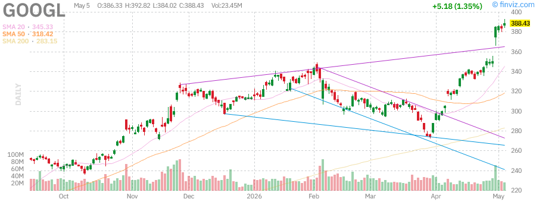

# 每日afternoon股票研究报告

**日期:** 2026-05-17
**时间:** 15:08 PM PDT

## 市场概述

美股三大指数今日全线上涨，再创收盘新高。市场受美伊停火协议进展和AMD强劲财报推动，科技股领涨。S&P 500和纳斯达克指数均触及盘中及收盘历史高点。特朗普宣布暂停霍尔木兹海峡护航行动，称与伊朗代表在达成全面最终协议方面取得"重大进展"。

## 大盘指数表现

### S&P 500 (SPY)
- **收盘价:** $723.77 (+$5.76, +0.80%)
- **盘中高点:** $725.04 (创52周新高)
- **盘后:** $726.46 (+0.37%)
- **52周区间:** $556.04 - $725.04

### 纳斯达克100 (QQQ)
- **收盘价:** $681.61 (+$8.73, +1.30%)
- **盘中高点:** $682.77 (创52周新高)
- **盘后:** $687.24 (+0.83%)
- **52周区间:** $476.78 - $682.77

### 罗素2000 (IWM)
- **收盘价:** $282.56 (+$4.68, +1.68%)
- **盘中高点:** $282.95 (创52周新高)
- **盘后:** $283.43 (+0.31%)
- **52周区间:** $195.64 - $282.95

### VIX波动率指数
- **当前水平:** 17.38
- **较上一交易日:** -4.98%
- **市场解读:** 波动性下降，投资者风险偏好回升

## 美国国债收益率

| 期限 | 收益率 |
|------|--------|
| 3个月 | 3.72% |
| 2年期 | 3.53% |
| 5年期 | 3.80% |
| 10年期 | 4.24% |
| 30年期 | 4.83% |

## 大宗商品

### 黄金 (GLD)
- **收盘价:** $418.27 (+$3.56, +0.86%)
- **盘后:** $421.99 (+0.89%)
- **52周区间:** $291.78 - $509.70

### 原油 (USO)
- **收盘价:** $144.17 (-$3.44, -2.33%)
- **盘后:** $140.02 (-2.88%)
- **52周区间:** $63.26 - $151.63

## 市场要闻

### 地缘政治进展
- **美伊停火协议:** 特朗普宣布暂停"自由计划"(Project Freedom)，称与伊朗代表在达成全面最终协议方面取得"重大进展"
- **霍尔木兹海峡:** 国防部长Pete Hegseth表示美伊停火"肯定有效"，美国商船已在驱逐舰护航下安全通过霍尔木兹海峡
- **油价反应:** 原油价格在特朗普宣布暂停海峡护航行动后大幅下跌，布伦特原油跌破每桶100美元

### 财报亮点
- **AMD:** 盘后大涨16%，Q2营收指引约112亿美元，Q1业绩超预期。AI业务持续推动增长，数据中心收入同比增长强劲。
- **Super Micro Computer (SMCI):** 盘后飙升18%，Q4利润预期65-79美分/股，远超华尔街预期的55美分
- **Arista Networks (ANET):** 盘后下跌近12%，Q1调整后毛利率62.4%，略低于预期的62.7%

### 市场整体数据
- 约85%已公布财报的S&P 500公司业绩超预期
- 77%的公司营收超预期
- 所有11个S&P 500行业板块今日均上涨

### 其他重要新闻
- **三星电子:** 市值突破1万亿美元，加入台积电精英俱乐部
- **美联储预期:** 交易员加大押注，认为Warsh领导下的美联储可能在降息前先加息
- **亚洲市场:** 受AI热潮和伊朗和平希望推动，亚洲股市创下历史新高

## 个股分析

### NVIDIA (NVDA)
- **市场表现:** 本周上涨1.70%，本月上涨9.84%
- **AI龙头:** 继续在AI芯片领域保持领先地位

### Tesla (TSLA)
- **本周表现:** +3.55%
- **本月表现:** +10.36%
- **市值:** $1.46万亿
- **分析师评级:** 2.50 (买入)

### Apple (AAPL)
- **本周表现:** +4.98%
- **本月表现:** +9.78%
- **市值:** $4.17万亿
- **P/E:** 34.38

### AMD (AMD)
AMD盘后大涨16%，Q2营收指引强劲(约112亿美元)，AI业务持续推动增长。数据中心收入同比增长显著，MI300系列AI芯片需求强劲。

### Microsoft (MSFT)
- **本周表现:** -4.16%
- **本月表现:** +10.33%
- **市值:** $3.06万亿
- **P/E:** 24.50

### Amazon (AMZN)
- **本周表现:** +5.33%
- **本月表现:** +28.55%
- **市值:** $2.94万亿
- **P/E:** 32.69

### Alphabet (GOOGL)
- **本周表现:** +11.05%
- **本月表现:** +29.48%
- **市值:** $4.69万亿
- **P/E:** 30.39

### Meta (META)
- **本周表现:** -9.89%
- **本月表现:** +5.57%
- **市值:** $1.54万亿
- **P/E:** 21.99

## 市场展望

RBC Capital Markets美国股票策略主管Lori Calvasina表示，股市正在"攀爬担忧之墙"。她认为地缘政治领域的人士可能低估了AI交易和财报对S&P 500每股收益的缓冲作用，AI相关板块的上调修正率持续为正。

**本周重点关注:**
- 美联储官员讲话及利率政策预期
- 美伊协议最终进展
- 更多Q1财报发布

**技术面:**
- SPY RSI(14): 71.25 (接近超买区域)
- QQQ RSI(14): 76.43 (超买区域)
- IWM RSI(14): 69.20 (接近超买)

**明日关注:**
- 更多财报季公司公布业绩
- 地缘政治进展
- 美国零售销售数据

---

*本报告由自动化系统生成，仅供参考，不构成投资建议。*
