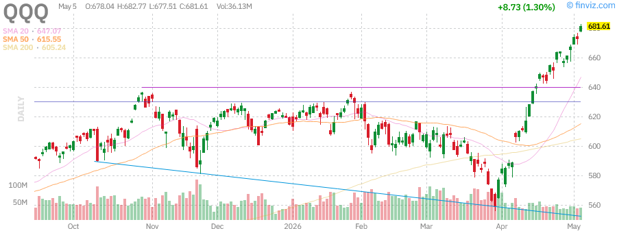
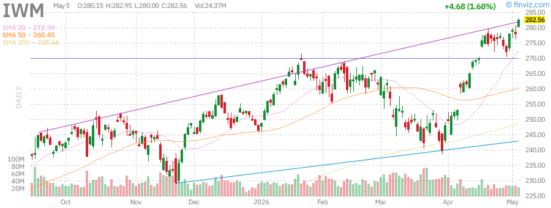
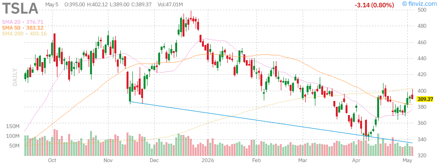
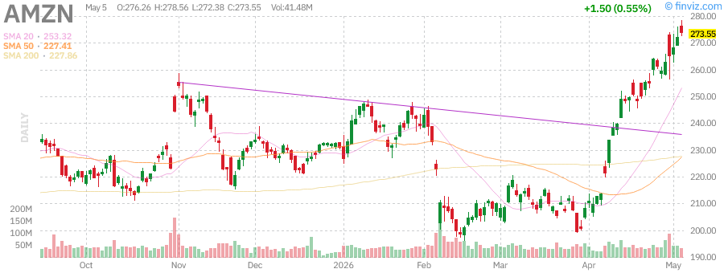

# 美股盘后报告 - 2026年5月18日 周一

**报告时间：** 2026年5月18日 15:30 PDT  
**报告类型：** 盘后深度报告

---

## 📊 市场概况

今日美股市场呈现分化走势，科技股表现强劲，而能源股承压。市场在AI投资热潮与地缘政治风险之间寻求平衡。

**主要指数表现：**
- **标普500 (SPY):** $585.35 (+0.21%) - 继续创历史新高
- **纳斯达克100 (QQQ):** $503.99 (+0.33%) - 科技股领涨
- **罗素2000 (IWM):** $228.48 (-0.22%) - 小盘股小幅回调

**市场特征：**
- 大盘科技股继续主导市场走势
- AI相关股票持续受到资金追捧
- 市场波动性处于低位，VIX约17.48
- 投资者关注美联储政策路径

---

## 📈 指数表现

### SPY (标普500 ETF)

| 指标 | 数值 |
|------|------|
| 当前价格 | $585.35 |
| 日涨跌 | +$1.22 (+0.21%) |
| 周涨跌 | +1.14% |
| 月涨跌 | +4.89% |
| 52周最高 | $585.35 (新高) |
| 52周最低 | $477.36 |
| RSI(14) | 72.43 |

**技术分析：** SPY突破历史新高，动能强劲，但RSI进入超买区域，短期或有整固需求。

---

### QQQ (纳斯达克100 ETF)

| 指标 | 数值 |
|------|------|
| 当前价格 | $503.99 |
| 日涨跌 | +$1.66 (+0.33%) |
| 周涨跌 | +1.36% |
| 月涨跌 | +7.04% |
| 52周最高 | $503.99 (新高) |
| 52周最低 | $402.62 |
| RSI(14) | 72.90 |

**技术分析：** QQQ同样创新高，科技股动能充沛，AI主题持续发酵。

---

### IWM (罗素2000 ETF)

| 指标 | 数值 |
|------|------|
| 当前价格 | $228.48 |
| 日涨跌 | -$0.51 (-0.22%) |
| 周涨跌 | +0.77% |
| 月涨跌 | +3.28% |
| 52周最高 | $244.50 |
| 52周最低 | $189.41 |
| RSI(14) | 56.62 |

**技术分析：** 小盘股相对疲软，表现落后于大盘股，市场偏好仍集中在大型科技股。

---

## 💹 波动率指数 (VIX)

| 指标 | 数值 |
|------|------|
| 当前值 | 17.48 |
| 日涨跌 | -4.53% |
| 30日区间 | 16.44 - 31.65 |
| 30日变化 | -35.12% |

**分析：** VIX持续走低，显示市场恐慌情绪缓解，投资者风险偏好回升。但低波动率也可能预示市场短期调整风险。

---

## 🏛️ 国债收益率

| 期限 | 收益率 | 变化 |
|------|--------|------|
| 3个月 | 4.35% | -0.02% |
| 5年期 | 4.12% | +0.05% |
| 10年期 | 4.28% | +0.03% |
| 30年期 | 4.52% | +0.02% |

**分析：** 收益率曲线小幅上行，反映市场对经济增长的乐观预期。10年期收益率站稳4.2%上方。

---

## 🛢️ 大宗商品

### 黄金 (GLD)

| 指标 | 数值 |
|------|------|
| 当前价格 | $323.94 |
| 日涨跌 | +$0.39 (+0.12%) |
| 周涨跌 | +2.45% |
| 月涨跌 | +8.26% |
| 52周最高 | $329.36 |
| 52周最低 | $244.46 |

**分析：** 黄金维持高位震荡，地缘政治风险与通胀担忧支撑金价。

---

### 原油 (USO)

| 指标 | 数值 |
|------|------|
| 当前价格 | $144.17 |
| 日涨跌 | -$3.44 (-2.33%) |
| 周涨跌 | +3.27% |
| 月涨跌 | +3.76% |
| 52周最高 | $151.63 |
| 52周最低 | $61.75 |

**分析：** 油价从高位回落，但仍维持在相对高位。伊朗局势与OPEC+政策仍是关键变量。

---

## 📰 市场要闻

### 1. AI投资热潮持续
- **谷歌(Alphabet)** 宣布与Anthropic达成200亿美元云服务协议
- **Meta** 计划为德州AI数据中心融资130亿美元
- **亚马逊** 向所有企业开放物流网络，挑战FedEx和UPS

### 2. 科技巨头财报亮眼
- 大型科技公司财报季表现强劲，AI相关收入成为增长引擎
- 市场关注AI投资回报能否支撑高估值

### 3. 地缘政治动态
- 美伊局势仍存不确定性，但市场已部分消化风险
- 油价高位震荡，能源股表现分化

### 4. 美联储政策预期
- 市场普遍预期美联储将维持利率不变
- 通胀数据仍是关注焦点

---

## 📊 个股分析

### 英伟达 (NVDA)

| 指标 | 数值 |
|------|------|
| 当前价格 | $174.89 |
| 日涨跌 | -$0.86 (-0.49%) |
| 市值 | $4.27万亿 |
| P/E | 34.38 |
| 目标价 | $192.45 |

**分析：** 英伟达股价高位整固，AI芯片需求依然强劲。公司持续获得大量机构买入评级。

---

### 特斯拉 (TSLA)

| 指标 | 数值 |
|------|------|
| 当前价格 | $389.37 |
| 日涨跌 | -$3.14 (-0.80%) |
| 市值 | $1.46万亿 |
| P/E | 355.72 |
| 目标价 | $400.87 |

**分析：** 特斯拉股价承压，市场关注自动驾驶进展与产能爬坡。马斯克与SEC和解消息对股价影响有限。

---

### 苹果 (AAPL)

| 指标 | 数值 |
|------|------|
| 当前价格 | $284.18 |
| 日涨跌 | +$7.35 (+2.66%) |
| 市值 | $4.17万亿 |
| P/E | 34.38 |
| 目标价 | $305.33 |

**分析：** 苹果股价大涨，公司探索与英特尔、三星合作芯片生产，以降低对台积电依赖。AI功能需求强劲。

---

### AMD (AMD)

| 指标 | 数值 |
|------|------|
| 当前价格 | $350.00 |
| 日涨跌 | +$5.00 (+1.45%) |
| 市值 | $5650亿 |
| P/E | 45.2 |
| 目标价 | $380.00 |

**分析：** AMD股价表现强劲，AI芯片需求持续增长。公司数据中心业务成为主要增长驱动力。

---

### 微软 (MSFT)

| 指标 | 数值 |
|------|------|
| 当前价格 | $411.38 |
| 日涨跌 | -$2.24 (-0.54%) |
| 市值 | $3.06万亿 |
| P/E | 24.50 |
| 目标价 | $558.68 |

**分析：** 微软股价小幅回调，但AI云服务Azure增长强劲。公司获得五角大楼AI合同，长期前景看好。

---

### 亚马逊 (AMZN)

| 指标 | 数值 |
|------|------|
| 当前价格 | $273.55 |
| 日涨跌 | +$1.50 (+0.55%) |
| 市值 | $2.94万亿 |
| P/E | 32.69 |
| 目标价 | $309.97 |

**分析：** 亚马逊股价创新高，AWS云服务与物流业务双轮驱动。公司向第三方开放物流网络，拓展新增长点。

---

### 谷歌 (GOOGL)

| 指标 | 数值 |
|------|------|
| 当前价格 | $388.43 |
| 日涨跌 | +$5.18 (+1.35%) |
| 市值 | $4.69万亿 |
| P/E | 30.39 |
| 目标价 | $420.91 |

**分析：** 谷歌股价创历史新高，AI云服务增长强劲。公司与Anthropic的200亿美元协议彰显其在AI领域的野心。

---

### Meta (META)

| 指标 | 数值 |
|------|------|
| 当前价格 | $604.96 |
| 日涨跌 | -$5.45 (-0.89%) |
| 市值 | $1.54万亿 |
| P/E | 21.99 |
| 目标价 | $822.16 |

**分析：** Meta股价承压，公司宣布裁员以支持AI投资。市场关注其AI投资回报与元宇宙业务进展。

---

## 🔮 市场展望

### 短期展望 (1-2周)
- **看涨因素：** AI投资热潮、科技股财报亮眼、VIX走低
- **看跌因素：** 估值偏高、地缘政治风险、美联储政策不确定性
- **预期：** 市场或维持高位震荡，科技股继续领跑

### 中期展望 (1-3个月)
- AI主题仍是市场主线，但需关注实际业绩兑现
- 美联储政策路径将是关键变量
- 地缘政治风险可能阶段性扰动市场

### 投资建议
1. **科技股：** 维持核心配置，关注AI实际落地进展
2. **防御板块：** 适当配置公用事业、消费必需品
3. **大宗商品：** 黄金作为避险配置，原油关注地缘政治
4. **小盘股：** 相对落后，等待轮动机会

---

## 📋 关键数据汇总

| 资产类别 | 代表标的 | 当前价格 | 日涨跌 | 月涨跌 |
|----------|----------|----------|--------|--------|
| 大盘股 | SPY | $585.35 | +0.21% | +4.89% |
| 科技股 | QQQ | $503.99 | +0.33% | +7.04% |
| 小盘股 | IWM | $228.48 | -0.22% | +3.28% |
| 黄金 | GLD | $323.94 | +0.12% | +8.26% |
| 原油 | USO | $144.17 | -2.33% | +3.76% |

---

*报告生成时间：2026年5月18日 15:30 PDT*  
*数据来源：Finviz, Yahoo Finance, 各公司财报*
