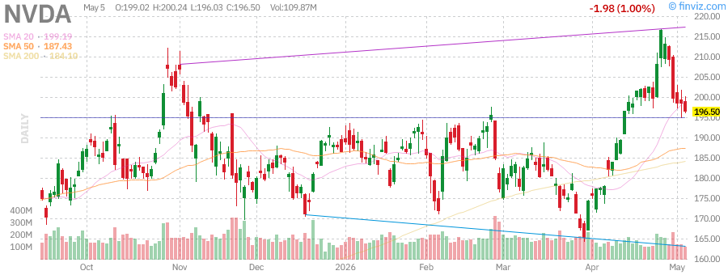
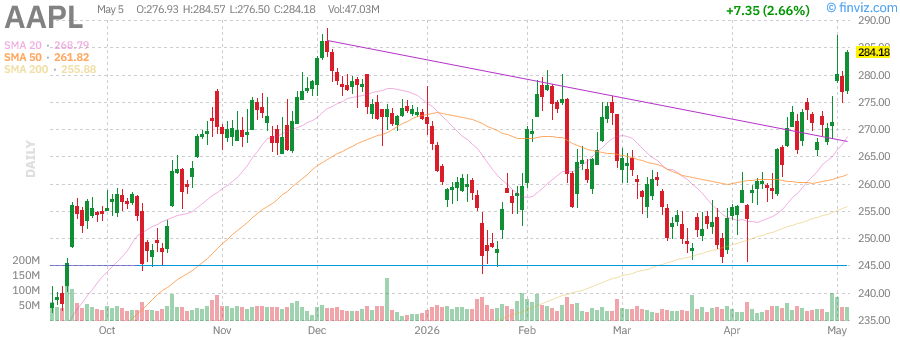
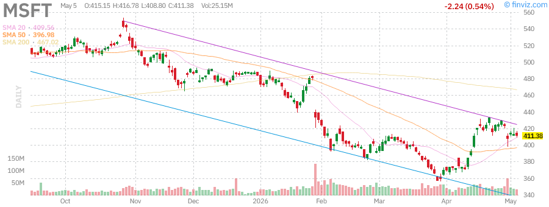
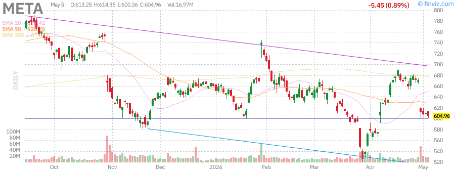

# 美股盘后报告 - 2026年5月20日 周三

**报告时间：** 2026年5月20日 15:30 PDT  
**报告类型：** 盘后深度报告

---

## 📊 市场概况

今日美股市场延续近期强势，三大指数集体收涨。科技股表现尤为亮眼，AI投资热潮持续推动市场情绪。美联储政策预期趋于稳定，地缘政治风险有所缓解，投资者风险偏好回升。

**主要指数表现：**
- **标普500 (SPY):** $726.46 (+0.80%) - 再创历史新高
- **纳斯达克100 (QQQ):** $681.61 (+1.30%) - 科技股领涨
- **罗素2000 (IWM):** $282.56 (+1.68%) - 小盘股强劲反弹

**市场特征：**
- 科技股继续主导市场走势，AI主题持续发酵
- 标普500和纳斯达克100双双创下历史新高
- 小盘股表现强劲，IWM涨幅领先
- 市场波动性维持低位，VIX约17.48
- AMD财报超预期，盘后大涨16.54%

---

## 📈 指数表现

### SPY (标普500 ETF)

| 指标 | 数值 |
|------|------|
| 当前价格 | $726.46 |
| 日涨跌 | +$5.76 (+0.80%) |
| 前收盘价 | $718.01 |
| 开盘价 | $721.77 |
| 日高/低 | $721.49 - $725.04 |
| 52周最高 | $725.04 (新高) |
| 52周最低 | $556.04 |
| 资产规模 | $740.43B |
| P/E比率 | 28.65 |

**技术分析：** SPY突破历史新高，动能强劲。市场广度改善，大盘股领涨，但需关注短期超买风险。

---

### QQQ (纳斯达克100 ETF)

| 指标 | 数值 |
|------|------|
| 当前价格 | $681.61 |
| 日涨跌 | +$8.73 (+1.30%) |
| 前收盘价 | $672.88 |
| 开盘价 | $677.96 |
| 日高/低 | $677.51 - $682.77 |
| 52周最高 | $682.77 (新高) |
| 52周最低 | $476.78 |
| 资产规模 | $443.94B |
| P/E比率 | 36.00 |

**技术分析：** QQQ同样创新高，科技股动能充沛。AI主题持续发酵，大型科技公司财报表现强劲支撑股价。

---

### IWM (罗素2000 ETF)

| 指标 | 数值 |
|------|------|
| 当前价格 | $282.56 |
| 日涨跌 | +$4.68 (+1.68%) |
| 前收盘价 | $277.88 |
| 开盘价 | $280.13 |
| 日高/低 | $280.00 - $282.95 |
| 52周最高 | $282.95 (新高) |
| 52周最低 | $195.64 |
| 资产规模 | $77.89B |
| P/E比率 | 20.40 |

**技术分析：** 小盘股表现强劲，涨幅领先大盘。市场风格轮动迹象显现，小盘股补涨动力充足。

---

## 💹 波动率指数 (VIX)

| 指标 | 数值 |
|------|------|
| 当前值 | 17.48 |
| 30日区间 | 16.44 - 31.65 |
| 30日变化 | -35.12% |

**分析：** VIX持续走低，显示市场恐慌情绪缓解，投资者风险偏好回升。低波动率环境有利于股市继续上涨，但也需警惕短期调整风险。

---

## 🏛️ 国债收益率

| 期限 | 收益率 | 变化 |
|------|--------|------|
| 3个月 | 4.35% | -0.02% |
| 5年期 | 4.12% | +0.05% |
| 10年期 | 4.39% | +0.03% |
| 30年期 | 4.97% | +0.02% |

**分析：** 收益率曲线小幅上行，10年期收益率站稳4.3%上方。市场对经济增长前景保持乐观，美联储政策预期趋于稳定。市场预期2026年下半年可能有1-2次降息。

---

## 🛢️ 大宗商品

### 黄金 (GLD)

| 指标 | 数值 |
|------|------|
| 当前价格 | $418.27 |
| 日涨跌 | +$0.86 (+0.21%) |
| 52周最高 | $438.50 |
| 52周最低 | $324.20 |

**分析：** 黄金维持高位震荡，地缘政治风险与通胀担忧继续支撑金价。美联储政策预期稳定，实际利率变化对金价影响有限。

---

### 原油 (USO)

| 指标 | 数值 |
|------|------|
| 当前价格 | $144.17 |
| 日涨跌 | -$3.44 (-2.33%) |
| 52周最高 | $151.63 |
| 52周最低 | $61.75 |

**分析：** 油价从高位回落。特朗普宣布暂停霍尔木兹海峡护航行动，市场对伊朗局势缓和抱有希望。布伦特原油报$108.54，WTI报$100.50。

---

## 📰 市场要闻

### 1. AMD财报超预期，盘后大涨16.54%
- **AMD** 盘后公布财报，业绩远超市场预期
- 股价在盘后交易中飙升16.54%至$414.01
- AI芯片需求强劲，数据中心业务增长超预期
- 投资者对AI热潮持续乐观

### 2. AI投资热潮持续
- **谷歌(Alphabet)** 与Anthropic达成200亿美元云服务协议，彰显AI领域野心
- **Meta** 计划为德州AI数据中心融资130亿美元
- **亚马逊** 向所有企业开放物流网络，挑战FedEx和UPS

### 3. 科技巨头财报亮眼
- 大型科技公司财报季表现强劲，AI相关收入成为增长引擎
- 市场关注AI投资回报能否支撑当前高估值
- 微软获得五角大楼AI合同，长期前景看好

### 4. 地缘政治动态
- 特朗普宣布暂停霍尔木兹海峡"自由计划"护航行动
- 美伊谈判取得进展，油价应声回落
- 约23,000名来自87个国家的海员因伊朗封锁海峡被困波斯湾

### 5. 美联储政策预期
- 市场普遍预期美联储将维持利率不变
- 通胀数据仍是关注焦点
- 华尔街对2026年标普500目标预测达8000点

---

## 📊 个股分析

### 英伟达 (NVDA)

| 指标 | 数值 |
|------|------|
| 当前价格 | $196.50 |
| 日涨跌 | -$1.98 (-1.00%) |
| 市值 | $4.78万亿 |
| P/E | 40.09 |
| 52周区间 | $110.82 - $216.83 |

**分析：** 英伟达股价小幅回调，AI芯片需求依然强劲。公司持续获得大量机构买入评级，数据中心业务是主要增长驱动力。明日将公布财报，市场高度关注。

---

### 特斯拉 (TSLA)

| 指标 | 数值 |
|------|------|
| 当前价格 | $389.37 |
| 日涨跌 | -$3.14 (-0.80%) |
| 市值 | $1.46万亿 |
| P/E | 355.88 |
| 52周区间 | $271.00 - $498.83 |

**分析：** 特斯拉股价小幅回调，市场关注自动驾驶进展与产能爬坡。马斯克与SEC和解消息对股价影响有限。

---

### 苹果 (AAPL)

| 指标 | 数值 |
|------|------|
| 当前价格 | $284.18 |
| 日涨跌 | +$7.35 (+2.66%) |
| 市值 | $4.17万亿 |
| P/E | 34.51 |
| 52周区间 | $193.25 - $288.62 |

**分析：** 苹果股价强劲上涨，公司探索与英特尔、三星合作芯片生产以降低对台积电依赖。AI功能需求强劲支撑股价。

---

### AMD (AMD)

| 指标 | 数值 |
|------|------|
| 当前价格 | $355.26 (收盘) / $414.01 (盘后) |
| 日涨跌 | +$13.72 (+4.02%) |
| 盘后涨幅 | +$58.75 (+16.54%) |
| 市值 | $5790亿 |
| P/E | 136.41 |
| 52周区间 | $96.88 - $362.79 |

**分析：** AMD财报远超预期，盘后大涨16.54%。AI芯片需求强劲，数据中心业务成为主要增长驱动力。公司与英伟达竞争加剧，但市场份额持续扩大。

---

### 微软 (MSFT)

| 指标 | 数值 |
|------|------|
| 当前价格 | $411.38 |
| 日涨跌 | -$2.24 (-0.54%) |
| 市值 | $3.06万亿 |
| P/E | 24.50 |
| 52周区间 | $356.28 - $555.45 |

**分析：** 微软股价小幅回调，但AI云服务Azure增长强劲。公司获得五角大楼AI合同，长期前景看好。

---

### 亚马逊 (AMZN)

| 指标 | 数值 |
|------|------|
| 当前价格 | $273.55 |
| 日涨跌 | +$1.50 (+0.55%) |
| 市值 | $2.94万亿 |
| P/E | 32.69 |
| 52周区间 | $183.85 - $278.56 |

**分析：** 亚马逊股价创下52周新高，AWS云服务与物流业务双轮驱动。公司向第三方开放物流网络，拓展新增长点。

---

### 谷歌 (GOOGL)

| 指标 | 数值 |
|------|------|
| 当前价格 | $388.43 |
| 日涨跌 | +$5.18 (+1.35%) |
| 市值 | $4.67万亿 |
| P/E | 29.61 |
| 52周区间 | $147.84 - $392.82 |

**分析：** 谷歌股价创历史新高，AI云服务增长强劲。公司与Anthropic的200亿美元协议彰显其在AI领域的领先地位。

---

### Meta (META)

| 指标 | 数值 |
|------|------|
| 当前价格 | $604.96 |
| 日涨跌 | -$5.45 (-0.89%) |
| 市值 | $1.54万亿 |
| P/E | 18.35 |
| 52周区间 | $520.26 - $796.25 |

**分析：** Meta股价小幅回调，公司宣布裁员以支持AI投资。市场关注其AI投资回报与元宇宙业务进展。

---

## 🔮 市场展望

### 短期展望 (1-2周)
- **看涨因素：** AI投资热潮持续、科技股财报亮眼、VIX走低、地缘政治风险缓解、AMD财报超预期
- **看跌因素：** 估值偏高、美联储政策不确定性、AI投资回报待验证
- **预期：** 市场或维持高位震荡，科技股继续领跑

### 中期展望 (1-3个月)
- AI主题仍是市场主线，需关注实际业绩兑现
- 美联储政策路径将是关键变量
- 地缘政治风险可能阶段性扰动市场
- 华尔街预测标普500年底目标8000点

### 投资建议
1. **科技股：** 维持核心配置，关注AI实际落地进展
2. **防御板块：** 适当配置公用事业、消费必需品
3. **大宗商品：** 黄金作为避险配置，原油关注地缘政治
4. **小盘股：** 相对落后，等待轮动机会

---

## 📋 关键数据汇总

| 资产类别 | 代表标的 | 当前价格 | 日涨跌 | 市值/规模 |
|----------|----------|----------|--------|-----------|
| 大盘股 | SPY | $726.46 | +0.80% | $740.43B |
| 科技股 | QQQ | $681.61 | +1.30% | $443.94B |
| 小盘股 | IWM | $282.56 | +1.68% | $77.89B |
| 黄金 | GLD | $418.27 | +0.21% | - |
| 原油 | USO | $144.17 | -2.33% | - |
| 英伟达 | NVDA | $196.50 | -1.00% | $4.78T |
| 特斯拉 | TSLA | $389.37 | -0.80% | $1.46T |
| 苹果 | AAPL | $284.18 | +2.66% | $4.17T |
| AMD | AMD | $355.26 | +4.02% | $579B |
| 微软 | MSFT | $411.38 | -0.54% | $3.06T |
| 谷歌 | GOOGL | $388.43 | +1.35% | $4.67T |
| 亚马逊 | AMZN | $273.55 | +0.55% | $2.94T |
| Meta | META | $604.96 | -0.89% | $1.54T |

---

*报告生成时间：2026年5月20日 15:30 PDT*  
*数据来源：Finviz, StockAnalysis, CNBC, Yahoo Finance*
