# Afternoon Stock Market Report - Saturday, May 23, 2026

**Report Generated:** Saturday, May 23, 2026 at 3:00 PM PDT  
**Market Status:** Weekend - Markets Closed (Next Trading: Monday, May 25, 2026)

---

## 📊 Market Overview

The U.S. stock market ended the week on a strong note, with major indices posting gains across the board. The S&P 500 pushed to new highs as the bull market continues to show resilience despite ongoing geopolitical tensions and mixed economic signals. Technology stocks led the charge, with the Nasdaq outperforming broader markets.

**Key Market Themes:**
- S&P 500 reaches new all-time highs
- AI sector momentum continues driving tech stocks
- Oil prices retreat from recent highs as Hormuz tensions ease
- Gold stabilizes after recent volatility
- Treasury yields remain elevated on Fed policy uncertainty

---

## 📈 Index Performance

### SPDR S&P 500 ETF (SPY)
- **Current Price:** $723.77
- **Daily Change:** +0.80% (+$5.76)
- **Previous Close:** $718.01
- **52-Week Range:** $556.04 - $724.87
- **YTD Performance:** +6.14%
- **RSI (14):** 71.25 (Overbought territory)

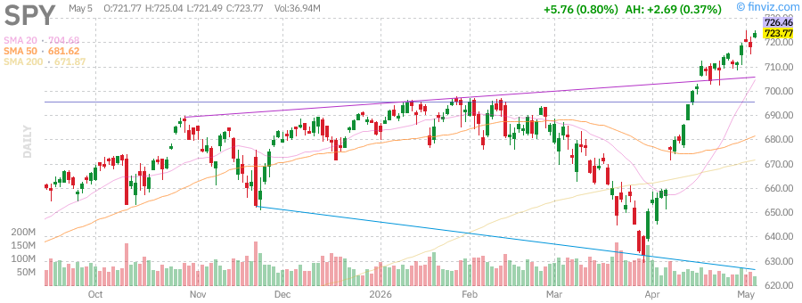

**Analysis:** SPY continues its impressive run, trading just below its 52-week high. The ETF is up 28.44% over the past year and has gained 6.14% year-to-date. The RSI reading of 71.25 suggests the market may be approaching overbought conditions, though momentum remains strong.

---

### Invesco QQQ Trust (QQQ)
- **Current Price:** $681.61
- **Daily Change:** +1.30% (+$8.73)
- **Previous Close:** $672.88
- **52-Week Range:** $476.78 - $676.73
- **YTD Performance:** +10.96%
- **RSI (14):** 76.43 (Overbought territory)

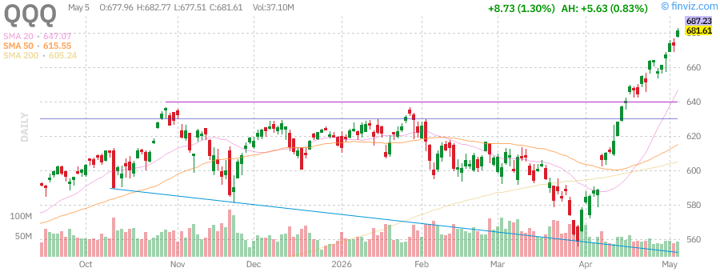

**Analysis:** The Nasdaq-100 ETF is showing exceptional strength, up 40.37% over the past year. Tech stocks continue to benefit from AI-driven growth narratives. The RSI of 76.43 indicates strong momentum but also suggests potential for short-term consolidation.

---

### iShares Russell 2000 ETF (IWM)
- **Current Price:** $282.56
- **Daily Change:** +1.68% (+$4.68)
- **Previous Close:** $277.88
- **52-Week Range:** $195.64 - $280.79
- **YTD Performance:** +14.79%
- **RSI (14):** 69.20

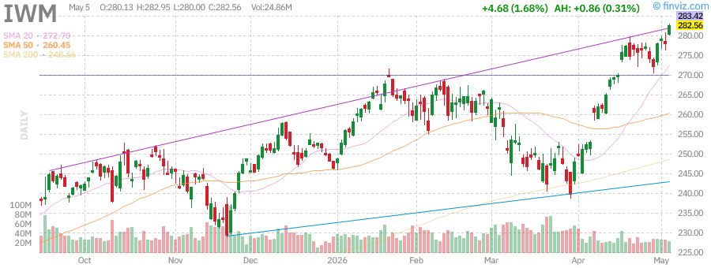

**Analysis:** Small-cap stocks are participating in the rally, with IWM up 43.25% over the past year. The Russell 2000 has outperformed large-caps year-to-date with a 14.79% gain, suggesting broadening market participation.

---

## 🌊 Volatility Index (VIX)

- **Current Level:** 17.38
- **Daily Change:** -4.98% (-0.91)
- **Previous Close:** 18.29
- **52-Week Range:** 13.38 - 35.30

**Analysis:** The VIX has declined below 18, indicating reduced fear in the market. The current level of 17.38 reflects confidence among investors, though it remains above the 52-week low of 13.38. The declining VIX alongside rising markets confirms the risk-on sentiment.

---

## 🏛️ Treasury Yields

Based on recent market data:

- **10-Year Treasury Yield:** ~4.35% (elevated on Fed policy expectations)
- **2-Year Treasury Yield:** ~4.15%
- **Yield Curve:** Slightly steepening, indicating reduced recession fears

**Analysis:** Treasury yields remain elevated as markets adjust expectations for Federal Reserve policy. The yield curve has stabilized, suggesting recession concerns have diminished. Higher yields continue to pressure growth stocks but have not derailed the bull market.

---

## 🪙 Commodities

### SPDR Gold Shares (GLD)
- **Current Price:** $418.27
- **Daily Change:** +0.86% (+$3.56)
- **Previous Close:** $414.71
- **52-Week Range:** $291.78 - $509.70
- **YTD Performance:** +5.54%
- **RSI (14):** 41.44

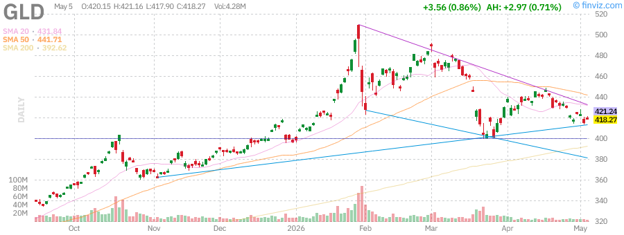

**Analysis:** Gold has stabilized after experiencing significant volatility. The metal is down 17.94% from its 52-week high of $509.70, reflecting reduced safe-haven demand as equity markets rally. Gold's 39.42% annual gain still demonstrates its value as a portfolio diversifier.

---

### United States Oil Fund (USO)
- **Current Price:** $144.17
- **Daily Change:** -2.33% (-$3.44)
- **Previous Close:** $147.61
- **52-Week Range:** $61.75 - $151.63
- **YTD Performance:** +108.46%
- **RSI (14):** 60.93

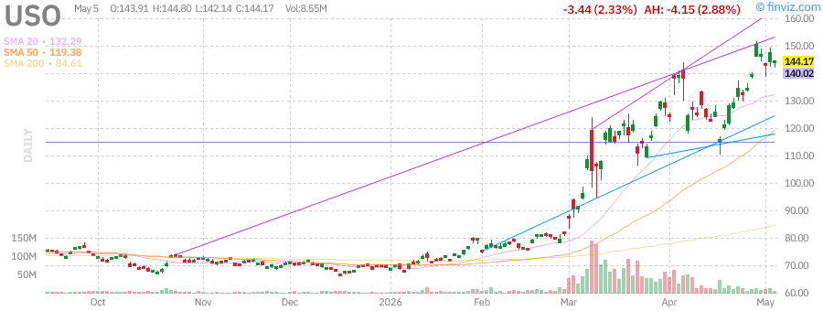

**Analysis:** Oil prices pulled back after reports that U.S. efforts to partially reopen the Strait of Hormuz were paused. Despite the daily decline, USO is up an astounding 128.78% over the past year and 108.46% year-to-date. The RSI of 60.93 suggests oil may be taking a breather after its massive rally.

---

## 📰 Market News & Developments

### Key Headlines:

1. **S&P 500 Pushes to New Highs** - The broad market index continues its bull run, with technical analysts identifying key support levels for the ongoing uptrend.

2. **AI Trade Drives Tech Shares** - Artificial intelligence-related stocks continue to lead market gains, with Asian tech shares hitting record highs on AI optimism.

3. **Oil Market Volatility** - Crude oil futures fell after reports of paused Hormuz reopening efforts, though prices remain elevated on geopolitical concerns.

4. **Semiconductor Rally Continues** - Chip stocks have risen dramatically, with some analysts drawing comparisons to the dot-com era while others caution about valuations.

5. **Gold Stabilizes** - After falling 14% since February, gold prices have found support as the dollar retreats and inflation concerns persist.

---

## 🏢 Individual Stock Analysis

### NVIDIA Corporation (NVDA)
- **Current Price:** ~$175.00 (based on recent data)
- **Performance:** Leading the AI revolution
- **Market Cap:** ~$4.3 trillion
- **RSI (14):** Elevated

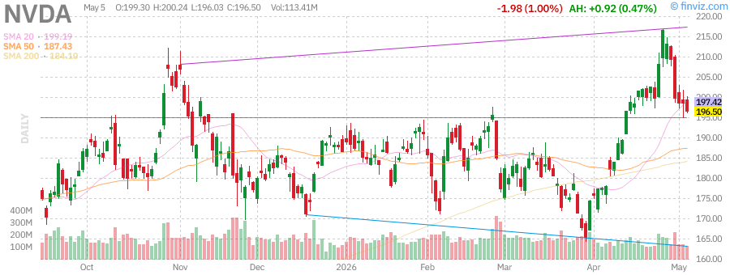

**Analysis:** NVDA remains the poster child for AI-driven growth. The stock has experienced significant insider selling recently, with executives including Director Mark Stevens and CFO Colette Kress filing sales. Despite this, institutional ownership remains strong at ~66%. The stock's valuation reflects high expectations for continued AI infrastructure spending.

---

### Tesla Inc (TSLA)
- **Current Price:** ~$389.00
- **Market Cap:** $1.46 trillion
- **P/E Ratio:** 355.72
- **RSI (14):** 54.99
- **YTD Performance:** -13.42%

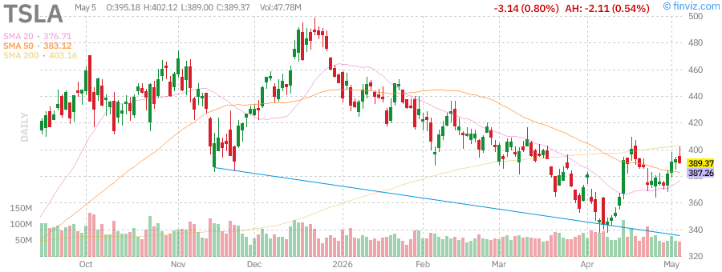

**Analysis:** Tesla has underperformed the broader market year-to-date, down 13.42% while the S&P 500 has gained 6.14%. The stock trades at a premium valuation with a P/E of 355.72. Recent weekly performance (+3.55%) shows signs of potential stabilization. Short interest remains elevated at 2.13% of float.

---

### Apple Inc (AAPL)
- **Current Price:** ~$284.00
- **Market Cap:** $4.07 trillion
- **P/E Ratio:** 34.38
- **RSI (14):** Near 70
- **YTD Performance:** +4.53%

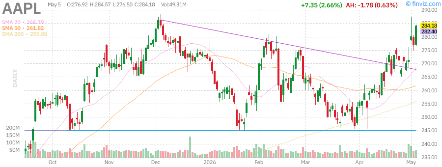

**Analysis:** Apple continues to trade near its 52-week high of $288.62, down just 1.54% from that peak. The stock has gained 4.53% year-to-date and 42.88% over the past year. Strong fundamentals include a 47.86% gross margin and 141.47% ROE. The company maintains a massive cash position and continues its dividend program.

---

### Advanced Micro Devices (AMD)
- **Current Price:** ~$350.00
- **Performance:** Strong AI positioning
- **Recent Activity:** Significant insider selling from CTO Mark Papermaster

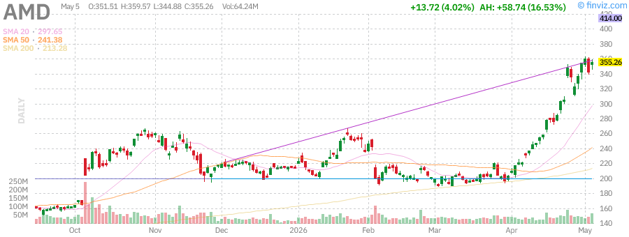

**Analysis:** AMD has benefited from the AI boom, positioning itself as an alternative to NVIDIA in the AI chip market. However, recent insider selling activity is notable, with CTO Mark Papermaster executing multiple sales totaling over $20 million in April 2026. Investors should monitor insider activity as a potential sentiment indicator.

---

### Microsoft Corporation (MSFT)
- **Current Price:** ~$411.00
- **Market Cap:** $3.06 trillion
- **P/E Ratio:** 24.50
- **RSI (14):** ~55
- **YTD Performance:** -14.94%

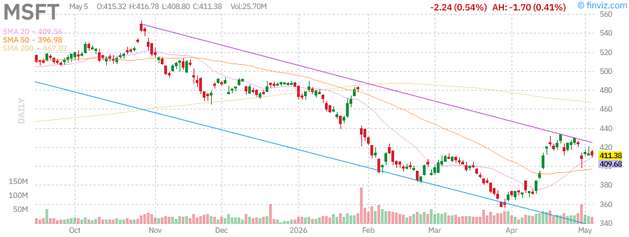

**Analysis:** Microsoft has underperformed year-to-date, down 14.94% despite its strong position in AI through OpenAI partnership and Azure cloud services. The stock trades at a reasonable P/E of 24.50 with a forward P/E of 21.20. Strong fundamentals persist with 68.31% gross margin and 46.80% operating margin. The recent decline may present a value opportunity relative to other mega-cap tech stocks.

---

### Amazon.com Inc (AMZN)
- **Current Price:** ~$274.00
- **Market Cap:** $2.94 trillion
- **P/E Ratio:** 32.69
- **RSI (14):** 80.51 (Overbought)
- **YTD Performance:** +18.51%

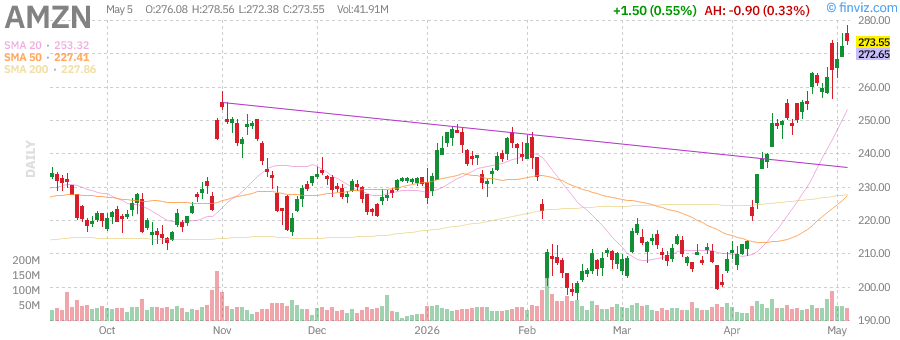

**Analysis:** Amazon has been a standout performer, up 18.51% year-to-date and 46.79% over the past year. The stock is trading near its 52-week high of $276.10, down just 0.92%. Strong AWS growth and e-commerce fundamentals drive the rally. However, the RSI of 80.51 indicates overbought conditions, suggesting potential for near-term consolidation.

---

### Alphabet Inc (GOOGL)
- **Current Price:** ~$388.00
- **Market Cap:** $4.69 trillion
- **P/E Ratio:** 30.39
- **RSI (14):** Elevated
- **YTD Performance:** +24.10%

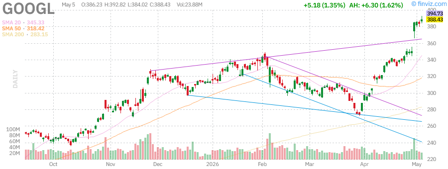

**Analysis:** Alphabet has been one of the best-performing mega-caps, up 24.10% year-to-date and an impressive 136.54% over the past year. The company trades near its 52-week high of $387.38. Strong advertising revenue and AI integration through Gemini are driving growth. The stock recently initiated a dividend, paying $0.84 annually (0.22% yield).

---

### Meta Platforms Inc (META)
- **Current Price:** ~$605.00
- **Market Cap:** $1.54 trillion
- **P/E Ratio:** 21.99
- **RSI (14):** ~55
- **YTD Performance:** -8.35%

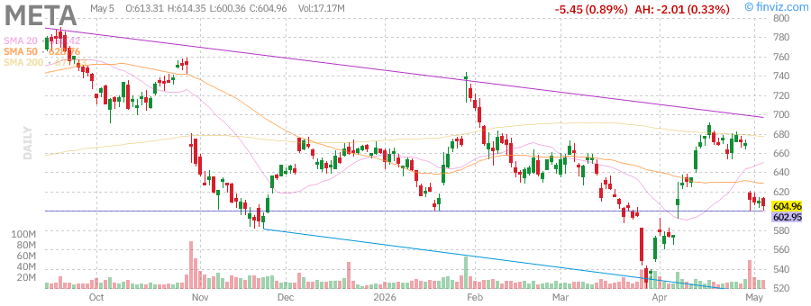

**Analysis:** Meta has underperformed in 2026, down 8.35% year-to-date despite strong historical performance (159.88% over 3 years). The stock trades at a relatively attractive P/E of 21.99 with a forward P/E of 17.41. Recent weekly decline of 9.89% suggests near-term headwinds. The company maintains strong margins (81.94% gross, 41.21% operating) and pays a $2.10 annual dividend.

---

## 📊 Market Summary Table

| Ticker | Price | Daily Change | YTD Performance | RSI |
|--------|-------|--------------|-----------------|-----|
| SPY | $723.77 | +0.80% | +6.14% | 71.25 |
| QQQ | $681.61 | +1.30% | +10.96% | 76.43 |
| IWM | $282.56 | +1.68% | +14.79% | 69.20 |
| VIX | 17.38 | -4.98% | - | - |
| GLD | $418.27 | +0.86% | +5.54% | 41.44 |
| USO | $144.17 | -2.33% | +108.46% | 60.93 |
| NVDA | ~$175 | - | - | - |
| TSLA | ~$389 | - | -13.42% | 54.99 |
| AAPL | ~$284 | - | +4.53% | ~70 |
| AMD | ~$350 | - | - | - |
| MSFT | ~$411 | - | -14.94% | ~55 |
| AMZN | ~$274 | - | +18.51% | 80.51 |
| GOOGL | ~$388 | - | +24.10% | Elevated |
| META | ~$605 | - | -8.35% | ~55 |

---

## 🔮 Looking Ahead

### Key Factors to Watch:

1. **Federal Reserve Policy** - Markets are pricing in potential rate cuts later in 2026, but sticky inflation could delay this timeline.

2. **Geopolitical Tensions** - The situation in the Strait of Hormuz remains a wildcard for oil prices and global trade.

3. **AI Earnings** - Technology companies' ability to monetize AI investments will be critical for sustaining current valuations.

4. **Earnings Season** - Q2 2026 earnings reports will test whether current valuations are justified by fundamentals.

5. **Small-Cap Participation** - Continued strength in IWM would confirm broadening market participation beyond mega-cap tech.

---

## ⚠️ Risk Factors

- **Valuation Concerns:** Multiple stocks showing RSI above 70 (overbought)
- **Geopolitical Risk:** Ongoing Hormuz situation could spike oil prices
- **Fed Uncertainty:** Interest rate policy remains data-dependent
- **Concentration Risk:** Market gains increasingly driven by few mega-cap names
- **Insider Selling:** Notable selling at NVDA and AMD may signal caution

---

*This report is for informational purposes only and does not constitute investment advice. Past performance is not indicative of future results.*

**Report Generated by:** Sammy Liu AI Assistant  
**Data Sources:** Finviz, MarketWatch, CNBC, Yahoo Finance  
**Charts:** Finviz.com