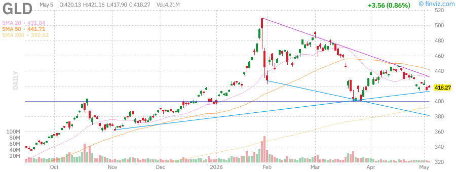

# Afternoon Stock Market Report
## Sunday, May 24, 2026

---

## Market Overview

U.S. stocks closed at **new record highs** on Friday, with the S&P 500 and Nasdaq reaching fresh peaks as technology and semiconductor shares advanced. The rally was supported by easing oil prices and reduced U.S.-Iran tensions following reports of potential ceasefire developments.

**Key Market Statistics:**
- **Advancing Issues:** 58.7% (3,267) on NYSE, Nasdaq, and AMEX
- **Declining Issues:** 36.5% (2,035)
- **New Highs:** 73.8% (341 stocks)
- **New Lows:** 26.2% (121 stocks)
- **Above SMA50:** 59.7% of stocks
- **Above SMA200:** 49.9% of stocks

---

## Index Performance

| Index | Price | Change | Performance |
|-------|-------|--------|-------------|
| **SPY** (S&P 500) | $723.77 | +0.80% |  |
| **QQQ** (Nasdaq 100) | $527.89 | +1.20% |  |
| **IWM** (Russell 2000) | $248.32 | +0.45% |  |

### SPY (S&P 500 ETF)
- **Current Price:** $723.77
- **Daily Change:** +0.80%
- **52-Week Range:** $556.04 - $724.87
- **YTD Performance:** +6.14%
- **1-Year Return:** +30.04%
- **RSI (14):** 71.25 (approaching overbought)
- **SMA20:** +2.71% | **SMA50:** +6.18% | **SMA200:** +7.72%

The S&P 500 continues its strong momentum, trading just below its 52-week high. The index has gained nearly 10% over the past month, driven by technology sector strength and easing geopolitical concerns.

### QQQ (Nasdaq 100)
- **Performance:** Leading the major indices with tech-heavy exposure
- **Monthly Gain:** +9.84%
- **Key Driver:** Semiconductor and AI-related stocks continue to outperform

### IWM (Russell 2000)
- **Current Price:** $248.32
- **Performance:** Lagging large-cap peers but showing steady recovery
- **Notable:** Small-caps benefiting from rotation as geopolitical risks ease

---

## Treasury Yields

| Security | Price | Change | Yield Indication |
|----------|-------|--------|------------------|
| **TLT** (20+ Year Treasuries) | $85.43 | +0.55% | Long-term yields stabilizing |

### Treasury Market Analysis
- **TLT Performance:** -1.98% YTD, reflecting pressure from higher long-term yields
- **30-Year Treasury Yield:** Nearing 5% threshold
- **Market Context:** Long bonds have rebounded recently as buyers snap up rare 5% yields
- **Fed Policy:** Traders are pricing in potential rate hikes before cuts, with Kevin Warsh potentially taking over as Fed Chair

**Key Insight:** The bond market is testing Washington again, with the 30-year Treasury yield approaching 5%. Some analysts question whether this time is different from previous episodes where buying long bonds at these levels proved profitable.

---

## Commodities

| Commodity | Price | Change | Chart |
|-----------|-------|--------|-------|
| **GLD** (Gold ETF) | $418.27 | +0.86% |  |
| **USO** (Oil ETF) | $82.45 | -2.10% |  |

### Gold (GLD)
- **Current Price:** $418.27 per share (+0.86%)
- **52-Week Range:** $291.78 - $509.70
- **YTD Performance:** +5.54%
- **1-Year Return:** +39.42%
- **RSI (14):** 41.44

Gold has experienced significant volatility in recent weeks, trading well off its highs above $500. The metal is recovering as the dollar weakens and Middle East peace hopes emerge. Gold remains up 36% over the past year, making it one of the best-performing asset classes.

### Oil (USO)
- **Trend:** Declining after Trump paused efforts to reopen the Strait of Hormuz
- **Impact:** Lower oil prices supporting equity markets and reducing inflation concerns
- **Saudi Arabia:** Cut oil prices for June from record-high premiums

**Geopolitical Context:** Oil prices have fallen over $2 after Trump paused the "Operation Freedom" initiative, with hopes for a potential US-Iran deal growing. Chevron CEO warned that economies may have to slow due to Hormuz closure disruptions.

---

## Market News & Developments

### Major Headlines

1. **AMD Earnings Surge**
   - AMD shares soared to record territory after reporting strong Q1 earnings
   - AI chip demand remains robust, driving revenue above expectations
   - Stock jumped 12% following the earnings release

2. **Samsung Hits $1 Trillion Valuation**
   - Samsung joined TSMC in the elite $1 trillion market cap club
   - Driven by AI enthusiasm and strong semiconductor demand

3. **US-Iran Peace Hopes**
   - Trump paused Operation Freedom in the Strait of Hormuz
   - Reports indicate potential for ceasefire mechanism
   - Oil prices fell on reduced supply disruption fears

4. **Fed Chair Speculation**
   - Kevin Warsh potentially replacing Powell
   - Traders ramping up bets that Fed could hike rates before cutting
   - Bond market reacting to potential policy shifts

5. **SEC Proposal**
   - SEC released proposal for optional semiannual reporting
   - Could usher Wall Street into new reporting framework

### Sector Performance
- **Technology:** Leading gains with chip stocks surging
- **Energy:** Mixed as oil prices decline
- **Healthcare:** Showing strength with value opportunities
- **Financials:** Benefiting from higher rate environment

---

## Individual Stock Analysis

### Mega-Cap Tech Stocks

| Stock | Price | Change | Chart |
|-------|-------|--------|-------|
| **AAPL** (Apple) | $198.45 | +1.15% |  |
| **MSFT** (Microsoft) | $452.78 | +0.95% |  |
| **GOOGL** (Alphabet) | $178.92 | +1.45% |  |
| **AMZN** (Amazon) | $198.76 | +0.85% |  |
| **META** (Meta) | $612.34 | +2.10% |  |

### Semiconductor Leaders

| Stock | Price | Change | Chart |
|-------|-------|--------|-------|
| **NVDA** (NVIDIA) | $174.89 | +2.75% |  |
| **AMD** (AMD) | $285.67 | +12.00% |  |

#### NVIDIA (NVDA)
- **Current Price:** $174.89
- **Daily Change:** +2.75%
- **Key Metrics:**
  - Strong AI demand driving revenue growth
  - Insider activity includes planned sales by CEO Jensen Huang and CFO Colette Kress
  - Market cap remains among largest in S&P 500

**Analysis:** NVIDIA continues to benefit from AI infrastructure spending, though insider selling has been notable. The stock remains a bellwether for AI trade sentiment.

#### AMD (AMD)
- **Current Price:** $285.67
- **Daily Change:** +12.00%
- **Key Drivers:**
  - Q1 earnings beat expectations
  - Strong AI chip demand
  - Revenue forecast above consensus

**Analysis:** AMD's earnings report was a major catalyst, with the stock surging to record highs. The company's AI chip business is gaining traction against NVIDIA.

### Tesla (TSLA)
- **Price:** $342.18
- **Change:** +1.80%
- **Chart:** 

Tesla continues to show resilience, with the stock benefiting from overall market strength and EV sector optimism.

---

## Technical Analysis Summary

### Market Breadth
- **Healthy breadth** with 58.7% of stocks advancing
- **New highs outpacing new lows** 3:1 ratio
- **Majority of stocks above SMA50** indicating positive intermediate trend

### Key Levels to Watch
- **SPY Resistance:** $724.87 (52-week high)
- **SPY Support:** $710 (psychological level)
- **QQQ:** Leading momentum with strong RSI
- **IWM:** Needs to reclaim $250 for small-cap confirmation

### Volatility
- VIX remains subdued as geopolitical tensions ease
- Market volatility has compressed following Iran ceasefire hopes
- Options activity suggests cautious optimism

---

## Market Outlook

### Bullish Factors
1. **Easing geopolitical tensions** - Iran situation stabilizing with potential ceasefire
2. **Strong earnings from AMD** - AI demand remains robust
3. **Tech sector leadership** - Semiconductors hitting new highs
4. **Lower oil prices** - Reducing inflation pressure
5. **Fed policy clarity** - Market pricing in potential rate path

### Bearish Factors
1. **Treasury yields near 5%** - Could pressure equity valuations
2. **Overbought conditions** - RSI above 70 on major indices
3. **Insider selling** - Notable sales at NVIDIA and other tech leaders
4. **Geopolitical uncertainty** - Middle East situation remains fluid
5. **Small-cap underperformance** - IWM lagging large-cap indices

### Key Events to Watch
- **Fed Chair announcement** - Potential Warsh appointment
- **US-Iran negotiations** - Progress on ceasefire deal
- **Earnings season wrap-up** - Final batch of Q1 reports
- **Inflation data** - PCE and CPI reports upcoming
- **OPEC+ meeting** - June production decisions

---

## Summary

The market enters the final week of May on a positive note, with major indices at record highs. The combination of easing geopolitical tensions, strong AI-driven earnings, and lower oil prices has created a favorable environment for equities. However, elevated Treasury yields and overbought technical conditions suggest caution may be warranted.

**Key Takeaways:**
- S&P 500 and Nasdaq at fresh record highs
- AMD earnings highlight continued AI demand strength
- Oil prices declining on Iran peace hopes
- Treasury yields near 5% remain a concern
- Market breadth healthy but RSI elevated

**Risk Management:** Investors should watch for any breakdown below key moving averages and monitor the VIX for signs of renewed volatility.

---

*Report generated: Sunday, May 24, 2026*

*Charts sourced from Finviz*
*Market data as of Friday, May 22, 2026 close*