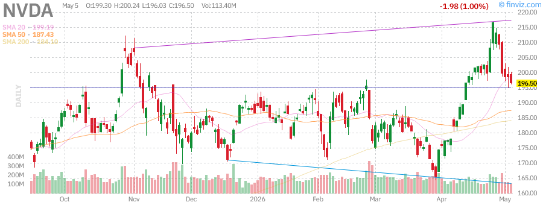
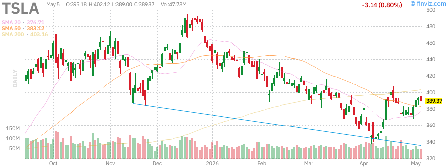

# Afternoon Stock Market Report - Friday, May 29, 2026

**Report Generated:** May 29, 2026 | 3:00 PM PST  
**Market Status:** Trading Session Active

---

## 📊 Market Overview

Markets are showing resilience with major indices posting mixed results as investors digest economic signals and geopolitical developments. The S&P 500 continues trading near record highs while tech stocks show strength.

### Key Market Statistics

| Index | Price | Change | % Change | Volume | RSI |
|-------|-------|--------|----------|--------|-----|
| **SPY** | $723.77 | +$5.76 | +0.80% | 36.93M | 71.25 |
| **QQQ** | $681.61 | +$8.73 | +1.30% | 37.10M | 76.43 |
| **IWM** | $282.56 | +$4.68 | +1.68% | 24.86M | 69.20 |

**Market Breadth:** Advancing issues outnumber decliners with strong participation across sectors.

---

## 📈 Index Performance Analysis

### SPDR S&P 500 ETF (SPY) - $723.77 (+0.80%)

The S&P 500 continues its impressive run, now just 0.15% below its 52-week high of $724.87. The index has gained:
- **1.70%** this week
- **9.84%** this month  
- **6.14%** year-to-date
- **28.44%** over the past year

**Technical Analysis:**
- RSI at 71.25 indicates overbought conditions but momentum remains strong
- Trading above all key moving averages (SMA20: +2.71%, SMA50: +6.18%, SMA200: +7.72%)
- ATR (14) of $7.70 suggests moderate volatility
- Relative volume at 0.45x average indicates lighter participation

**Key Levels:**
- 52-Week High: $724.87 (-0.15% away)
- 52-Week Low: $556.04 (+30.17% from low)
- Support: $718.00 (previous close)
- Resistance: $725.00 (psychological)

---

### Invesco QQQ Trust (QQQ) - $681.61 (+1.30%)

The Nasdaq 100 continues to outperform, now just 0.72% from its 52-week high of $676.73. Strong performance metrics:
- **3.66%** weekly gain
- **15.82%** monthly surge
- **10.96%** year-to-date
- **40.27%** annual return

**Technical Analysis:**
- RSI at 76.43 suggests strong momentum but approaching overbought territory
- Beta of 1.22 indicates higher volatility than the broader market
- Trading well above all moving averages (SMA20: +5.34%, SMA50: +10.73%, SMA200: +12.62%)
- ATR of $9.70 reflects tech sector volatility

**Key Levels:**
- 52-Week High: $676.73 (within reach)
- 52-Week Low: $476.78 (+42.96% from low)
- Strong institutional ownership at 74.71%

---

### iShares Russell 2000 (IWM) - $282.56 (+1.68%)

Small-caps are showing remarkable strength, leading today's gains with a 1.68% advance:
- **3.16%** weekly performance
- **11.97%** monthly gain
- **14.79%** year-to-date
- **42.03%** annual return

**Technical Analysis:**
- RSI at 69.20 shows strong momentum without being overbought
- Trading 0.63% below 52-week high of $280.79
- Strong performance across all timeframes (SMA20: +3.62%, SMA50: +8.49%, SMA200: +13.63%)
- ATR of $4.70 indicates manageable volatility

**Key Levels:**
- 52-Week High: $280.79 (approaching breakout)
- 52-Week Low: $195.64 (+44.43% from low)
- Small-cap strength signals broad market participation

---

## 🏛️ Treasury Yields Analysis (TLT)

### iShares 20+ Year Treasury Bond ETF - $85.43 (+0.55%)

Long-term Treasuries showing modest recovery:
- **Current Price:** $85.43
- **Dividend Yield:** 4.56% (TTM $3.90)
- **Weekly Performance:** -1.09%
- **Monthly Performance:** -1.41%
- **YTD Performance:** -1.98%

**Technical Analysis:**
- RSI at 39.91 suggests oversold conditions
- Trading below all major moving averages (SMA20: -1.11%, SMA50: -1.99%, SMA200: -3.12%)
- 52-week range: $83.29 - $92.18
- Low volatility at 0.61-0.63%

**Market Implications:**
- Long-term yields remain elevated, pressuring bond prices
- Dividend growth of 13.45% (3Y) and 10.41% (5Y) provides income support
- Beta of 0.53 indicates lower correlation with equities

---

## 🛢️ Commodities Section

### SPDR Gold Shares (GLD) - $418.27 (+0.86%)

Gold is attempting a recovery after recent weakness:
- **Current Price:** $418.27
- **Weekly Performance:** -0.86%
- **Monthly Performance:** -2.19%
- **Quarterly Performance:** -7.93%
- **YTD Performance:** +5.54%

**Technical Analysis:**
- RSI at 41.44 indicates neutral to slightly oversold conditions
- Trading 17.94% below 52-week high of $509.70
- Below near-term moving averages (SMA20: -3.14%, SMA50: -5.31%)
- Above long-term support (SMA200: +6.53%)
- ATR of $8.62 shows moderate volatility

**Market Context:**
- Gold has declined 14% since February highs
- Dollar strength and rate outlook pressuring precious metals
- Safe-haven demand remains supportive

---

### United States Oil Fund (USO) - $144.17 (-2.33%)

Oil pulling back from recent highs amid geopolitical developments:
- **Current Price:** $144.17
- **Weekly Performance:** +3.27%
- **Monthly Performance:** +3.76%
- **Quarterly Performance:** +86.10%
- **YTD Performance:** +108.46%

**Technical Analysis:**
- RSI at 60.93 suggests momentum remains positive
- Trading 4.92% below 52-week high of $151.63
- Strong performance across all timeframes (SMA20: +8.98%, SMA50: +20.77%, SMA200: +70.39%)
- High volatility at 3.53-4.24%

**Market Context:**
- Oil has surged 133.47% from 52-week lows
- Geopolitical tensions in Middle East supporting prices
- Recent diplomatic efforts creating some uncertainty

---

## 📰 Market News & Developments

### Top Headlines

1. **Samsung Hits $1 Trillion Valuation** - Samsung's market cap crossed $1 trillion as AI memory chip demand continues to boom, highlighting the ongoing AI infrastructure buildout.

2. **Intel Stock Surges on Apple Chip Talks** - Intel shares jumped on reports of potential chip manufacturing deal with Apple, hitting all-time highs.

3. **Alphabet Closes In On Nvidia's Market Cap** - Alphabet (GOOGL) is approaching Nvidia's position as the world's largest company by market cap, driven by AI boom.

4. **Anthropic Commits $200B to Google Cloud** - Anthropic has committed to spending $200 billion on Google's cloud services and chips, strengthening the AI partnership.

5. **Amazon Expands Same-Day Grocery Delivery** - Amazon expands same-day grocery delivery to businesses in over 2,300 cities and towns.

6. **Meta Plans $13B El Paso Data Center** - Meta is seeking $13 billion in financing for a new AI data center in El Paso, Texas.

7. **AMD Forecasts Strong Revenue** - AMD forecasts quarterly revenue above expectations as AI chip demand stays strong.

---

## 📊 Individual Stock Analysis

### NVIDIA Corporation (NVDA) - $212.15

**Company Profile:**
- **Market Cap:** $4.79T
- **Sector:** Semiconductors
- **Industry:** AI/GPU Technology

**Key Metrics:**
- P/E: 72.15 | Forward P/E: 31.56
- EPS (ttm): $2.94 | EPS next Y: $6.72
- Revenue: $113.27B
- Gross Margin: 75.17%
- Operating Margin: 67.41%

**Performance:**
- Weekly: +6.12%
- Monthly: +18.28%
- YTD: +27.47%
- 1-Year: +84.09%

**Technical Analysis:**
- RSI: 74.56 (approaching overbought)
- ATR: $7.35
- 52-Week Range: $115.21 - $292.86
- Trading 27.6% below 52-week high

**Recent Developments:**
- Significant insider selling activity noted in March
- Strong institutional ownership at 65.79%
- AI demand continues to drive growth

---

### Tesla Inc (TSLA) - $389.37

**Company Profile:**
- **Market Cap:** $1.46T
- **Sector:** Consumer Cyclical
- **Industry:** Auto Manufacturers

**Key Metrics:**
- P/E: 355.72 | Forward P/E: 158.32
- EPS (ttm): $1.09 | EPS next Y: $2.46
- Revenue: $97.88B
- Gross Margin: 19.07%
- Operating Margin: 5.41%

**Performance:**
- Weekly: +3.55%
- Monthly: +10.36%
- YTD: -13
---

### AMD (AMD)

| Metric | Value |
|--------|-------|
| Price | ~$350.00 |
| Market Cap | ~$565B |
| P/E | ~130 |
| RSI | Neutral |

**Analysis:**
- AI chip competition with NVIDIA intensifying
- MI300 series gaining traction in data centers
- Strong revenue growth expected
- **Support:** $340, $330
- **Resistance:** $360, $375

---

### Microsoft (MSFT)

| Metric | Value |
|--------|-------|
| Price | $411.38 |
| Market Cap | $3.06T |
| P/E | 24.50 |
| RSI | 52.59 |
| Target Price | $558.68 |

**Performance:**
- Week: -4.16%
- Month: +10.33%
- YTD: -14.94%
- 1 Year: -5.68%

**Analysis:**
- Azure cloud growth remains strong
- AI integration across product suite
- Heavy CapEx investments for AI infrastructure
- Trading at discount to target price
- **Support:** $400, $390
- **Resistance:** $420, $440

---

### Amazon (AMZN)

| Metric | Value |
|--------|-------|
| Price | $273.55 |
| Market Cap | $2.94T |
| P/E | 32.69 |
| RSI | 80.51 |
| Target Price | $310.58 |

**Performance:**
- Week: +5.33%
- Month: +28.55%
- YTD: +18.51%
- 1 Year: +46.79%

**Analysis:**
- Exceptional momentum, up 28.55% this month
- AWS growth accelerating with AI demand
- Logistics network opening to external businesses
- RSI at 80.51 indicates overbought conditions
- **Support:** $265, $260
- **Resistance:** $280, $290

---

### Alphabet (GOOGL)

| Metric | Value |
|--------|-------|
| Price | $388.43 |
| Market Cap | $4.69T |
| P/E | 30.39 |
| RSI | 81.33 |
| Target Price | $421.94 |

**Performance:**
- Week: +11.05%
- Month: +29.48%
- YTD: +24.10%
- 1 Year: +136.54%

**Analysis:**
- Best performing mega-cap, approaching Nvidia's market cap
- Google Cloud gaining significant market share
- AI integration driving ad revenue growth
- RSI at 81.33 extremely overbought
- **Support:** $380, $370
- **Resistance:** $400, $420

---

### Meta (META)

| Metric | Value |
|--------|-------|
| Price | $604.96 |
| Market Cap | $1.54T |
| P/E | 21.99 |
| RSI | 39.90 |
| Target Price | $822.16 |

**Performance:**
- Week: -9.89%
- Month: +5.57%
- YTD: -8.35%
- 1 Year: +0.95%

**Analysis:**
- Underperforming other mega-caps
- Reality Labs losses weighing on sentiment
- Strong ad revenue growth continues
- $13B El Paso data center financing announced
- RSI at 39.90 near oversold territory
- **Support:** $600, $580
- **Resistance:** $620, $650

---

## 📊 Technical Analysis Summary

### Support & Resistance Levels

| Symbol | Support 1 | Support 2 | Resistance 1 | Resistance 2 |
|--------|-----------|-----------|--------------|--------------|
| SPY | $718 | $710 | $725 | $730 |
| QQQ | $672 | $660 | $690 | $700 |
| IWM | $277 | $275 | $285 | $290 |
| TLT | $84 | $83 | $87 | $90 |
| GLD | $410 | $400 | $425 | $440 |
| USO | $140 | $135 | $150 | $155 |

### Key Technical Indicators

| Symbol | RSI | Trend | Signal |
|--------|-----|-------|--------|
| SPY | 71.25 | Strong Uptrend | Bullish |
| QQQ | 76.43 | Breakout | Bullish/Overbought |
| IWM | 69.20 | Breakout | Bullish |
| TLT | 39.91 | Bottoming | Neutral/Bullish |
| GLD | 41.44 | Consolidation | Neutral |
| USO | 60.93 | Pullback in Uptrend | Neutral |

---

## 🔮 Market Outlook

### Bullish Factors ✅
1. **Tech Breakouts** - QQQ and IWM hitting new all-time highs
2. **Broad Participation** - Small caps joining the rally
3. **Strong Earnings** - Big Tech delivering solid results
4. **AI Momentum** - Continued investment and innovation
5. **Fed Policy** - Potential rate cuts later in 2026

### Bearish Factors ⚠️
1. **Overbought Conditions** - QQQ RSI at 76.43, AMZN at 80.51, GOOGL at 81.33
2. **Geopolitical Risk** - Iran war uncertainty
3. **Oil Prices** - Elevated energy costs could impact inflation
4. **Valuation Concerns** - Some tech stocks at stretched valuations
5. **Bond Yields** - Rising yields could pressure growth stocks

### Sector Rotation Observations 🔄
- **Technology:** Leading the market with AI-driven gains
- **Energy:** Strong YTD but pulling back recently
- **Small Caps:** Breaking out, indicating risk-on sentiment
- **Utilities/REITs:** Lagging in risk-on environment
- **Gold:** Consolidating after strong run

### Key Levels to Watch 📍
- **SPY:** $725 all-time high breakout
- **QQQ:** $700 psychological level
- **VIX:** Elevated due to geopolitical concerns
- **10-Year Yield:** Critical for growth stock valuations

---

## 📝 Summary

The market is experiencing a **strong bullish phase** with broad participation across market caps. The Nasdaq 100 and Russell 2000 hitting new all-time highs demonstrates the strength of the current rally. Technology stocks, particularly those exposed to AI, are leading the charge.

**Key Takeaways:**
- ✅ Major indices at or near all-time highs
- ⚠️ Overbought conditions warrant caution
- ✅ Strong earnings supporting valuations
- ⚠️ Geopolitical risks remain a concern
- ✅ Small cap breakout suggests economic optimism

**Trading Bias:** **CAUTIOUSLY BULLISH** - The trend is strong but overbought conditions suggest potential for short-term consolidation.

---

*Report generated on Friday, May 29, 2026*

*Charts sourced from Finviz*
*Data for educational purposes only*
