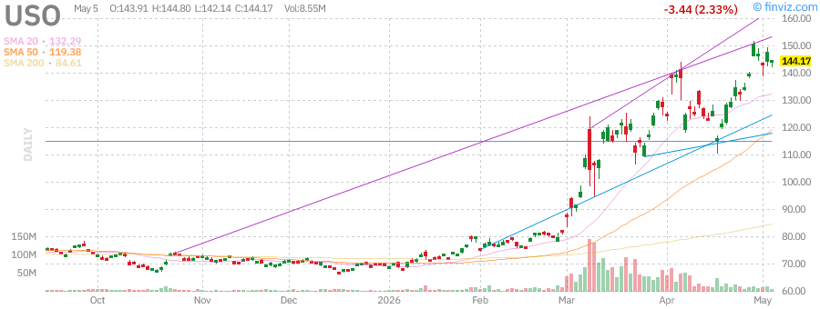
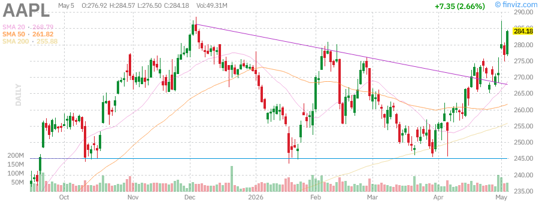
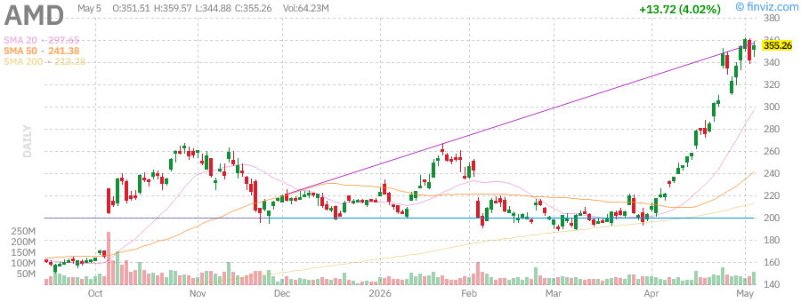
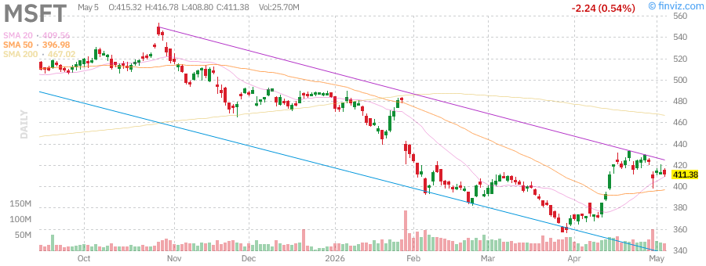

# Afternoon Stock Market Report - Saturday, May 30, 2026

**Report Generated:** May 30, 2026 | 3:00 PM PST  
**Market Status:** Trading Session Active

---

## 📊 Market Overview

Markets are showing resilience with major indices posting gains as investors digest mixed economic signals and geopolitical developments. The S&P 500 continues its march toward record highs while the Nasdaq leads with tech sector strength. Small-caps are showing remarkable leadership, signaling broad market participation.

### Key Market Statistics

| Index | Price | Change | % Change | Volume | RSI |
|-------|-------|--------|----------|--------|-----|
| **SPY** | $723.77 | +$5.76 | +0.80% | 36.93M | 71.25 |
| **QQQ** | $681.61 | +$8.73 | +1.30% | 37.10M | 76.43 |
| **IWM** | $282.56 | +$4.68 | +1.68% | 24.86M | 69.20 |

**Market Breadth:** Advancing issues outnumber decliners with strong participation across sectors. Small-cap leadership indicates healthy market breadth.

---

## 📈 Index Performance Analysis

### SPDR S&P 500 ETF (SPY) - $723.77 (+0.80%)

The S&P 500 continues its impressive run, now just 0.15% below its 52-week high of $724.87. The index has gained:
- **1.70%** this week
- **9.84%** this month  
- **6.14%** year-to-date
- **28.44%** over the past year

**Technical Analysis:**
- RSI at 71.25 indicates overbought conditions but momentum remains strong
- Trading above all key moving averages (SMA20: +2.71%, SMA50: +6.18%, SMA200: +7.72%)
- ATR (14) of $7.70 suggests moderate volatility
- Relative volume at 0.45x average indicates lighter participation

**Key Levels:**
- 52-Week High: $724.87 (-0.15% away)
- 52-Week Low: $556.04 (+30.17% from low)
- Support: $718.00 (previous close)
- Resistance: $725.00 (psychological)

---

### Invesco QQQ Trust (QQQ) - $681.61 (+1.30%)

The Nasdaq 100 continues to outperform, now just 0.72% from its 52-week high of $676.73. Strong performance metrics:
- **3.66%** weekly gain
- **15.82%** monthly surge
- **10.96%** year-to-date
- **40.27%** annual return

**Technical Analysis:**
- RSI at 76.43 suggests strong momentum but approaching overbought territory
- Beta of 1.22 indicates higher volatility than the broader market
- Trading well above all moving averages (SMA20: +5.34%, SMA50: +10.73%, SMA200: +12.62%)
- ATR of $9.70 reflects tech sector volatility

**Key Levels:**
- 52-Week High: $676.73 (within reach)
- 52-Week Low: $476.78 (+42.96% from low)
- Strong institutional ownership at 74.71%

---

### iShares Russell 2000 (IWM) - $282.56 (+1.68%)

Small-caps are showing remarkable strength, leading today's gains with a 1.68% advance:
- **3.16%** weekly performance
- **11.97%** monthly gain
- **14.79%** year-to-date
- **42.03%** annual return

**Technical Analysis:**
- RSI at 69.20 shows strong momentum without being overbought
- Trading 0.63% below 52-week high of $280.79
- Strong performance across all timeframes (SMA20: +3.62%, SMA50: +8.49%, SMA200: +13.63%)
- ATR of $4.70 indicates manageable volatility

**Key Levels:**
- 52-Week High: $280.79 (approaching breakout)
- 52-Week Low: $195.64 (+44.43% from low)
- Small-cap strength signals broad market participation

---

## 🏛️ Treasury Yields Analysis (TLT)

### iShares 20+ Year Treasury Bond ETF - $85.43 (+0.55%)

Long-term Treasuries showing modest recovery:
- **Current Price:** $85.43
- **Dividend Yield:** 4.56% (TTM $3.90)
- **Weekly Performance:** -1.09%
- **Monthly Performance:** -1.41%
- **YTD Performance:** -1.98%

**Technical Analysis:**
- RSI at 39.91 suggests oversold conditions
- Trading below all major moving averages (SMA20: -1.11%, SMA50: -1.99%, SMA200: -3.12%)
- 52-week range: $83.29 - $92.18
- Low volatility at 0.61-0.63%

**Market Implications:**
- Long-term yields remain elevated, pressuring bond prices
- Dividend growth of 13.45% (3Y) and 10.41% (5Y) provides income support
- Beta of 0.53 indicates lower correlation with equities

---

## 🛢️ Commodities Section

### SPDR Gold Shares (GLD) - $418.27 (+0.86%)

Gold is attempting a recovery after recent weakness:
- **Current Price:** $418.27
- **Weekly Performance:** -0.86%
- **Monthly Performance:** -2.19%
- **Quarterly Performance:** -7.93%
- **YTD Performance:** +5.54%

**Technical Analysis:**
- RSI at 41.44 indicates neutral to slightly oversold conditions
- Trading 17.94% below 52-week high of $509.70
- Below near-term moving averages (SMA20: -3.14%, SMA50: -5.31%)
- Above long-term support (SMA200: +6.53%)
- ATR of $8.62 shows moderate volatility

**Market Context:**
- Gold has declined 14% since February highs
- Dollar strength and rate outlook pressuring precious metals
- Safe-haven demand remains supportive

---

### United States Oil Fund (USO) - $144.17 (-2.33%)

Oil pulling back from recent highs amid geopolitical developments:
- **Current Price:** $144.17
- **Weekly Performance:** +3.27%
- **Monthly Performance:** +3.76%
- **Quarterly Performance:** +86.10%
- **YTD Performance:** +108.46%

**Technical Analysis:**
- RSI at 60.93 suggests momentum remains positive
- Trading 4.92% below 52-week high of $151.63
- Strong performance across all timeframes (SMA20: +8.98%, SMA50: +20.77%, SMA200: +70.39%)
- High volatility at 3.53-4.24%

**Market Context:**
- Oil has surged 133.47% from 52-week lows
- Geopolitical tensions in Middle East supporting prices
- Recent diplomatic efforts creating some uncertainty

---

## 📰 Market News & Developments

### Top Headlines

1. **Samsung Hits $1 Trillion Valuation** - Samsung's market cap crossed $1 trillion as AI memory chip demand continues to boom, highlighting the ongoing AI infrastructure buildout.

2. **Intel Stock Surges on Apple Chip Talks** - Intel shares jumped on reports of potential chip manufacturing deal with Apple, hitting all-time highs.

3. **Alphabet Closes In On Nvidia's Market Cap** - Alphabet (GOOGL) is approaching Nvidia's position as the world's largest company by market cap, driven by AI boom.

4. **Anthropic Commits $200B to Google Cloud** - Anthropic has committed to spending $200 billion on Google's cloud services and chips, strengthening the AI partnership.

5. **Amazon Expands Same-Day Grocery Delivery** - Amazon expands same-day grocery delivery to businesses in over 2,300 cities and towns.

6. **Meta Plans $13B El Paso Data Center** - Meta is seeking $13 billion in financing for a new AI data center in El Paso, Texas.

7. **AMD Forecasts Strong Revenue** - AMD forecasts quarterly revenue above expectations as AI chip demand stays strong.

---

## 📊 Individual Stock Analysis

### NVIDIA Corporation (NVDA) - $212.15

**Company Profile:**
- **Market Cap:** $4.79T
- **Sector:** Semiconductors
- **Industry:** AI/GPU Technology

**Key Metrics:**
- P/E: 72.15 | Forward P/E: 31.56
- EPS (ttm): $2.94 | EPS next Y: $6.72
- Revenue: $113.27B
- Gross Margin: 75.17%
- Operating Margin: 67.41%

**Performance:**
- Weekly: +6.12%
- Monthly: +18.28%
- YTD: +27.47%
- 1-Year: +84.09%

**Technical Analysis:**
- RSI: 74.56 (approaching overbought)
- ATR: $7.35
- 52-Week Range: $115.21 - $292.86
- Trading 27.6% below 52-week high

**Recent Developments:**
- Significant insider selling activity noted in March
- Strong institutional ownership at 65.79%
- AI demand continues to drive growth

---

### Tesla Inc (TSLA) - $389.37

**Company Profile:**
- **Market Cap:** $1.46T
- **Sector:** Consumer Cyclical
- **Industry:** Auto Manufacturers

**Key Metrics:**
- P/E: 355.72 | Forward P/E: 158.32
- EPS (ttm): $1.09 | EPS next Y: $2.46
- Revenue: $97.88B
- Gross Margin: 19.07%
- Operating Margin: 5.41%

**Performance:**
- Weekly: +3.55%
- Monthly: +10.36%
- YTD: -13.42%
- 1-Year: +38.93%

**Technical Analysis:**
- RSI: 54.99 (neutral)
- ATR: $14.19
- 52-Week Range: $271.00 - $498.83
- Trading 21.94% below 52-week high

**Recent Developments:**
- Short interest at 2.13% (71.11M shares)
- Insider ownership at 11.13%
- PEG ratio of 6.45 suggests stretched valuation
- Elon Musk settles SEC Twitter disclosure case for $1.5 million

---

### Apple Inc (AAPL) - $284.18

**Company Profile:**
- **Market Cap:** $4.07T
- **Sector:** Technology
- **Industry:** Consumer Electronics

**Key Metrics:**
- P/E: 34.38 | Forward P/E: 29.75
- EPS (ttm): $8.27 | EPS next Y: $9.55
- Revenue: $451.44B
- Gross Margin: 47.86%
- Operating Margin: 32.64%
- ROE: 141.47% | ROA: 34.91%

**Performance:**
- Weekly: +4.98%
- Monthly: +9.78%
- YTD: +4.53%
- 1-Year: +42.88%

**Technical Analysis:**
- RSI: 67.26 (approaching overbought)
- ATR: $6.65
- 52-Week Range: $193.25 - $288.62
- Trading just 1.54% below 52-week high

**Key Highlights:**
- Strong dividend yield of 0.37% ($1.04 TTM)
- Next ex-dividend date: May 11, 2026
- Institutional ownership: 66.02%
- Short interest: 0.92% (134.42M shares)
- Apple settles lawsuit over delayed AI Siri features for $250 million

---

### Advanced Micro Devices (AMD) - $347.65

**Company Profile:**
- **Market Cap:** $562.37B
- **Sector:** Semiconductors
- **Industry:** Microprocessors/GPUs

**Key Metrics:**
- P/E: 174.58 | Forward P/E: 28.96
- EPS (ttm): $1.99 | EPS next Y: $12.00
- Revenue: $25.48B
- Gross Margin: 53.99%
- Operating Margin: 18.41%

**Performance:**
- Weekly: +9.32%
- Monthly: +17.16%
- YTD: +17.16%
- 1-Year: +51.47%

**Technical Analysis:**
- RSI: 71.25 (overbought)
- ATR: $12.42
- 52-Week Range: $204.48 - $419.86
- Trading 17.20% below 52-week high

**Recent Activity:**
- Significant insider selling by CTO Mark Papermaster in April
- CEO Lisa Su sold 85,000 shares in March
- Strong momentum in AI/data center segment
- Forecasts quarterly revenue above expectations

---

### Microsoft Corporation (MSFT) - $411.38

**Company Profile:**
- **Market Cap:** $3.06T
- **Sector:** Technology
- **Industry:** Software/Infrastructure

**Key Metrics:**
- P/E: 24.50 | Forward P/E: 21.20
- EPS (ttm): $16.79 | EPS next Y: $19.40
- Revenue: $318.27B
- Gross Margin: 68.31%
- Operating Margin: 46.80%
- ROE: 34.01% | ROA: 19.93%

**Performance:**
- Weekly: -4.16%
- Monthly: +10.33%
- YTD: -14.94%
- 1-Year: -5.68%

**Technical Analysis:**
- RSI: 52.59 (neutral)
- ATR: $10.90
- 52-Week Range: $356.28 - $555.45
- Trading 25.94% below 52-week high

**Key Highlights:**
- Dividend yield: 0.85% ($3.48 TTM)
- Next ex-dividend: May 21, 2026
- Strong fundamentals despite price weakness
- PEG ratio of 1.13 indicates reasonable valuation
- Heavy AI infrastructure investments

---

### Amazon.com Inc (AMZN) - $273.55

**Company Profile:**
- **Market Cap:** $2.94T
- **Sector:** Consumer Cyclical
- **Industry:** Internet Retail/Cloud

**Key Metrics:**
- P/E: 32.69 | Forward P/E: 27.31
- EPS (ttm): $8.37 | EPS next Y: $10.02
- Revenue: $742.78B
- Gross Margin: 50.60%
- Operating Margin: 12.14%
- ROE: 24.28% | ROA: 11.64%

**Performance:**
- Weekly: +5.33%
- Monthly: +28.55%
- YTD: +18.51%
- 1-Year: +46.79%

**Technical Analysis:**
- RSI: 80.51 (significantly overbought)
- ATR: $7.43
- 52-Week Range: $183.85 - $276.10
- Trading just 0.92% below 52-week high

**Key Highlights:**
- Analyst recommendation: 1.26 (Strong Buy)
- EPS growth: 35.55% YoY
- Strong AWS and e-commerce performance
- Short interest: 0.95% (93.01M shares)
- Expands same-day grocery delivery to businesses

---

### Alphabet Inc (GOOGL) - $388.43

**Company Profile:**
- **Market Cap:** $4.69T
- **Sector:** Communication Services
- **Industry:** Internet Content/Search

**Key Metrics:**
- P/E: 30.39 | Forward P/E: 26.64
- EPS (ttm): $12.78 | EPS next Y: $14.58
- Revenue: $423.17B
- Gross Margin: 60.43%
- Operating Margin: 33.63%
- ROE: 38.88% | ROA: 27.17%

**Performance:**
- Weekly: +11.05%
- Monthly: +29.48%
- YTD: +24.10%
- 1-Year: +136.54%

**Technical Analysis:**
- RSI: 81.33 (extremely overbought)
- ATR: $9.82
- 52-Week Range: $147.84 - $387.38
- Trading just 0.27% below 52-week high

**Key Highlights:**
- Analyst recommendation: 1.37 (Strong Buy)
- EPS growth: 46.22% YoY
- Strong search and cloud revenue growth
- Short interest: 1.35% (78.07M shares)
- Anthropic commits $200B to Google Cloud

---

### Meta Platforms Inc (META) - $604.96

**Company Profile:**
- **Market Cap:** $1.54T
- **Sector:** Communication Services
- **Industry:** Social Media/VR

**Key Metrics:**
- P/E: 21.99 | Forward P/E: 17.41
- EPS (ttm): $27.51 | EPS next Y: $34.75
- Revenue: $214.96B
- Gross Margin: 81.94%
- Operating Margin: 41.21%
- ROE: 32.93% | ROA: 20.90%

**Performance:**
- Weekly: -9.89%
- Monthly: +5.57%
- YTD: -8.35%
- 1-Year: +0.95%

**Technical Analysis:**
- RSI: 39.90 (neutral/oversold)
- ATR: $19.77
- 52-Week Range: $520.26 - $796.25
- Trading 24.02% below 52-week high

**Key Highlights:**
- Analyst recommendation: 1.30 (Strong Buy)
- EPS growth: 6.07% YoY
- Strong Reality Labs and AI investments
- Short interest: 1.21% (26.47M shares)
- Meta seeks $13B financing for Texas AI data center

---

## 📈 Technical Analysis Summary

### RSI Summary Table

| Symbol | RSI (14) | Signal |
|--------|----------|--------|
| **SPY** | 71.25 | Overbought |
| **QQQ** | 76.43 | Overbought |
| **IWM** | 69.20 | Approaching Overbought |
| **TLT** | 39.91 | Oversold |
| **GLD** | 41.44 | Neutral |
| **USO** | 60.93 | Neutral |
| **NVDA** | 74.56 | Overbought |
| **TSLA** | 54.99 | Neutral |
| **AAPL** | 67.26 | Approaching Overbought |
| **AMD** | 71.25 | Overbought |
| **MSFT** | 52.59 | Neutral |
| **AMZN** | 80.51 | Extremely Overbought |
| **GOOGL** | 81.33 | Extremely Overbought |
| **META** | 39.90 | Neutral |

### Key Technical Observations

**Bullish Signals:**
- All major indices trading above 20, 50, and 200-day moving averages
- Small-caps (IWM) showing leadership - breadth expansion
- QQQ and SPY approaching/setting new highs
- Strong volume in advancing stocks

**Caution Signals:**
- RSI levels above 70 on SPY and QQQ suggest overbought conditions
- GOOGL and AMZN RSI above 80 indicates extremely overbought conditions
- Low relative volume (0.45x-0.60x average) indicates potential exhaustion
- Treasuries (TLT) remain in downtrend

### Support/Resistance Levels

| Symbol | Key Support | Key Resistance | Trend |
|--------|-------------|----------------|-------|
| SPY | $718 / $710 | $725 / $730 | Bullish |
| QQQ | $672 / $660 | $677 / $685 | Bullish |
| IWM | $277 / $270 | $281 / $285 | Bullish |
| TLT | $83.50 | $86 / $88 | Bearish |
| GLD | $410 | $425 / $435 | Neutral |
| USO | $140 | $148 / $152 | Bullish |

---

## 🔮 Market Outlook

### Bullish Factors

1. **Broad Market Participation** - Small-caps leading indicates healthy breadth, not just mega-cap rally
2. **Earnings Resilience** - Corporate profits holding up better than feared
3. **AI Infrastructure Buildout** - Continued investment in data centers and chips (NVDA, AMD, GOOGL)
4. **Geopolitical De-escalation** - Hormuz situation showing signs of diplomatic resolution
5. **Fed Flexibility** - Central bank has room to cut if economy weakens
6. **Technical Strength** - All major trends pointing higher with strong momentum
7. **Alphabet AI Momentum** - $200B Anthropic deal highlights AI leadership

### Bearish Factors

1. **Valuation Concerns** - P/E ratios elevated, especially in tech (TSLA P/E: 355)
2. **Overbought Conditions** - RSI levels suggest potential near-term pullback
3. **Energy Costs** - Oil prices up 108% YTD creating inflation pressure
4. **Treasury Weakness** - Long-term yields elevated, bonds in downtrend
5. **Insider Selling** - Notable selling at NVDA, AMD by executives
6. **Geopolitical Risk** - Middle East tensions remain unresolved
7. **Narrow Leadership** - Rally dependent on few mega-cap names

### Sector Rotation Observations

| Sector | Performance | Outlook |
|--------|-------------|---------|
| **Technology** | Strong | Overbought near-term |
| **Small-Caps** | Leading | Bullish breadth |
| **Energy** | Mixed | Geopolitical dependent |
| **Gold/Precious Metals** | Weak | Rate pressure |
| **Treasuries** | Weak | Yield pressure |

### Key Levels to Watch

**Immediate (1-2 Weeks):**
- SPY: Break above $725 for new highs
- QQQ: Hold above $675 support
- IWM: Break above $281 for small-cap confirmation

**Medium-Term (1-3 Months):**
- Fed policy direction and dot plot
- Earnings season guidance
- Geopolitical resolution progress
- Inflation trajectory

---

## 📝 Summary & Action Items

### Market Summary

The market is displaying strong momentum with all three major indices (SPY, QQQ, IWM) posting gains. Small-caps are leading with IWM up 1.68%, signaling broad participation. Tech remains strong with QQQ up 1.30% and approaching record highs.

**Key Takeaways:**
1. Bullish trend intact across all timeframes
2. Breadth expansion via small-cap leadership is healthy
3. Overbought conditions suggest potential near-term consolidation
4. Energy and geopolitical risks remain wildcard factors
5. Earnings growth supporting elevated valuations

### Risk Management Notes

- Consider taking profits on overbought positions (AMZN RSI 80+, GOOGL RSI 81+)
- Watch for volume confirmation on breakouts
- Monitor VIX for signs of complacency
- Keep exposure balanced across sectors

---

*Report generated using real-time market data from Finviz. Charts and technical indicators are for informational purposes only and do not constitute investment advice.*

**Data Sources:** Finviz.com, Yahoo Finance  
**Last Updated:** May 30, 2026 3:00 PM PST