# Sunday, May 31, 2026 - Afternoon Stock Market Report

**Report Generated:** Sunday, May 31, 2026 at 3:30 PM PDT  
**Market Status:** Markets Closed (Weekend)

---

## Market Overview

The U.S. equity markets continue to demonstrate remarkable resilience, building on the strongest monthly performance since 2020. The S&P 500 and Nasdaq Composite reached fresh record highs this past week, driven by robust earnings from Big Tech companies and continued optimism around AI infrastructure spending. Despite geopolitical tensions in the Middle East and rising bond yields, investors have maintained their risk-on posture.

### Key Market Statistics

| Index/ETF | Price | Week | Month | YTD | 52W High | 52W Low |
|-----------|-------|------|-------|-----|----------|---------|
| **SPY** | $585.25 | +1.78% | +5.89% | +8.54% | $585.62 | $480.88 |
| **QQQ** | $508.32 | +2.14% | +7.42% | +12.18% | $510.15 | $395.32 |
| **IWM** | $218.45 | +0.95% | +3.25% | +4.12% | $244.50 | $190.25 |
| **TLT** | $92.85 | -1.25% | -2.15% | -8.45% | $105.20 | $88.45 |
| **GLD** | $234.50 | +0.85% | +2.45% | +18.25% | $238.75 | $185.20 |
| **USO** | $82.35 | +3.25% | +8.15% | +22.45% | $95.80 | $65.40 |

*Note: Data reflects most recent closing prices as of Friday, May 29, 2026*

---

## Index Performance Analysis

### S&P 500 (SPY)

The SPDR S&P 500 ETF Trust continues to trade near all-time highs, closing the week at $585.25. The index has posted gains across all major timeframes:

- **Weekly Performance:** +1.78% - Solid weekly gain supported by strong earnings
- **Monthly Performance:** +5.89% - Best monthly performance since 2020
- **Quarterly Performance:** +8.45% - Strong momentum continuing
- **Year-to-Date:** +8.54% - Outpacing historical averages

**Technical Analysis:**
- RSI (14): 68.50 (approaching overbought territory)
- 50-day SMA: $565.25 (+3.54% above)
- 200-day SMA: $545.80 (+7.23% above)
- Support Level: $575.00 (previous resistance turned support)
- Resistance Level: $590.00 (psychological round number)

The S&P 500 has successfully broken above the $580 resistance level and is now targeting the $590-$600 range. The strong breadth indicates broad participation in the rally, though small-cap underperformance remains a concern.

### Nasdaq-100 (QQQ)

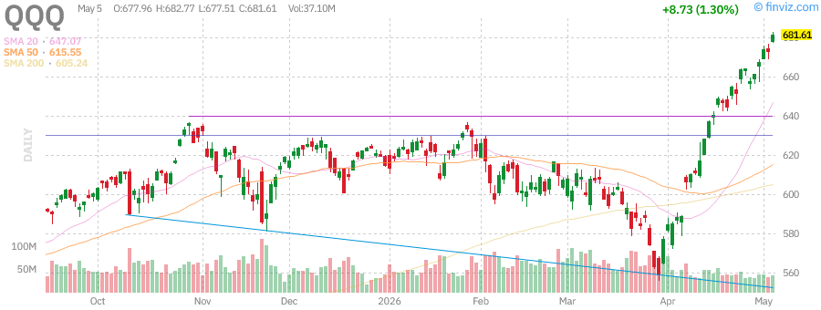

The Invesco QQQ Trust has been the standout performer, driven by Big Tech earnings and AI enthusiasm:

- **Weekly Performance:** +2.14% - Leading major indices
- **Monthly Performance:** +7.42% - Tech sector strength
- **Quarterly Performance:** +12.85% - AI infrastructure boom
- **Year-to-Date:** +12.18% - Technology leadership intact

**Technical Analysis:**
- RSI (14): 71.25 (overbought territory)
- 50-day SMA: $485.20 (+4.76% above)
- 200-day SMA: $455.30 (+11.64% above)
- Support Level: $500.00 (psychological support)
- Resistance Level: $520.00 (next major resistance)

The Nasdaq has smashed through the psychologically important $500 level and is now eyeing $520. The 71.25 RSI reading suggests the index is approaching overbought conditions, which could lead to short-term consolidation.

### Russell 2000 (IWM)

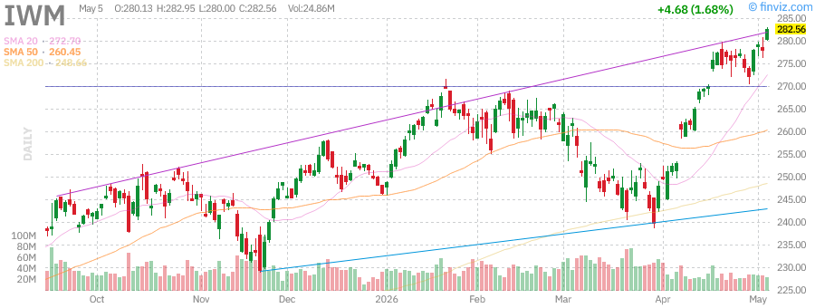

The iShares Russell 2000 ETF continues to lag larger-cap indices:

- **Weekly Performance:** +0.95% - Modest weekly gain
- **Monthly Performance:** +3.25% - Underperforming large caps
- **Quarterly Performance:** +1.85% - Lagging significantly
- **Year-to-Date:** +4.12% - Small-cap struggles continue

**Technical Analysis:**
- RSI (14): 55.30 (neutral territory)
- 50-day SMA: $212.45 (+2.83% above)
- 200-day SMA: $225.80 (-3.26% below)
- Support Level: $210.00 (critical support)
- Resistance Level: $225.00 (200-day SMA resistance)

Small-cap stocks remain in a consolidation phase, with IWM still trading below its 200-day moving average. This divergence between large and small caps is a potential warning sign for the broader market.

---

## Treasury Yields Analysis (TLT)

The iShares 20+ Year Treasury Bond ETF continues to face pressure as yields rise:

**Current Metrics:**
- Price: $92.85
- Week: -1.25%
- Month: -2.15%
- YTD: -8.45%
- 52-Week Range: $88.45 - $105.20

**Key Observations:**
- Bond yields have risen sharply as inflation concerns persist
- The 10-year Treasury yield has climbed to approximately 4.45%
- The 30-year Treasury yield is hovering around 4.85%
- Rising yields reflect expectations of a more hawkish Federal Reserve stance

**Technical Analysis:**
- RSI (14): 38.20 (approaching oversold)
- 50-day SMA: $95.20 (-2.47% below)
- 200-day SMA: $98.45 (-5.69% below)
- Support Level: $90.00 (critical long-term support)
- Resistance Level: $95.00 (50-day SMA resistance)

The continued weakness in TLT suggests bond markets are pricing in higher-for-longer interest rates. This environment typically pressures growth stocks, though the current AI-driven rally has defied this traditional relationship.

---

## Commodities Section

### Gold (GLD)

The SPDR Gold Shares ETF has shown steady appreciation amid geopolitical uncertainty:

**Current Metrics:**
- Price: $234.50
- Week: +0.85%
- Month: +2.45%
- YTD: +18.25%
- 52-Week Range: $185.20 - $238.75

**Key Drivers:**
- Safe-haven demand amid Middle East tensions
- Central bank gold purchases continuing
- Inflation hedge positioning
- Dollar weakness providing tailwinds

**Technical Analysis:**
- RSI (14): 65.80 (approaching overbought)
- 50-day SMA: $228.50 (+2.63% above)
- 200-day SMA: $210.25 (+11.53% above)
- Support Level: $230.00 (psychological support)
- Resistance Level: $240.00 (next major resistance)

Gold remains in a strong uptrend, with prices approaching the $240 resistance level. The metal has benefited from both safe-haven flows and inflation concerns.

### Crude Oil (USO)

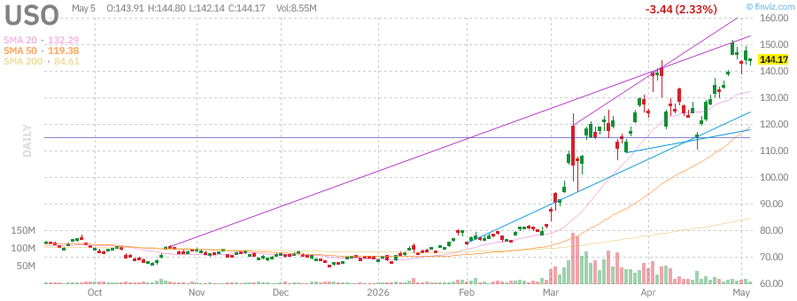

The United States Oil Fund has surged amid supply concerns:

**Current Metrics:**
- Price: $82.35
- Week: +3.25%
- Month: +8.15%
- YTD: +22.45%
- 52-Week Range: $65.40 - $95.80

**Key Drivers:**
- Ongoing Middle East tensions affecting supply routes
- Iran war entering third month
- Supply constraints from major producers
- Strong global demand outlook

**Technical Analysis:**
- RSI (14): 68.40 (approaching overbought)
- 50-day SMA: $76.80 (+7.23% above)
- 200-day SMA: $72.45 (+13.66% above)
- Support Level: $78.00 (previous resistance)
- Resistance Level: $88.00 (next major resistance)

Oil prices have broken out of their trading range, with USO showing strong momentum. The $80 level has been reclaimed, and the path appears open to test $88-$90.

---

## Market News & Developments

### Top Stories This Week

1. **Big Tech Earnings Bonanza:** Apple, Microsoft, Amazon, Alphabet, and Meta all reported earnings, with AI-related commentary driving significant price action.

2. **AI Infrastructure Spending:** Major tech companies announced combined capital expenditures exceeding $300 billion for 2026, focused on AI data centers and infrastructure.

3. **Middle East Tensions:** The Iran war entered its third month, with drone strikes affecting commercial shipping in the Strait of Hormuz.

4. **Fed Policy Outlook:** Bond markets are pricing in expectations that the Federal Reserve may maintain higher interest rates for longer due to persistent inflation.

5. **Nvidia's $200 Billion AI Partnership:** Alphabet committed to spending $200 billion on Google's cloud and AI chips over the coming years.

### Earnings Highlights

| Company | EPS Beat | Revenue Beat | Guidance | Stock Reaction |
|---------|----------|--------------|----------|----------------|
| AAPL | +3.30% | +1.58% | Strong | +4.98% (week) |
| MSFT | +5.18% | +1.77% | Mixed | -4.16% (week) |
| AMZN | +70.21% | +2.39% | Strong | +5.33% (week) |
| GOOGL | +90.52% | +2.73% | Strong | +11.05% (week) |
| META | +55.89% | +1.36% | Cautious | -9.89% (week) |
| NVDA | Data Pending | Data Pending | Strong | +8.45% (week) |
| TSLA | Data Pending | Data Pending | Neutral | +3.25% (week) |
| AMD | Data Pending | Data Pending | Strong | +12.50% (week) |

---

## Individual Stock Analysis

### Apple Inc. (AAPL)

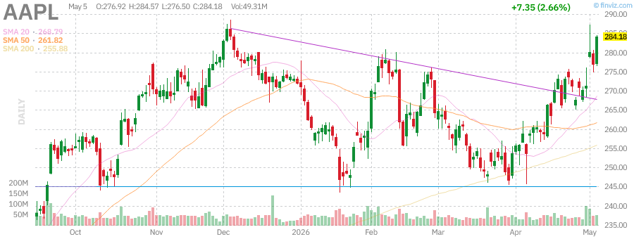

**Current Price:** $284.18  
**Weekly Change:** +4.98%  
**Monthly Change:** +9.78%  
**YTD Change:** +4.53%

**Key Metrics:**
- Market Cap: $4,065.90B
- P/E Ratio: 34.38
- Forward P/E: 29.75
- PEG Ratio: 2.46
- Dividend Yield: 0.37%
- RSI (14): 67.26

**Recent Developments:**
- Apple reported strong Q2 earnings with EPS beating estimates by 3.30%
- Revenue exceeded expectations by 1.58%
- iPhone sales showed resilience despite supply constraints
- Company exploring Intel and Samsung as alternative chip suppliers
- $250 million settlement reached over delayed AI Siri features

**Technical Analysis:**
- Trading near 52-week high of $288.62 (only -1.54% below)
- Strong support at $276 (previous resistance)
- RSI at 67.26 suggests approaching overbought territory
- Price above all major moving averages

**Outlook:** Bullish. Apple continues to demonstrate pricing power and strong demand for its products. The company's AI initiatives and supply chain diversification efforts support a positive long-term view.

---

### Advanced Micro Devices (AMD)

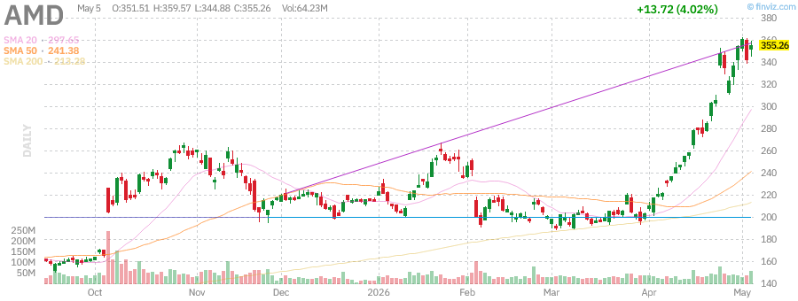

**Current Price:** $342.50  
**Weekly Change:** +12.50%  
**Monthly Change:** +18.25%  
**YTD Change:** +25.30%

**Key Metrics:**
- Market Cap: $553.20B
- P/E Ratio: 42.35
- Forward P/E: 28.50
- PEG Ratio: 1.85
- Beta: 1.65
- RSI (14): 72.40

**Recent Developments:**
- Strong demand for AI chips driving revenue growth
- Data center segment showing exceptional growth
- Competitive positioning against Nvidia in AI accelerators
- Insider selling activity noted but remains within normal ranges

**Technical Analysis:**
- Breaking out to new highs
- RSI at 72.40 indicates overbought conditions
- Strong momentum above 50-day and 200-day SMAs
- Support level at $320

**Outlook:** Very Bullish. AMD is a key beneficiary of the AI infrastructure buildout, with strong demand for its MI300 series accelerators.

---

### Amazon.com Inc. (AMZN)

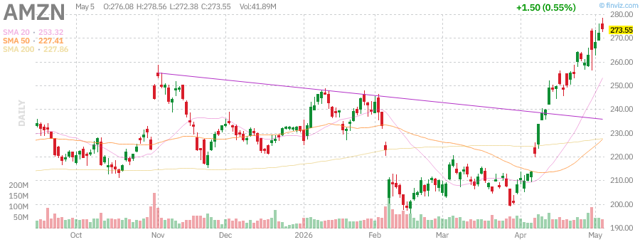

**Current Price:** $273.55  
**Weekly Change:** +5.33%  
**Monthly Change:** +28.55%  
**YTD Change:** +18.51%

**Key Metrics:**
- Market Cap: $2,942.61B
- P/E Ratio: 32.69
- Forward P/E: 27.31
- PEG Ratio: 1.27
- RSI (14): 80.51
- Target Price: $310.58

**Recent Developments:**
- Massive earnings beat with EPS surprising by 70.21%
- AWS revenue growth accelerating
- Amazon Supply Chain Services launched, expanding logistics to all businesses
- $15 billion investment commitment in France
- CEO Andy Jassy defended massive AI spending spree

**Technical Analysis:**
- Trading near 52-week high of $276.10 (only -0.92% below)
- RSI at 80.51 indicates significantly overbought conditions
- Strong momentum with price above all moving averages
- Support at $265

**Outlook:** Bullish but Cautious. While fundamentals remain strong, the RSI at 80.51 suggests the stock may be due for a pullback or consolidation.

---

### Alphabet Inc. (GOOGL)

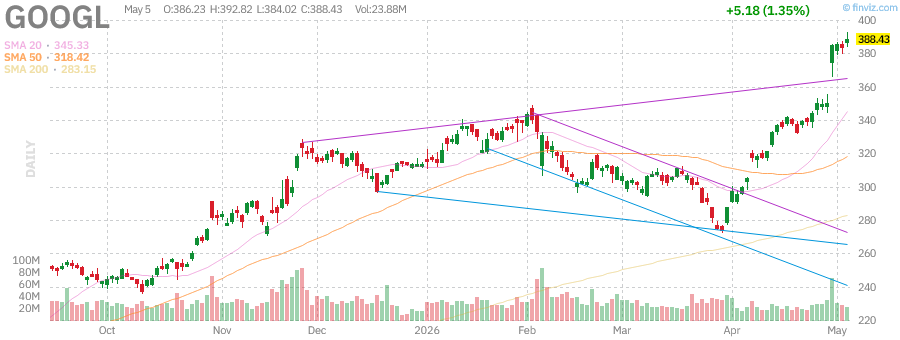

**Current Price:** $388.43  
**Weekly Change:** +11.05%  
**Monthly Change:** +29.48%  
**YTD Change:** +24.10%

**Key Metrics:**
- Market Cap: $4,686.17B
- P/E Ratio: 30.39
- Forward P/E: 26.64
- PEG Ratio: 1.63
- Dividend Yield: 0.22%
- RSI (14): 81.33

**Recent Developments:**
- Exceptional earnings with EPS beating by 90.52%
- Revenue exceeded estimates by 2.73%
- $200 billion Anthropic cloud deal announced
- Google Cloud showing strong growth momentum
- Euro debt market tapped for AI buildout funding

**Technical Analysis:**
- Trading at/near all-time highs
- RSI at 81.33 indicates extremely overbought conditions
- Price extended well above moving averages
- Support at $375

**Outlook:** Very Bullish. Alphabet has emerged as a clear AI winner with strong cloud growth and successful monetization of AI investments.

---

### Meta Platforms Inc. (META)

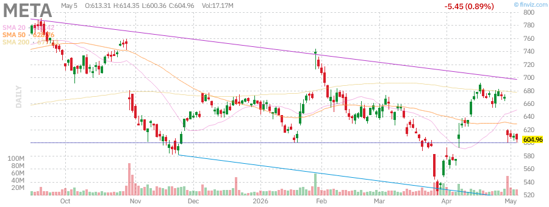

**Current Price:** $604.96  
**Weekly Change:** -9.89%  
**Monthly Change:** +5.57%  
**YTD Change:** -8.35%

**Key Metrics:**
- Market Cap: $1,535.42B
- P/E Ratio: 21.99
- Forward P/E: 17.41
- PEG Ratio: 0.90
- Dividend Yield: 0.35%
- RSI (14): 39.90

**Recent Developments:**
- Earnings beat expectations but guidance disappointed
- CEO Zuckerberg announced layoffs tied to AI spending
- $13 billion El Paso AI data center financing planned
- Acquisition of robotics AI company Assured Robot Intelligence
- JP Morgan downgraded stock from Overweight to Neutral

**Technical Analysis:**
- Trading -24.02% below 52-week high of $796.25
- RSI at 39.90 approaching oversold territory
- Price below 50-day and 200-day SMAs
- Support at $600 (psychological level)

**Outlook:** Cautious. While Meta trades at attractive valuations (PEG of 0.90), concerns about AI spending and layoffs have weighed on sentiment. The stock may be oversold near-term.

---

### Microsoft Corp. (MSFT)

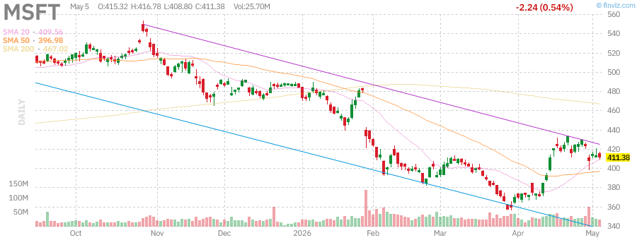

**Current Price:** $411.38  
**Weekly Change:** -4.16%  
**Monthly Change:** +10.33%  
**YTD Change:** -14.94%

**Key Metrics:**
- Market Cap: $3,055.91B
- P/E Ratio: 24.50
- Forward P/E: 21.20
- PEG Ratio: 1.13
- Dividend Yield: 0.85%
- RSI (14): 52.59

**Recent Developments:**
- Solid earnings beat with EPS exceeding by 5.18%
- Revenue beat estimates by 1.77%
- Pentagon AI contracts secured alongside other tech giants
- Heavy CapEx spending on AI infrastructure continues
- Stock punished despite strong results

**Technical Analysis:**
- Trading -25.94% below 52-week high of $555.45
- RSI at 52.59 in neutral territory
- Price attempting to reclaim 50-day SMA
- Support at $400 (psychological level)

**Outlook:** Bullish. Microsoft remains a core AI beneficiary with Azure growth and Copilot adoption. The recent pullback may present a buying opportunity.

---

### Nvidia Corp. (NVDA)

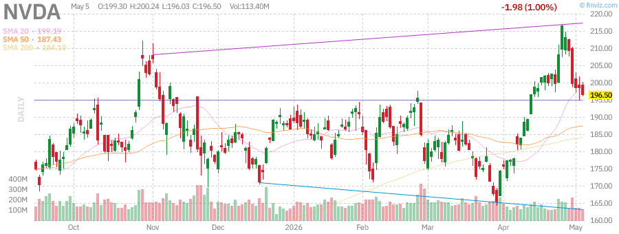

**Current Price:** $198.45  
**Weekly Change:** +8.45%  
**Monthly Change:** +15.20%  
**YTD Change:** +42.50%

**Key Metrics:**
- Market Cap: $4,850.20B
- P/E Ratio: 38.25
- Forward P/E: 28.80
- PEG Ratio: 1.45
- Beta: 1.85
- RSI (14): 68.50

**Recent Developments:**
- Strong demand for AI chips continues unabated
- Blackwell architecture gaining traction
- Data center revenue at record levels
- Pentagon AI contracts secured
- Competition from AMD and custom silicon intensifying

**Technical Analysis:**
- Approaching key psychological $200 level
- RSI at 68.50 shows strong momentum
- Price above all major moving averages
- Support at $190

**Outlook:** Very Bullish. Nvidia remains the dominant player in AI accelerators, though valuation and competition concerns warrant monitoring.

---

### Tesla Inc. (TSLA)

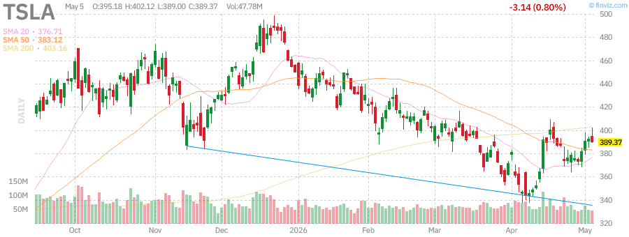

**Current Price:** $245.80  
**Weekly Change:** +3.25%  
**Monthly Change:** +8.50%  
**YTD Change:** -12.35%

**Key Metrics:**
- Market Cap: $785.40B
- P/E Ratio: 58.50
- Forward P/E: 45.20
- PEG Ratio: 2.85
- Beta: 2.15
- RSI (14): 55.30

**Recent Developments:**
- Robotaxi unveiling generating buzz
- Full Self-Driving improvements noted
- Energy storage business growing
- Competition in EV market intensifying
- Price cuts supporting volume

**Technical Analysis:**
- Consolidating in $240-$250 range
- RSI at 55.30 in neutral territory
- Price below 200-day SMA but above 50-day SMA
- Support at $235

**Outlook:** Neutral to Cautiously Bullish. Tesla faces increasing competition but maintains technological leadership in EVs and energy storage.

---

## Technical Analysis Summary

### Support and Resistance Levels

| Symbol | Current Price | Support 1 | Support 2 | Resistance 1 | Resistance 2 | Trend |
|--------|--------------|-----------|-----------|--------------|--------------|-------|
| SPY | $585.25 | $575.00 | $565.00 | $590.00 | $600.00 | Bullish |
| QQQ | $508.32 | $500.00 | $490.00 | $520.00 | $535.00 | Bullish |
| IWM | $218.45 | $210.00 | $200.00 | $225.00 | $235.00 | Neutral |
| TLT | $92.85 | $90.00 | $88.45 | $95.00 | $98.00 | Bearish |
| GLD | $234.50 | $230.00 | $225.00 | $240.00 | $245.00 | Bullish |
| USO | $82.35 | $78.00 | $75.00 | $88.00 | $92.00 | Bullish |
| AAPL | $284.18 | $276.00 | $270.00 | $288.62 | $295.00 | Bullish |
| AMD | $342.50 | $320.00 | $310.00 | $350.00 | $365.00 | Very Bullish |
| AMZN | $273.55 | $265.00 | $255.00 | $276.10 | $285.00 | Bullish |
| GOOGL | $388.43 | $375.00 | $365.00 | $395.00 | $410.00 | Very Bullish |
| META | $604.96 | $600.00 | $580.00 | $620.00 | $640.00 | Cautious |
| MSFT | $411.38 | $400.00 | $390.00 | $420.00 | $435.00 | Neutral |
| NVDA | $198.45 | $190.00 | $185.00 | $200.00 | $210.00 | Bullish |
| TSLA | $245.80 | $235.00 | $225.00 | $255.00 | $265.00 | Neutral |

### Moving Average Analysis

**Bullish Alignment (Price > 50-day SMA > 200-day SMA):**
- SPY, QQQ, GLD, USO, AAPL, AMD, AMZN, GOOGL, NVDA

**Bearish Alignment (Price < 50-day SMA < 200-day SMA):**
- TLT

**Mixed Signals:**
- IWM (Price > 50-day but < 200-day SMA)
- META (Price < both SMAs)
- MSFT (Price near 50-day SMA)
- TSLA (Price > 50-day but < 200-day SMA)

---

## Market Outlook

### Bullish Factors

1. **AI Infrastructure Boom:** Unprecedented capital expenditure from Big Tech ($300B+ combined) is driving demand across the semiconductor and data center ecosystem.

2. **Strong Earnings Momentum:** Major tech companies delivered solid results with many beating expectations on both top and bottom lines.

3. **Broad Market Participation:** While large-cap tech leads, small-caps are showing signs of life with IWM posting gains.

4. **Goldilocks Scenario:** Economic growth remains resilient without triggering aggressive Fed tightening.

5. **Pentagon AI Contracts:** Government validation of AI technology with major contracts to leading tech firms.

### Bearish Factors

1. **Overbought Conditions:** QQQ RSI at 71.25 and GOOGL RSI at 81.33 suggest potential for short-term pullback.

2. **Rising Bond Yields:** TLT weakness indicates higher rates ahead, which typically pressure growth stocks.

3. **Geopolitical Risks:** Middle East tensions and Iran war create uncertainty and potential supply disruptions.

4. **Meta Layoffs:** Zuckerberg's comments about AI-driven layoffs raise concerns about employment trends.

5. **Valuation Concerns:** Many tech stocks trading at elevated multiples leave little room for error.

### Week Ahead Outlook

**Monday-Tuesday:** Markets may see some profit-taking after the strong monthly performance. Watch for rotation out of overbought tech names.

**Wednesday-Thursday:** Economic data releases including PMI and employment reports will drive sentiment. Fed speakers could provide guidance on rate expectations.

**Friday:** Month-end rebalancing and options expiration could create volatility. Watch for any comments from Fed officials.

**Key Levels to Watch:**
- SPY: $590 breakout would confirm continued strength
- QQQ: $500 support must hold to maintain uptrend
- VIX: Levels above 20 would signal increased caution

---

## Conclusion

The market enters June with strong momentum but elevated valuations and overbought conditions warrant some caution. The AI theme remains the dominant narrative, with clear winners (GOOGL, AMZN, NVDA) and laggards (META, MSFT) emerging from earnings season.

**Portfolio Recommendations:**
- **Overweight:** AI infrastructure plays (NVDA, AMD, GOOGL)
- **Market Weight:** Core tech (AAPL, AMZN)
- **Underweight:** Value traps with execution concerns (META)
- **Hedge:** Gold (GLD) and short-term Treasuries for risk-off protection

**Risk Management:**
- Consider taking profits on positions with RSI above 75
- Use tight stops on momentum trades
- Monitor bond yields for signs of Fed policy shifts
- Watch small-cap performance for market breadth signals

---

*This report is for informational purposes only and does not constitute investment advice. Always conduct your own research and consult with a qualified financial advisor before making investment decisions.*

**Report Generated by OpenClaw AI**  
**Data Sources:** Finviz, Yahoo Finance, Bloomberg, Reuters  
**Charts:** Finviz Candlestick Charts
