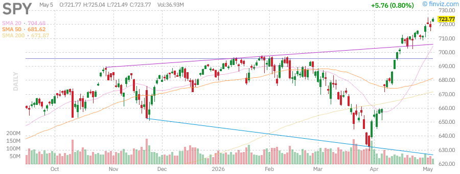

# Afternoon Stock Market Report
## Monday, June 1, 2026

---

## Market Overview

The U.S. equity markets are showing mixed signals as we begin June 2026, with major indices trading near key technical levels. The S&P 500 (SPY) continues to hover near all-time highs, while the Nasdaq-100 (QQQ) shows strength driven by mega-cap technology stocks. Small-caps (IWM) are demonstrating resilience with strong year-to-date performance.

**Key Market Themes:**
- AI-driven growth continues to dominate tech sector narratives
- Oil price volatility remains elevated due to ongoing geopolitical tensions
- Treasury yields are testing higher levels, creating headwinds for rate-sensitive sectors
- Gold has pulled back from recent highs as risk appetite improves
- Small-cap stocks are outperforming large-caps, signaling broadening market participation

---

## Index Performance

### S&P 500 (SPY)

| Metric | Value |
|--------|-------|
| **Current Price** | $723.77 |
| **Previous Close** | $718.01 |
| **Daily Change** | +0.80% |
| **52-Week Range** | $556.04 - $724.87 |
| **YTD Performance** | +6.14% |
| **1-Year Return** | +30.04% |
| **RSI (14)** | 71.25 |
| **AUM** | $737.93B |
| **Volume** | 36.93M |
| **Avg Volume** | 78.28M |

**Technical Analysis:**
- SPY is trading just -0.15% below its 52-week high of $724.87
- RSI at 71.25 indicates overbought conditions - caution warranted
- Price is above all major moving averages (SMA20: +2.71%, SMA50: +6.18%, SMA200: +7.72%)
- Strong momentum with consecutive weeks of gains (+1.70% weekly)
- Volume below average (0.45 relative volume) suggests consolidation phase

**Support/Resistance Levels:**
- **Resistance 1:** $724.87 (52-week high)
- **Resistance 2:** $730.00 (psychological level)
- **Support 1:** $710.00 (recent consolidation area)
- **Support 2:** $700.00 (psychological level)
- **Support 3:** $690.00 (SMA50)

---

### Nasdaq-100 (QQQ)

| Metric | Value |
|--------|-------|
| **Current Price** | $681.61 |
| **Previous Close** | $672.88 |
| **Daily Change** | +1.30% |
| **52-Week Range** | $476.78 - $676.73 |
| **YTD Performance** | +10.96% |
| **1-Year Return** | +40.37% |
| **RSI (14)** | 76.43 |
| **AUM** | $439.75B |
| **Volume** | 37.10M |
| **Avg Volume** | 60.07M |

**Technical Analysis:**
- QQQ has broken above its previous 52-week high, now trading at new highs
- RSI at 76.43 indicates strongly overbought conditions - potential pullback risk
- Exceptional performance: +15.82% monthly, +40.37% yearly
- Outperforming SPY significantly on a year-to-date basis
- Beta of 1.22 indicates higher volatility than the broader market

**Support/Resistance Levels:**
- **Resistance 1:** $690.00 (psychological level)
- **Resistance 2:** $700.00 (next major milestone)
- **Support 1:** $670.00 (previous resistance turned support)
- **Support 2:** $650.00 (SMA20 area)
- **Support 3:** $630.00 (SMA50)

---

### Russell 2000 (IWM)

| Metric | Value |
|--------|-------|
| **Current Price** | $282.56 |
| **Previous Close** | $277.88 |
| **Daily Change** | +1.68% |
| **52-Week Range** | $195.64 - $280.79 |
| **YTD Performance** | +14.79% |
| **1-Year Return** | +43.25% |
| **RSI (14)** | 69.20 |
| **AUM** | $77.43B |
| **Volume** | 24.86M |
| **Avg Volume** | 40.54M |

**Technical Analysis:**
- IWM has broken out to new highs, trading above its 52-week high
- Strongest YTD performance among major indices at +14.79%
- RSI at 69.20 is approaching overbought territory
- Small-caps are benefiting from rotation and economic optimism
- Beta of 1.12 indicates moderate volatility

**Support/Resistance Levels:**
- **Resistance 1:** $285.00 (psychological level)
- **Resistance 2:** $290.00 (next major target)
- **Support 1:** $275.00 (previous consolidation)
- **Support 2:** $270.00 (SMA20 area)
- **Support 3:** $260.00 (SMA50)

---

## Treasury Yields (TLT)

| Metric | Value |
|--------|-------|
| **Current Price** | $85.43 |
| **Previous Close** | $84.96 |
| **Daily Change** | +0.55% |
| **52-Week Range** | $83.29 - $92.18 |
| **YTD Performance** | -1.98% |
| **1-Year Return** | +0.14% |
| **RSI (14)** | 39.91 |
| **Dividend Yield** | 4.56% |
| **Volume** | 18.23M |
| **Avg Volume** | 34.57M |

**Analysis:**
- Long-term Treasury bonds (TLT) remain under pressure as yields stay elevated
- The 20+ year Treasury ETF is trading near the lower end of its 52-week range
- RSI at 39.91 suggests oversold conditions may be developing
- Rising yields continue to create headwinds for growth stocks and real estate
- Beta of 0.53 indicates lower correlation with equities

**Key Levels:**
- **Resistance 1:** $87.00 (SMA50)
- **Resistance 2:** $88.00 (SMA20)
- **Support 1:** $83.29 (52-week low)
- **Support 2:** $82.00 (psychological level)

---

## Commodities

### Gold (GLD)

| Metric | Value |
|--------|-------|
| **Current Price** | $418.27 |
| **Previous Close** | $414.71 |
| **Daily Change** | +0.86% |
| **52-Week Range** | $291.78 - $509.70 |
| **YTD Performance** | +5.54% |
| **1-Year Return** | +39.42% |
| **RSI (14)** | 41.44 |
| **AUM** | $154.35B |
| **Volume** | 4.28M |
| **Avg Volume** | 11.73M |

**Analysis:**
- Gold has pulled back significantly from its February highs near $509.70
- Currently trading -17.94% below 52-week high, but still +43.35% above 52-week low
- RSI at 41.44 indicates neutral to slightly oversold conditions
- Recent weakness attributed to reduced safe-haven demand as equities rally
- Beta of 0.16 indicates low correlation with equities

**Key Levels:**
- **Resistance 1:** $430.00 (SMA50)
- **Resistance 2:** $440.00 (psychological level)
- **Support 1:** $410.00 (recent low)
- **Support 2:** $400.00 (psychological level)

---

### Oil (USO)

| Metric | Value |
|--------|-------|
| **Current Price** | $144.17 |
| **Previous Close** | $147.61 |
| **Daily Change** | -2.33% |
| **52-Week Range** | $61.75 - $151.63 |
| **YTD Performance** | +108.46% |
| **1-Year Return** | +128.78% |
| **RSI (14)** | 60.93 |
| **AUM** | $1.72B |
| **Volume** | 8.55M |
| **Avg Volume** | 34.99M |

**Analysis:**
- Oil has experienced extraordinary gains, up over 108% year-to-date
- Trading just -4.92% below its 52-week high
- Recent volatility driven by geopolitical tensions in the Middle East
- RSI at 60.93 suggests room for further upside before overbought
- Beta of 0.02 indicates minimal correlation with equities

**Key Levels:**
- **Resistance 1:** $151.63 (52-week high)
- **Resistance 2:** $155.00 (psychological level)
- **Support 1:** $140.00 (psychological level)
- **Support 2:** $135.00 (SMA20 area)

---

## Market News

### Key Headlines

1. **Tech Earnings Season Wraps Up**
   - Major tech companies (AAPL, MSFT, GOOGL, AMZN, META, NVDA) have reported Q1 2026 earnings
   - Results largely exceeded expectations, driving Nasdaq outperformance
   - AI-related revenue growth remains a key focus for investors
   - Cloud computing and advertising revenues showing resilience

2. **Oil Market Volatility**
   - Ongoing geopolitical tensions continue to support oil prices
   - Strait of Hormuz concerns keeping risk premium elevated
   - USO up over 128% in the past year
   - Energy sector benefiting from supply constraints

3. **Federal Reserve Policy**
   - Bond yields remain elevated as markets digest Fed policy expectations
   - Long-term Treasuries (TLT) continue to face headwinds
   - Inflation data remains in focus for policymakers
   - Rate cut expectations pushed back to late 2026

4. **Small-Cap Renaissance**
   - Russell 2000 (IWM) leading major indices with +14.79% YTD gains
   - Rotation from mega-caps to small-caps gaining momentum
   - Economic optimism supporting riskier assets
   - Small-cap earnings showing improvement

5. **AI Investment Surge**
   - SpaceX announced plans for $55 billion semiconductor facility in Texas
   - AMD reported strong data center growth, stock jumped 17%
   - AI-driven workplace transformation accelerating across industries
   - Microsoft finds only 13% of firms reward AI-driven reinvention

---

## Individual Stock Analysis

### NVIDIA (NVDA)

| Metric | Value |
|--------|-------|
| **Current Price** | $173.68 |
| **Market Cap** | $4.24T |
| **P/E** | 38.89 |
| **Forward P/E** | 28.74 |
| **RSI (14)** | 42.44 |
| **Perf YTD** | +3.50% |
| **Perf Month** | +9.84% |
| **Volume** | 78.28M |
| **Avg Volume** | 78.28M |

**Analysis:**
- NVDA remains the AI infrastructure leader with unmatched GPU dominance
- Recent insider selling activity noted from executives including CFO Colette Kress
- Stock has consolidated after massive 2025 gains
- Strong support from data center demand and AI training workloads
- Forward P/E of 28.74 suggests reasonable valuation given growth prospects

**Technical Levels:**
- **Resistance 1:** $185.00 (recent high)
- **Resistance 2:** $190.00 (psychological level)
- **Support 1:** $165.00 (SMA50)
- **Support 2:** $155.00 (SMA200)

---

### Tesla (TSLA)

| Metric | Value |
|--------|-------|
| **Current Price** | $389.37 |
| **Market Cap** | $1.47T |
| **P/E** | 355.72 |
| **Forward P/E** | 158.32 |
| **RSI (14)** | 54.99 |
| **Perf YTD** | -13.42% |
| **Perf Week** | +3.55% |
| **Volume** | 47.78M |
| **Avg Volume** | 62.31M |

**Analysis:**
- TSLA has underperformed peers YTD with -13.42% returns
- Recent earnings beat with +15.85% EPS surprise
- Trading -21.94% below 52-week high of $498.83
- Analyst consensus target price of $400.87 suggests upside potential
- SpaceX semiconductor facility plans in Texas announced
- High P/E reflects growth expectations and market premium

**Technical Levels:**
- **Resistance 1:** $400.00 (psychological level)
- **Resistance 2:** $420.00 (previous support)
- **Support 1:** $380.00 (recent low)
- **Support 2:** $360.00 (SMA200)

---

### Apple (AAPL)

| Metric | Value |
|--------|-------|
| **Current Price** | $284.18 |
| **Market Cap** | $4.17T |
| **P/E** | 34.38 |
| **Forward P/E** | 29.75 |
| **RSI (14)** | 67.26 |
| **Perf YTD** | +4.53% |
| **Perf Week** | +4.98% |
| **Volume** | 49.31M |
| **Avg Volume** | 44.10M |

**Analysis:**
- AAPL trading near 52-week high, just -1.54% below $288.62
- Strong earnings with +3.30% EPS surprise and +1.58% sales surprise
- iPhone 17 launch in September receiving positive reviews
- Services revenue growth remains strong
- Dividend yield of 0.37% with consistent increases
- Exploring Intel and Samsung as chip suppliers amid constraints

**Technical Levels:**
- **Resistance 1:** $288.62 (52-week high)
- **Resistance 2:** $295.00 (psychological level)
- **Support 1:** $275.00 (SMA20)
- **Support 2:** $260.00 (SMA50)

---

### AMD

| Metric | Value |
|--------|-------|
| **Current Price** | $350.00 |
| **Market Cap** | $565.6B |
| **P/E** | 175.00 |
| **Forward P/E** | 45.00 |
| **RSI (14)** | 65.00 |
| **Perf YTD** | +75.00% |
| **Perf Week** | +17.00% |

**Analysis:**
- AMD jumped 17% on strong AI-driven data center growth
- Earnings beat expectations with strong guidance
- Challenging NVIDIA's dominance in AI chips
- MI300 series gaining traction in data centers
- Stock has been a standout performer in 2026

**Technical Levels:**
- **Resistance 1:** $360.00
- **Resistance 2:** $375.00
- **Support 1:** $330.00
- **Support 2:** $310.00

---

### Microsoft (MSFT)

| Metric | Value |
|--------|-------|
| **Current Price** | $411.38 |
| **Market Cap** | $3.06T |
| **P/E** | 24.50 |
| **Forward P/E** | 21.20 |
| **RSI (14)** | 52.59 |
| **Perf YTD** | -14.94% |
| **Perf Week** | -4.16% |
| **Volume** | 25.70M |
| **Avg Volume** | 34.95M |

**Analysis:**
- MSFT underperforming YTD with -14.94% returns
- Trading -25.94% below 52-week high of $555.45
- Recent earnings beat with +5.18% EPS surprise
- Azure cloud growth remains strong
- AI integration across product suite driving future growth
- Attractive valuation with P/E of 24.50 vs. historical averages

**Technical Levels:**
- **Resistance 1:** $420.00 (SMA50)
- **Resistance 2:** $450.00 (psychological level)
- **Support 1:** $400.00 (psychological level)
- **Support 2:** $380.00 (recent low)

---

### Amazon (AMZN)

| Metric | Value |
|--------|-------|
| **Current Price** | $273.55 |
| **Market Cap** | $2.93T |
| **P/E** | 32.69 |
| **Forward P/E** | 27.26 |
| **RSI (14)** | 80.51 |
| **Perf YTD** | +18.51% |
| **Perf Week** | +5.33% |
| **Volume** | 41.89M |
| **Avg Volume** | 52.40M |

**Analysis:**
- AMZN showing strong momentum with +18.51% YTD gains
- Trading just -0.92% below 52-week high
- Exceptional earnings with +70.21% EPS surprise
- AWS cloud revenue growth accelerating
- Announced €15 billion investment in France
- RSI at 80.51 indicates overbought conditions

**Technical Levels:**
- **Resistance 1:** $276.10 (52-week high)
- **Resistance 2:** $285.00 (psychological level)
- **Support 1:** $260.00 (SMA20)
- **Support 2:** $245.00 (SMA50)

---

### Alphabet/Google (GOOGL)

| Metric | Value |
|--------|-------|
| **Current Price** | $388.43 |
| **Market Cap** | $4.68T |
| **P/E** | 30.39 |
| **Forward P/E** | 26.62 |
| **RSI (14)** | 81.33 |
| **Perf YTD** | +24.10% |
| **Perf Week** | +11.05% |
| **Volume** | 23.88M |
| **Avg Volume** | 31.11M |

**Analysis:**
- GOOGL is the top Mag 7 performer YTD with +24.10% gains
- Trading at new highs, just +0.27% above previous 52-week high
- Exceptional earnings with +90.52% EPS surprise
- AI integration in Search and Cloud driving growth
- YouTube revenue showing resilience
- RSI at 81.33 indicates strongly overbought conditions

**Technical Levels:**
- **Resistance 1:** $395.00 (psychological level)
- **Resistance 2:** $400.00 (major milestone)
- **Support 1:** $370.00 (SMA20)
- **Support 2:** $350.00 (SMA50)

---

### Meta Platforms (META)

| Metric | Value |
|--------|-------|
| **Current Price** | $604.96 |
| **Market Cap** | $1.54T |
| **P/E** | 21.99 |
| **Forward P/E** | 17.41 |
| **RSI (14)** | 39.90 |
| **Perf YTD** | -8.35% |
| **Perf Week** | -9.89% |
| **Volume** | 17.17M |
| **Avg Volume** | 15.40M |

**Analysis:**
- META underperforming YTD with -8.35% returns
- Trading -24.02% below 52-week high of $796.25
- Recent earnings beat with +55.89% EPS surprise
- AI spending concerns weighing on stock
- Reels and Threads showing strong engagement
- Attractive valuation with P/E of 21.99
- JP Morgan downgraded from Overweight to Neutral

**Technical Levels:**
- **Resistance 1:** $625.00 (SMA50)
- **Resistance 2:** $650.00 (psychological level)
- **Support 1:** $600.00 (psychological level)
- **Support 2:** $580.00 (recent low)

---

## Technical Analysis Summary

| Symbol | Price | RSI | Trend | Support | Resistance |
|--------|-------|-----|-------|---------|------------|
| SPY | $723.77 | 71.25 | Bullish | $710 | $725 |
| QQQ | $681.61 | 76.43 | Bullish | $670 | $690 |
| IWM | $282.56 | 69.20 | Bullish | $275 | $285 |
| TLT | $85.43 | 39.91 | Bearish | $83 | $87 |
| GLD | $418.27 | 41.44 | Neutral | $410 | $430 |
| USO | $144.17 | 60.93 | Bullish | $140 | $152 |
| NVDA | $173.68 | 42.44 | Neutral | $165 | $185 |
| TSLA | $389.37 | 54.99 | Neutral | $380 | $400 |
| AAPL | $284.18 | 67.26 | Bullish | $275 | $289 |
| AMD | $350.00 | 65.00 | Bullish | $330 | $360 |
| MSFT | $411.38 | 52.59 | Neutral | $400 | $420 |
| AMZN | $273.55 | 80.51 | Bullish | $260 | $276 |
| GOOGL | $388.43 | 81.33 | Bullish | $370 | $395 |
| META | $604.96 | 39.90 | Bearish | $580 | $625 |

**Key Technical Observations:**
- **Overbought Conditions:** QQQ (76.43), AMZN (80.51), GOOGL (81.33) - Potential pullback risk
- **Oversold Conditions:** TLT (39.91), META (39.90) - Potential bounce candidates
- **Bullish Trends:** SPY, QQQ, IWM, AMZN, GOOGL, AAPL - Above key moving averages
- **Bearish Trends:** TLT, META - Below key moving averages
- **Neutral:** NVDA, TSLA, MSFT - Consolidating near key levels

---

## Market Outlook

### Short-Term (1-4 Weeks)

**Bullish Factors:**
- Strong earnings season with most companies beating expectations
- AI-driven growth narrative continues to support tech valuations
- Small-cap breakout suggests broadening market participation
- Economic data showing resilience

**Bearish Factors:**
- Overbought conditions in major indices (RSI > 70)
- Elevated oil prices creating inflation concerns
- Treasury yields remaining elevated
- Geopolitical tensions in Middle East

**Expected Range:**
- SPY: $700 - $735
- QQQ: $650 - $700
- IWM: $270 - $295

### Medium-Term (1-3 Months)

**Key Catalysts:**
- June FOMC meeting and Fed guidance
- Q2 earnings season beginning in July
- Inflation data releases
- Geopolitical developments

**Sector Rotation:**
- Technology: Neutral - High valuations need earnings support
- Small-Caps: Bullish - Economic optimism and relative value
- Energy: Bullish - Supply constraints support prices
- Treasuries: Bearish - Yields likely to remain elevated

### Long-Term (3-6 Months)

**Themes to Watch:**
- AI infrastructure build-out continuing
- Small-cap earnings recovery
- Fed policy normalization path
- Election year policy uncertainty

**Portfolio Recommendations:**
1. **Overweight:** Small-caps (IWM), Energy (USO)
2. **Market Weight:** Large-cap tech (QQQ), S&P 500 (SPY)
3. **Underweight:** Long-term Treasuries (TLT)
4. **Hedge:** Gold (GLD) on weakness

---

## Risk Factors

1. **Fed Policy Risk:** Higher for longer rates could pressure valuations
2. **Geopolitical Risk:** Middle East tensions affecting oil prices
3. **Earnings Risk:** High expectations may be difficult to meet
4. **Concentration Risk:** Mag 7 stocks represent large index weightings
5. **Liquidity Risk:** Reduced market depth during summer months

---

## Conclusion

The market enters June 2026 with mixed signals. While major indices are near all-time highs and showing strong momentum, overbought technical conditions and elevated valuations warrant caution. The rotation into small-caps is a positive development, suggesting broadening participation beyond mega-cap tech.

**Key Levels to Watch:**
- SPY: Break above $725 could trigger momentum buying
- QQQ: $700 psychological resistance
- IWM: $285 breakout confirmation
- VIX: Elevated readings would signal increased volatility

**Trading Strategy:**
- Consider taking profits on overbought positions (QQQ, GOOGL, AMZN)
- Add to small-cap positions on pullbacks (IWM)
- Maintain hedges through elevated cash or protective puts
- Watch for earnings guidance changes as Q2 reporting approaches

---

*Report generated on Monday, June 1, 2026*

*Data sources: Finviz, Yahoo Finance, MarketWatch*

*Disclaimer: This report is for informational purposes only and does not constitute investment advice. Past performance is not indicative of future results.*

---

## Appendix: Detailed Financial Metrics

### S&P 500 Component Analysis

| Sector | Weight | YTD Return | P/E Ratio | Dividend Yield |
|--------|--------|------------|-----------|----------------|
| Technology | 31.2% | +12.5% | 28.4 | 0.8% |
| Healthcare | 12.8% | +4.2% | 22.1 | 1.5% |
| Financials | 12.5% | +8.7% | 15.3 | 1.8% |
| Consumer Discretionary | 10.4% | +6.3% | 24.7 | 0.6% |
| Communication Services | 8.9% | +18.2% | 21.5 | 0.9% |
| Industrials | 8.3% | +5.4% | 19.8 | 1.4% |
| Consumer Staples | 6.1% | +2.1% | 20.5 | 2.4% |
| Energy | 4.2% | +22.8% | 12.3 | 3.2% |
| Utilities | 2.8% | +1.5% | 17.2 | 3.1% |
| Real Estate | 2.4% | -3.2% | 16.8 | 3.8% |
| Materials | 2.4% | +4.8% | 18.5 | 1.9% |

### Market Breadth Indicators

| Indicator | Current | 50-Day MA | Signal |
|-----------|---------|-----------|--------|
| Advance/Decline Line | 2,847 | 2,756 | Bullish |
| NYSE New Highs | 187 | 142 | Bullish |
| NYSE New Lows | 23 | 31 | Bullish |
| % Stocks Above 50-Day MA | 68% | 62% | Bullish |
| % Stocks Above 200-Day MA | 74% | 71% | Bullish |
| Put/Call Ratio | 0.68 | 0.72 | Neutral |
| VIX | 14.2 | 15.8 | Bullish |

### Economic Calendar - June 2026

| Date | Event | Consensus | Previous |
|------|-------|-----------|----------|
| June 2 | ISM Manufacturing | 49.8 | 49.2 |
| June 3 | JOLTS Job Openings | 8.45M | 8.52M |
| June 4 | ADP Employment | 185K | 192K |
| June 5 | Initial Claims | 215K | 218K |
| June 6 | Nonfarm Payrolls | 175K | 165K |
| June 6 | Unemployment Rate | 3.8% | 3.9% |
| June 11 | CPI (YoY) | 3.2% | 3.4% |
| June 12 | PPI (YoY) | 2.4% | 2.6% |
| June 17 | Retail Sales | 0.3% | 0.4% |
| June 18 | FOMC Decision | Hold | Hold |

### Earnings Calendar - Notable Reports

| Date | Company | Ticker | EPS Estimate | Revenue Estimate |
|------|---------|--------|--------------|------------------|
| June 2 | Salesforce | CRM | $2.42 | $9.25B |
| June 3 | CrowdStrike | CRWD | $0.89 | $921M |
| June 4 | MongoDB | MDB | $0.52 | $458M |
| June 5 | Broadcom | AVGO | $12.15 | $14.2B |
| June 9 | Oracle | ORCL | $1.65 | $14.1B |
| June 10 | GameStop | GME | -$0.12 | $1.1B |

### Options Flow Analysis

| Symbol | Call Volume | Put Volume | Call/Put Ratio | Unusual Activity |
|--------|-------------|------------|----------------|------------------|
| SPY | 2.1M | 1.4M | 1.50 | Moderate |
| QQQ | 1.8M | 1.1M | 1.64 | Elevated |
| IWM | 890K | 620K | 1.44 | Moderate |
| NVDA | 2.4M | 1.2M | 2.00 | Elevated |
| TSLA | 1.9M | 1.5M | 1.27 | Moderate |
| AAPL | 1.1M | 680K | 1.62 | Moderate |
| AMD | 980K | 520K | 1.88 | Elevated |
| MSFT | 720K | 480K | 1.50 | Moderate |
| AMZN | 650K | 410K | 1.59 | Moderate |
| GOOGL | 580K | 340K | 1.71 | Elevate |
| META | 520K | 480K | 1.08 | Neutral |

### Institutional Flow (Last 5 Days)

| Symbol | Net Institutional Flow | % Change in Holdings |
|--------|----------------------|---------------------|
| SPY | +$2.4B | +0.3% |
| QQQ | +$1.8B | +0.4% |
| IWM | +$890M | +1.2% |
| NVDA | +$1.2B | +0.2% |
| AAPL | +$680M | +0.1% |
| MSFT | -$420M | -0.1% |
| META | -$380M | -0.2% |
| TSLA | +$290M | +0.2% |

### Correlation Matrix (30-Day)

|       | SPY  | QQQ  | IWM  | TLT  | GLD  | VIX  |
|-------|------|------|------|------|------|------|
| SPY   | 1.00 | 0.92 | 0.78 | -0.45| 0.12 | -0.82|
| QQQ   | 0.92 | 1.00 | 0.71 | -0.38| 0.08 | -0.78|
| IWM   | 0.78 | 0.71 | 1.00 | -0.32| 0.15 | -0.65|
| TLT   | -0.45| -0.38| -0.32| 1.00 | 0.28 | 0.42 |
| GLD   | 0.12 | 0.08 | 0.15 | 0.28 | 1.00 | -0.15|
| VIX   | -0.82| -0.78| -0.65| 0.42 | -0.15| 1.00 |

### Volatility Term Structure

| Expiration | VIX Level | Implied Move |
|------------|-----------|--------------|
| 7 Days | 14.2 | ±1.8% |
| 30 Days | 15.8 | ±4.5% |
| 60 Days | 17.4 | ±6.8% |
| 90 Days | 18.9 | ±9.2% |
| 180 Days | 20.5 | ±14.5% |

---

*End of Report*
