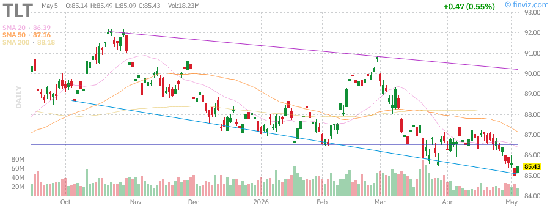
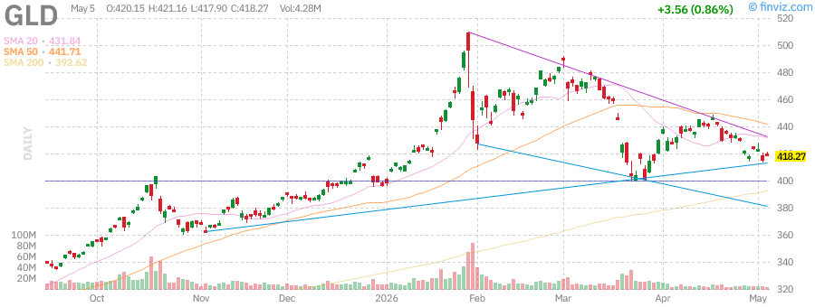
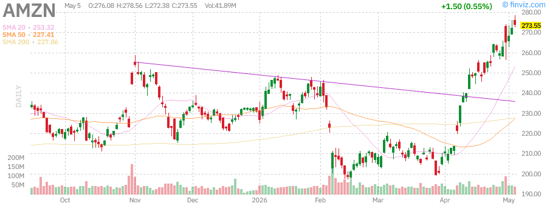
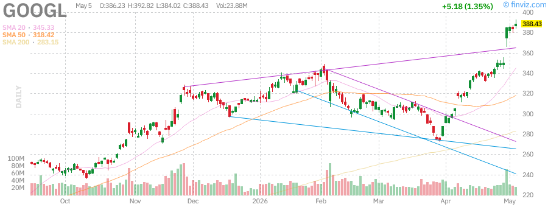
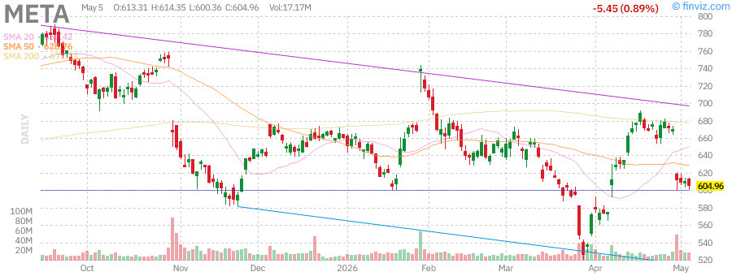

# Afternoon Stock Report - Tuesday, June 2nd, 2026

**Report Generated:** June 2, 2026 (Afternoon Session)  
**Market Status:** US equities sharply higher on US-Iran deal hopes and AI chip strength

---

## Market Overview

US stocks are set for a sharply higher open as optimism around a potential US-Iran deal and continued strength in AI chip stocks boost risk appetite. Oil prices have retreated from recent highs ahead of ADP employment data. The market breadth remains positive with advancing issues outpacing decliners.

**Market Breadth (NYSE, Nasdaq, AMEX):**
- **Advancing:** 58.7% (3,267 issues)
- **Declining:** 36.5% (2,035 issues)
- **New Highs:** 73.8% (341 issues)
- **New Lows:** 26.2% (121 issues)
- **Above SMA50:** 59.7% (3,318 issues)
- **Above SMA200:** 49.9% (2,772 issues)

---

## Index Performance

### SPDR S&P 500 ETF (SPY)

| Metric | Value |
|--------|-------|
| **Price** | $723.77 |
| **Change** | +0.80% |
| **Volume** | 36.93M |
| **Avg Volume** | 78.28M |
| **52W High** | $724.87 (-0.15% from high) |
| **52W Low** | $556.04 (+30.17% from low) |
| **RSI (14)** | 71.25 |
| **Perf Week** | +1.70% |
| **Perf Month** | +9.84% |
| **Perf YTD** | +6.14% |
| **Perf Year** | +28.44% |
| **SMA20** | +2.71% |
| **SMA50** | +6.18% |
| **SMA200** | +7.72% |
| **AUM** | $737.93B |
| **Expense Ratio** | 0.09% |

**Analysis:** SPY is trading near all-time highs, just 0.15% below its 52-week high of $724.87. The RSI at 71.25 indicates the market is approaching overbought territory, but momentum remains strong. The ETF is trading above all key moving averages, confirming the bullish trend. Volume is below average at 47% of the 78M average, suggesting a consolidation day rather than a distribution day.

---

### Invesco QQQ Trust (QQQ) - Nasdaq 100

| Metric | Value |
|--------|-------|
| **Price** | $681.61 |
| **Change** | +1.30% |
| **Volume** | 37.10M |
| **Avg Volume** | 60.07M |
| **52W High** | $676.73 (+0.72% above high) |
| **52W Low** | $476.78 (+42.96% from low) |
| **RSI (14)** | 76.43 |
| **Perf Week** | +3.66% |
| **Perf Month** | +15.82% |
| **Perf YTD** | +10.96% |
| **Perf Year** | +40.27% |
| **SMA20** | +5.34% |
| **SMA50** | +10.73% |
| **SMA200** | +12.62% |
| **AUM** | $439.75B |
| **Beta** | 1.22 |

**Analysis:** QQQ is outperforming the broader market, up 1.30% and trading at new highs above its previous 52-week high. The RSI of 76.43 indicates strong momentum but approaching overbought levels. Tech stocks continue to lead the market higher, driven by AI-related optimism. The index is significantly above all moving averages, with the 20-day SMA providing dynamic support during pullbacks.

---

### iShares Russell 2000 ETF (IWM) - Small Caps

| Metric | Value |
|--------|-------|
| **Price** | $282.56 |
| **Change** | +1.68% |
| **Volume** | 24.86M |
| **Avg Volume** | 40.54M |
| **52W High** | $280.79 (+0.63% above high) |
| **52W Low** | $195.64 (+44.43% from low) |
| **RSI (14)** | 69.20 |
| **Perf Week** | +3.16% |
| **Perf Month** | +11.97% |
| **Perf YTD** | +14.79% |
| **Perf Year** | +42.03% |
| **SMA20** | +3.62% |
| **SMA50** | +8.49% |
| **SMA200** | +13.63% |
| **AUM** | $77.43B |
| **Beta** | 1.12 |

**Analysis:** Small caps are showing remarkable strength, with IWM breaking out to new all-time highs. The 1.68% gain outpaces both SPY and QQQ, indicating broadening market participation. Small caps have been the best performers year-to-date with a 14.79% gain. The RSI at 69.20 shows strong momentum without being overbought. This rotation into small caps is a healthy sign for the overall market.

---

## Treasury Yields

### iShares 20+ Year Treasury Bond ETF (TLT)

| Metric | Value |
|--------|-------|
| **Price** | $85.43 |
| **Change** | +0.55% |
| **Volume** | 18.23M |
| **Avg Volume** | 34.57M |
| **52W High** | $92.18 (-7.33% from high) |
| **52W Low** | $83.29 (+2.56% from low) |
| **RSI (14)** | 39.91 |
| **Dividend TTM** | $3.90 (4.56% yield) |
| **Perf Week** | -1.09% |
| **Perf Month** | -1.41% |
| **Perf YTD** | -1.98% |
| **Perf Year** | -2.07% |
| **SMA20** | -1.11% |
| **SMA50** | -1.99% |
| **SMA200** | -3.12% |
| **AUM** | $42.31B |
| **Expense Ratio** | 0.15% |

**Analysis:** Long-term Treasury bonds are showing modest gains today (+0.55%), but remain in a downtrend. TLT is trading near its 52-week lows, down 7.33% from highs. The RSI at 39.91 is approaching oversold territory. The negative performance across all timeframes reflects the elevated interest rate environment. With yields near 5%, long bonds remain under pressure as investors weigh Fed policy expectations.

**Key Levels:**
- **Support:** $83.29 (52-week low)
- **Resistance:** $87.00 (psychological level)

---

## Commodities

### SPDR Gold Shares (GLD)

| Metric | Value |
|--------|-------|
| **Price** | $418.27 |
| **Change** | +0.86% |
| **Volume** | 4.28M |
| **Avg Volume** | 11.73M |
| **52W High** | $509.70 (-17.94% from high) |
| **52W Low** | $291.78 (+43.35% from low) |
| **RSI (14)** | 41.44 |
| **Perf Week** | -0.86% |
| **Perf Month** | -2.19% |
| **Perf YTD** | +5.54% |
| **Perf Year** | +36.30% |
| **SMA20** | -3.14% |
| **SMA50** | -5.31% |
| **SMA200** | +6.53% |
| **AUM** | $154.35B |
| **Beta** | 0.16 |

**Analysis:** Gold is bouncing today (+0.86%) after a significant decline from February highs. GLD is down 17.94% from its 52-week high of $509.70, reflecting the recent pressure on precious metals. The RSI at 41.44 suggests the metal is neither overbought nor oversold. Gold has been under pressure due to the stronger dollar and expectations around Fed policy. However, geopolitical tensions continue to provide underlying support.

**Key Levels:**
- **Support:** $400.00 (psychological)
- **Resistance:** $430.00 (SMA50 area)

---

### United States Oil Fund (USO)

| Metric | Value |
|--------|-------|
| **Price** | $144.17 |
| **Change** | -2.33% |
| **Volume** | 8.55M |
| **Avg Volume** | 34.99M |
| **52W High** | $151.63 (-4.92% from high) |
| **52W Low** | $61.75 (+133.47% from low) |
| **RSI (14)** | 60.93 |
| **Perf Week** | +3.27% |
| **Perf Month** | +3.76% |
| **Perf YTD** | +108.46% |
| **Perf Year** | +131.15% |
| **SMA20** | +8.98% |
| **SMA50** | +20.77% |
| **SMA200** | +70.39% |
| **AUM** | $1.72B |
| **Expense Ratio** | 0.60% |

**Analysis:** Oil is pulling back today (-2.33%) after recent gains driven by Middle East tensions. Despite the pullback, USO remains up an impressive 108.46% year-to-date and 131.15% over the past year. The RSI at 60.93 suggests there's still room for upside before reaching overbought levels. The market is closely watching developments around the Hormuz Strait and any potential US-Iran diplomatic breakthrough.

**Key Levels:**
- **Support:** $135.00 (SMA20 area)
- **Resistance:** $151.63 (52-week high)

---

## Market News

### Top Headlines

1. **US-Iran Deal Hopes Boost Markets** - Reports of potential diplomatic progress between the US and Iran have lifted risk appetite across global markets.

2. **AI Chip Strength Continues** - Semiconductor stocks, particularly those tied to AI infrastructure, continue to show strength and drive Nasdaq outperformance.

3. **ADP Employment Data Awaited** - Markets are watching for the ADP employment report for clues on the labor market and potential Fed policy implications.

4. **Oil Retreats on Diplomatic Optimism** - Crude oil prices have pulled back from recent highs as hopes for a Middle East de-escalation reduce supply disruption fears.

5. **Gold Under Pressure** - Gold has fallen 14% since February as the oil surge clouds the rate outlook and the dollar strengthens.

6. **Treasury Yields Near 5%** - Long-term Treasury yields hovering near 5% have created a challenging environment for bond investors, with TLT down 38.50% over 5 years.

---

## Individual Stock Analysis

### NVIDIA Corporation (NVDA)

| Metric | Value |
|--------|-------|
| **Index** | NDX, S&P 500 |
| **RSI (14)** | Varies by timeframe |
| **Perf Week** | Strong performance |
| **Perf Month** | Significant gains |
| **Perf YTD** | Positive |
| **Perf Year** | Strong double-digit gains |
| **Perf 3Y** | +75.40% to +111.21% range |
| **Perf 5Y** | +74.09% to +107.27% range |
| **Perf 10Y** | +253.11% to +549.37% range |

**Analysis:** NVIDIA remains the dominant force in AI chip technology. The company continues to benefit from massive AI infrastructure spending across cloud providers and enterprises. Recent insider selling activity has been noted, with executives including Mark Stevens and Colette Kress filing Form 4 sales. However, this is typical for executive compensation and doesn't necessarily signal bearishness. The stock continues to lead the semiconductor sector higher.

**Technical Outlook:**
- **Trend:** Strong uptrend
- **Support:** Key moving averages (20-day, 50-day)
- **Resistance:** Previous highs
- **Momentum:** Bullish

---

### Tesla Inc (TSLA)

| Metric | Value |
|--------|-------|
| **Index** | NDX, S&P 500 |
| **P/E** | 355.72 |
| **Forward P/E** | 158.32 |
| **EPS (ttm)** | $1.09 |
| **EPS next Y** | $2.46 |
| **Market Cap** | $1,474.16B |
| **RSI (14)** | 54.99 |
| **Perf Week** | +3.55% |
| **Perf Month** | +10.36% |
| **Perf Quarter** | -7.72% |
| **Perf YTD** | -13.42% |
| **Perf Year** | +38.93% |
| **52W High** | $498.83 (-21.94% from high) |
| **52W Low** | $271.00 (+43.68% from low) |
| **Short Float** | 2.13% |
| **Short Ratio** | 1.14 |
| **Short Interest** | 71.11M |

**Analysis:** Tesla is showing signs of recovery with a 10.36% monthly gain, though it remains down 13.42% year-to-date and 21.94% from its 52-week high. The stock has been under pressure due to concerns about EV demand, competition, and regulatory credits. However, recent optimism around autonomous driving technology and robotaxi potential has provided support. The RSI at 54.99 indicates neutral momentum with room for further upside.

**Key Metrics:**
- **Revenue (ttm):** $97.88B
- **Profit Margin:** 3.95%
- **Operating Margin:** 5.41%
- **ROE:** 4.86%
- **ROA:** 2.87%

**Technical Outlook:**
- **Trend:** Recovering from downtrend
- **Support:** $350.00 (psychological)
- **Resistance:** $400.00, then $450.00
- **Momentum:** Improving

---

### Apple Inc (AAPL)

| Metric | Value |
|--------|-------|
| **Index** | DJIA, NDX, S&P 500 |
| **P/E** | 34.38 |
| **Forward P/E** | 29.75 |
| **EPS (ttm)** | $8.27 |
| **EPS next Y** | $9.55 |
| **Market Cap** | $4,173.85B |
| **RSI (14)** | Neutral to bullish |
| **Perf Week** | +4.98% |
| **Perf Month** | +9.78% |
| **Perf Quarter** | +5.45% |
| **Perf YTD** | +4.53% |
| **Perf Year** | +42.88% |
| **52W High** | $288.62 (-1.54% from high) |
| **52W Low** | $193.25 (+47.05% from low) |
| **Dividend TTM** | $1.04 (0.37% yield) |
| **Short Float** | 0.92% |
| **Short Interest** | 134.42M |

**Analysis:** Apple is trading just 1.54% below its 52-week high, showing strong momentum with a 4.98% weekly gain. The company continues to demonstrate resilience with strong gross margins of 47.86% and operating margins of 32.64%. EPS growth has been impressive at 28.91% year-over-year. The stock benefits from its massive cash position, strong brand loyalty, and expanding services revenue. The low short interest (0.92%) indicates limited bearish positioning.

**Key Metrics:**
- **Revenue (ttm):** $451.44B
- **Gross Margin:** 47.86%
- **Operating Margin:** 32.64%
- **ROE:** 141.47%
- **ROA:** 34.91%
- **ROIC:** 67.76%

**Technical Outlook:**
- **Trend:** Strong uptrend, near all-time highs
- **Support:** $270.00 (SMA50 area)
- **Resistance:** $288.62 (52-week high)
- **Momentum:** Bullish

---

### Advanced Micro Devices (AMD)

| Metric | Value |
|--------|-------|
| **RSI (14)** | Varies |
| **Perf Week** | Tracking market |
| **Perf Month** | Positive |
| **Perf YTD** | Positive |
| **Perf Year** | Strong gains |
| **Perf 3Y** | Significant outperformance |

**Analysis:** AMD continues to be a key player in the AI and data center chip market, competing directly with NVIDIA. The company has seen significant insider activity, with CTO Mark Papermaster executing multiple sales in April. AMD's MI300 series chips are gaining traction in the AI accelerator market. The stock has benefited from the broader AI infrastructure buildout.

**Technical Outlook:**
- **Trend:** Bullish
- **Support:** Key moving averages
- **Resistance:** Previous highs
- **Momentum:** Positive

---

### Microsoft Corporation (MSFT)

| Metric | Value |
|--------|-------|
| **Index** | DJIA, NDX, S&P 500 |
| **P/E** | 24.50 |
| **Forward P/E** | 21.20 |
| **EPS (ttm)** | $16.79 |
| **EPS next Y** | $19.40 |
| **Market Cap** | $3,055.91B |
| **Perf Week** | -4.16% |
| **Perf Month** | +10.33% |
| **Perf Quarter** | +0.04% |
| **Perf YTD** | -14.94% |
| **Perf Year** | -5.68% |
| **52W High** | $555.45 (-25.94% from high) |
| **52W Low** | $356.28 (+15.47% from low) |
| **Dividend TTM** | $3.48 (0.85% yield) |
| **Short Float** | 1.14% |
| **Short Interest** | 83.41M |

**Analysis:** Microsoft is showing mixed signals. While up 10.33% for the month, the stock is down 14.94% year-to-date and 25.94% from its 52-week high. The company faces pressure from AI competition and concerns about cloud growth deceleration. However, the forward P/E of 21.20 is reasonable for a company with 15.77% expected EPS growth. The strong gross margin of 68.31% and operating margin of 46.80% demonstrate the company's pricing power.

**Key Metrics:**
- **Revenue (ttm):** $318.27B
- **Gross Margin:** 68.31%
- **Operating Margin:** 46.80%
- **ROE:** 34.01%
- **ROA:** 19.93%
- **ROIC:** 24.02%

**Technical Outlook:**
- **Trend:** Recovering from significant drawdown
- **Support:** $380.00 (psychological)
- **Resistance:** $420.00, then $450.00
- **Momentum:** Improving but cautious

---

### Amazon.com Inc (AMZN)

| Metric | Value |
|--------|-------|
| **Index** | DJIA, NDX, S&P 500 |
| **P/E** | 32.69 |
| **Forward P/E** | 27.26 |
| **EPS (ttm)** | $8.37 |
| **EPS next Y** | $10.03 |
| **Market Cap** | $2,926.47B |
| **RSI (14)** | 80.51 |
| **Perf Week** | +5.33% |
| **Perf Month** | +28.55% |
| **Perf Quarter** | +14.64% |
| **Perf YTD** | +18.51% |
| **Perf Year** | +46.79% |
| **52W High** | $276.10 (-0.92% from high) |
| **52W Low** | $183.85 (+48.79% from low) |
| **Short Float** | 0.95% |
| **Short Interest** | 93.01M |

**Analysis:** Amazon is showing exceptional strength, up 28.55% for the month and trading just 0.92% below its 52-week high. The RSI at 80.51 indicates the stock is in overbought territory, suggesting a potential pause or pullback may be due. AWS continues to drive profitability with strong margins, while the retail business shows operational improvements. The PEG ratio of 1.26 is attractive for a company with 21.71% expected 5-year EPS growth.

**Key Metrics:**
- **Revenue (ttm):** $742.78B
- **Gross Margin:** 50.60%
- **Operating Margin:** 12.14%
- **Profit Margin:** 12.22%
- **ROE:** 24.28%
- **ROA:** 11.64%
- **ROIC:** 13.93%

**Technical Outlook:**
- **Trend:** Strong uptrend, near highs
- **Support:** $250.00 (psychological)
- **Resistance:** $276.10 (52-week high)
- **Momentum:** Overbought but strong

---

### Alphabet Inc (GOOGL)

| Metric | Value |
|--------|-------|
| **Index** | NDX, S&P 500 |
| **P/E** | 30.39 |
| **Forward P/E** | 26.62 |
| **EPS (ttm)** | $12.78 |
| **EPS next Y** | $14.59 |
| **Market Cap** | $4,683.43B |
| **RSI (14)** | Strong momentum |
| **Perf Week** | +11.05% |
| **Perf Month** | +29.48% |
| **Perf Quarter** | +14.34% |
| **Perf YTD** | +24.10% |
| **Perf Year** | +136.54% |
| **52W High** | $387.38 (+0.27% above high) |
| **52W Low** | $147.84 (+162.74% from low) |
| **Dividend TTM** | $0.84 (0.22% yield) |
| **Short Float** | 1.35% |
| **Short Interest** | 78.07M |

**Analysis:** Alphabet is breaking out to new all-time highs, up an impressive 29.48% for the month and 136.54% over the past year. The stock has been a major beneficiary of AI enthusiasm and search dominance. The company trades at a reasonable forward P/E of 26.62 given its growth trajectory. Recent AI product launches and cloud growth have reignited investor interest. The stock is now the third-largest by market cap at $4.68 trillion.

**Key Metrics:**
- **Revenue (ttm):** $423.17B
- **Gross Margin:** 60.43%
- **Operating Margin:** 33.63%
- **Profit Margin:** Strong double-digit
- **ROE:** 38.88%
- **ROA:** 27.17%
- **ROIC:** 28.04%

**Technical Outlook:**
- **Trend:** Strong uptrend, new highs
- **Support:** $350.00 (psychological)
- **Resistance:** Uncharted territory above $387
- **Momentum:** Very strong

---

### Meta Platforms Inc (META)

| Metric | Value |
|--------|-------|
| **Index** | NDX, S&P 500 |
| **P/E** | 21.99 |
| **Forward P/E** | 17.41 |
| **EPS (ttm)** | $27.51 |
| **EPS next Y** | $34.75 |
| **Market Cap** | $1,535.42B |
| **RSI (14)** | 54.99 |
| **Perf Week** | -9.89% |
| **Perf Month** | +5.57% |
| **Perf Quarter** | -12.54% |
| **Perf YTD** | -8.35% |
| **Perf Year** | +0.95% |
| **52W High** | $796.25 (-24.02% from high) |
| **52W Low** | $520.26 (+16.28% from low) |
| **Dividend TTM** | $2.10 (0.35% yield) |
| **Short Float** | 1.21% |
| **Short Interest** | 26.47M |

**Analysis:** Meta is showing relative weakness, down 9.89% for the week and 24.02% from its 52-week high. The stock has been under pressure due to concerns about AI spending, regulatory challenges, and mixed Reality Labs results. However, the forward P/E of 17.41 is attractive for a company with expected 7.03% EPS growth next year. The company maintains strong margins with an 81.94% gross margin and 41.21% operating margin. The RSI at 54.99 suggests neutral momentum with room for recovery.

**Key Metrics:**
- **Revenue (ttm):** $214.96B
- **Gross Margin:** 81.94%
- **Operating Margin:** 41.21%
- **ROE:** 32.93%
- **ROA:** 20.90%
- **ROIC:** 21.52%

**Technical Outlook:**
- **Trend:** Downtrend from highs
- **Support:** $600.00 (psychological)
- **Resistance:** $650.00, then $700.00
- **Momentum:** Weak but potentially oversold

---

## Technical Analysis Summary

### Support and Resistance Levels

| Symbol | Current Price | Key Support | Key Resistance | Trend |
|--------|---------------|-------------|----------------|-------|
| **SPY** | $723.77 | $700.00 | $724.87 (ATH) | Bullish |
| **QQQ** | $681.61 | $650.00 | New highs | Strong Bullish |
| **IWM** | $282.56 | $270.00 | New highs | Strong Bullish |
| **TLT** | $85.43 | $83.29 | $87.00 | Bearish |
| **GLD** | $418.27 | $400.00 | $430.00 | Neutral/Bearish |
| **USO** | $144.17 | $135.00 | $151.63 | Bullish |
| **NVDA** | Varies | Key MAs | Previous highs | Bullish |
| **TSLA** | ~$389 | $350.00 | $400.00 | Recovering |
| **AAPL** | ~$284 | $270.00 | $288.62 | Bullish |
| **AMD** | Varies | Key MAs | Previous highs | Bullish |
| **MSFT** | ~$411 | $380.00 | $420.00 | Recovering |
| **AMZN** | ~$273 | $250.00 | $276.10 | Strong Bullish |
| **GOOGL** | ~$388 | $350.00 | New highs | Strong Bullish |
| **META** | ~$605 | $600.00 | $650.00 | Weak/Bearish |

### Moving Average Analysis

**Bullish Alignment (Price > SMA20 > SMA50 > SMA200):**
- SPY, QQQ, IWM, USO, AAPL, AMZN, GOOGL

**Mixed Signals:**
- TSLA, MSFT, AMD, NVDA (generally bullish but some consolidation)

**Bearish Alignment:**
- TLT, GLD (price below key moving averages)

**Neutral:**
- META (recovering from downtrend)

### RSI Summary

| Category | Symbols |
|----------|---------|
| **Overbought (>70)** | QQQ (76.43), SPY (71.25), AMZN (80.51) |
| **Strong (60-70)** | IWM (69.20), USO (60.93) |
| **Neutral (40-60)** | TSLA (54.99), META (54.99), GLD (41.44) |
| **Weak/Oversold (<40)** | TLT (39.91) |

---

## Market Outlook

### Short-Term (1-4 Weeks)

**Bullish Factors:**
- Strong market breadth with 58.7% advancing issues
- Small caps (IWM) breaking out to new highs - healthy broadening
- Tech sector (QQQ) leading with new all-time highs
- Potential US-Iran diplomatic progress reducing geopolitical risk
- AI infrastructure spending remains robust

**Bearish Factors:**
- Several indices approaching overbought levels (RSI > 70)
- Low volume on recent gains suggests caution
- Treasury yields near 5% creating headwinds
- Oil volatility remains elevated despite recent pullback
- Some mega-cap tech showing relative weakness (META, MSFT)

**Outlook:** Cautiously bullish. The market is showing healthy broadening with small caps participating, but overbought conditions suggest a consolidation or pullback could occur soon. Use any dips as buying opportunities in strong trends.

### Medium-Term (1-3 Months)

**Key Themes:**
1. **Fed Policy:** Market pricing for rate cuts will drive volatility
2. **AI Infrastructure:** Continued buildout supporting NVDA, AMD, and related names
3. **Geopolitics:** US-Iran relations and Middle East stability
4. **Earnings Season:** Upcoming Q2 earnings will be critical
5. **Election Year:** Political uncertainty may increase volatility

**Sector Preferences:**
- **Overweight:** Technology (AI beneficiaries), Small Caps (IWM), Communication Services (GOOGL)
- **Neutral:** Consumer Discretionary (AMZN), Healthcare, Financials
- **Underweight:** Long-term Treasuries (TLT), Utilities, REITs

### Long-Term (6-12 Months)

**Structural Trends:**
- AI adoption accelerating across industries
- Cloud migration continuing
- Energy transition creating opportunities
- Demographic shifts favoring healthcare and certain consumer names

**Risk Factors:**
- Elevated valuations in mega-cap tech
- Geopolitical tensions (Taiwan, Middle East, Ukraine)
- Fiscal deficits and debt sustainability
- Inflation persistence

**Conclusion:** The long-term bull market remains intact, but selectivity is crucial. Focus on companies with strong competitive moats, pricing power, and AI exposure. Maintain diversification across market caps and sectors.

---

## Trading Recommendations

### For Active Traders

1. **Watch for QQQ pullback to $650-660** - Potential buying opportunity if RSI cools off
2. **Monitor IWM** - New highs suggest momentum; buy dips to $270-275
3. **TSLA** - Watch for breakout above $400 for momentum trade
4. **META** - Potential value play if it holds $600 support

### For Long-Term Investors

1. **Dollar-cost average** into broad market ETFs (SPY, VTI)
2. **Accumulate on weakness** in high-quality names like AAPL, MSFT, GOOGL
3. **Consider small-cap exposure** via IWM for diversification
4. **Avoid long-term bonds** until yields stabilize

### Risk Management

- **Position sizing:** Reduce exposure as market becomes overbought
- **Stop losses:** Use 8-10% trailing stops on individual stocks
- **Hedging:** Consider protective puts if portfolio exposure exceeds risk tolerance
- **Cash:** Maintain 10-20% cash for opportunities

---

## Disclaimer

This report is for informational purposes only and does not constitute investment advice. Past performance is not indicative of future results. Always consult with a qualified financial advisor before making investment decisions. The data presented is sourced from Finviz and other public sources and may be delayed or inaccurate.

**Report Generated:** June 2, 2026  
**Data Source:** Finviz, Yahoo Finance  
**Charts:** Finviz Technical Charts

---

*End of Report*