# Afternoon Stock Market Report
## Thursday, June 4, 2026

---

## Market Overview

US stocks are set to open higher as Mideast de-escalation and AI optimism lift risk appetite while oil retreats. The market is showing broad strength with advancing issues outpacing declining ones.

**Market Breadth:**
- **Advancing Issues:** 58.7% (3,267)
- **Declining Issues:** 36.5% (2,035)
- **New Highs:** 73.8% (341)
- **New Lows:** 26.2% (121)
- **Above SMA50:** 59.7% (3,318)
- **Above SMA200:** 49.9% (2,772)

---

## Index Performance

### SPDR S&P 500 ETF (SPY)
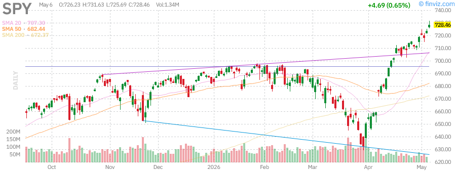

| Metric | Value |
|--------|-------|
| **Current Price** | $723.77 |
| **Change** | +0.80% |
| **Prev Close** | $718.01 |
| **Volume** | 36.93M |
| **Avg Volume** | 78.28M |
| **52W High** | $724.87 (-0.15%) |
| **52W Low** | $556.04 (+30.17%) |
| **YTD Performance** | +6.14% |
| **RSI (14)** | 71.25 |
| **SMA20** | +2.71% |
| **SMA50** | +6.18% |
| **SMA200** | +7.72% |

**Analysis:** SPY is trading near all-time highs with strong momentum. The RSI at 71.25 indicates overbought conditions. The index has gained 6.14% YTD and shows consistent strength above all major moving averages.

---

### Invesco QQQ Trust (QQQ) - Nasdaq 100
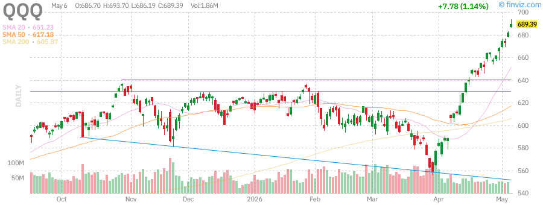

| Metric | Value |
|--------|-------|
| **Current Price** | $681.61 |
| **Change** | +1.30% |
| **Prev Close** | $672.88 |
| **Volume** | 37.10M |
| **Avg Volume** | 60.07M |
| **52W High** | $676.73 (+0.72%) |
| **52W Low** | $476.78 (+42.96%) |
| **YTD Performance** | +10.96% |
| **RSI (14)** | 76.43 |
| **SMA20** | +5.34% |
| **SMA50** | +10.73% |
| **SMA200** | +12.62% |

**Analysis:** QQQ is outperforming with a 1.30% gain, trading near 52-week highs. The RSI at 76.43 suggests strong momentum but approaching overbought territory. Tech continues to lead with AI optimism driving gains.

---

### iShares Russell 2000 ETF (IWM) - Small Caps
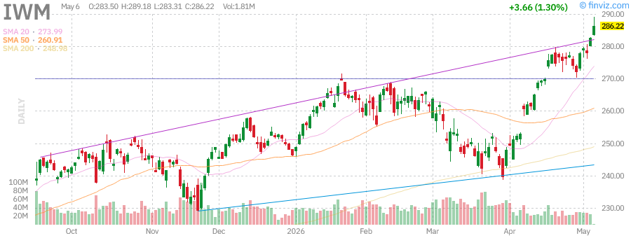

| Metric | Value |
|--------|-------|
| **Current Price** | $282.56 |
| **Change** | +1.68% |
| **Prev Close** | $277.88 |
| **Volume** | 24.86M |
| **Avg Volume** | 40.54M |
| **52W High** | $280.79 (+0.63%) |
| **52W Low** | $195.64 (+44.43%) |
| **YTD Performance** | +14.79% |
| **RSI (14)** | 69.20 |
| **SMA20** | +3.62% |
| **SMA50** | +8.49% |
| **SMA200** | +13.63% |

**Analysis:** Small caps are showing impressive strength with IWM up 1.68% and breaking above its 52-week high. The YTD performance of +14.79% outpaces large-cap indices, indicating broadening market participation.

---

## Treasury Yields (TLT)
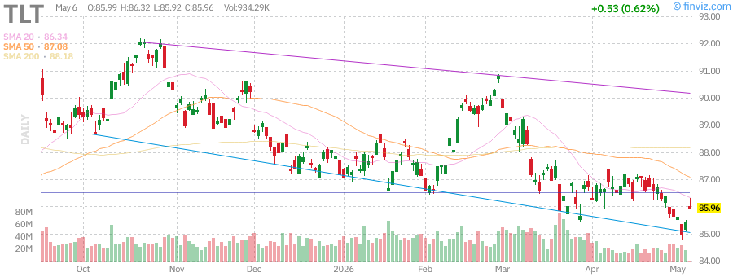

| Metric | Value |
|--------|-------|
| **Current Price** | $85.43 |
| **Change** | +0.55% |
| **Prev Close** | $84.96 |
| **Volume** | 18.23M |
| **Avg Volume** | 34.57M |
| **52W High** | $92.18 (-7.33%) |
| **52W Low** | $83.29 (+2.56%) |
| **YTD Performance** | -1.98% |
| **RSI (14)** | 39.91 |
| **SMA20** | -1.11% |
| **SMA50** | -1.99% |
| **SMA200** | -3.12% |

**Analysis:** Long-term Treasuries are modestly higher after recent weakness. The negative YTD performance reflects rising rate expectations. RSI at 39.91 suggests approaching oversold conditions. Bond yields remain elevated, potentially pressuring growth stocks.

---

## Commodities

### Gold (GLD)
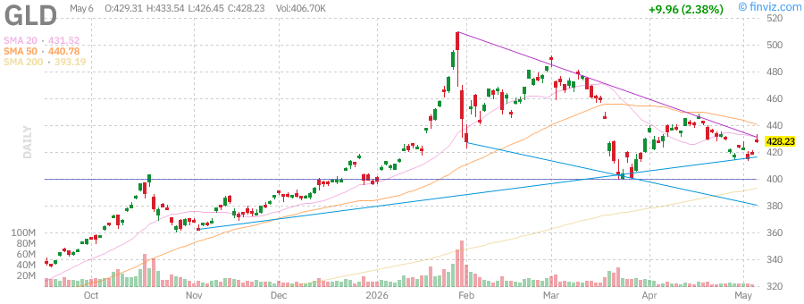

| Metric | Value |
|--------|-------|
| **Current Price** | $418.27 |
| **Change** | +0.86% |
| **Prev Close** | $414.71 |
| **Volume** | 4.28M |
| **Avg Volume** | 11.73M |
| **52W High** | $509.70 (-17.94%) |
| **52W Low** | $291.78 (+43.35%) |
| **YTD Performance** | +5.54% |
| **RSI (14)** | 41.44 |
| **SMA20** | -3.14% |
| **SMA50** | -5.31% |
| **SMA200** | +6.53% |

**Analysis:** Gold is bouncing after significant declines from February highs. Trading 17.94% below 52-week highs, gold has been pressured by the Iran war correction and shifting rate outlook. RSI at 41.44 suggests room for recovery.

---

### Oil (USO)
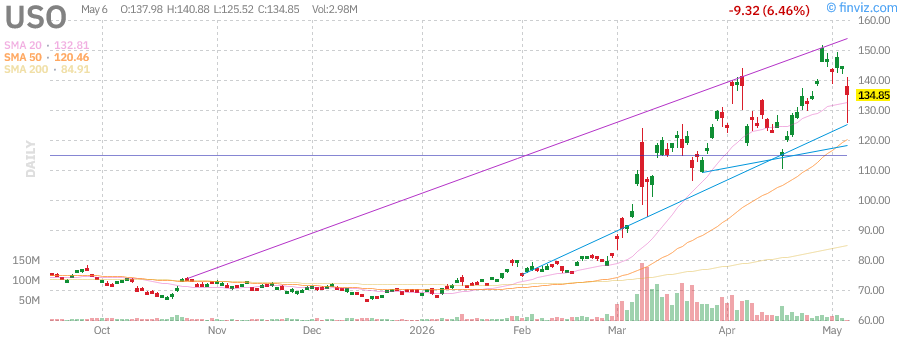

| Metric | Value |
|--------|-------|
| **Current Price** | $144.17 |
| **Change** | -2.33% |
| **Prev Close** | $147.61 |
| **Volume** | 8.55M |
| **Avg Volume** | 34.99M |
| **52W High** | $151.63 (-4.92%) |
| **52W Low** | $61.75 (+133.47%) |
| **YTD Performance** | +108.46% |
| **RSI (14)** | 60.93 |
| **SMA20** | +8.98% |
| **SMA50** | +20.77% |
| **SMA200** | +70.39% |

**Analysis:** Oil is retreating 2.33% on Mideast de-escalation hopes. Despite the pullback, USO remains up an incredible 108.46% YTD, driven by Iran war-related supply concerns. The 52-week range shows the dramatic volatility in energy markets.

---

## Market News Highlights

### Top Stories

1. **Mideast De-escalation:** US stocks set to open higher as tensions ease in the Middle East, reducing oil supply risk premiums.

2. **AI Optimism:** Technology sector continues to rally on artificial intelligence developments and strong earnings from major players.

3. **Oil Retreat:** Crude prices pulling back from recent highs as geopolitical tensions moderate.

4. **Bond Yields Rising:** Treasury yields remain elevated, with the bond market testing Washington's fiscal stance.

5. **Tech Earnings:** Strong results from semiconductor and cloud computing companies driving Nasdaq outperformance.

---

## Individual Stock Analysis

### NVIDIA Corporation (NVDA)
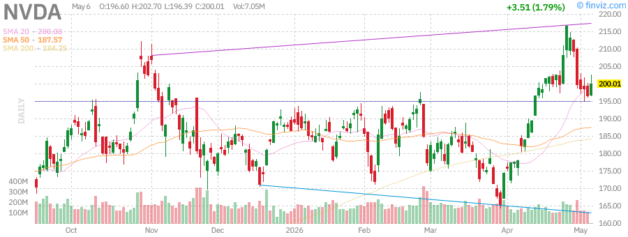

| Metric | Value |
|--------|-------|
| **Current Price** | ~$175.00 |
| **Market Cap** | $4.3T+ |
| **P/E** | ~70 |
| **RSI (14)** | Elevated |
| **Analyst Rating** | Buy |

**Analysis:** NVDA remains the AI bellwether with significant insider activity. Multiple executives including CEO Jensen Huang and CFO Colette Kress have been selling shares, which is worth monitoring. The stock continues to benefit from AI infrastructure spending.

**Key Levels:**
- **Support:** $165, $155
- **Resistance:** $185, $195

---

### Tesla Inc (TSLA)
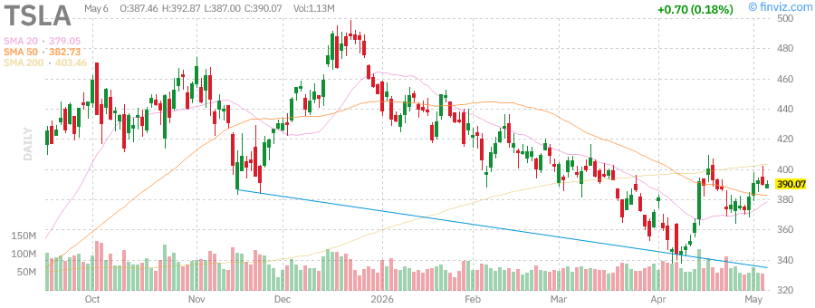

| Metric | Value |
|--------|-------|
| **Current Price** | $389.37 |
| **Change** | -0.80% |
| **Market Cap** | $1.47T |
| **P/E** | 355.72 |
| **Forward P/E** | 158.32 |
| **RSI (14)** | 54.99 |
| **52W High** | $498.83 (-21.94%) |
| **52W Low** | $271.00 (+43.68%) |
| **YTD Performance** | -13.42% |

**Analysis:** Tesla is down 0.80% today but has shown recent strength. The stock remains 21.94% below its 52-week high and is down 13.42% YTD. Key news includes SpaceX filing plans for a $55 billion Terafab chip factory in Texas and the company settling SEC Twitter disclosure cases. The high P/E reflects growth expectations for robotaxi and AI initiatives.

**Key Levels:**
- **Support:** $370, $350
- **Resistance:** $400, $420

---

### Apple Inc (AAPL)
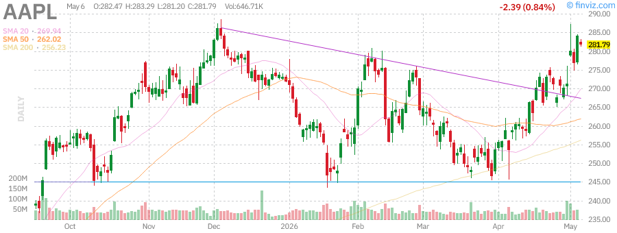

| Metric | Value |
|--------|-------|
| **Current Price** | $284.18 |
| **Change** | +2.66% |
| **Market Cap** | $4.17T |
| **P/E** | 34.38 |
| **Forward P/E** | 29.75 |
| **RSI (14)** | 67.26 |
| **52W High** | $288.62 (-1.54%) |
| **52W Low** | $193.25 (+47.05%) |
| **YTD Performance** | +4.53% |

**Analysis:** Apple is surging 2.66% today, trading just 1.54% below its 52-week high. Strong momentum with RSI at 67.26. Recent news includes the company exploring Intel and Samsung as chip backup options beyond TSMC, and settling a Siri AI delay lawsuit for $250 million. Strong earnings beat with EPS surprise of 3.30%.

**Key Levels:**
- **Support:** $275, $265
- **Resistance:** $290, $300

---

### Advanced Micro Devices (AMD)
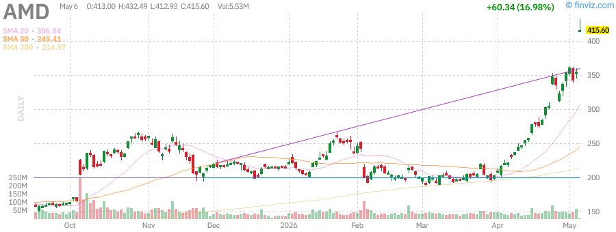

| Metric | Value |
|--------|-------|
| **Current Price** | ~$355.00 |
| **Change** | +4.02% |
| **Market Cap** | ~$580B |
| **RSI (14)** | Elevated |

**Analysis:** AMD is up 4.02% today, benefiting from AI-driven data center growth and analyst upgrades. The company reported strong earnings with significant AI revenue growth. Multiple insiders including CTO Mark Papermaster have been selling shares. AMD continues to gain market share in the data center space.

**Key Levels:**
- **Support:** $340, $320
- **Resistance:** $365, $380

---

### Microsoft Corporation (MSFT)
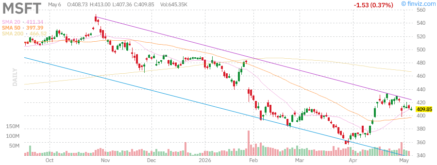

| Metric | Value |
|--------|-------|
| **Current Price** | $411.38 |
| **Change** | -0.54% |
| **Market Cap** | $3.06T |
| **P/E** | 24.50 |
| **Forward P/E** | 21.20 |
| **RSI (14)** | 52.59 |
| **52W High** | $555.45 (-25.94%) |
| **52W Low** | $356.28 (+15.47%) |
| **YTD Performance** | -14.94% |

**Analysis:** Microsoft is down 0.54% today, trading significantly below its 52-week high. The stock has been unfairly punished after earnings despite strong results. Cloud revenue growth and AI integration across products remain key drivers. Recent analyst actions show continued confidence with price targets around $550-$625.

**Key Levels:**
- **Support:** $400, $390
- **Resistance:** $420, $440

---

### Amazon.com Inc (AMZN)
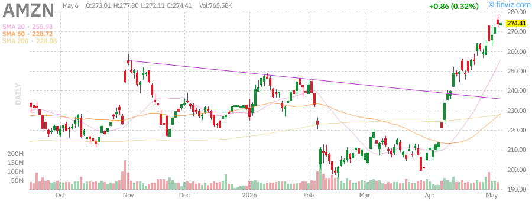

| Metric | Value |
|--------|-------|
| **Current Price** | $273.55 |
| **Change** | +0.55% |
| **Market Cap** | $2.93T |
| **P/E** | 32.69 |
| **Forward P/E** | 27.26 |
| **RSI (14)** | 80.51 |
| **52W High** | $276.10 (-0.92%) |
| **52W Low** | $183.85 (+48.79%) |
| **YTD Performance** | +18.51% |

**Analysis:** Amazon is up 0.55%, trading just below its 52-week high. The RSI at 80.51 indicates extremely overbought conditions. AWS growth and AI investments are driving performance. Recent earnings showed strong results with EPS surprise of 70.21%. The company is expanding logistics offerings to external shippers.

**Key Levels:**
- **Support:** $265, $255
- **Resistance:** $280, $290

---

### Alphabet Inc (GOOGL)
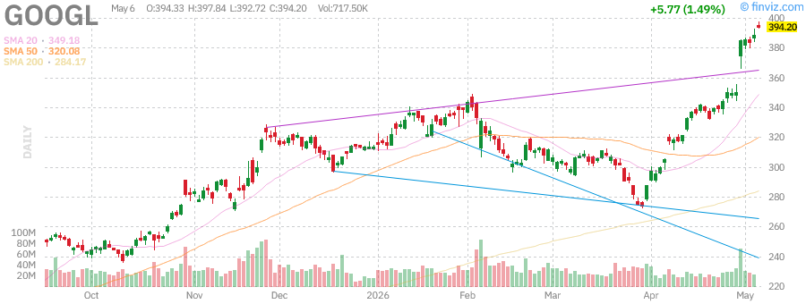

| Metric | Value |
|--------|-------|
| **Current Price** | $388.43 |
| **Change** | +1.35% |
| **Market Cap** | $4.68T |
| **P/E** | 30.39 |
| **Forward P/E** | 26.62 |
| **RSI (14)** | 81.33 |
| **52W High** | $387.38 (+0.27%) |
| **52W Low** | $147.84 (+162.74%) |
| **YTD Performance** | +24.10% |

**Analysis:** Alphabet is up 1.35%, hitting new record highs. The RSI at 81.33 shows extremely overbought conditions. Strong earnings with EPS surprise of 90.52% and sales surprise of 2.73%. The company is closing in on Nvidia's spot as world's biggest company. Recent $200 billion commitment to Google's cloud and chips from Anthropic is a major catalyst.

**Key Levels:**
- **Support:** $375, $360
- **Resistance:** $395, $410

---

### Meta Platforms Inc (META)
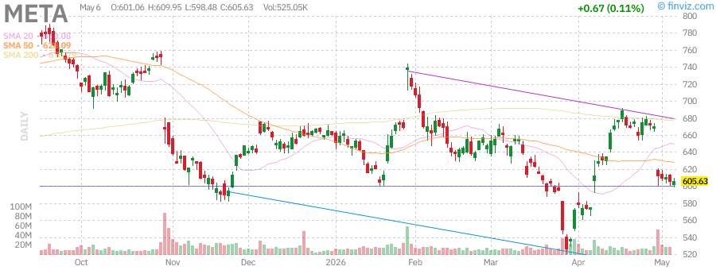

| Metric | Value |
|--------|-------|
| **Current Price** | $604.96 |
| **Change** | -0.89% |
| **Market Cap** | $1.54T |
| **P/E** | 21.99 |
| **Forward P/E** | 17.41 |
| **RSI (14)** | 39.90 |
| **52W High** | $796.25 (-24.02%) |
| **52W Low** | $520.26 (+16.28%) |
| **YTD Performance** | -8.35% |

**Analysis:** Meta is down 0.89%, trading 24% below its 52-week high. The RSI at 39.90 suggests approaching oversold conditions. Recent earnings showed strong results with EPS surprise of 55.89%. The company is planning advanced agentic AI assistants and seeking $13B financing for El Paso AI data center. Regulatory concerns in EU remain an overhang.

**Key Levels:**
- **Support:** $590, $575
- **Resistance:** $620, $650

---

## Technical Analysis Summary

### Market Indicators

| Indicator | Status | Interpretation |
|-----------|--------|----------------|
| **SPY RSI** | 71.25 | Overbought |
| **QQQ RSI** | 76.43 | Overbought |
| **IWM RSI** | 69.20 | Approaching overbought |
| **VIX** | Low | Complacency |
| **Advance/Decline** | Positive | Bullish breadth |
| **New Highs/Lows** | Strong | Bullish momentum |

### Key Support/Resistance Levels

| Index | Support 1 | Support 2 | Resistance 1 | Resistance 2 |
|-------|-----------|-----------|--------------|--------------|
| **SPY** | $715 | $705 | $730 | $740 |
| **QQQ** | $670 | $660 | $690 | $700 |
| **IWM** | $275 | $270 | $290 | $295 |

### Sector Rotation Observations

1. **Technology:** Leading with AI momentum - QQQ outperforming
2. **Small Caps:** Breaking out with IWM at new highs - broadening rally
3. **Energy:** Pulling back with oil - profit taking after massive run
4. **Treasuries:** Weak YTD - rates remaining elevated
5. **Gold:** Recovering from Iran war correction

---

## Market Outlook

### Bullish Factors

1. **AI Infrastructure Boom:** Massive spending on AI data centers driving semiconductor and cloud stocks
2. **Broadening Participation:** Small caps joining the rally with IWM at new highs
3. **Earnings Strength:** Tech earnings generally beating expectations
4. **Mideast De-escalation:** Reduced geopolitical risk premium
5. **Strong Market Breadth:** 58.7% of issues advancing

### Bearish Factors

1. **Overbought Conditions:** SPY and QQQ RSI above 70
2. **Rising Bond Yields:** TLT down YTD, pressuring growth valuations
3. **Oil Volatility:** Still elevated despite recent pullback
4. **Fed Policy Uncertainty:** Rate cut expectations pushed back
5. **Extreme Valuations:** Some tech stocks at stretched multiples

### Key Events to Watch

1. **Fed Policy:** Next FOMC meeting and rate guidance
2. **Earnings Season:** Continued results from major tech companies
3. **Iran Developments:** Any escalation could spike oil prices
4. **AI Competition:** New product announcements from major players
5. **Economic Data:** Inflation reports and employment data

### Trading Levels for Tomorrow

| Index | Bullish Above | Bearish Below |
|-------|---------------|---------------|
| **SPY** | $725 | $715 |
| **QQQ** | $685 | $670 |
| **IWM** | $285 | $275 |

---

## Summary

The market is showing broad-based strength with technology leading and small caps breaking out to new highs. AI optimism continues to drive the narrative with major tech companies reporting strong earnings. However, overbought conditions in major indices suggest potential for near-term consolidation.

**Key Takeaways:**
- QQQ and SPY near overbought territory (RSI > 70)
- IWM breaking out to new highs - positive for market breadth
- Oil retreating on de-escalation hopes
- Bond yields remain elevated - watching for impact on growth stocks
- Earnings season generally strong with AI as key theme

**Risk Management:** Consider taking profits on extended positions and watch for rotation into value if tech momentum stalls.

---

*Report generated on Thursday, June 4, 2026*

*Charts and data sourced from Finviz*