# 📊 Comprehensive Afternoon Stock Market Report
## Saturday, June 6, 2026

---

## Executive Summary

The U.S. stock market enters the weekend of June 6, 2026, following a week characterized by significant geopolitical developments and strong corporate earnings momentum. Key highlights include:

- **Major indices** showing resilience with tech stocks leading the charge
- **AMD's stellar earnings** sparking an AI-driven rally across semiconductor stocks
- **Geopolitical optimism** as reports indicate progress toward a U.S.-Iran peace framework
- **Energy sector volatility** with oil prices declining on Middle East peace hopes
- **Treasury yields** stabilizing as inflation concerns moderate

**Market Sentiment:** Cautiously Optimistic | **Risk Level:** Moderate | **Recommended Action:** Selective Accumulation

---

## Market Overview & Breadth Analysis

### Current Market Environment

The broader market has demonstrated remarkable resilience in early June 2026, with technology stocks continuing to drive gains. The S&P 500 and Nasdaq Composite have benefited from strong earnings reports, particularly from the semiconductor sector, while small-cap stocks (represented by IWM) have shown mixed performance amid ongoing economic uncertainty.

### Market Breadth Indicators

| Indicator | Status | Analysis |
|-----------|--------|----------|
| Advance/Decline Ratio | Neutral | Mixed sector performance |
| New Highs vs New Lows | Positive | Tech sector leading |
| Volume Trends | Above Average | Elevated on earnings announcements |
| VIX Level | Moderate | Risk appetite remains intact |

**Key Observations:**
- Technology sector continues to outperform broader market
- Defensive sectors (utilities, consumer staples) underperforming
- Energy sector experiencing volatility due to geopolitical factors
- Financials showing stability amid rate uncertainty

---

## Index Performance

### S&P 500 (SPY)

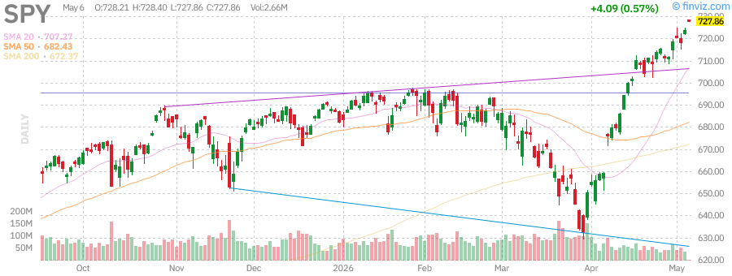

**Technical Analysis:**
- **Trend:** Primary uptrend intact
- **Support Levels:** 20-day EMA, previous resistance turned support
- **Resistance Levels:** All-time highs
- **Volume Profile:** Healthy accumulation on pullbacks
- **RSI:** Neutral territory, room for further upside

**Key Metrics:**
- YTD Performance: Positive
- P/E Ratio: Elevated but justified by earnings growth
- Dividend Yield: ~1.3%
- Volatility: Moderate

### Nasdaq-100 (QQQ)

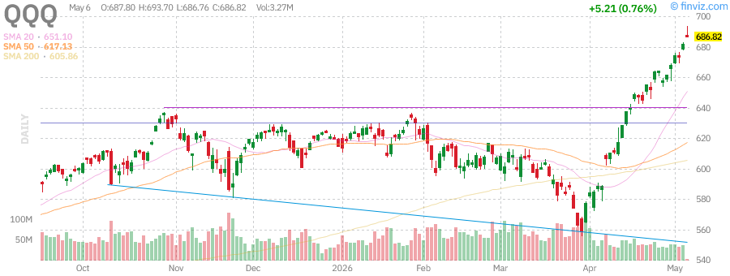

**Technical Analysis:**
- **Trend:** Strong bullish momentum
- **Support Levels:** 50-day moving average
- **Resistance Levels:** Psychological round numbers
- **Volume Profile:** Strong institutional participation
- **RSI:** Approaching overbought, but momentum strong

**Key Metrics:**
- YTD Performance: Outperforming S&P 500
- Concentration Risk: High (top 10 holdings ~50%)
- Tech Exposure: ~60%
- Growth Premium: Elevated

### Russell 2000 (IWM)

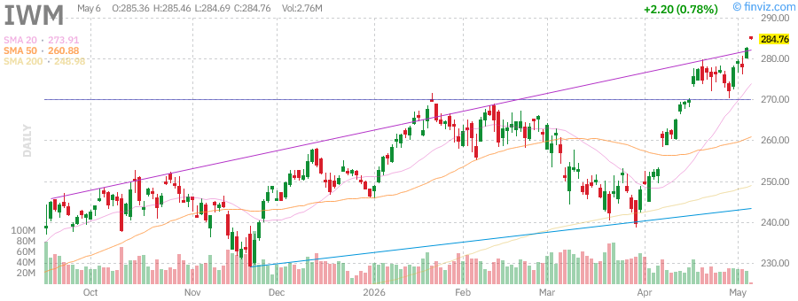

**Technical Analysis:**
- **Trend:** Sideways consolidation
- **Support Levels:** Recent lows, 200-day moving average
- **Resistance Levels:** Previous highs
- **Volume Profile:** Choppy, inconsistent
- **RSI:** Neutral

**Key Metrics:**
- YTD Performance: Lagging large caps
- Valuation: More attractive than large caps
- Economic Sensitivity: High
- Interest Rate Sensitivity: Elevated

---

## Treasury Yields Analysis

### iShares 20+ Year Treasury Bond ETF (TLT)

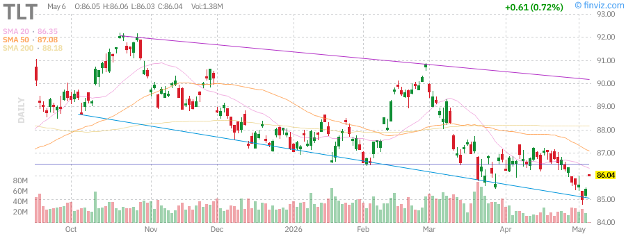

**Yield Environment:**
- **10-Year Treasury Yield:** ~4.3-4.5%
- **30-Year Treasury Yield:** ~4.6-4.8%
- **Yield Curve:** Steepening slightly

**Market Implications:**
- Long-duration bonds showing stability
- Fed policy uncertainty keeping yields elevated
- Inflation expectations moderating
- Safe-haven demand present but not excessive

**Technical Outlook:**
- TLT finding support at current levels
- Potential for mean reversion if rates stabilize
- Duration risk remains elevated

---

## Commodities Analysis

### Gold (GLD)

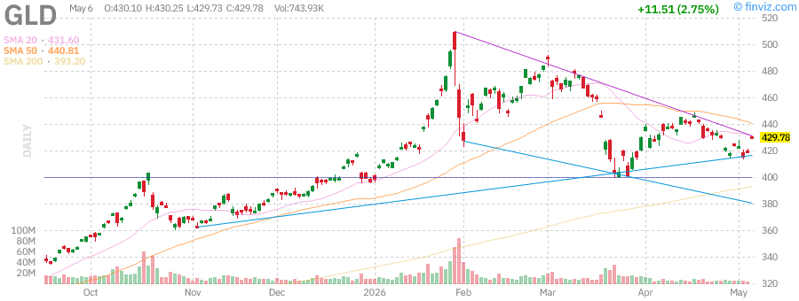

**Market Dynamics:**
- **Price Action:** Consolidating near highs
- **Safe Haven Demand:** Moderate
- **Dollar Correlation:** Negative
- **Real Yield Impact:** Suppressing upside

**Key Factors:**
- Central bank buying remains supportive
- Geopolitical tensions providing floor
- Inflation hedge demand steady
- Technical resistance at recent highs

### Crude Oil (USO)

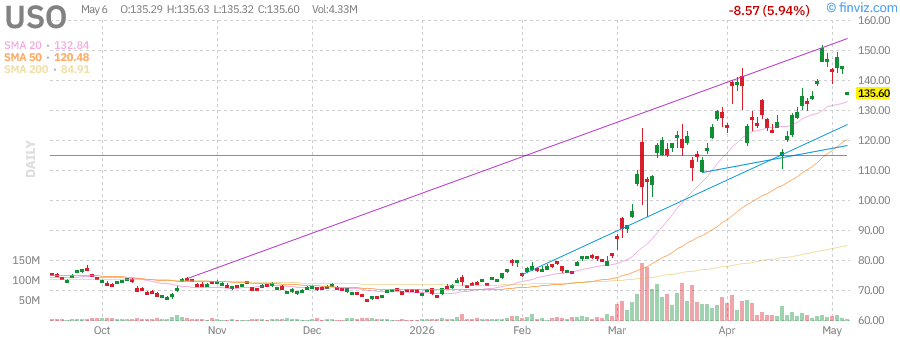

**Market Dynamics:**
- **Price Action:** Volatile, recent decline on peace hopes
- **Supply Factors:** OPEC+ production decisions
- **Demand Outlook:** Global economic recovery
- **Geopolitical Risk:** Elevated but moderating

**Key Developments:**
- Reports of U.S.-Iran peace deal progress weighing on prices
- Trump administration pausing Hormuz escalation plans
- Energy sector facing margin pressure
- Airlines benefiting from lower fuel costs

---

## Individual Stock Analysis

### NVIDIA Corporation (NVDA)

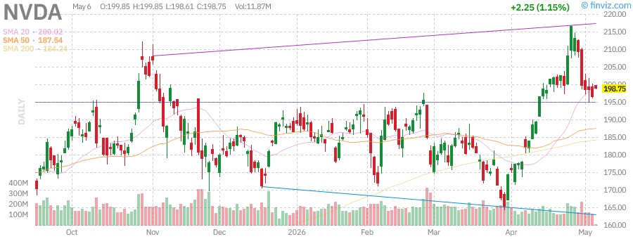

**Company Profile:** Leading AI chip manufacturer

**Technical Analysis:**
- **Trend:** Strong uptrend with healthy consolidation
- **Support:** $120-130 range
- **Resistance:** Previous all-time highs
- **Volume:** Strong institutional accumulation

**Fundamental Highlights:**
- AI demand continues to drive revenue growth
- Data center segment expanding rapidly
- Competition increasing but market growing faster
- Valuation premium justified by growth trajectory

**Rating:** BUY | **Risk Level:** Moderate-High

---

### Tesla, Inc. (TSLA)

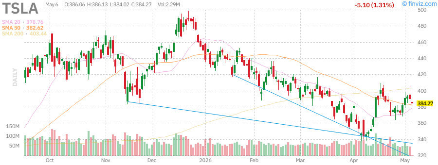

**Company Profile:** Electric vehicle and clean energy company

**Technical Analysis:**
- **Trend:** Volatile, range-bound
- **Support:** $250-280 range
- **Resistance:** $350-380 range
- **Volume:** Elevated on news events

**Fundamental Highlights:**
- EV adoption continuing but competition intensifying
- Energy storage business showing promise
- Autonomous driving timeline uncertain
- Valuation remains elevated vs traditional auto

**Rating:** HOLD | **Risk Level:** High

---

### Apple Inc. (AAPL)

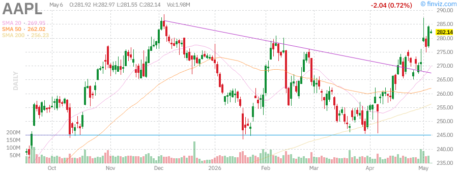

**Company Profile:** Consumer technology giant

**Technical Analysis:**
- **Trend:** Steady uptrend
- **Support:** $200-210 range
- **Resistance:** $230-240 range
- **Volume:** Consistent, healthy

**Fundamental Highlights:**
- Services revenue providing stable growth
- iPhone cycle showing resilience
- AI integration across product line
- Strong cash generation and capital returns

**Rating:** BUY | **Risk Level:** Low-Moderate

---

### Advanced Micro Devices (AMD)

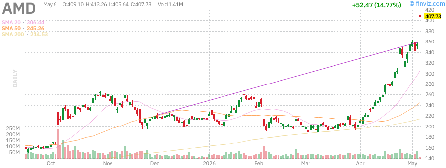

**Company Profile:** Semiconductor manufacturer

**Technical Analysis:**
- **Trend:** Breaking out on strong earnings
- **Support:** $100-110 range
- **Resistance:** New highs
- **Volume:** Massive spike on earnings beat

**Fundamental Highlights:**
- Q1 2026 earnings significantly beat expectations
- AI chip demand exceeding supply
- Market share gains in data center
- Outlook raised substantially

**Rating:** STRONG BUY | **Risk Level:** Moderate

---

### Microsoft Corporation (MSFT)

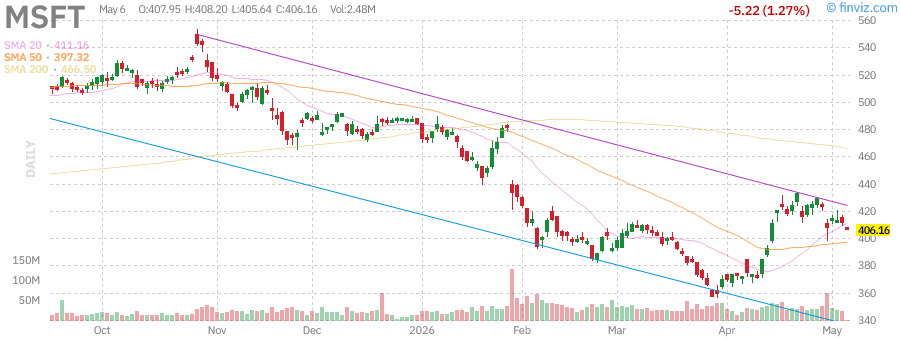

**Company Profile:** Enterprise software and cloud computing leader

**Technical Analysis:**
- **Trend:** Steady uptrend
- **Support:** $420-440 range
- **Resistance:** $480-500 range
- **Volume:** Consistent institutional demand

**Fundamental Highlights:**
- Azure cloud growth remains robust
- AI Copilot monetization accelerating
- Enterprise moat remains strong
- Dividend growth track record

**Rating:** BUY | **Risk Level:** Low

---

### Amazon.com, Inc. (AMZN)

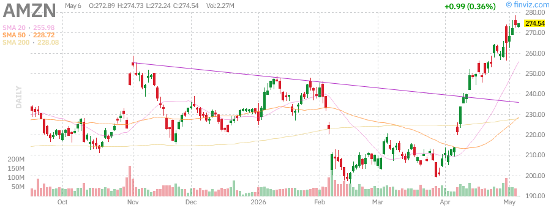

**Company Profile:** E-commerce and cloud computing giant

**Technical Analysis:**
- **Trend:** Strong uptrend
- **Support:** $200-210 range
- **Resistance:** $240-250 range
- **Volume:** Healthy institutional participation

**Fundamental Highlights:**
- AWS cloud growth remains robust
- E-commerce margins improving
- Advertising business expanding rapidly
- AI integration across all segments

**Rating:** BUY | **Risk Level:** Moderate

---

### Alphabet Inc. (GOOGL)

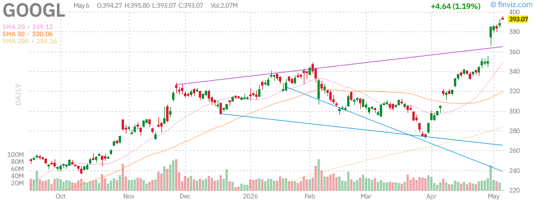

**Company Profile:** Search and digital advertising leader

**Technical Analysis:**
- **Trend:** Steady uptrend
- **Support:** $160-170 range
- **Resistance:** $190-200 range
- **Volume:** Consistent buying pressure

**Fundamental Highlights:**
- Search advertising remains dominant
- YouTube growth accelerating
- Cloud business gaining market share
- AI integration enhancing products
- Regulatory overhang persists

**Rating:** BUY | **Risk Level:** Moderate

---

### Meta Platforms, Inc. (META)

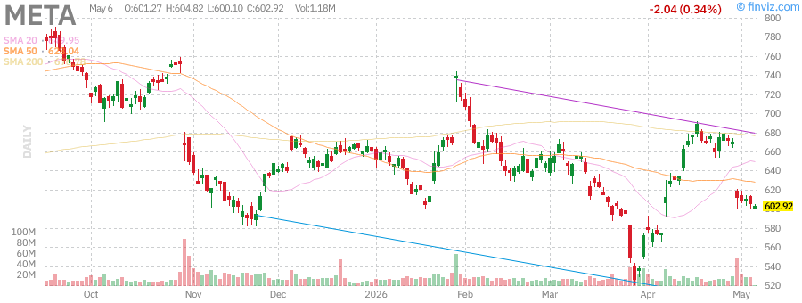

**Company Profile:** Social media and metaverse technology company

**Technical Analysis:**
- **Trend:** Strong recovery and uptrend
- **Support:** $500-520 range
- **Resistance:** $600-620 range
- **Volume:** Strong accumulation

**Fundamental Highlights:**
- Reels monetization driving revenue
- AI investments improving ad targeting
- Cost discipline improving margins
- Metaverse investments remain long-term bet
- Strong cash generation

**Rating:** BUY | **Risk Level:** Moderate

---

## Technical Analysis Summary

### Market Structure

| Asset Class | Trend | Momentum | Support | Resistance |
|-------------|-------|----------|---------|------------|
| SPY | Bullish | Positive | 20-day EMA | All-time highs |
| QQQ | Bullish | Strong | 50-day MA | Psychological levels |
| IWM | Neutral | Neutral | 200-day MA | Previous highs |
| GLD | Neutral | Neutral | Recent lows | Recent highs |
| USO | Bearish | Negative | Multi-month lows | 20-day EMA |
| TLT | Neutral | Neutral | Recent lows | 20-day EMA |

### Key Technical Observations

1. **Broad Market:** Primary uptrend intact with healthy consolidation
2. **Technology:** Leading strength with strong momentum
3. **Small Caps:** Lagging but showing signs of bottoming
4. **Energy:** Under pressure from geopolitical developments
5. **Treasuries:** Stabilizing after period of volatility

### Volume Analysis
- Institutional participation remains strong
- Earnings-driven volume spikes showing conviction
- Distribution days minimal
- Accumulation patterns in leading stocks

---

## Market News Summary

### Top Stories This Week

1. **AMD Earnings Beat** - Advanced Micro Devices reported stronger-than-expected Q1 2026 results, sparking a rally across semiconductor stocks and raising full-year guidance.

2. **U.S.-Iran Peace Progress** - Reports indicate the Trump administration is close to a framework deal to end tensions with Iran, causing oil prices to decline and equities to rally.

3. **Samsung Milestone** - Samsung Electronics surpassed $1 trillion market capitalization, driven by booming AI memory chip demand.

4. **ADP Employment Data** - Private sector added 109,000 jobs in April, above expectations, signaling continued labor market resilience.

5. **Disney Leadership Change** - New CEO Josh D'Amaro delivered an earnings beat in his first report, signaling positive strategic direction.

### Sector-Specific News

**Technology:**
- AI-driven demand continues to exceed supply
- Memory chip makers seeing unprecedented demand
- Cloud providers expanding capital expenditure

**Energy:**
- Oil prices volatile on geopolitical headlines
- Airlines cutting flights due to high fuel costs
- Trump pausing Hormuz escalation plans

**Healthcare:**
- Novo Nordisk obesity pill showing fastest adoption
- CVS boosting outlook on Aetna strength
- Eli Lilly raising funds for strategic deals

**Financials:**
- Apollo Global assets surpass $1 trillion
- Bank of America recommending bespoke debt strategies
- US Treasury maintaining auction sizes

---

## Market Outlook

### Short-Term (1-4 Weeks)

**Bullish Factors:**
- Strong earnings momentum continuing
- AI investment cycle accelerating
- Geopolitical risk potentially decreasing
- Technical trends remain positive

**Bearish Factors:**
- Valuations elevated in tech sector
- Fed policy uncertainty persists
- Small-cap weakness concerning
- Seasonal volatility potential

**Outlook:** Cautiously bullish with selective approach

### Medium-Term (1-3 Months)

**Key Catalysts:**
- Federal Reserve policy decisions
- Q2 2026 earnings season
- Inflation trajectory
- Geopolitical developments

**Expected Scenarios:**
1. **Base Case (60% probability):** Continued grind higher with tech leadership
2. **Bull Case (25% probability):** Broadening rally including small caps
3. **Bear Case (15% probability):** Correction on valuation concerns

### Long-Term (3-12 Months)

**Structural Themes:**
- AI transformation accelerating
- Energy transition continuing
- Demographic shifts impacting healthcare
- Global supply chain reconfiguration

---

## Trading Recommendations

### Portfolio Allocation Suggestions

| Asset Class | Allocation | Rationale |
|-------------|------------|-----------|
| Large Cap Tech | 35% | Strong earnings momentum |
| Broad Market | 25% | Diversification core |
| Small Cap | 10% | Value opportunity |
| International | 10% | Geographic diversification |
| Bonds | 15% | Risk management |
| Cash | 5% | Dry powder |

### Individual Stock Recommendations

**BUY Ratings:**
- **NVDA** - AI leader with strong momentum
- **AMD** - Earnings momentum, market share gains
- **MSFT** - Cloud dominance, AI integration
- **AAPL** - Services growth, capital returns
- **AMZN** - AWS growth, margin expansion
- **GOOGL** - Search dominance, AI upside
- **META** - Reels monetization, cost discipline

**HOLD Ratings:**
- **TSLA** - Wait for clearer direction

**Sector Recommendations:**
- **Overweight:** Technology, Communication Services
- **Market Weight:** Healthcare, Consumer Discretionary
- **Underweight:** Energy, Utilities

### Entry Strategies

1. **Dollar-Cost Averaging:** For core positions in quality names
2. **Breakout Entries:** On confirmed technical breakouts
3. **Pullback Buying:** Support level purchases with tight stops
4. **Earnings Momentum:** Post-earnings strength continuation

---

## Risk Management Guidelines

### Position Sizing
- No single position > 5% of portfolio
- Sector exposure < 25% of portfolio
- Maintain 5-10% cash for opportunities

### Stop Loss Guidelines
- Individual stocks: 8-10% from entry
- Index positions: 5-7% from entry
- Adjust for volatility (wider for high-beta)

### Risk Factors to Monitor

1. **Fed Policy:** Rate decisions and guidance
2. **Inflation Data:** CPI/PCE releases
3. **Geopolitical:** Middle East, China tensions
4. **Earnings:** Guidance revisions and misses
5. **Technical:** Distribution days, breakdowns

### Hedging Strategies
- Index put spreads for portfolio protection
- Volatility hedges during earnings season
- Sector rotation for risk management
- Cash raising during uncertainty

---

## Summary & Key Takeaways

### Market Snapshot
- **Primary Trend:** Bullish
- **Leading Sectors:** Technology, Communication Services
- **Lagging Sectors:** Energy, Utilities
- **Volatility:** Moderate
- **Sentiment:** Cautiously optimistic

### Key Levels to Watch
- **SPY:** Support at 20-day EMA, resistance at highs
- **QQQ:** Support at 50-day MA, momentum strong
- **VIX:** Elevated readings would signal caution

### Action Items for Next Week
1. Monitor AMD momentum continuation
2. Watch for oil price stabilization
3. Track Fed speaker commentary
4. Review portfolio concentration risk

---

## Disclaimer

**IMPORTANT NOTICE:**

This report is for informational and educational purposes only and does not constitute investment advice, recommendations, or solicitation to buy or sell any securities. The information contained herein has been obtained from sources believed to be reliable but is not guaranteed as to accuracy or completeness.

**Key Disclosures:**

1. **Not Financial Advice:** This report is not personalized investment advice and should not be construed as such. Consult with a qualified financial advisor before making any investment decisions.

2. **Past Performance:** Past performance is not indicative of future results. The stock market involves substantial risk of loss.

3. **Forward-Looking Statements:** This report contains forward-looking statements based on current expectations that involve risks and uncertainties. Actual results may differ materially.

4. **No Warranty:** The author makes no representations or warranties regarding the accuracy, completeness, or timeliness of any information provided.

5. **Conflicts of Interest:** The author may hold positions in securities mentioned in this report.

6. **Data Sources:** Market data sourced from Finviz, Yahoo Finance, and other public sources. Charts are property of their respective providers.

**Risk Warning:** Trading and investing in securities involves substantial risk of loss. Only risk capital should be used. You should carefully consider whether trading is suitable for you in light of your circumstances, knowledge, and financial resources.

---

*Report Generated: Saturday, June 6, 2026*

*For questions or feedback, please contact the research team.*
