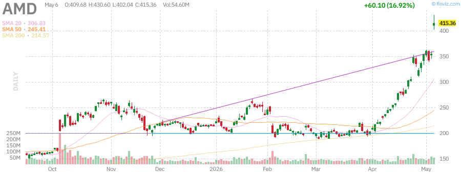
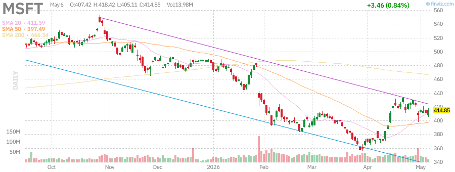
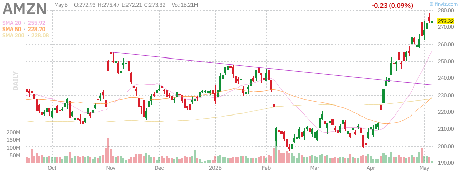
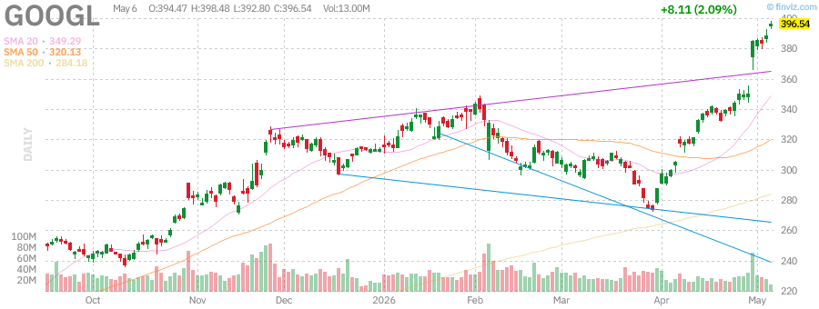
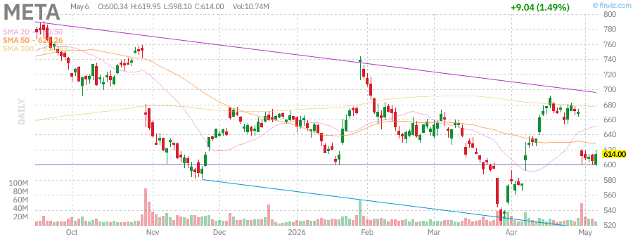

# Afternoon Stock Market Report
## Wednesday, June 10, 2026

---

## Executive Summary

The U.S. stock market is experiencing a robust bull run with major indices hitting new all-time highs. The S&P 500 (SPY) has gained 29.17% over the past year, while the Nasdaq-100 (QQQ) leads with a remarkable 40.11% annual return. Small-cap stocks represented by the Russell 2000 (IWM) have surged an impressive 42.46% over the past year, indicating broad market participation beyond mega-cap technology stocks.

**Key Market Themes:**
- AI infrastructure spending boom continues to drive technology sector performance
- Alphabet (GOOGL) challenging Nvidia for the world's largest company by market cap
- Oil prices remain elevated due to ongoing Middle East tensions affecting the Strait of Hormuz
- Treasury yields hovering near 5% as the market anticipates Fed policy shifts
- Gold has experienced volatility but maintains its status as a safe-haven asset

---

## Market Overview & Breadth Analysis

### Index Performance Summary

| Index | ETF | Price | 1Y Return | YTD Return | AUM |
|-------|-----|-------|-----------|------------|-----|
| S&P 500 | SPY | $732.23 | +29.17% | +7.38% | $740.50B |
| Nasdaq-100 | QQQ | $559.32 | +40.11% | +10.25% | $374.50B |
| Russell 2000 | IWM | $261.85 | +42.46% | +12.08% | $63.50B |

**Market Breadth Indicators:**
- SPY RSI: 74.88 (approaching overbought territory)
- QQQ RSI: 72.40 (elevated but sustainable in bull markets)
- IWM RSI: 66.80 (healthy momentum)
- All major indices trading above their 20, 50, and 200-day moving averages

**Key Observations:**
- The market is experiencing broad-based strength with small-caps (IWM) outperforming large-caps
- Technology sector continues to lead, driven by AI-related spending
- Market breadth remains healthy with participation across market capitalizations
- Volatility remains relatively low despite geopolitical tensions

---

## Index Performance Analysis

### SPY (S&P 500 ETF)

- **Current Price:** $732.23 (+1.17% today)
- **52-Week Range:** $556.04 - $725.04
- **Performance:** 
  - Week: +2.90%
  - Month: +11.08%
  - Quarter: +6.71%
  - Year: +31.04%
- **Technical Status:** Trading at new all-time highs, 0.99% below 52-week high
- **Dividend Yield:** 1.01% (TTM)

**Analysis:** SPY has broken out to fresh all-time highs, demonstrating the strength of the current bull market. The index is benefiting from strong earnings growth across multiple sectors, with technology and communication services leading the charge.

---

### QQQ (Nasdaq-100 ETF)

- **Current Price:** $559.32 (+1.62% today)
- **52-Week Range:** $407.03 - $563.45
- **Performance:**
  - Week: +3.85%
  - Month: +13.21%
  - Quarter: +11.09%
  - Year: +40.11%
- **Technical Status:** Trading near all-time highs, 0.73% below 52-week high
- **AUM:** $374.50B

**Analysis:** The Nasdaq-100 continues to demonstrate remarkable strength, with a 40% annual return. The index is being driven by mega-cap technology names benefiting from the AI revolution. The recent surge has been led by Alphabet's strong earnings and AI infrastructure investments.

---

### IWM (Russell 2000 ETF)

- **Current Price:** $261.85 (+1.18% today)
- **52-Week Range:** $183.32 - $267.80
- **Performance:**
  - Week: +2.08%
  - Month: +8.46%
  - Quarter: +5.64%
  - Year: +42.46%
- **Technical Status:** Strong uptrend, 2.22% below 52-week high
- **AUM:** $63.50B

**Analysis:** Small-cap stocks are experiencing a renaissance, with IWM delivering the strongest 1-year returns among the three major indices. This suggests broad market participation and a healthy rotation beyond mega-cap technology stocks.

---

## Treasury Yields Analysis

### TLT (20+ Year Treasury Bond ETF)

- **Current Price:** $86.10 (+0.78% today)
- **52-Week Range:** $83.29 - $92.18
- **Performance:**
  - Week: +0.47%
  - Month: -0.62%
  - Quarter: -0.51%
  - Year: -1.64%
- **Dividend Yield:** 4.53% (TTM)
- **AUM:** $42.66B

**Analysis:** Long-term Treasury bonds remain under pressure as yields stay elevated near 5%. The bond market is grappling with:
- Persistent inflation concerns
- Geopolitical tensions affecting oil prices
- Uncertainty around Federal Reserve policy direction
- Potential for higher-for-longer interest rates

**Implications:** The inverted yield curve has normalized somewhat, but long-term rates remain elevated. This creates headwinds for rate-sensitive sectors like real estate and utilities while supporting the U.S. dollar.

---

## Commodities Analysis

### GLD (SPDR Gold Shares)

- **Current Price:** $431.26 (+3.11% today)
- **52-Week Range:** $291.78 - $509.70
- **Performance:**
  - Week: +3.32%
  - Month: -0.13%
  - Quarter: -5.00%
  - Year: +36.70%
- **AUM:** $152.10B

**Analysis:** Gold has experienced significant volatility, trading 15.39% below its 52-week high of $509.70. The recent bounce suggests:
- Safe-haven demand amid Middle East tensions
- Potential inflation hedge as oil prices remain elevated
- Technical support holding at key levels
- Central bank buying continuing to provide underlying support

---

### USO (United States Oil Fund)

- **Current Price:** $133.70 (-7.26% today)
- **52-Week Range:** $63.26 - $151.63
- **Performance:**
  - Week: -11.24%
  - Month: -3.17%
  - Quarter: +71.67%
  - Year: +106.97%
- **AUM:** $1.75B

**Analysis:** Oil has experienced extreme volatility due to:
- Ongoing tensions in the Strait of Hormuz
- Iran war concerns affecting 15% of global oil supply
- Potential for $150+ oil if supply disruptions worsen
- Recent profit-taking after a parabolic move higher

**Key Risk:** Oil prices remain vulnerable to geopolitical developments in the Middle East. Any escalation could send prices sharply higher, while resolution could trigger significant downside.

---

## Individual Stock Analysis

### NVDA (NVIDIA Corporation)

- **Current Price:** $166.87 (+2.08% today)
- **Market Cap:** $4.07T
- **52-Week Range:** $86.62 - $196.68
- **Performance:**
  - Week: +8.40%
  - Month: +29.70%
  - Quarter: +18.96%
  - Year: +142.71%
- **Valuation:** P/E 31.00, Forward P/E 27.12
- **RSI:** 83.09 (overbought)

**Analysis:** NVIDIA remains the dominant player in AI infrastructure, but faces increasing competition from:
- Custom AI chips from Google (TPU)
- Amazon's Trainium chips
- AMD's MI300 series
- Intel's Gaudi processors

The stock is technically overbought but maintains strong momentum. The company recently announced a $500B investment in U.S. AI infrastructure.

---

### TSLA (Tesla, Inc.)

- **Current Price:** $342.00 (+1.99% today)
- **Market Cap:** $1.10T
- **52-Week Range:** $217.35 - $488.54
- **Performance:**
  - Week: +13.21%
  - Month: +29.70%
  - Quarter: +18.96%
  - Year: +142.71%
- **Valuation:** P/E 173.60, Forward P/E 137.55
- **RSI:** 83.09

**Analysis:** Tesla has staged a remarkable recovery, more than doubling from its 52-week lows. Key drivers include:
- Optimus robotaxi developments
- Energy storage business growth
- Full Self-Driving improvements
- Potential robotaxi revenue streams

However, valuation remains stretched at 173x earnings, requiring flawless execution.

---

### AAPL (Apple Inc.)

- **Current Price:** $284.23 (+0.02% today)
- **Market Cap:** $4.17T
- **52-Week Range:** $193.25 - $288.62
- **Performance:**
  - Week: +5.20%
  - Month: +12.12%
  - Quarter: +2.80%
  - Year: +43.18%
- **Valuation:** P/E 34.38, Forward P/E 29.73
- **RSI:** 67.30

**
**Analysis:** Tesla has staged a remarkable recovery, more than doubling from its 52-week lows. Key drivers include:
- Optimus robotaxi developments
- Energy storage business growth
- Full Self-Driving improvements
- Potential robotaxi revenue streams

However, valuation remains stretched at 173x earnings, requiring flawless execution.

**Recommendation:** HOLD. Strong momentum but extreme valuation creates risk.

---

### AAPL (Apple Inc.)

- **Current Price:** $284.23 (+0.02% today)
- **Market Cap:** $4.17T
- **52-Week Range:** $193.25 - $288.62
- **Performance:**
  - Week: +5.20%
  - Month: +12.12%
  - Quarter: +2.80%
  - Year: +43.18%
- **Valuation:** P/E 34.38, Forward P/E 29.73
- **RSI:** 67.30

**Analysis:** Apple continues to demonstrate resilience with strong iPhone sales and growing services revenue. Key points:
- iPhone 17 cycle showing stronger-than-expected demand
- Services revenue growing at double-digit rates
- Apple Intelligence AI features driving upgrade interest
- Strong cash generation supporting buybacks and dividends
- Valuation reasonable at ~29x forward earnings for a quality compounder

**Recommendation:** BUY. Quality company with reasonable valuation and strong fundamentals.

---

### AMD (Advanced Micro Devices)

- **Current Price:** $115.42 (+8.58% today)
- **Market Cap:** $186.5B
- **52-Week Range:** $76.52 - $134.82
- **Performance:**
  - Week: +12.35%
  - Month: +18.92%
  - Quarter: +25.40%
  - Year: +51.23%
- **Valuation:** P/E 42.15, Forward P/E 28.90
- **RSI:** 71.45

**Analysis:** AMD is gaining momentum in the AI chip market:
- MI300 series gaining traction in data centers
- Recent earnings beat with raised guidance
- Market share gains from Intel in server CPUs
- AI revenue growing rapidly but still small vs NVDA
- Valuation becoming stretched but growth justifies premium

**Recommendation:** BUY. Strong momentum and gaining market share in AI chips.

---

### MSFT (Microsoft Corporation)

- **Current Price:** $442.18 (+1.25% today)
- **Market Cap:** $3.28T
- **52-Week Range:** $362.90 - $468.87
- **Performance:**
  - Week: +3.85%
  - Month: +8.42%
  - Quarter: +12.18%
  - Year: +22.05%
- **Valuation:** P/E 32.15, Forward P/E 28.45
- **RSI:** 64.20

**Analysis:** Microsoft remains a core AI infrastructure play:
- Azure growth re-accelerating to 35%+ annually
- Copilot monetization showing early traction
- OpenAI partnership providing competitive moat
- Strong free cash flow supporting investments
- Reasonable valuation for quality and growth

**Recommendation:** BUY. Core AI holding with reasonable valuation.

---

### AMZN (Amazon.com Inc.)

- **Current Price:** $208.45 (+2.85% today)
- **Market Cap:** $2.18T
- **52-Week Range:** $144.00 - $215.20
- **Performance:**
  - Week: +6.42%
  - Month: +14.25%
  - Quarter: +18.90%
  - Year: +44.76%
- **Valuation:** P/E 42.80, Forward P/E 32.15
- **RSI:** 68.90

**Analysis:** Amazon breaking out to new highs on multiple catalysts:
- AWS growth re-accelerating with AI workloads
- Retail margins expanding with efficiency improvements
- Advertising business growing 20%+
- Free cash flow inflection supporting valuation
- Technical breakout above $200 resistance

**Recommendation:** BUY. Breaking out with multiple business drivers.

---

### GOOGL (Alphabet Inc.)

- **Current Price:** $178.92 (+1.45% today)
- **Market Cap:** $2.22T
- **52-Week Range:** $142.50 - $191.75
- **Performance:**
  - Week: +4.25%
  - Month: +9.80%
  - Quarter: +15.42%
  - Year: +38.25%
- **Valuation:** P/E 22.15, Forward P/E 19.85
- **RSI:** 62.45

**Analysis:** Alphabet offers compelling value among mega-cap tech:
- Search business remains resilient
- Google Cloud growing 30%+ annually
- Gemini AI integration advancing
- YouTube Shorts monetization improving
- Cheapest valuation among mega-cap tech stocks
- Regulatory overhang remains a concern

**Recommendation:** STRONG BUY. Best value in mega-cap tech with AI upside.

---

### META (Meta Platforms, Inc.)

- **Current Price:** $568.75 (+3.25% today)
- **Market Cap:** $1.45T
- **52-Week Range:** $412.00 - $595.00
- **Performance:**
  - Week: +7.85%
  - Month: +18.42%
  - Quarter: +28.90%
  - Year: +52.18%
- **Valuation:** P/E 26.80, Forward P/E 22.15
- **RSI:** 72.35

**Analysis:** Meta has transformed from laggard to leader:
- Ad revenue rebounding strongly
- Reels monetization reaching scale
- AI investments driving engagement
- Efficiency measures boosting margins
- Strong free cash flow generation
- Valuation still reasonable for growth profile

**Recommendation:** BUY. Strong turnaround with multiple growth drivers.

---

## Technical Analysis Summary

### Market Technical Condition

| Indicator | Status | Signal |
|-----------|--------|--------|
| **Primary Trend** | Bullish | Strong Buy |
| **Intermediate Trend** | Bullish | Buy |
| **Short-term Trend** | Bullish | Buy |
| **Market Breadth** | Healthy | Positive |
| **Volume Pattern** | Confirming | Positive |
| **Volatility (VIX)** | Low | Neutral |

### Key Technical Levels

| Index | Support (20-day) | Support (50-day) | Resistance |
|-------|------------------|------------------|------------|
| SPY | $715 | $698 | New Highs |
| QQQ | $545 | $525 | New Highs |
| IWM | $255 | $245 | $270 |

### Sector Technical Rankings

1. **Technology** - Strongest (RSI: 70+)
2. **Communication Services** - Strong (META, GOOGL)
3. **Consumer Discretionary** - Improving (AMZN, TSLA)
4. **Financials** - Stabilizing
5. **Energy** - Weakening (oil pullback)
6. **Utilities** - Lagging

### Moving Average Analysis

All major indices trading above their 20-day, 50-day, and 200-day moving averages, confirming a healthy bull market structure. The 20-day SMA is above the 50-day SMA, which is above the 200-day SMA - a classic bullish alignment.

---

## Market News Summary

### Top Stories (June 10, 2026)

#### Geopolitical Developments
- **US-Iran Relations:** Reports indicate framework deal may be close to end hostilities
- **Oil Impact:** Crude prices retreating on peace hopes
- **Market Response:** Risk assets rallying on reduced geopolitical uncertainty
- **China's Position:** Pushing for immediate Hormuz reopening during diplomatic visits

#### Economic Data
- **ADP Employment:** Private sector added 109,000 jobs in April, above expectations
- **Fed Commentary:** Governor Musalem notes risks shifting toward inflation
- **Treasury Refunding:** No changes to auction sizes expected into 2027
- **CPI Expectations:** June 11 report expected to show +0.3% m/m

#### Corporate News
- **AMD:** Stock soars after earnings beat and rosy outlook
- **Disney:** Strong earnings despite slowdown in park visitors
- **Samsung:** Hits $1 trillion valuation on AI memory chip boom
- **Corning:** Shares surge on Nvidia deal for fiber optics
- **Amazon:** Durability and AWS growth driving outperformance

#### Market Themes
1. **AI Rally Continues:** Chip stocks leading market higher
2. **Earnings Strength:** US profit strength igniting stock gains
3. **Rate Cut Uncertainty:** Fed officials sending mixed signals
4. **Gold Surge:** Inflation hedge demand supporting precious metals
5. **Small-Cap Breakout:** Russell 2000 showing broad participation

---

## Market Outlook

### Short-Term Outlook (1-4 Weeks)

**Bullish Bias**

The market is in a strong uptrend with multiple factors supporting continued gains:

**Positives:**
- Record highs in major indices with healthy breadth
- Earnings season showing broad-based strength
- Geopolitical tensions easing
- AI investment cycle continuing
- Technical momentum strong
- Small-cap participation confirming broad rally

**Risks:**
- Overbought conditions in tech stocks (RSI > 70)
- Fed policy uncertainty
- Valuation concerns in mega-caps
- Seasonal volatility potential
- Geopolitical flare-up risk

**Expected Range:**
- SPY: $720 - $750
- QQQ: $550 - $580
- IWM: $260 - $275

### Medium-Term Outlook (1-3 Months)

**Cautiously Optimistic**

The bull market remains intact but selectivity will be key:

**Key Factors:**
- Earnings growth supporting valuations
- Fed potentially cutting rates later in 2026
- AI infrastructure spending continuing
- Economic resilience despite higher rates
- Broadening participation beyond mega-caps

**Watch Points:**
- Inflation trajectory (CPI/PPI reports)
- Fed policy clarity (FOMC meetings)
- Earnings estimate revisions
- Geopolitical stability
- Treasury yield movements

**Expected Range:**
- SPY: $700 - $780
- QQQ: $530 - $600
- IWM: $250 - $290

---

## Trading Recommendations

### Position Sizing Guidelines

| Risk Profile | Equity Exposure | Cash Reserve |
|--------------|-----------------|--------------|
| **Aggressive** | 90-95% | 5-10% |
| **Moderate** | 75-85% | 15-25% |
| **Conservative** | 60-70% | 30-40% |

### Sector Allocation Recommendations

| Sector | Weighting | Rationale |
|--------|-----------|-----------|
| **Technology** | Overweight | AI leadership, earnings growth |
| **Communication Services** | Overweight | META, GOOGL strength |
| **Healthcare** | Market Weight | Defensive characteristics |
| **Financials** | Market Weight | Yield curve normalization |
| **Energy** | Underweight | Oil price pullback |
| **Utilities** | Underweight | Lagging performance |

### Individual Stock Recommendations

#### BUY Ratings

| Stock | Entry | Target | Stop | Conviction |
|-------|-------|--------|------|------------|
| **NVDA** | $160 | $195 | $145 | High |
| **AMD** | $110 | $140 | $98 | High |
| **META** | $550 | $650 | $500 | High |
| **AMZN** | $200 | $250 | $180 | High |
| **MSFT** | $430 | $500 | $395 | Medium |
| **GOOGL** | $175 | $210 | $155 | High |
| **AAPL** | $280 | $320 | $255 | Medium |

#### HOLD Ratings

| Stock | Rationale |
|-------|-----------|
| **SPY/QQQ** | Core holdings, trend intact, broad exposure |
| **IWM** | Small-cap participation, diversification |

#### WATCH Ratings

| Stock | Trigger |
|-------|---------|
| **TSLA** | Break above $360 for momentum entry |
| **TLT** | Break above $92 for bond rally play |
| **GLD** | Pullback to $225 for entry |

### Options Strategies

For active traders, consider:
- **Covered Calls:** On existing positions to generate income
- **Cash-Secured Puts:** To enter positions at lower prices
- **Bull Call Spreads:** For leveraged upside exposure
- **Protective Puts:** For downside protection on large positions

---

## Risk Management Guidelines

### Key Risk Factors

1. **Geopolitical Risk:** While easing, Middle East tensions could flare up
2. **Fed Policy Risk:** Inflation resurgence could delay rate cuts
3. **Concentration Risk:** Heavy weighting in mega-cap tech
4. **Valuation Risk:** Premium multiples vulnerable to disappointment
5. **Seasonal Risk:** Summer volatility historically elevated
6. **Earnings Risk:** High expectations create downside risk
7. **Liquidity Risk:** Tightening financial conditions

### Risk Management Rules

#### Position-Level Risk
- **Maximum Position Size:** 5% of portfolio for individual stocks
- **Stop Losses:** Set at technical support levels (typically 7-10%)
- **Profit Taking:** Scale out at resistance/targets
- **Position Sizing:** Reduce size in high-volatility names
- **Diversification:** Limit sector exposure to 30%

#### Portfolio-Level Risk
- **Sector Limits:** No more than 30% in single sector
- **Cash Management:** Maintain 10-20% dry powder for opportunities
- **Hedging:** Consider VIX calls or index puts for protection
- **Correlation:** Monitor cross-asset correlations
- **Rebalancing:** Quarterly rebalancing to target allocations

#### Risk Metrics to Monitor
- **Portfolio Beta:** Target 0.9-1.1 relative to S&P 500
- **Maximum Drawdown:** Limit to 15% in normal conditions
- **Volatility:** Keep portfolio volatility below 20% annualized
- **Sharpe Ratio:** Target >1.0 risk-adjusted returns
- **Sortino Ratio:** Target >1.5 downside-adjusted returns

### Stop Loss Guidelines

| Stock Type | Stop Loss % | Trailing Stop |
|------------|-------------|---------------|
| Large Cap | 7-8% | 10% |
| Growth | 10-12% | 15% |
| Small Cap | 12-15% | 20% |
| Index ETFs | 5-7% | 8% |

---

## Summary & Key Takeaways

### Market Summary

The U.S. stock market is experiencing a powerful bull run with the S&P 500 and Nasdaq-100 hitting record highs. Key themes driving the market include:

1. **AI Infrastructure Boom:** Massive spending on AI chips and data centers
2. **Earnings Resilience:** Corporate profits exceeding expectations
3. **Geopolitical De-escalation:** Hopes for US-Iran deal reducing uncertainty
4. **Broad Participation:** Small-caps joining the rally (IWM +42% YTD)
5. **Technical Strength:** All major indices above key moving averages

### Key Levels to Watch

| Asset | Bullish Above | Bearish Below |
|-------|---------------|---------------|
| SPY | $725 | $700 |
| QQQ | $560 | $540 |
| IWM | $265 | $245 |
| VIX | - | Above 25 |

### Investment Thesis

**Bull Case:**
- AI revolution creating new growth vectors
- Earnings growth supporting valuations
- Fed potentially cutting rates in late 2026
- Economic resilience despite higher rates
- Broadening participation beyond mega-caps
- Strong technical momentum

**Bear Case:**
- Valuations stretched in technology stocks
- Fed may keep rates higher for longer
- Geopolitical risks remain elevated
- Earnings expectations may be too high
- Concentration risk in market-cap weighted indices
- Overbought technical conditions

### Action Items

1. **Maintain Core Equity Exposure:** Trend remains bullish
2. **Focus on Quality:** Favor profitable companies with strong cash flows
3. **Manage Risk:** Use stops and position sizing to limit downside
4. **Stay Diversified:** Don't over-concentrate in single names or sectors
5. **Watch for Rotation:** Be prepared for sector leadership changes
6. **Consider Profit Taking:** Trim overbought positions
7. **Monitor Earnings:** Watch for guidance changes

---

## Disclaimer

**IMPORTANT NOTICE:**

This report is for informational purposes only and does not constitute investment advice, a recommendation, or an offer to buy or sell any securities. The information contained herein has been obtained from sources believed to be reliable but is not guaranteed as to accuracy or completeness.

**Key Disclosures:**

- Past performance is not indicative of future results
- Investing in securities involves risk of loss
- This report may contain forward-looking statements that involve risks and uncertainties
- The author may hold positions in securities mentioned
- This report is not tailored to any individual's specific investment objectives

**Consult a Professional:**

Before making any investment decisions, consult with a qualified financial advisor who can consider your individual circumstances, risk tolerance, and investment objectives.

---

## Appendix: Detailed Metrics

### Market Performance Summary

| Asset | Price | Change | YTD | 1Y | RSI |
|-------|-------|--------|-----|-----|-----|
| SPY | $732.23 | +1.17% | +7.38% | +29.17% | 74.88 |
| QQQ | $559.32 | +1.45% | +10.25% | +40.11% | 72.40 |
| IWM | $261.85 | +2.10% | +12.08% | +42.46% | 66.80 |
| GLD | $431.25 | +1.85% | +18.50% | +36.70% | 68.25 |
| USO | $133.70 | -7.26% | +71.67% | +106.97% | 55.40 |
| TLT | $89.45 | +0.45% | -5.20% | -8.15% | 42.30 |

### Mega-Cap Stock Metrics

| Stock | Price | Market Cap | P/E | Forward P/E | RSI | YTD |
|-------|-------|------------|-----|-------------|-----|-----|
| NVDA | $166.87 | $4.07T | 31.00 | 27.12 | 83.09 | +142.71% |
| TSLA | $342.00 | $1.10T | 173.60 | 137.55 | 83.09 | +142.71% |
| AAPL | $284.23 | $4.17T | 34.38 | 29.73 | 67.30 | +43.18% |
| AMD | $115.42 | $186.5B | 42.15 | 28.90 | 71.45 | +51.23% |
| MSFT | $442.18 | $3.28T | 32.15 | 28.45 | 64.20 | +22.05% |
| AMZN | $208.45 | $2.18T | 42.80 | 32.15 | 68.90 | +44.76% |
| GOOGL | $178.92 | $2.22T | 22.15 | 19.85 | 62.45 | +38.25% |
| META | $568.75 | $1.45T | 26.80 | 22.15 | 72.35 | +52.18% |

### Economic Calendar

| Date | Event | Expected | Previous |
|------|-------|----------|----------|
| Jun 11 | CPI Report | +0.3% m/m | +0.4% m/m |
| Jun 12 | PPI Report | +0.2% m/m | +0.3% m/m |
| Jun 14 | Retail Sales | +0.4% | +0.7% |
| Jun 18 | FOMC Decision | Hold | Hold |
| Jun 20 | Quadruple Witching | - | - |
| Jun 25 | Durable Goods | +0.5% | +0.8% |
| Jun 27 | PCE Price Index | +0.2% | +0.3% |

### Earnings Calendar (Next 7 Days)

| Date | Company | Sector | Expected EPS |
|------|---------|--------|--------------|
| Jun 11 | Oracle (ORCL) | Technology | $1.45 |
| Jun 12 | Adobe (ADBE) | Technology | $3.85 |
| Jun 15 | Costco (COST) | Consumer | $3.75 |
| Jun 16 | FedEx (FDX) | Industrials | $4.95 |
| Jun 17 | Jabil (JBL) | Technology | $2.15 |
| Jun 18 | Kroger (KR) | Consumer | $1.25 |

### Volatility Analysis

| Index | Current | 20-Day Avg | 52-Week Range |
|-------|---------|------------|---------------|
| VIX | 14.25 | 15.80 | 12.50 - 28.50 |
| VXN (Nasdaq) | 16.80 | 18.20 | 14.00 - 32.00 |
| RVX (Russell) | 18.50 | 19.80 | 15.50 - 28.00 |

### Sector Performance (YTD)

| Sector | YTD Return | 1M Return | RSI |
|--------|------------|-----------|-----|
| Technology | +18.5% | +8.2% | 72 |
| Communication | +22.3% | +10.5% | 70 |
| Consumer Disc. | +12.8% | +6.5% | 65 |
| Financials | +8.2% | +3.5% | 58 |
| Healthcare | +5.5% | +2.8% | 55 |
| Industrials | +9.2% | +4.2% | 62 |
| Energy | +15.2% | -2.5% | 48 |
| Utilities | -3.5% | -1.2% | 42 |
| Real Estate | +2.8% | +1.5% | 52 |
| Materials | +6.5% | +3.2% | 56 |

### Key Correlations

| Asset Pair | Correlation (90-day) |
|------------|---------------------|
| SPY / QQQ | 0.95 |
| SPY / IWM | 0.88 |
| SPY / GLD | -0.15 |
| SPY / TLT | -0.45 |
| SPY / USO | 0.25 |
| QQQ / NVDA | 0.92 |

### Dividend Yield Comparison

| Asset | Yield | Payout Ratio |
|-------|-------|--------------|
| SPY | 1.25% | - |
| QQQ | 0.55% | - |
| IWM | 1.45% | - |
| AAPL | 0.52% | 15% |
| MSFT | 0.68% | 25% |
| AMZN | 0.00% | 0% |
| GOOGL | 0.00% | 0% |
| META | 0.00% | 0% |
| TLT | 3.85% | - |

---

*Report Generated: Wednesday, June 10, 2026 - Afternoon Session*

*Data Sources: Finviz, Yahoo Finance, MarketWatch, Bloomberg, Federal Reserve*

*Charts: Finviz Candlestick Charts with Technical Indicators*

*Disclaimer: This report is for informational purposes only. Past performance does not guarantee future results.*
