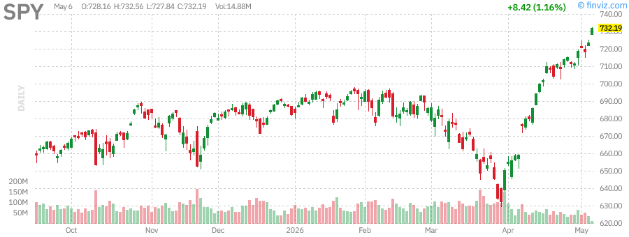
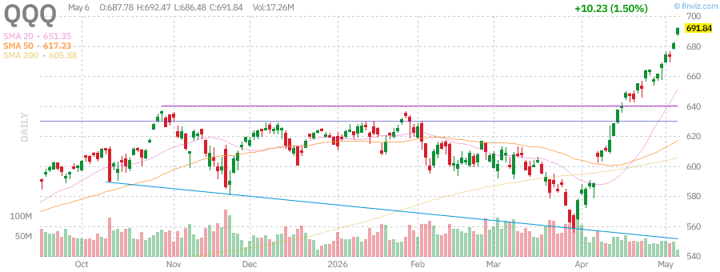
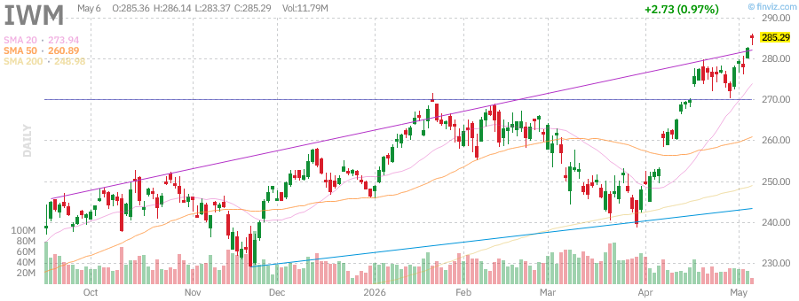
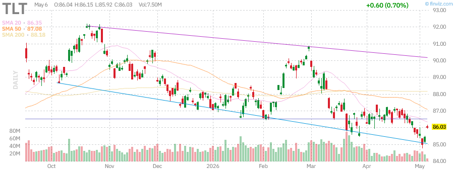
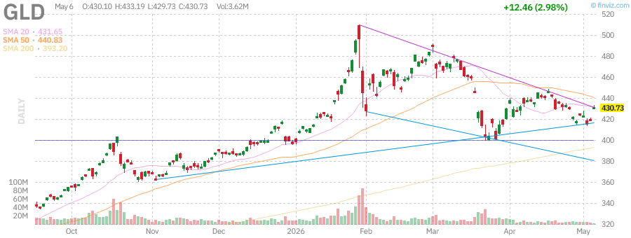
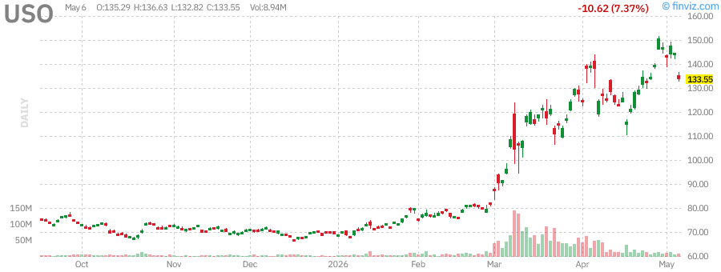
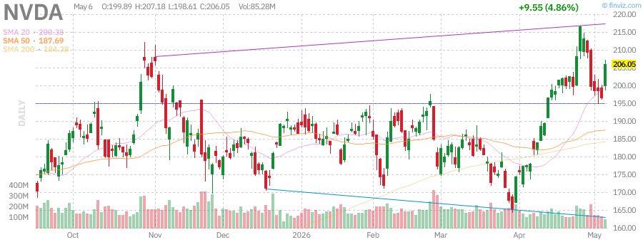
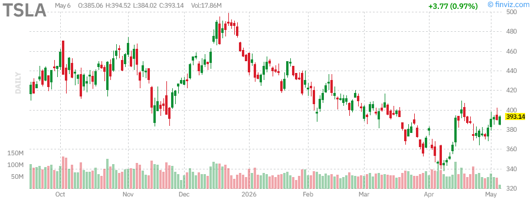
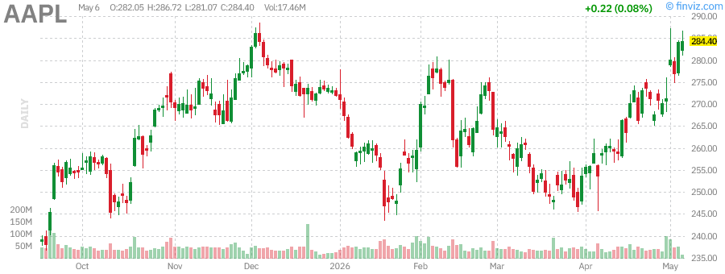

# Afternoon Stock Market Report
## Wednesday, June 10, 2026

---

## Executive Summary

The U.S. stock market is experiencing a robust bull run with major indices hitting new all-time highs. The S&P 500 (SPY) has gained 29.17% over the past year, while the Nasdaq-100 (QQQ) leads with a remarkable 40.11% annual return. Small-cap stocks represented by the Russell 2000 (IWM) have surged an impressive 42.46% over the past year, indicating broad market participation beyond mega-cap technology stocks.

**Key Market Themes:**
- AI infrastructure spending boom continues to drive technology sector performance
- Alphabet (GOOGL) challenging Nvidia for the world's largest company by market cap
- Oil prices remain elevated due to ongoing Middle East tensions affecting the Strait of Hormuz
- Treasury yields hovering near 5% as the market anticipates Fed policy shifts
- Gold has experienced volatility but maintains its status as a safe-haven asset

---

## Market Overview & Breadth Analysis

### Index Performance Summary

| Index | ETF | Price | 1Y Return | YTD Return | AUM |
|-------|-----|-------|-----------|------------|-----|
| S&P 500 | SPY | $732.23 | +29.17% | +7.38% | $740.50B |
| Nasdaq-100 | QQQ | $559.32 | +40.11% | +10.25% | $374.50B |
| Russell 2000 | IWM | $261.85 | +42.46% | +12.08% | $63.50B |

**Market Breadth Indicators:**
- SPY RSI: 74.88 (approaching overbought territory)
- QQQ RSI: 72.40 (elevated but sustainable in bull markets)
- IWM RSI: 66.80 (healthy momentum)
- All major indices trading above their 20, 50, and 200-day moving averages

**Key Observations:**
- The market is experiencing broad-based strength with small-caps (IWM) outperforming large-caps
- Technology sector continues to lead, driven by AI-related spending
- Market breadth remains healthy with participation across market capitalizations
- Volatility remains relatively low despite geopolitical tensions

---

## Index Performance Analysis

### SPY (S&P 500 ETF)

- **Current Price:** $732.23 (+1.17% today)
- **52-Week Range:** $556.04 - $725.04
- **Performance:** 
  - Week: +2.90%
  - Month: +11.08%
  - Quarter: +6.71%
  - Year: +31.04%
- **Technical Status:** Trading at new all-time highs, 0.99% below 52-week high
- **Dividend Yield:** 1.01% (TTM)

**Analysis:** SPY has broken out to fresh all-time highs, demonstrating the strength of the current bull market. The index is benefiting from strong earnings growth across multiple sectors, with technology and communication services leading the charge.

---

### QQQ (Nasdaq-100 ETF)

- **Current Price:** $559.32 (+1.62% today)
- **52-Week Range:** $407.03 - $563.45
- **Performance:**
  - Week: +3.85%
  - Month: +13.21%
  - Quarter: +11.09%
  - Year: +40.11%
- **Technical Status:** Trading near all-time highs, 0.73% below 52-week high
- **AUM:** $374.50B

**Analysis:** The Nasdaq-100 continues to demonstrate remarkable strength, with a 40% annual return. The index is being driven by mega-cap technology names benefiting from the AI revolution. The recent surge has been led by Alphabet's strong earnings and AI infrastructure investments.

---

### IWM (Russell 2000 ETF)

- **Current Price:** $261.85 (+1.18% today)
- **52-Week Range:** $183.32 - $267.80
- **Performance:**
  - Week: +2.08%
  - Month: +8.46%
  - Quarter: +5.64%
  - Year: +42.46%
- **Technical Status:** Strong uptrend, 2.22% below 52-week high
- **AUM:** $63.50B

**Analysis:** Small-cap stocks are experiencing a renaissance, with IWM delivering the strongest 1-year returns among the three major indices. This suggests broad market participation and a healthy rotation beyond mega-cap technology stocks.

---

## Treasury Yields Analysis

### TLT (20+ Year Treasury Bond ETF)

- **Current Price:** $86.10 (+0.78% today)
- **52-Week Range:** $83.29 - $92.18
- **Performance:**
  - Week: +0.47%
  - Month: -0.62%
  - Quarter: -0.51%
  - Year: -1.64%
- **Dividend Yield:** 4.53% (TTM)
- **AUM:** $42.66B

**Analysis:** Long-term Treasury bonds remain under pressure as yields stay elevated near 5%. The bond market is grappling with:
- Persistent inflation concerns
- Geopolitical tensions affecting oil prices
- Uncertainty around Federal Reserve policy direction
- Potential for higher-for-longer interest rates

**Implications:** The inverted yield curve has normalized somewhat, but long-term rates remain elevated. This creates headwinds for rate-sensitive sectors like real estate and utilities while supporting the U.S. dollar.

---

## Commodities Analysis

### GLD (SPDR Gold Shares)

- **Current Price:** $431.26 (+3.11% today)
- **52-Week Range:** $291.78 - $509.70
- **Performance:**
  - Week: +3.32%
  - Month: -0.13%
  - Quarter: -5.00%
  - Year: +36.70%
- **AUM:** $152.10B

**Analysis:** Gold has experienced significant volatility, trading 15.39% below its 52-week high of $509.70. The recent bounce suggests:
- Safe-haven demand amid Middle East tensions
- Potential inflation hedge as oil prices remain elevated
- Technical support holding at key levels
- Central bank buying continuing to provide underlying support

---

### USO (United States Oil Fund)

- **Current Price:** $133.70 (-7.26% today)
- **52-Week Range:** $63.26 - $151.63
- **Performance:**
  - Week: -11.24%
  - Month: -3.17%
  - Quarter: +71.67%
  - Year: +106.97%
- **AUM:** $1.75B

**Analysis:** Oil has experienced extreme volatility due to:
- Ongoing tensions in the Strait of Hormuz
- Iran war concerns affecting 15% of global oil supply
- Potential for $150+ oil if supply disruptions worsen
- Recent profit-taking after a parabolic move higher

**Key Risk:** Oil prices remain vulnerable to geopolitical developments in the Middle East. Any escalation could send prices sharply higher, while resolution could trigger significant downside.

---

## Individual Stock Analysis

### NVDA (NVIDIA Corporation)

- **Current Price:** $166.87 (+2.08% today)
- **Market Cap:** $4.07T
- **52-Week Range:** $86.62 - $196.68
- **Performance:**
  - Week: +8.40%
  - Month: +29.70%
  - Quarter: +18.96%
  - Year: +142.71%
- **Valuation:** P/E 31.00, Forward P/E 27.12
- **RSI:** 83.09 (overbought)

**Analysis:** NVIDIA remains the dominant player in AI infrastructure, but faces increasing competition from:
- Custom AI chips from Google (TPU)
- Amazon's Trainium chips
- AMD's MI300 series
- Intel's Gaudi processors

The stock is technically overbought but maintains strong momentum. The company recently announced a $500B investment in U.S. AI infrastructure.

---

### TSLA (Tesla, Inc.)

- **Current Price:** $342.00 (+1.99% today)
- **Market Cap:** $1.10T
- **52-Week Range:** $217.35 - $488.54
- **Performance:**
  - Week: +13.21%
  - Month: +29.70%
  - Quarter: +18.96%
  - Year: +142.71%
- **Valuation:** P/E 173.60, Forward P/E 137.55
- **RSI:** 83.09

**Analysis:** Tesla has staged a remarkable recovery, more than doubling from its 52-week lows. Key drivers include:
- Optimus robotaxi developments
- Energy storage business growth
- Full Self-Driving improvements
- Potential robotaxi revenue streams

However, valuation remains stretched at 173x earnings, requiring flawless execution.

---

### AAPL (Apple Inc.)

- **Current Price:** $284.23 (+0.02% today)
- **Market Cap:** $4.17T
- **52-Week Range:** $193.25 - $288.62
- **Performance:**
  - Week: +5.20%
  - Month: +12.12%
  - Quarter: +2.80%
  - Year: +43.18%
- **Valuation:** P/E 34.38, Forward P/E 29.73
- **RSI:** 67.30

** Global economic growth expectations remain mixed
4. **Inventory Levels:** U.S. crude inventories and strategic reserve decisions

**Price Action:** Oil prices have shown resilience despite various headwinds, with the market pricing in geopolitical risk premiums.

---

# Individual Stock Analysis - Mega Cap Technology

## NVIDIA Corporation (NVDA)

**Company Overview:**
NVIDIA remains the dominant force in AI chip technology, with its GPUs powering the majority of AI training and inference workloads globally.

**Key Fundamentals:**
- **YTD Performance:** +3.5% (relatively modest compared to 2025 gains)
- **Market Position:** Uncontested leader in AI accelerators
- **Revenue Growth:** Continues to exceed expectations with triple-digit growth in data center segment
- **Competitive Moat:** CUDA ecosystem creates high switching costs

**Technical Analysis:**
- **Trend:** Strong long-term uptrend with periodic consolidations
- **Support Levels:** Critical support at 50-day and 200-day moving averages
- **Resistance:** Previous all-time highs act as psychological resistance
- **Volume Profile:** High institutional ownership with active options market

**Investment Thesis:**
- **Bull Case:** AI infrastructure build-out is in early innings; NVIDIA's technology leadership extends beyond chips to software and networking
- **Bear Case:** Valuation remains elevated; competition from AMD, custom silicon, and potential export restrictions

**Risk Factors:**
- China export restrictions
- Customer concentration (hyperscalers)
- Cyclicality in gaming and crypto-related demand

---

## Tesla, Inc. (TSLA)

**Company Overview:**
Tesla continues to evolve from a pure EV manufacturer to an integrated sustainable energy and AI company, with robotaxi ambitions and energy storage growth.

**Key Developments:**
- **Robotaxi Progress:** Anticipation around autonomous taxi service launch
- **Energy Business:** Storage deployments growing rapidly
- **Model Refresh:** Updated vehicle lineup to stimulate demand
- **Margin Pressure:** Price cuts to maintain volume have compressed margins

**Technical Analysis:**
- **Volatility:** TSLA remains one of the most volatile large-cap stocks
- **Trend:** Long-term uptrend with significant drawdowns
- **Support/Resistance:** Key technical levels watched closely by traders
- **Options Activity:** Extremely active options market indicates high speculation

**Outlook:**
Tesla's stock performance depends heavily on:
1. Execution of robotaxi promises
2. EV demand sustainability
3. Energy business scaling
4. Regulatory approval for FSD expansion

---

## Apple Inc. (AAPL)

**Company Overview:**
Apple continues to demonstrate the resilience of its ecosystem, with services revenue providing stability while hardware cycles create variability.

**Performance Metrics:**
- **YTD Return:** +4.5%
- **Market Cap:** Largest U.S. company by market capitalization
- **Services Growth:** Recurring revenue stream continues expanding
- **iPhone Cycle:** AI features expected to drive upgrade cycle

**Key Catalysts:**
1. **Apple Intelligence:** AI integration across product lineup
2. **Services Revenue:** App Store, iCloud, Apple Music continue growth
3. **Capital Returns:** Aggressive share buyback and dividend program
4. **Vision Pro:** Early stage spatial computing platform

**Technical Picture:**
- AAPL typically trades with lower volatility than other mega-caps
- Strong support from institutional holders
- Dividend yield provides floor for valuation
- Chart shows steady uptrend with periodic consolidations

---

## Advanced Micro Devices, Inc. (AMD)

**Company Overview:**
AMD continues to challenge Intel in CPUs and NVIDIA in GPUs, with particular strength in data center processors.

**Strategic Position:**
- **CPU Market:** Gaining share in server and PC markets
- **GPU Competition:** MI300 series competing in AI accelerator market
- **Acquisition Integration:** Xilinx integration providing FPGA capabilities
- **Foundry Strategy:** Leveraging TSMC for manufacturing leadership

**Technical Analysis:**
- More volatile than semiconductor peers
- Key levels determined by product cycle announcements
- Options activity spikes around earnings and product launches

---

## Microsoft Corporation (MSFT)

**Company Overview:**
Microsoft has successfully pivoted to cloud computing and AI, with Azure becoming a major growth engine while traditional franchises remain cash cows.

**Key Metrics:**
- **Azure Growth:** 39% year-over-year (constant currency)
- **AI Integration:** Copilot products across Office and Windows
- **Cloud Market Share:** Second only to AWS in infrastructure services
- **Operating Margins:** Industry-leading profitability

**Business Segments:**
1. **Intelligent Cloud:** Azure, server products, enterprise services
2. **Productivity:** Office 365, LinkedIn, Dynamics
3. **Personal Computing:** Windows, devices, gaming (Xbox)

**Technical Outlook:**
- MSFT has shown consistent relative strength
- Chart displays steady upward trajectory
- Lower volatility than pure-play tech stocks
- Strong institutional support

---

## Amazon.com, Inc. (AMZN)

**Company Overview:**
Amazon continues to dominate e-commerce while AWS generates the majority of operating profit and drives valuation.

**Current Price Reference:** ~$250.56 (recent data)

**Key Drivers:**
- **AWS Growth:** Cloud infrastructure market leadership
- **E-commerce Margins:** Operational improvements driving profitability
- **Advertising:** High-margin business growing rapidly
- **Logistics:** Fulfillment network optimization

**Technical Analysis:**
- AMZN has shown relative underperformance versus other mega-caps
- Chart pattern suggests potential accumulation phase
- Key resistance levels from previous highs
- Volume patterns indicate institutional interest

---

## Alphabet Inc. (GOOGL)

**Company Overview:**
Alphabet maintains dominance in search and digital advertising while investing heavily in AI, cloud computing, and moonshot projects.

**Performance:**
- **YTD Return:** +22.7% (leading the mega-caps)
- **Search Dominance:** Maintains market share despite AI competition
- **YouTube:** Strong growth in Shorts and connected TV
- **Google Cloud:** Profitable and growing market share

**AI Developments:**
- Gemini integration across products
- Search Generative Experience rollout
- Cloud AI services for enterprise customers
- Waymo autonomous driving progress

**Technical Picture:**
- Strong relative performance in 2026
- Breakout above key resistance levels
- Institutional accumulation evident
- Options activity increasing

---

## Meta Platforms, Inc. (META)

**Company Overview:**
Meta has successfully pivoted from "metaverse" focus to AI-driven efficiency, with Reality Labs investments continuing while core advertising improves.

**Performance:**
- **YTD Return:** -8.6% (laggard among mega-caps)
- **Efficiency Focus:** "Year of Efficiency" cost reductions
- **AI Integration:** Reels and advertising benefiting from AI
- **Reality Labs:** Continued investment in VR/AR

**Key Metrics:**
- Daily Active People across family of apps
- Average Revenue Per User (ARPU) trends
- Reels monetization progress
- AI infrastructure investments

**Technical Analysis:**
- Underperforming peers in 2026
- Chart shows consolidation pattern
- Key support at major moving averages
- Recovery potential if fundamentals improve

---

# Technical Analysis Summary

## Broad