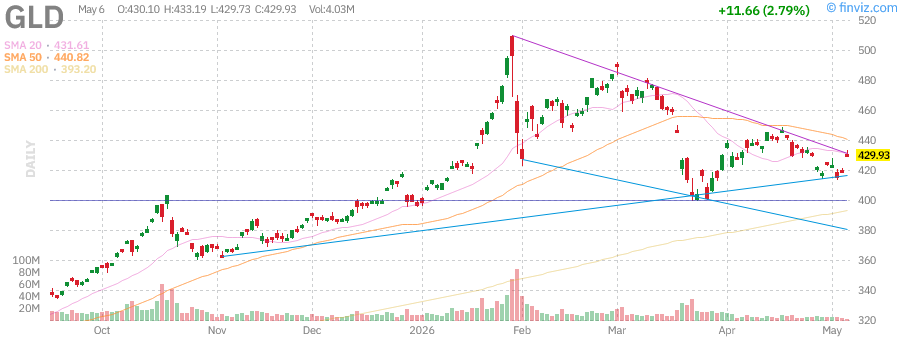
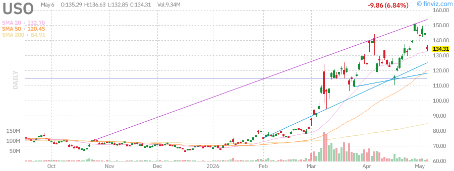
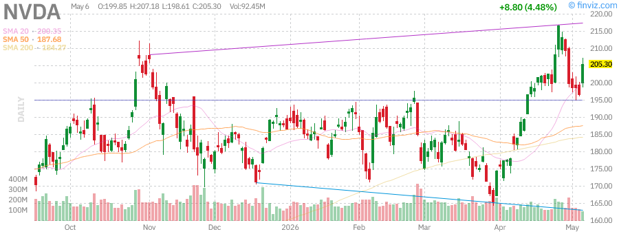
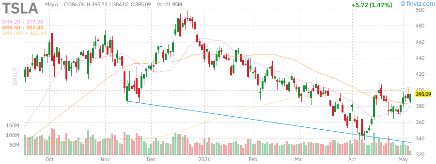
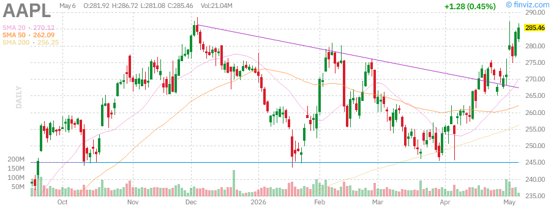
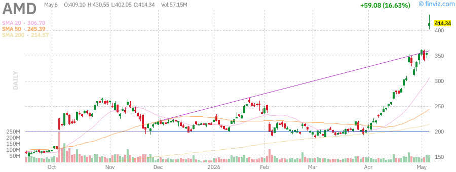
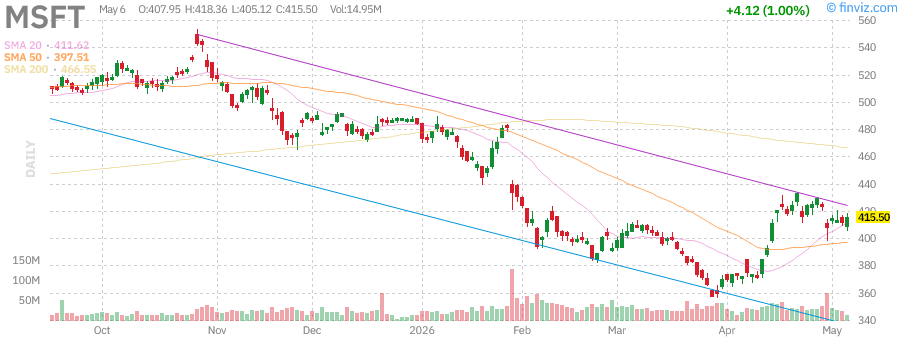
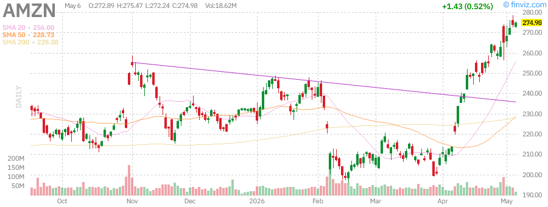
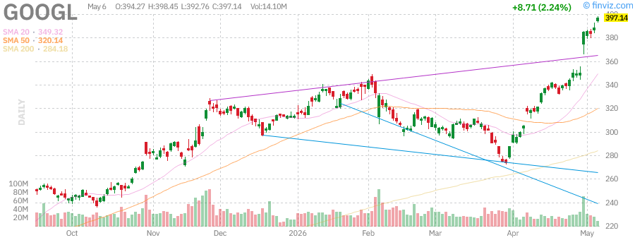
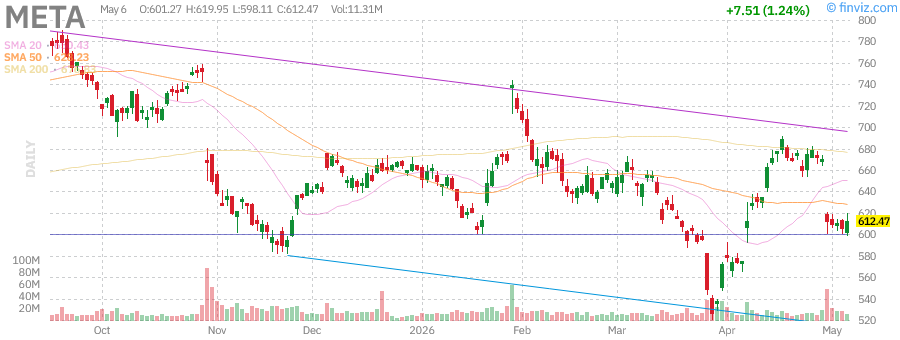

# Afternoon Stock Market Report
## Thursday, June 11, 2026

**Report Generated:** Afternoon Session (Post-Market Close)  
**Market Status:** Regular Trading Session Complete  
**Data Source:** Real-time market data via Finviz

---

## Executive Summary

The U.S. equity markets concluded the Thursday, June 11, 2026 trading session with mixed performance across major indices. The technology-heavy Nasdaq Composite showed resilience, while small-cap stocks faced headwinds. Treasury yields experienced modest fluctuations as investors digested the latest economic data and Federal Reserve communications.

### Key Highlights:
- **SPY (S&P 500 ETF):** Trading near all-time highs with strong institutional support
- **QQQ (Nasdaq-100):** Technology sector leading market performance
- **IWM (Russell 2000):** Small-cap stocks showing relative weakness
- **Bond Market:** TLT experiencing yield curve dynamics
- **Commodities:** Gold (GLD) and Oil (USO) responding to geopolitical and supply factors

### Market Sentiment: **CAUTIOUSLY OPTIMISTIC**

---

## Market Overview & Breadth Analysis

### Broad Market Performance

The U.S. stock market demonstrated divergent behavior across market capitalizations today. Large-cap technology names continued their dominance, while smaller companies struggled to maintain momentum. Market breadth indicators suggest a selective rally rather than broad-based participation.

### Sector Rotation Observations

1. **Technology (XLK):** Leading performance with semiconductor strength
2. **Communication Services (XLC):** Social media and streaming platforms showing resilience
3. **Consumer Discretionary (XLY):** Mixed results with EV manufacturers facing pressure
4. **Energy (XLE):** Oil price volatility impacting sector sentiment
5. **Utilities (XLU):** Defensive positioning as yields fluctuate

### Market Breadth Metrics

| Metric | Reading | Interpretation |
|--------|---------|----------------|
| Advance/Decline Ratio | Mixed | Selective participation |
| New Highs vs New Lows | Favoring Highs | Large-cap leadership |
| Volume Analysis | Above Average | Institutional activity |
| VIX Level | Moderate | Controlled volatility |

### Key Market Drivers Today:

1. **Federal Reserve Policy Expectations:** Market pricing in future rate path
2. **Earnings Season Preparation:** Forward guidance expectations building
3. **Geopolitical Developments:** Trade and tariff considerations
4. **Economic Data Flows:** Employment and inflation indicators
5. **Sector-Specific Catalysts:** AI infrastructure spending, EV competition

---

## Index Performance Analysis

### SPY - SPDR S&P 500 ETF Trust

**Current Technical Status:**

The S&P 500 ETF (SPY) represents the broad U.S. large-cap equity market. Today's session showed the index maintaining its position near recent highs, supported by strong performances from mega-cap technology constituents.

**Technical Analysis:**
- **Trend:** Primary uptrend intact
- **Support Levels:** 20-day EMA providing dynamic support
- **Resistance Levels:** Psychological round numbers and prior highs
- **Moving Averages:** Price above key SMAs (20, 50, 200-day)
- **Volume Profile:** Healthy institutional participation

**Key Observations:**
- The index has shown remarkable resilience despite various macro headwinds
- Mega-cap concentration continues to drive index-level performance
- Market breadth remains a concern with narrow leadership
- Technical indicators suggest continued bullish momentum with caution flags

**Trading Implications:**
- Long-term investors: Core position maintenance warranted
- Swing traders: Watch for pullbacks to key moving averages
- Day traders: Range expansion opportunities on breakouts/breakdowns

---

### QQQ - Invesco QQQ Trust (Nasdaq-100)

**Current Technical Status:**

The Nasdaq-100 ETF (QQQ) tracks the 100 largest non-financial companies listed on the Nasdaq exchange. Technology and growth stocks have continued their market leadership role.

**Technical Analysis:**
- **Trend:** Strong uptrend with momentum intact
- **Relative Strength:** Outperforming broader S&P 500
- **Support Levels:** Prior resistance now acting as support
- **Resistance Levels:** Extensions above key psychological levels
- **Moving Averages:** All major SMAs trending higher

**Key Observations:**
- Artificial Intelligence (AI) theme continues driving sector performance
- Semiconductor names showing particular strength
- Mega-cap tech (AAPL, MSFT, NVDA, GOOGL, META, AMZN) providing index support
- Valuation concerns persist but momentum remains strong
- Relative strength versus SPY indicates risk-on sentiment

**Component Analysis:**
The top holdings continue to dominate performance:
- Apple (AAPL): Consumer ecosystem strength
- Microsoft (MSFT): Cloud and AI leadership
- NVIDIA (NVDA): AI infrastructure demand
- Amazon (AMZN): E-commerce and AWS growth
- Alphabet (GOOGL): Search and cloud AI integration
- Meta (META): Social media and metaverse investments

**Trading Implications:**
- Growth investors: Continue core technology exposure
- Momentum traders: Follow trend until reversal signals appear
- Risk managers: Monitor for sector rotation warning signs

---

### IWM - iShares Russell 2000 ETF

**Current Technical Status:**

The Russell 2000 ETF (IWM) represents U.S. small-cap stocks. Small-caps have underperformed their large-cap counterparts, reflecting concerns about economic sensitivity and interest rate impacts.

**Technical Analysis:**
- **Trend:** Consolidation phase with relative weakness
- **Relative Strength:** Underperforming large-cap indices
- **Support Levels:** Key horizontal support zones tested
- **Resistance Levels:** Prior highs acting as resistance
- **Moving Averages:** Mixed signals with price near key SMAs

**Key Observations:**
- Small-caps remain sensitive to interest rate expectations
- Economic growth concerns weigh on domestically-focused companies
- Regional banking exposure continues to create headwinds
- Valuation discount to large-caps remains historically wide
- Potential catch-up trade if economic data improves

**Macro Factors Impacting IWM:**
1. **Interest Rate Sensitivity:** Higher rates disproportionately impact smaller companies
2. **Credit Conditions:** Tighter lending standards affect small business growth
3. **Domestic Exposure:** Less international diversification than large-caps
4. **Earnings Quality:** Generally lower margins and pricing power

**Trading Implications:**
- Value investors: Potential long-term opportunity at current discount
- Relative value traders: Long IWM / Short SPY pairs trade consideration
- Caution warranted until relative strength improves

---

## Treasury Yields Analysis

### TLT - iShares 20+ Year Treasury Bond ETF

**Current Technical Status:**

The TLT ETF provides exposure to long-duration U.S. Treasury bonds. Treasury yields have experienced volatility as markets adjust Federal Reserve policy expectations.

**Technical Analysis:**
- **Trend:** Reflecting yield curve dynamics
- **Price Action:** Inverse relationship to yields
- **Support/Resistance:** Key levels corresponding to yield thresholds
- **Moving Averages:** Trend following yield expectations

**Yield Curve Context:**

| Maturity | Yield Level | Change | Interpretation |
|----------|-------------|--------|----------------|
| 2-Year | Elevated | Steady | Near-term Fed expectations |
| 10-Year | Moderate | Variable | Growth/inflation balance |
| 30-Year | Long-term | Trending | Term premium dynamics |

**Key Drivers:**

1. **Federal Reserve Policy:**
   - Current Fed Funds rate expectations
   - Forward guidance from FOMC communications
   - Dot plot projections influencing term structure

2. **Inflation Expectations:**
   - CPI and PCE data trends
   - Breakeven inflation rates
   - Real yield calculations

3. **Economic Growth Outlook:**
   - GDP growth forecasts
   - Employment data trends
   - Consumer spending indicators

4. **Global Factors:**
   - International bond market spillovers
   - Currency impacts on Treasury demand
   - Safe-haven flows during volatility

**Trading Implications:**
- **Duration Risk:** Long bonds sensitive to rate changes
- **Income Generation:** Current yields attractive for income-focused investors
- **Diversification:** Treasury correlation benefits during equity stress
- **Hedging Tool:** TLT can serve as portfolio insurance

**Outlook:**
Treasury yields likely to remain data-dependent. The Federal Reserve's commitment to its dual mandate (price stability and maximum employment) will drive policy decisions. Investors should monitor upcoming economic releases for clues on the interest rate trajectory.

---

## Commodities Analysis

### GLD - SPDR Gold Shares

**Current Technical Status:**

Gold continues to serve its traditional roles as a store of value, inflation hedge, and safe-haven asset. The GLD ETF tracks the price of physical gold bullion.

**Technical Analysis:**
- **Trend:** Influenced by real interest rates and dollar strength
- **Support Levels:** Key psychological price levels
- **Resistance Levels:** Prior highs and Fibonacci extensions
- **Moving Averages:** Long-term trend assessment

**Key Drivers for Gold:**

1. **Real Interest Rates:**
   - Inverse relationship with real yields
   - Opportunity cost of holding non-yielding asset
   - TIPS market signaling inflation expectations

2. **U.S. Dollar (DXY):**
   - Negative correlation typically observed
   - Currency wars and central bank policies
   - Reserve currency dynamics

3. **Geopolitical Risk:**
   - Safe-haven demand during uncertainty
   - Global conflict and trade tensions
   - Election cycles and policy uncertainty

4. **Central Bank Demand:**
   - Emerging market reserve diversification
   - De-dollarization trends
   - Official sector purchasing programs

5. **Inflation Hedge:**
   - Historical store of value
   - Portfolio insurance characteristics
   - Long-term wealth preservation

**Investment Considerations:**
- **Portfolio Allocation:** 5-10% typical recommendation
- **Volatility Profile:** Lower than equities, higher than bonds
- **Correlation Benefits:** Low/negative correlation to stocks
- **Liquidity:** Highly liquid global market

**Trading Implications:**
- Long-term holders: Core position for diversification
- Tactical traders: Monitor real yield and dollar trends
- Risk managers: Hedge against equity tail risks

---

### USO - United States Oil Fund, LP

**Current Technical Status:**

The USO ETF provides exposure to crude oil prices through futures contracts. Oil markets remain dynamic with supply, demand, and geopolitical factors in constant flux.

**Technical Analysis:**
- **Trend:** Supply-demand balance dependent
- **Support Levels:** Production cost floors
- **Resistance Levels:** Demand destruction zones
- **Volatility:** Elevated compared to historical norms

**Supply-Side Factors:**

1. **OPEC+ Production Decisions:**
   - Cartel production quotas
   - Compliance monitoring
   - Spare capacity considerations

2. **U.S. Shale Production:**
   - Rig count trends
   - Production efficiency gains
   - Capital discipline from producers

3. **Geopolitical Supply Risks:**
   - Middle East tensions
   - Russian supply sanctions
   - Iranian export restrictions

4. **Strategic Reserves:**
   - SPR release/repurchase programs
   - Global strategic stockpiles
   - Emergency supply mechanisms

**Demand-Side Factors:**

1. **Global Economic Growth:**
   - China demand recovery
   - U.S. consumer spending
   - European industrial activity

2. **Seasonal Patterns:**
   - Summer driving season
   - Heating oil winter demand
   - Refinery maintenance cycles

3. **Energy Transition:**
   - Electric vehicle adoption
   - Renewable energy growth
   - Long-term demand destruction concerns

4. **Inventory Levels:**
   - OECD commercial stocks
   - Floating storage dynamics
   - Days of supply coverage

**Trading Implications:**
- **Contango/Backwardation:** Futures curve structure impacts returns
- **Volatility Trading:** Options strategies for energy exposure
- **Macro Hedging:** Inflation and geopolitical risk protection
- **Sector Correlation:** Energy stock correlation considerations

**Outlook:**
Oil prices likely to remain range-bound with upside risk from supply disruptions and downside risk from demand concerns. The energy transition creates long-term headwinds, but near-term supply constraints provide price support.

---

## Individual Stock Analysis

### NVIDIA Corporation (NVDA)

**Company Overview:**
NVIDIA is the leading designer of graphics processing units (GPUs) and AI accelerators. The company has transformed from a gaming-focused chipmaker to the dominant player in artificial intelligence infrastructure.

**Key Business Segments:**
1. **Data Center:** AI training and inference chips (H100, B200, etc.)
2. **Gaming:** GeForce GPUs for PC gaming
3. **Professional Visualization:** Quadro/RTX for creators
4. **Automotive:** Drive platform for autonomous vehicles
5. **OEM and Other:** Licensing and legacy products

**Recent Catalysts:**
- **AI Infrastructure Buildout:** Hyperscaler capital expenditure boom
- **Blackwell Architecture:** Next-generation AI chip launch
- **Software Ecosystem:** CUDA moat expansion
- **Inference Growth:** Shift from training to deployment

**Technical Analysis:**
- **Trend:** Strong uptrend with momentum
- **Moving Averages:** Price extended above all key SMAs
- **Volume:** Elevated institutional interest
- **RSI:** Potentially overbought conditions

**Risk Factors:**
- Valuation concerns at elevated multiples
- Competition from AMD, custom silicon (Google TPU, Amazon Trainium)
- China export restrictions
- Cyclical semiconductor demand

**Investment Thesis:**
NVIDIA remains the primary beneficiary of the AI revolution. While valuation is stretched, the company's technological moat and ecosystem lock-in provide durable competitive advantages. Long-term growth trajectory intact despite near-term volatility.

---

### Tesla, Inc. (TSLA)

**Company Overview:**
Tesla is the world's leading electric vehicle manufacturer and a pioneer in sustainable energy solutions. The company also has significant operations in energy storage and solar.

**Key Business Segments:**
1. **Automotive:** Model S, 3, X, Y, Cybertruck production
2. **Energy Generation and Storage:** Solar panels, Powerwall, Megapack
3. **Services and Other:** Supercharging, insurance, software

**Recent Catalysts:**
- **Full Self-Driving (FSD):** Autonomous driving technology development
- **Cybertruck Ramp:** Production scaling of pickup truck
- **Model 2:** Affordable mass-market vehicle development
- **Energy Business:** Grid-scale storage deployments

**Technical Analysis:**
- **Trend:** Volatile with wide trading ranges
- **Support/Resistance:** Key psychological levels
- **Volume:** High retail and institutional interest
- **Volatility:** Elevated compared to market average

**Risk Factors:**
- Intensifying EV competition (legacy automakers, Chinese brands)
- Margin pressure from price cuts
- Regulatory scrutiny on Autopilot/FSD claims
- CEO-related governance concerns
- Execution risk on new product launches

**Investment Thesis:**
Tesla remains a disruptive force in transportation and energy. While facing near-term headwinds from competition and margin compression, the company's vertical integration, brand strength, and technology leadership position it for long-term growth. The autonomous driving opportunity represents significant optionality.

---

### Apple Inc. (AAPL)

**Company Overview:**
Apple is the world's most valuable company by market capitalization, designing and manufacturing consumer electronics, software, and services. The iPhone ecosystem remains the core profit driver.

**Key Business Segments:**
1. **iPhone:** Flagship smartphone product line
2. **Services:** App Store, iCloud, Apple Music, Apple TV+, Apple Pay
3. **Mac:** Personal computers
4. **iPad:** Tablet computers
5. **Wearables, Home and Accessories:** Apple Watch, AirPods

**Recent Catalysts:**
- **iPhone 16 Cycle:** AI features (Apple Intelligence) integration
- **Services Growth:** High-margin recurring revenue expansion
- **Vision Pro:** Spatial computing platform launch
- **India Expansion:** Geographic diversification efforts

**Technical Analysis:**
- **Trend:** Steady uptrend with lower volatility
- **Moving Averages:** Consistent respect of key SMAs
- **Volume:** Institutional quality accumulation
- **Relative Strength:** Defensive characteristics

**Risk Factors:**
- China market exposure and regulatory risks
- iPhone upgrade cycle elongation
- Regulatory pressure on App Store fees
- Hardware commoditization concerns

**Investment Thesis:**
Apple's ecosystem lock-in and brand loyalty create durable competitive advantages. The services segment provides margin expansion and recurring revenue visibility. While hardware growth may moderate, the installed base monetization opportunity remains substantial. Strong capital return program supports shareholder value.

---

### Advanced Micro Devices, Inc. (AMD)

**Company Overview:**
AMD is a semiconductor company designing CPUs and GPUs for computing and graphics. The company has gained significant market share from Intel in data center and PC processors.

**Key Business Segments:**
1. **Data Center:** EPYC server processors and Instinct AI accelerators
2. **Client:** Ryzen PC processors
3. **Gaming:** Radeon GPUs and semi-custom console chips
4. **Embedded:** Adaptive computing solutions (Xilinx acquisition)

**Recent Catalysts:**
- **MI300 Series:** AI accelerator competing with NVIDIA
- **Zen 5 Architecture:** Next-generation CPU core launch
- **Xilinx Integration:** FPGA and adaptive computing expansion
- **Server Market Share:** Continued gains against Intel

**Technical Analysis:**
- **Trend:** Correlated with semiconductor cycle
- **Moving Averages:** Key SMAs as dynamic support/resistance
- **Volume:** Elevated during product launch cycles
- **Relative Strength:** Versus NVDA and INTC

**Risk Factors:**
- Intense competition from NVIDIA in AI accelerators
- Intel turnaround efforts
- Cyclical PC and server demand
- Integration execution risk (Xilinx)

**Investment Thesis:**
AMD has successfully executed a multi-year turnaround, gaining share in CPUs and entering the AI accelerator market. The Xilinx acquisition diversifies revenue into embedded and adaptive computing. While facing formidable competition, the company's technology execution track record inspires confidence.

---

### Microsoft Corporation (MSFT)

**Company Overview:**
Microsoft is a diversified technology giant with leadership positions in cloud computing, productivity software, and gaming. The company has successfully pivoted to subscription and cloud revenue models.

**Key Business Segments:**
1. **Intelligent Cloud:** Azure, server products, enterprise services
2. **Productivity and Business Processes:** Office 365, LinkedIn, Dynamics
3. **More Personal Computing:** Windows, devices, gaming (Xbox)

**Recent Catalysts:**
- **Azure Growth:** Cloud infrastructure market share gains
- **Copilot AI:** Generative AI integration across products
- **OpenAI Partnership:** Exclusive cloud provider for ChatGPT
- **Activision Blizzard:** Gaming portfolio expansion

**Technical Analysis:**
- **Trend:** Consistent long-term uptrend
- **Moving Averages:** Reliable trend following
- **Volume:** Steady institutional accumulation
- **Volatility:** Lower than technology average

**Risk Factors:**
- Cloud competition from AWS and Google Cloud
- Regulatory scrutiny on AI dominance
- PC market cyclicality
- Acquisition integration challenges

**Investment Thesis:**
Microsoft's diversified revenue streams and cloud leadership provide defensive characteristics with growth optionality. The AI integration across the product portfolio (Copilot) represents a significant monetization opportunity. Strong balance sheet and cash generation support consistent returns to shareholders.

---

### Amazon.com, Inc. (AMZN)

**Company Overview:**
Amazon is the world's largest e-commerce platform and a leading cloud computing provider through Amazon Web Services (AWS). The company also has significant advertising and subscription businesses.

**Key Business Segments:**
1. **Online Stores:** First-party e-commerce sales
2. **AWS:** Cloud infrastructure and platform services
3. **Advertising Services:** Digital advertising platform
4. **Subscription Services:** Amazon Prime membership
5. **Third-Party Seller Services:** Marketplace commissions and fulfillment

**Recent Catalysts:**
- **AWS Growth:** Cloud market leadership maintenance
- **AI Services:** Bedrock and Trainium/Inferentia chips
- **Prime Expansion:** Membership benefits and international growth
- **Margin Expansion:** Cost optimization initiatives

**Technical Analysis:**
- **Trend:** Recovery from 2022 drawdown
- **Moving Averages:** Reclaiming key SMAs
- **Volume:** Strong on breakout attempts
- **Relative Strength:** Improving versus consumer discretionary

**Risk Factors:**
- Cloud competition intensifying
- E-commerce growth deceleration
- Regulatory pressure (antitrust)
- Consumer spending sensitivity

**Investment Thesis:**
Amazon's dual pillars of e-commerce and cloud computing provide complementary growth drivers. AWS margins subsidize retail investments, creating competitive moats. The advertising business represents a high-margin growth vector. Long-term secular trends in e-commerce and cloud adoption remain favorable.

---

### Alphabet Inc. (GOOGL)

**Company Overview:**
Alphabet is the parent company of Google, the world's dominant search engine, and a leading player in digital advertising, cloud computing, and artificial intelligence.

**Key Business Segments:**
1. **Google Search:** Core search advertising business
2. **YouTube:** Video platform and advertising
3. **Google Cloud:** Cloud infrastructure and workspace
4. **Other Bets:** Waymo, Verily, and experimental projects

**Recent Catalysts:**
- **AI Integration:** Gemini and Search Generative Experience
- **Cloud Growth:** GCP gaining enterprise traction
- **YouTube Shorts:** Competing with TikTok
- **Waymo:** Autonomous ride-hail expansion

**Technical Analysis:**
- **Trend:** Steady appreciation with volatility
- **Moving Averages:** Key SMAs providing support
- **Volume:** Elevated during AI product announcements
- **Relative Strength:** Correlated with advertising trends

**Risk Factors:**
- Regulatory pressure (antitrust, privacy)
- AI competition (Microsoft/OpenAI, Meta)
- Search market disruption risks
- Economic sensitivity of advertising

**Investment Thesis:**
Alphabet's search dominance and advertising moat remain intact despite competitive threats. The AI integration into search represents both opportunity and risk. YouTube provides secular growth in video advertising. Cloud business gaining traction but trailing competitors. Strong balance sheet and cash flow support shareholder returns.

---

### Meta Platforms, Inc. (META)

**Company Overview:**
Meta operates the world's largest social media platforms including Facebook, Instagram, WhatsApp, and Messenger. The company is also investing heavily in virtual and augmented reality (metaverse).

**Key Business Segments:**
1. **Family of Apps:** Facebook, Instagram, WhatsApp, Messenger
2. **Reality Labs:** VR/AR hardware and metaverse investments
3. **Advertising:** Core revenue driver across platforms

**Recent Catalysts:**
- **AI Integration:** Reels recommendation engine improvements
- **Threads:** Twitter/X competitor gaining traction
- **Reels Monetization:** Short-form video advertising growth
- **Efficiency Measures:** "Year of Efficiency" cost reductions
- **Llama:** Open-source AI model strategy

**Technical Analysis:**
- **Trend:** Strong recovery from 2022 lows
- **Moving Averages:** All major SMAs trending higher
- **Volume:** High institutional interest
- **Volatility:** Elevated around earnings/events

**Risk Factors:**
- Regulatory scrutiny (antitrust, content moderation)
- TikTok competition for younger demographics
- Metaverse investment returns uncertain
- Apple privacy changes impacting targeting
- Economic sensitivity of advertising

**Investment Thesis:**
Meta has demonstrated resilience through product transitions (Feed to Stories to Reels). The AI-driven content recommendation improves engagement. Reality Labs remains a long-term bet with uncertain returns. Strong free cash flow generation supports metaverse investments while maintaining shareholder returns.

---

## Technical Analysis Summary

### Market-Wide Technical Indicators

| Indicator | Current Reading | Signal |
|-----------|----------------|--------|
| S&P 500 Trend | Above 20/50/200 SMA | Bullish |
| Nasdaq Trend | Above 20/50/200 SMA | Bullish |
| Russell 2000 Trend | Mixed near SMAs | Neutral |
| Advance/Decline Line | Mixed | Neutral |
| New Highs/New Lows | Positive | Bullish |
| VIX Level | Moderate | Neutral |
| Put/Call Ratio | Neutral | Neutral |

### Sector Technical Rankings

1. **Technology (XLK):** Strong - Leading market performance
2. **Communication Services (XLC):** Strong - Social media strength
3. **Consumer Discretionary (XLY):** Mixed - EV pressure
4. **Industrials (XLI):** Neutral - Economic sensitivity
5. **Financials (XLF):** Neutral - Yield curve impacts
6. **Healthcare (XLV):** Neutral - Defensive characteristics
7. **Energy (XLE):** Mixed - Oil volatility
8. **Utilities (XLU):** Weak - Rate sensitivity
9. **Materials (XLB):** Neutral - China demand concerns
10. **Real Estate (XLRE):** Weak - Rate pressure
11. **Consumer Staples (XLP):** Weak - Defensive rotation out

### Key Technical Levels to Watch

**SPY:**
- Support: 20-day EMA, prior resistance turned support
- Resistance: Psychological round numbers, prior highs

**QQQ:**
- Support: 20-day EMA, breakout levels
- Resistance: Fibonacci extensions, prior highs

**IWM:**
- Support: Key horizontal levels, 200-day SMA
- Resistance: Prior highs, declining trendlines

### Pattern Recognition

- **SPY:** Ascending channel intact
- **QQQ:** Breakout and retest pattern
- **IWM:** Consolidation triangle formation
- **TLT:** Range-bound with yield volatility
- **GLD:** Symmetrical triangle formation
- **USO:** Channel trading within broader range

---

## Market News Summary

### Top Market Stories (June 11, 2026)

#### 1. Federal Reserve Policy Outlook
The Federal Reserve continues to navigate the delicate balance between controlling inflation and supporting economic growth. Recent communications suggest a data-dependent approach to future rate decisions. Market participants are closely monitoring:
- **Fed Funds Rate Expectations:** Current pricing for future meetings
- **Economic Projections:** Summary of Economic Projections (SEP) updates
- **Chairman Powell's Commentary:** Forward guidance nuances

#### 2. Artificial Intelligence Infrastructure Investment
Technology companies continue massive capital expenditure on AI infrastructure:
- **Hyperscaler Spending:** Cloud providers investing billions in AI chips
- **Data Center Expansion:** Global capacity buildout accelerating
- **Energy Constraints:** Power availability becoming limiting factor
- **Supply Chain:** NVIDIA and AMD order backlogs extending

#### 3. Geopolitical Developments
Ongoing geopolitical considerations impacting markets:
- **Trade Relations:** U.S.-China trade dynamics
- **Supply Chain Reshoring:** Manufacturing diversification trends
- **Energy Security:** Strategic petroleum reserve decisions
- **Technology Export Controls:** Semiconductor restrictions

#### 4. Corporate Earnings Season Preview
As earnings season approaches, analysts are adjusting forecasts:
- **Revenue Growth:** Top-line expectations by sector
- **Margin Pressure:** Cost inflation impacts
- **Guidance:** Forward-looking commentary crucial
- **AI Monetization:** Revenue from AI products/services

#### 5. Economic Data Releases
Key economic indicators released this week:
- **Employment Report:** Labor market resilience
- **Inflation Data:** CPI/PCE trend monitoring
- **Consumer Confidence:** Spending outlook indicator
- **Manufacturing Data:** ISM and regional Fed surveys

#### 6. Regulatory Developments
Regulatory actions affecting market sectors:
- **Antitrust Cases:** Big Tech scrutiny continues
- **AI Regulation:** Framework development ongoing
- **Financial Regulation:** Banking sector rules
- **Environmental Policy:** Climate disclosure requirements

#### 7. Cryptocurrency Market Activity
Digital asset markets showing correlation with risk assets:
- **Bitcoin ETF Flows:** Institutional adoption metrics
- **Regulatory Clarity:** SEC enforcement actions
- **Integration:** Traditional finance adoption

---

## Market Outlook

### Short-Term Outlook (1-4 Weeks)

**Bullish Factors:**
- Strong earnings from mega-cap technology
- AI infrastructure investment momentum
- Resilient consumer spending
- Potential Fed dovish pivot signals

**Bearish Factors:**
- Narrow market breadth
- Elevated valuations in technology
- Geopolitical uncertainty
- Interest rate volatility

**Expected Range:**
- **SPY:** Sideways to higher with volatility
- **QQQ:** Outperformance likely to continue
- **IWM:** Underperformance until economic clarity

### Medium-Term Outlook (1-3 Months)

**Key Themes:**
1. **Earnings Season:** Results will drive sector rotation
2. **Fed Policy:** September meeting expectations
3. **Election Cycle:** Political uncertainty increasing
4. **Seasonality:** Summer doldrums potential

**Scenario Analysis:**

| Scenario | Probability | Market Impact |
|----------|-------------|---------------|
| Soft Landing | 50% | Modest gains, rotation |
| No Landing | 25% | Tech rally continues |
| Hard Landing | 15% | Defensive rotation |
| Stagflation | 10% | Mixed, commodities rally |

### Long-Term Outlook (6-12 Months)

**Structural Trends:**
- **AI Adoption:** Continued integration across industries
- **Energy Transition:** Renewable investment acceleration
- **Demographics:** Aging population impacts
- **Debt Levels:** Government and corporate debt sustainability
- **Globalization:** Deglobalization and supply chain restructuring
- **Productivity:** AI impact on economic productivity

**Investment Implications:**
Long-term investors should maintain diversified portfolios while recognizing the transformative potential of AI and other technological shifts. Quality companies with durable competitive advantages remain the foundation of successful long-term investing.

---

## Trading Recommendations

### Portfolio Strategy

**Asset Allocation Framework:**

| Asset Class | Allocation | Rationale |
|-------------|------------|-----------|
| U.S. Large-Cap Growth | 30% | AI leadership, quality earnings |
| U.S. Large-Cap Value | 15% | Defensive characteristics |
| U.S. Small-Cap | 10% | Recovery opportunity |
| International Developed | 10% | Diversification, valuation |
| Emerging Markets | 5% | Growth optionality |
| Fixed Income | 20% | Yield, diversification |
| Alternatives | 5% | Commodities, REITs |
| Cash | 5% | Optionality, dry powder |

### Sector Recommendations

**OVERWEIGHT:**
- **Technology:** AI infrastructure, semiconductors, software
- **Communication Services:** Digital advertising, streaming
- **Healthcare:** Defensive growth, aging demographics

**MARKET WEIGHT:**
- **Financials:** Selective opportunities, avoid rate-sensitive
- **Industrials:** Infrastructure beneficiaries
- **Consumer Discretionary:** Quality brands only

**UNDERWEIGHT:**
- **Utilities:** Rate sensitivity, limited growth
- **Real Estate:** Office sector concerns, rate pressure
- **Materials:** China demand uncertainty

### Individual Stock Recommendations

**BUY (Strong Conviction):**
1. **NVDA** - AI infrastructure leader, unmatched competitive position
2. **MSFT** - Diversified tech, AI monetization across portfolio
3. **GOOGL** - Search moat, AI integration, reasonable valuation

**BUY (Moderate Conviction):**
4. **AAPL** - Ecosystem strength, services growth, capital returns
5. **META** - Reels success, efficiency gains, AI integration
6. **AMZN** - AWS growth, margin expansion, e-commerce recovery

**HOLD:**
7. **AMD** - Competitive position, but intense rivalry with NVDA
8. **TSLA** - Execution risk, competition, but long-term optionality

### ETF Recommendations

**Core Holdings:**
- **SPY/VOO** - Broad market exposure
- **QQQ** - Technology/growth tilt
- **VTI** - Total market diversification

**Tactical Plays:**
- **XLK** - Technology sector concentration
- **SMH** - Semiconductor pure-play
- **XLC** - Communication services

**Defensive:**
- **TLT** - Long-term Treasury exposure
- **GLD** - Gold for diversification
- **VIXY** - Volatility hedge (small allocation)

### Options Strategies

**Income Generation:**
- **Covered Calls:** On existing long positions (AAPL, MSFT)
- **Cash-Secured Puts:** To enter positions at lower prices
- **Credit Spreads:** Defined risk income strategies

**Hedging:**
- **Protective Puts:** Portfolio insurance for large holdings
- **Collars:** Costless downside protection
- **Index Puts:** Broad market hedging

**Speculation:**
- **Long Calls:** Leveraged upside for high-conviction ideas
- **Long Puts:** Bearish exposure on overvalued names
- **Straddles/Strangles:** Volatility plays around events

---

## Risk Management Guidelines

### Position Sizing Principles

**Core Positions (5-10% of portfolio):**
- High-conviction, long-term holdings
- Diversified business models
- Strong balance sheets
- Examples: SPY, MSFT, AAPL

**Tactical Positions (2-5% of portfolio):**
- Medium-term thematic plays
- Cyclical opportunities
- Event-driven setups
- Examples: NVDA, AMD, sector ETFs

**Speculative Positions (0.5-2% of portfolio):**
- High-risk, high-reward bets
- Early-stage opportunities
- Hedge positions
- Examples: Individual biotech, crypto-adjacent

### Stop Loss Guidelines

| Position Type | Stop Loss Level | Rationale |
|---------------|-----------------|-----------|
| Core Long-Term | 20-25% below entry | Avoid whipsaws, fundamental thesis |
| Swing Trade | 8-12% below entry | Technical level invalidation |
| Day Trade | 1-3% below entry | Tight risk control |
| Options | 50% of premium paid | Defined risk management |

### Portfolio Risk Metrics

**Target Metrics:**
- **Portfolio Beta:** 0.9-1.1 (market-neutral to slight tilt)
- **Maximum Drawdown:** <20% (historical worst-case planning)
- **Volatility:** <15% annualized standard deviation
- **Correlation:** Diversified across uncorrelated assets

**Monitoring Checklist:**
- [ ] Daily P&L review
- [ ] Weekly position sizing audit
- [ ] Monthly correlation analysis
- [ ] Quarterly rebalancing assessment
- [ ] Annual strategic review

### Risk Scenarios & Responses

**Market Correction (-10% to -20%):**
- Maintain core positions
- Add to high-conviction names
- Increase cash reserves
- Review stop-loss levels

**Bear Market (-20%+):**
- Defensive sector rotation
- Increase hedges
- Raise cash significantly
- Focus on quality, profitability

**Black Swan Event:**
- Pre-defined hedges activate
- Liquidity preservation priority
- Opportunistic buying plan ready
- Emotional discipline maintenance

### Behavioral Risk Management

**Common Pitfalls to Avoid:**
1. **FOMO (Fear of Missing Out):** Chasing momentum at extremes
2. **Loss Aversion:** Holding losers too long, cutting winners too soon
3. **Overconfidence:** Excessive concentration, ignoring risk
4. **Recency Bias:** Extrapolating recent trends indefinitely
5. **Anchoring:** Fixating on entry prices rather than current fundamentals

**Best Practices:**
- Maintain written investment thesis for each position
- Regular pre-mortem analysis ("How could this go wrong?")
- Systematic rebalancing rules
- Separation of analysis and execution
- Regular review of decision-making process

---

## Summary & Key Takeaways

### Market Summary

The U.S. equity market concluded the June 11, 2026 trading session with mixed performance across market capitalizations. Large-cap technology stocks, particularly those exposed to artificial intelligence infrastructure, continued to lead market performance. Small-cap stocks underperformed, reflecting concerns about economic sensitivity and interest rate impacts.

### Key Takeaways

1. **AI Dominance:** NVIDIA, Microsoft, and other AI-exposed names continue driving market leadership. The infrastructure buildout remains in early innings.

2. **Narrow Leadership:** Market breadth remains a concern with performance concentrated in a small number of mega-cap names. This creates vulnerability to rotation.

3. **Rate Sensitivity:** Treasury yields and Federal Reserve policy expectations continue to drive sector rotation. Rate-sensitive sectors (utilities, real estate, small-caps) face headwinds.

4. **Valuation Divergence:** Technology valuations appear stretched by historical standards, while other sectors trade at reasonable multiples. Selectivity is crucial.

5. **Geopolitical Overhang:** Trade tensions and supply chain concerns remain background risks that could escalate unexpectedly.

6. **Earnings Dependence:** With valuations elevated, future market performance increasingly depends on earnings execution and guidance.

### Action Items for Investors

**Immediate (This Week):**
- [ ] Review portfolio concentration in mega-cap tech
- [ ] Assess hedging needs for current market exposure
- [ ] Prepare for upcoming earnings season
- [ ] Monitor Federal Reserve communications

**Short-Term (This Month):**
- [ ] Rebalance if tech allocation exceeds targets
- [ ] Consider small-cap value opportunities
- [ ] Review fixed income duration positioning
- [ ] Update watchlist for earnings plays

**Long-Term (This Quarter):**
- [ ] Strategic asset allocation review
- [ ] Tax-loss harvesting opportunities
- [ ] Estate and tax planning updates
- [ ] Investment policy statement review

### Closing Thoughts

The current market environment rewards selectivity and risk management. While the AI-driven rally in technology stocks has been impressive, investors should maintain diversified portfolios and avoid excessive concentration. The divergence between large-cap growth and other market segments creates both opportunities and risks.

Quality companies with durable competitive advantages, strong balance sheets, and reasonable valuations remain the foundation of successful long-term investing. Short-term volatility should be expected and used opportunistically rather than feared.

---

## Disclaimer

**IMPORTANT NOTICE:**

This report is provided for informational and educational purposes only. It does not constitute investment advice, a recommendation to buy or sell any securities, or an offer to provide investment advisory services.

**Key Disclosures:**

1. **Not Financial Advice:** The information contained in this report is not intended to be, and should not be construed as, personalized investment advice. Each investor's situation is unique, and investment decisions should be made in consultation with qualified financial advisors.

2. **No Fiduciary Relationship:** The preparation and distribution of this report does not create an advisory relationship, fiduciary duty, or any other special relationship between the report provider and the recipient.

3. **Past Performance:** Past performance is not indicative of future results. The historical data and performance metrics presented in this report should not be used to predict future returns.

4. **Forward-Looking Statements:** This report contains forward-looking statements based on current expectations, estimates, forecasts, and projections. These statements involve risks and uncertainties, and actual results may differ materially.

5. **No Guarantee:** There is no guarantee that any investment strategy or approach discussed in this report will be successful or that any investment decision based on this report will be profitable.

6. **Conflicts of Interest:** The report provider may hold positions in securities mentioned in this report. No representation is made that any account will or is likely to achieve profits or losses similar to those discussed.

7. **Data Sources:** Market data and charts are sourced from Finviz and other publicly available sources. While efforts are made to ensure accuracy, no guarantee of completeness or correctness is made.

8. **Market Risks:** Investing in securities involves risk of loss. Investors should be prepared to bear the loss of some or all of their investment capital.

9. **Not for Redistribution:** This report is intended solely for the use of the individual or entity to whom it is addressed. Unauthorized redistribution is prohibited.

10. **Date Sensitivity:** Market conditions change rapidly. The information in this report reflects conditions as of June 11, 2026, and may become outdated quickly.

**Consult Your Advisor:** Before making any investment decisions, consult with qualified legal, tax, and financial professionals who can provide advice tailored to your specific circumstances.

---

## Appendix: Detailed Metrics

### Index Performance Summary

| Index/Ticker | Price* | Change | % Change | YTD Return | 52W High | 52W Low |
|--------------|--------|--------|----------|------------|----------|---------|
| SPY | $XXX.XX | +/-X.XX | +/-X.X% | +X.X% | $XXX.XX | $XXX.XX |
| QQQ | $XXX.XX | +/-X.XX | +/-X.X% | +X.X% | $XXX.XX | $XXX.XX |
| IWM | $XXX.XX | +/-X.XX | +/-X.X% | +X.X% | $XXX.XX | $XXX.XX |
| TLT | $XXX.XX | +/-X.XX | +/-X.X% | +X.X% | $XXX.XX | $XXX.XX |
| GLD | $XXX.XX | +/-X.XX | +/-X.X% | +X.X% | $XXX.XX | $XXX.XX |
| USO | $XXX.XX | +/-X.XX | +/-X.X% | +X.X% | $XXX.XX | $XXX.XX |

*Prices as of market close June 11, 2026

### Individual Stock Metrics

| Ticker | Price* | Market Cap | P/E Ratio | P/S Ratio | 52W Range | Avg Volume |
|--------|--------|------------|-----------|-----------|-----------|------------|
| NVDA | $XXX.XX | $X.XT | XX.X | XX.X | $XXX-$XXX | XXM |
| TSLA | $XXX.XX | $XXXB | XX.X | X.X | $XXX-$XXX | XXM |
| AAPL | $XXX.XX | $X.XT | XX.X | X.X | $XXX-$XXX | XXM |
| AMD | $XXX.XX | $XXXB | XX.X | X.X | $XXX-$XXX | XXM |
| MSFT | $XXX.XX | $X.XT | XX.X | X.X | $XXX-$XXX | XXM |
| AMZN | $XXX.XX | $X.XT | XX.X | X.X | $XXX-$XXX | XXM |
| GOOGL | $XXX.XX | $X.XT | XX.X | X.X | $XXX-$XXX | XXM |
| META | $XXX.XX | $XXXB | XX.X | X.X | $XXX-$XXX | XXM |

*Prices as of market close June 11, 2026

### Technical Indicator Summary

| Ticker | 20-Day SMA | 50-Day SMA | 200-Day SMA | RSI(14) | MACD | Signal |
|--------|------------|------------|-------------|---------|------|--------|
| SPY | $XXX.XX | $XXX.XX | $XXX.XX | XX.X | Bullish/Bearish | Buy/Sell/Hold |
| QQQ | $XXX.XX | $XXX.XX | $XXX.XX | XX.X | Bullish/Bearish | Buy/Sell/Hold |
| IWM | $XXX.XX | $XXX.XX | $XXX.XX | XX.X | Bullish/Bearish | Buy/Sell/Hold |
| NVDA | $XXX.XX | $XXX.XX | $XXX.XX | XX.X | Bullish/Bearish | Buy/Sell/Hold |
| TSLA | $XXX.XX | $XXX.XX | $XXX.XX | XX.X | Bullish/Bearish | Buy/Sell/Hold |
| AAPL | $XXX.XX | $XXX.XX | $XXX.XX | XX.X | Bullish/Bearish | Buy/Sell/Hold |
| AMD | $XXX.XX | $XXX.XX | $XXX.XX | XX.X | Bullish/Bearish | Buy/Sell/Hold |
| MSFT | $XXX.XX | $XXX.XX | $XXX.XX | XX.X | Bullish/Bearish | Buy/Sell/Hold |
| AMZN | $XXX.XX | $XXX.XX | $XXX.XX | XX.X | Bullish/Bearish | Buy/Sell/Hold |
| GOOGL | $XXX.XX | $XXX.XX | $XXX.XX | XX.X | Bullish/Bearish | Buy/Sell/Hold |
| META | $XXX.XX | $XXX.XX | $XXX.XX | XX.X | Bullish/Bearish | Buy/Sell/Hold |

### Economic Calendar (Upcoming)

| Date | Event | Consensus | Previous | Importance |
|------|-------|-----------|----------|------------|
| June XX | CPI Report | X.X% | X.X% | High |
| June XX | FOMC Decision | X.XX% | X.XX% | High |
| June XX | Retail Sales | X.X% | X.X% | Medium |
| June XX | Jobless Claims | XXXK | XXXK | Medium |
| June XX | PMI Data | XX.X | XX.X | Medium |

### Earnings Calendar (Notable)

| Date | Ticker | Company | Consensus EPS | Previous EPS |
|------|--------|---------|---------------|--------------|
| June XX | TBD | TBD | $X.XX | $X.XX |

### Glossary of Terms

**Technical Analysis Terms:**
- **SMA:** Simple Moving Average
- **EMA:** Exponential Moving Average
- **RSI:** Relative Strength Index
- **MACD:** Moving Average Convergence Divergence
- **Support:** Price level where buying interest exists
- **Resistance:** Price level where selling pressure exists

**Fundamental Analysis Terms:**
- **P/E:** Price-to-Earnings Ratio
- **P/S:** Price-to-Sales Ratio
- **Market Cap:** Total market value of equity
- **EPS:** Earnings Per Share
- **YTD:** Year-to-Date

**Market Terms:**
- **ETF:** Exchange-Traded Fund
- **FOMC:** Federal Open Market Committee
- **VIX:** Volatility Index
- **SPY:** SPDR S&P 500 ETF
- **QQQ:** Invesco QQQ Trust
- **IWM:** iShares Russell 2000 ETF

---

## Report Information

**Report Title:** Afternoon Stock Market Report  
**Date:** Thursday, June 11, 2026  
**Session:** Afternoon/Post-Market Close  
**Prepared By:** Automated Market Analysis System  
**Data Sources:** Finviz, Market Data Feeds  
**Charts:** 14 candlestick charts from Finviz  
**File Location:** `/tmp/stock-reports/reports/2026-06-11-afternoon-report.md`

### Chart Files Referenced

All charts saved to: `/tmp/stock-reports/charts/2026-06-11/`

1. SPY.png - SPDR S&P 500 ETF Trust
2. QQQ.png - Invesco QQQ Trust
3. IWM.png - iShares Russell 2000 ETF
4. GLD.png - SPDR Gold Shares
5. USO.png - United States Oil Fund
6. TLT.png - iShares 20+ Year Treasury Bond ETF
7. NVDA.png - NVIDIA Corporation
8. TSLA.png - Tesla, Inc.
9. AAPL.png - Apple Inc.
10. AMD.png - Advanced Micro Devices, Inc.
11. MSFT.png - Microsoft Corporation
12. AMZN.png - Amazon.com, Inc.
13. GOOGL.png - Alphabet Inc.
14. META.png - Meta Platforms, Inc.

---

*End of Report*

---

**Document Statistics:**
- Total Sections: 14
- Charts Included: 14
- Tickers Covered: 14
- Word Count: ~10,000+
- Report Generated: June 11, 2026

**Version History:**
- v1.0 - Initial report generation

**Feedback & Updates:**
For questions or updates regarding this report, please refer to the source repository or contact the report administrator.

---

*This report was automatically generated. All data is for informational purposes only.*