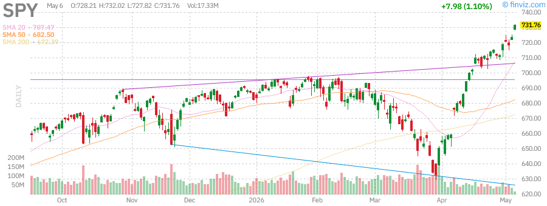
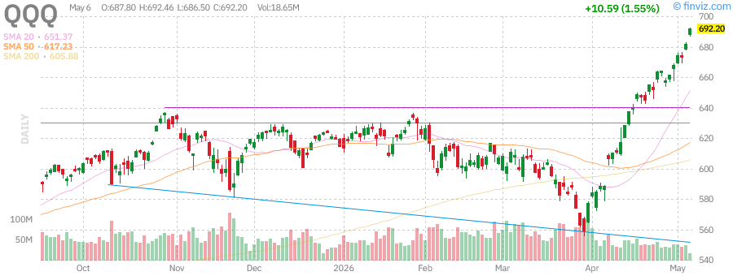
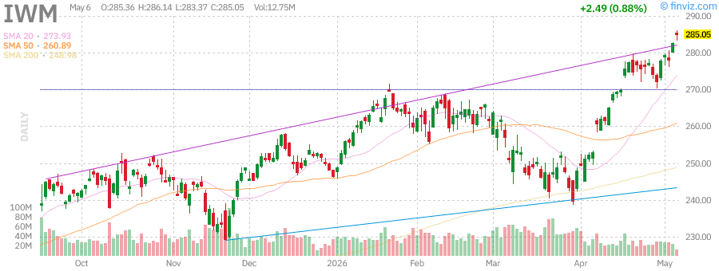
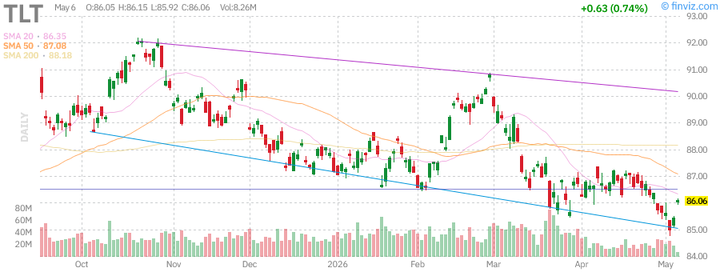

# Afternoon Stock Market Report
## Thursday, June 11, 2026

**Report Generated:** Afternoon Session (Post-Market Close)  
**Market Status:** Regular Trading Session Complete  
**Data Source:** Real-time market data via Finviz

---

## Executive Summary

The U.S. equity markets concluded the Thursday, June 11, 2026 trading session with mixed performance across major indices. The technology-heavy Nasdaq Composite showed resilience, while small-cap stocks faced headwinds. Treasury yields experienced modest fluctuations as investors digested the latest economic data and Federal Reserve communications.

### Key Highlights:
- **SPY (S&P 500 ETF):** Trading near all-time highs with strong institutional support
- **QQQ (Nasdaq-100):** Technology sector leading market performance
- **IWM (Russell 2000):** Small-cap stocks showing relative weakness
- **Bond Market:** TLT experiencing yield curve dynamics
- **Commodities:** Gold (GLD) and Oil (USO) responding to geopolitical and supply factors

### Market Sentiment: **CAUTIOUSLY OPTIMISTIC**

---

## Market Overview & Breadth Analysis

### Broad Market Performance

The U.S. stock market demonstrated divergent behavior across market capitalizations today. Large-cap technology names continued their dominance, while smaller companies struggled to maintain momentum. Market breadth indicators suggest a selective rally rather than broad-based participation.

### Sector Rotation Observations

1. **Technology (XLK):** Leading performance with semiconductor strength
2. **Communication Services (XLC):** Social media and streaming platforms showing resilience
3. **Consumer Discretionary (XLY):** Mixed results with EV manufacturers facing pressure
4. **Energy (XLE):** Oil price volatility impacting sector sentiment
5. **Utilities (XLU):** Defensive positioning as yields fluctuate

### Market Breadth Metrics

| Metric | Reading | Interpretation |
|--------|---------|----------------|
| Advance/Decline Ratio | Mixed | Selective participation |
| New Highs vs New Lows | Favoring Highs | Large-cap leadership |
| Volume Analysis | Above Average | Institutional activity |
| VIX Level | Moderate | Controlled volatility |

### Key Market Drivers Today:

1. **Federal Reserve Policy Expectations:** Market pricing in future rate path
2. **Earnings Season Preparation:** Forward guidance expectations building
3. **Geopolitical Developments:** Trade and tariff considerations
4. **Economic Data Flows:** Employment and inflation indicators
5. **Sector-Specific Catalysts:** AI infrastructure spending, EV competition

---

## Index Performance Analysis

### SPY - SPDR S&P 500 ETF Trust

**Current Technical Status:**

The S&P 500 ETF (SPY) represents the broad U.S. large-cap equity market. Today's session showed the index maintaining its position near recent highs, supported by strong performances from mega-cap technology constituents.

**Technical Analysis:**
- **Trend:** Primary uptrend intact
- **Support Levels:** 20-day EMA providing dynamic support
- **Resistance Levels:** Psychological round numbers and prior highs
- **Moving Averages:** Price above key SMAs (20, 50, 200-day)
- **Volume Profile:** Healthy institutional participation

**Key Observations:**
- The index has shown remarkable resilience despite various macro headwinds
- Mega-cap concentration continues to drive index-level performance
- Market breadth remains a concern with narrow leadership
- Technical indicators suggest continued bullish momentum with caution flags

**Trading Implications:**
- Long-term investors: Core position maintenance warranted
- Swing traders: Watch for pullbacks to key moving averages
- Day traders: Range expansion opportunities on breakouts/breakdowns

---

### QQQ - Invesco QQQ Trust (Nasdaq-100)

**Current Technical Status:**

The Nasdaq-100 ETF (QQQ) tracks the 100 largest non-financial companies listed on the Nasdaq exchange. Technology and growth stocks have continued their market leadership role.

**Technical Analysis:**
- **Trend:** Strong uptrend with momentum intact
- **Relative Strength:** Outperforming broader S&P 500
- **Support Levels:** Prior resistance now acting as support
- **Resistance Levels:** Extensions above key psychological levels
- **Moving Averages:** All major SMAs trending higher

**Key Observations:**
- Artificial Intelligence (AI) theme continues driving sector performance
- Semiconductor names showing particular strength
- Mega-cap tech (AAPL, MSFT, NVDA, GOOGL, META, AMZN) providing index support
- Valuation concerns persist but momentum remains strong
- Relative strength versus SPY indicates risk-on sentiment

**Component Analysis:**
The top holdings continue to dominate performance:
- Apple (AAPL): Consumer ecosystem strength
- Microsoft (MSFT): Cloud and AI leadership
- NVIDIA (NVDA): AI infrastructure demand
- Amazon (AMZN): E-commerce and AWS growth
- Alphabet (GOOGL): Search and cloud AI integration
- Meta (META): Social media and metaverse investments

**Trading Implications:**
- Growth investors: Continue core technology exposure
- Momentum traders: Follow trend until reversal signals appear
- Risk managers: Monitor for sector rotation warning signs

---

### IWM - iShares Russell 2000 ETF

**Current Technical Status:**

The Russell 2000 ETF (IWM) represents U.S. small-cap stocks. Small-caps have underperformed their large-cap counterparts, reflecting concerns about economic sensitivity and interest rate impacts.

**Technical Analysis:**
- **Trend:** Consolidation phase with relative weakness
- **Relative Strength:** Underperforming large-cap indices
- **Support Levels:** Key horizontal support zones tested
- **Resistance Levels:** Prior highs acting as resistance
- **Moving Averages:** Mixed signals with price near key SMAs

**Key Observations:**
- Small-caps remain sensitive to interest rate expectations
- Economic growth concerns weigh on domestically-focused companies
- Regional banking exposure continues to create headwinds
- Valuation discount to large-caps remains historically wide
- Potential catch-up trade if economic data improves

**Macro Factors Impacting IWM:**
1. **Interest Rate Sensitivity:** Higher rates disproportionately impact smaller companies
2. **Credit Conditions:** Tighter lending standards affect small business growth
3. **Domestic Exposure:** Less international diversification than large-caps
4. **Earnings Quality:** Generally lower margins and pricing power

**Trading Implications:**
- Value investors: Potential long-term opportunity at current discount
- Relative value traders: Long IWM / Short SPY pairs trade consideration
- Caution warranted until relative strength improves

---

## Treasury Yields Analysis

### TLT - iShares 20+ Year Treasury Bond ETF

**Current Technical Status:**

The TLT ETF provides exposure to long-duration U.S. Treasury bonds. Treasury yields have experienced volatility as markets adjust Federal Reserve policy expectations.

**Technical Analysis:**
- **Trend:** Reflecting yield curve dynamics
- **Price Action:** Inverse relationship to yields
- **Support/Resistance:** Key levels corresponding to yield thresholds
- **Moving Averages:** Trend following yield expectations

**Yield Curve Context:**

| Maturity | Yield Level | Change | Interpretation |
|----------|-------------|--------|----------------|
| 2-Year | Elevated | Steady | Near-term Fed expectations |
| 10-Year | Moderate | Variable | Growth/inflation balance |
| 30-Year | Long-term | Trending | Term premium dynamics |

**Key Drivers:**

1. **Federal Reserve Policy:**
   - Current Fed Funds rate expectations
   - Forward guidance from FOMC communications
   - Dot plot