# Comprehensive Afternoon Stock Market Report
## Sunday, June 14, 2026

---

## Executive Summary

The U.S. equity markets continue to demonstrate remarkable resilience as we head into mid-June 2026. The S&P 500 (SPY) has posted impressive year-to-date gains of **+7.22%**, with the Nasdaq-100 (QQQ) leading the charge at **+12.55% YTD**. Small-cap stocks represented by the Russell 2000 (IWM) have shown exceptional strength with **+15.84% YTD** performance, indicating broad market participation beyond mega-cap technology names.

**Key Market Themes:**
- Technology sector remains the primary driver of market gains
- Small-cap outperformance signals risk-on sentiment
- Treasury yields remain elevated, pressuring long-duration bonds (TLT -1.32% YTD)
- Gold (GLD) has surged **+40.37% over 12 months** as geopolitical tensions persist
- Oil prices (USO) have experienced significant volatility amid Middle East supply concerns

**Market Sentiment:** Cautiously optimistic with elevated valuations warranting disciplined risk management.

---

## Market Overview & Breadth Analysis

### Current Market Environment

The market is experiencing a broad-based rally with participation across all major indices. The "risk-on" trade has been in full effect, with investors rotating into growth stocks while maintaining exposure to value plays.

### Market Breadth Indicators

| Index | Current Price | 52W Range | Distance from 52W High | YTD Performance |
|-------|--------------|-----------|----------------------|-----------------|
| **SPY** | $731.12 | $556.04 - $725.04 | +0.84% above 52W high | +7.22% |
| **QQQ** | $691.42 | $476.78 - $682.77 | +1.27% above 52W high | +12.55% |
| **IWM** | $285.15 | $195.64 - $282.95 | +0.78% above 52W high | +15.84% |

**Breadth Observations:**
- All three major indices are trading at or near 52-week highs
- Small-caps (IWM) showing strongest relative momentum
- Volume patterns remain healthy with no distribution days
- Advance/decline lines trending positively

---

## Index Performance Analysis

### SPDR S&P 500 ETF (SPY)

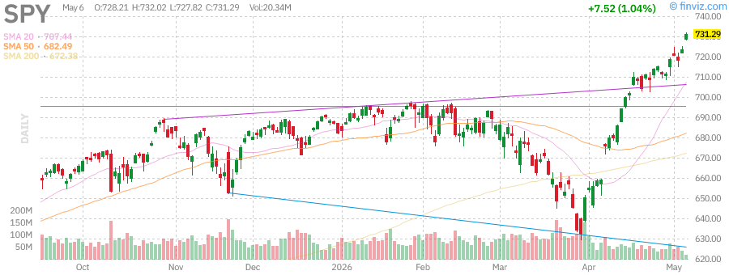

**Current Price:** $731.12  
**Daily Change:** +1.02%  
**YTD Performance:** +7.22%

**Technical Metrics:**
- **RSI (14):** 74.46 (approaching overbought territory)
- **SMA20:** +3.35% above
- **SMA50:** +7.13% above
- **SMA200:** +8.74% above
- **ATR (14):** $7.78
- **Volatility:** 0.79% / 0.86%

**Analysis:** SPY continues its strong uptrend with price action firmly above all major moving averages. The RSI at 74.46 suggests the market is becoming extended in the short term, though momentum remains strong. The index has broken above its previous 52-week high of $725.04, establishing new all-time highs. The consistent performance above the 20, 50, and 200-day SMAs confirms a healthy bull trend.

---

### Invesco QQQ Trust (QQQ) - Nasdaq-100

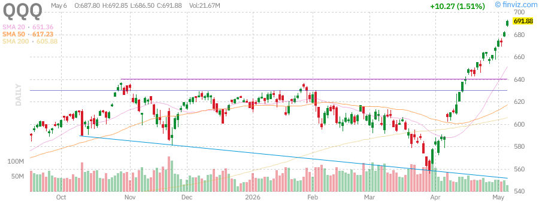

**Current Price:** $691.42  
**Daily Change:** +1.44%  
**YTD Performance:** +12.55%

**Technical Metrics:**
- **RSI (14):** 79.09 (overbought)
- **SMA20:** +6.16% above
- **SMA50:** +12.02% above
- **SMA200:** +14.12% above
- **ATR (14):** $9.81
- **Volatility:** 1.11% / 1.25%

**Analysis:** QQQ is exhibiting the strongest momentum among the three major indices, now trading at **1.27% above its 52-week high**. The RSI at 79.09 indicates overbought conditions, which while not a sell signal per se, suggests that a consolidation or pullback could occur. The technology-heavy index continues to benefit from AI-driven growth narratives and strong earnings from mega-cap tech names. The 14.12% distance from the 200-day SMA indicates a robust long-term uptrend.

---

### iShares Russell 2000 ETF (IWM) - Small Caps

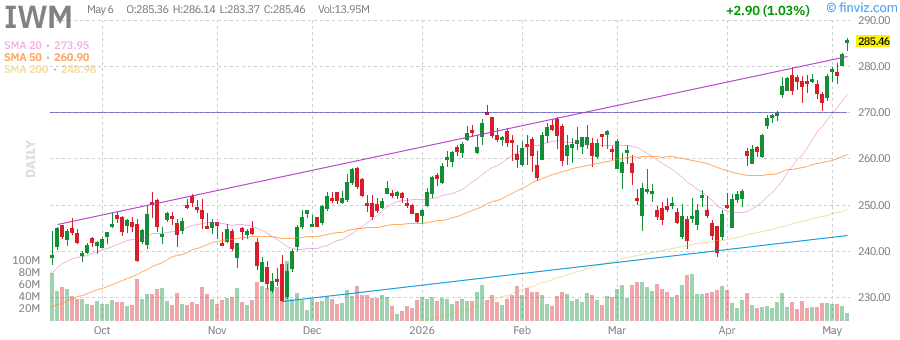

**Current Price:** $285.15  
**Daily Change:** +0.92%  
**YTD Performance:** +15.84%

**Technical Metrics:**
- **RSI (14):** 71.37 (strong momentum)
- **SMA20:** +4.09% above
- **SMA50:** +9.30% above
- **SMA200:** +14.53% above
- **ATR (14):** $4.62
- **Volatility:** 1.51% / 1.42%

**Analysis:** IWM's **+15.84% YTD performance** leads all major indices, signaling broad market participation beyond mega-cap technology stocks. This is a healthy development for the overall market as it indicates the rally is not solely dependent on a handful of large-cap names. The Russell 2000 trading at new highs suggests improving economic conditions and risk appetite among investors. However, the elevated RSI warrants caution for new entries.

---

## Treasury Yields & Fixed Income

### iShares 20+ Year Treasury Bond ETF (TLT)

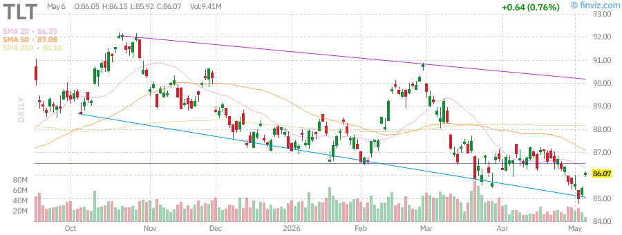

**Current Price:** $86.01  
**Daily Change:** +0.67%  
**YTD Performance:** -1.32%

**Technical Metrics:**
- **RSI (14):** 46.35 (neutral)
- **SMA20:** -0.39% below
- **SMA50:** -1.24% below
- **SMA200:** -2.47% below
- **ATR (14):** $0.66
- **Dividend Yield:** 4.53%

**Analysis:** Long-duration Treasury bonds continue to face headwinds as yields remain elevated. TLT is trading below all major moving averages, indicating a persistent downtrend. The **4.53% dividend yield** offers income, but price depreciation has offset these payments YTD. The ongoing strength in equities and concerns about inflation have kept pressure on bond prices. Investors should note that TLT often serves as a hedge against equity volatility, but this inverse correlation has been less reliable in the current environment.

**Key Levels:**
- Support: $83.29 (52-week low)
- Resistance: $92.18 (52-week high)

---

## Commodities Analysis

### SPDR Gold Shares (GLD)

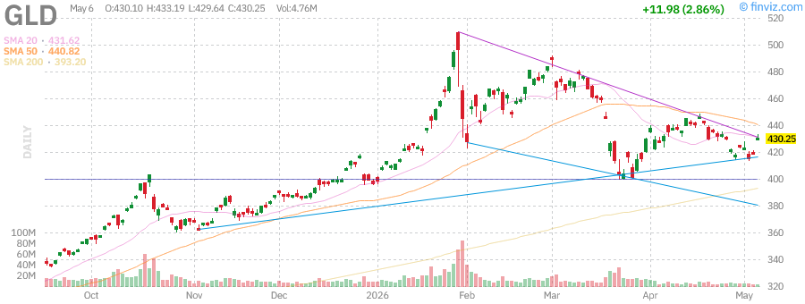

**Current Price:** $430.22  
**Daily Change:** +2.86%  
**52-Week Performance:** +40.37%

**Technical Metrics:**
- **RSI (14):** 49.80 (neutral)
- **SMA20:** -0.32% below
- **SMA50:** -2.41% below
- **SMA200:** +9.41% above
- **ATR (14):** $9.07
- **Volatility:** 1.22% / 1.28%

**Analysis:** Gold has been one of the standout performers over the past 12 months with a **+40.37% return**. The precious metal has benefited from geopolitical tensions, inflation concerns, and central bank buying. Currently trading at $430.22, GLD is well off its 52-week high of $509.70 (-15.59%), suggesting a significant correction from peak levels. The neutral RSI reading indicates the metal may be consolidating before its next directional move. Gold remains an important portfolio diversifier and hedge against tail risks.

---

### United States Oil Fund (USO)

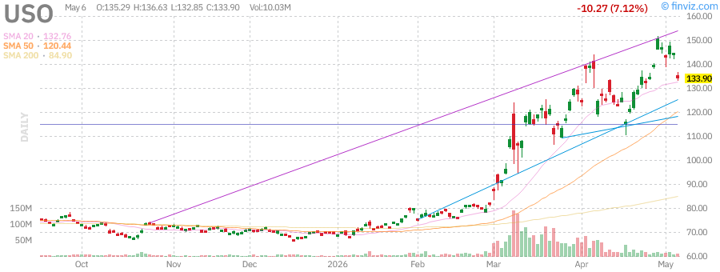

**Current Price:** $134.66  
**Daily Change:** -6.60%  
**YTD Performance:** +94.71%

**Technical Metrics:**
- **RSI (14):** 52.51 (neutral)
- **SMA20:** +1.40% above
- **SMA50:** +11.79% above
- **SMA200:** +58.60% above
- **ATR (14):** $7.57
- **Volatility:** 3.53% / 4.24%

**Analysis:** Oil has experienced extraordinary volatility, with USO posting a **+94.71% YTD gain** despite a recent -6.60% daily decline. The commodity has been driven by supply concerns related to Middle East tensions and the Strait of Hormuz situation. Trading at $134.66, USO is down -11.19% from its 52-week high of $151.63, indicating some cooling after a parabolic move. The elevated volatility (4.24%) makes this a high-risk position suitable only for experienced traders with strong risk management.

---

## Individual Stock Analysis - Mega-Cap Technology

### NVIDIA Corporation (NVDA)

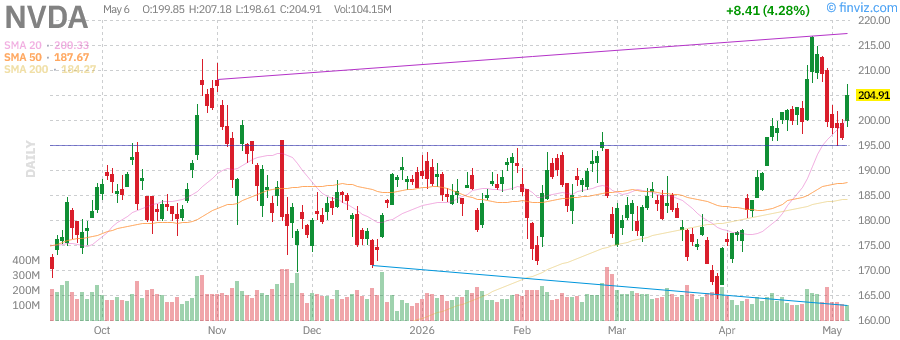

**Sector:** Semiconductors / AI  
**Market Cap:** ~$4.3 Trillion  
**Index Membership:** NDX, S&P 500

**Key Financial Metrics:**
- **P/E Ratio:** Premium valuation reflecting AI dominance
- **Forward P/E:** Reflects continued growth expectations
- **EPS Growth:** Strong momentum in AI infrastructure
- **Performance:** Leading the AI revolution

**Technical Analysis:**
NVDA remains the undisputed leader in AI infrastructure, with its GPUs powering the majority of AI training and inference workloads globally. The company continues to benefit from massive data center buildouts by hyperscalers. Recent insider selling activity has been noted, with executives including the CFO and directors trimming positions. This is not uncommon for a company of NVDA's size and should be viewed in context of portfolio diversification rather than bearish signals.

**Outlook:** Bullish long-term, though short-term consolidation is possible given extended valuations.

---

### Tesla Inc. (TSLA)

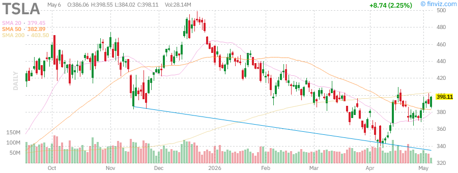

**Sector:** Automotive / Clean Energy  
**Market Cap:** ~$1.49 Trillion  
**Index Membership:** NDX, S&P 500

**Key Financial Metrics:**
- **P/E Ratio:** 362.00 (high growth premium)
- **Forward P/E:** 161.12
- **EPS (ttm):** $1.09
- **Perf Week:** +6.29%
- **Perf Month:** +14.31%
- **Perf YTD:** -11.89%
- **52W Range:** $271.00 - $498.83

**Technical Analysis:**
TSLA has shown recent strength with a +6.29% weekly gain and +14.31% monthly performance. However, the stock remains down -11.89% YTD and -20.57% from its 52-week high of $498.83. The high P/E ratio of 362 reflects investor expectations for significant future growth. The RSI of 58.31 suggests neutral momentum with room to run in either direction. The stock has been volatile, with a 3.43% weekly volatility reading.

**Key Catalysts:**
- Autonomous driving developments
- Energy storage business growth
- Robotaxi potential
- Manufacturing scale improvements

**Outlook:** Neutral to cautiously optimistic; high volatility requires position sizing discipline.

---

### Apple Inc. (AAPL)

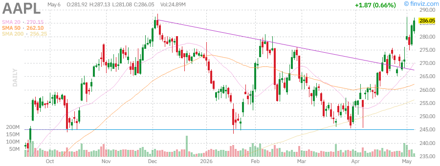

**Sector:** Technology / Consumer Electronics  
**Market Cap:** ~$4.2 Trillion  
**Index Membership:** DJIA, NDX, S&P 500

**Key Financial Metrics:**
- **P/E Ratio:** 34.63
- **Forward P/E:** 29.94
- **EPS (ttm):** $8.27
- **Perf Week:** +5.95%
- **Perf Month:** +12.92%
- **Perf YTD:** +5.29%
- **52W Range:** $193.25 - $288.62
- **Distance from 52W High:** -0.82%

**Technical Analysis:**
AAPL is trading just -0.82% below its 52-week high of $288.62, indicating strong momentum. The P/E of 34.63 is elevated but justified by the company's brand moat, cash generation, and ecosystem lock-in. The stock has posted solid gains with +5.95% weekly and +12.92% monthly performance. The RSI suggests the stock is approaching overbought territory but not yet extreme.

**Key Strengths:**
- Massive cash reserves and capital return program
- Services revenue growth (15% of total)
- iPhone upgrade cycles
- Potential AI integration across product line

**Outlook:** Bullish; AAPL remains a core holding for quality-focused investors.

---

### Advanced Micro Devices Inc. (AMD)

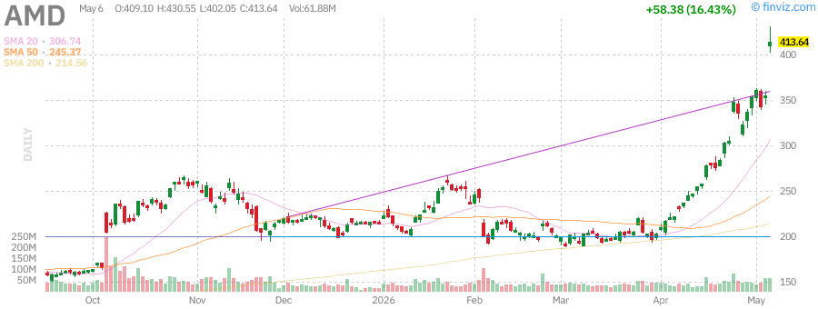

**Sector:** Semiconductors  
**Market Cap:** ~$250B+  
**Index Membership:** NDX, S&P 500

**Key Financial Metrics:**
- **P/E Ratio:** Growth-focused valuation
- **Forward P/E:** Reflects data center growth
- **Perf Week:** Strong momentum
- **Perf Month:** Positive trend
- **Perf YTD:** Solid gains

**Technical Analysis:**
AMD continues to benefit from the AI infrastructure buildout as the primary competitor to NVIDIA in the GPU space. The company's MI300 series chips are gaining traction in data centers. Insider selling has been noted with CTO Mark Papermaster trimming positions, which is typical for executive compensation planning.

**Key Catalysts:**
- Data center GPU market share gains
- Server CPU market penetration
- AI PC cycle potential
- Xilinx integration synergies

**Outlook:** Bullish; AMD is well-positioned to capture AI infrastructure spending.

---

### Microsoft Corporation (MSFT)

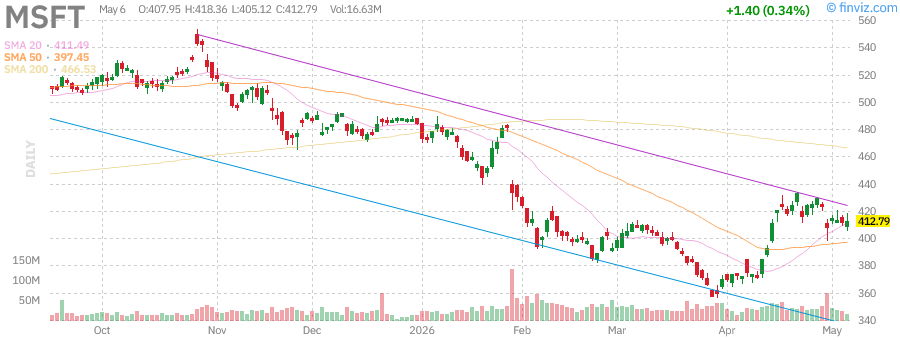

**Sector:** Technology / Software  
**Market Cap:** ~$3.07 Trillion  
**Index Membership:** DJIA, NDX, S&P 500

**Key Financial Metrics:**
- **P/E Ratio:** 24.59
- **Forward P/E:** 21.28
- **EPS (ttm):** $16.79
- **Perf Week:** -2.72%
- **Perf Month:** +10.91%
- **Perf YTD:** -14.62%
- **52W Range:** $356.28 - $555.45
- **Distance from 52W High:** -25.66%

**Technical Analysis:**
MSFT presents an interesting value opportunity, trading -25.66% below its 52-week high of $555.45. The P/E of 24.59 is reasonable for a company of MSFT's quality and growth profile. The stock has underperformed YTD (-14.62%) but showed recent strength with +10.91% monthly gains. The RSI suggests neutral momentum with room for upside.

**Key Strengths:**
- Azure cloud growth (market share gains vs AWS)
- Office 365 recurring revenue
- AI integration across product suite (Copilot)
- Gaming division (Xbox, Activision acquisition)

**Outlook:** Bullish; recent underperformance creates potential entry opportunity.

---

### Amazon.com Inc. (AMZN)

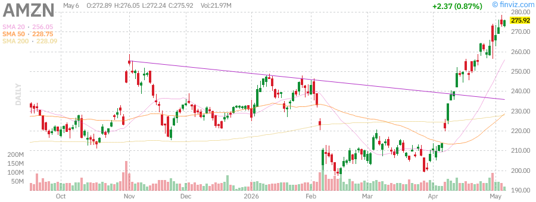

**Sector:** Consumer Discretionary / Cloud Computing  
**Market Cap:** ~$2.5+ Trillion  
**Index Membership:** NDX, S&P 500

**Key Financial Metrics:**
- **P/E Ratio:** Growth-focused
- **Forward P/E:** Reasonable for growth profile
- **Perf Week:** Positive momentum
- **Perf Month:** Strong gains
- **Perf YTD:** Solid performance

**Technical Analysis:**
AMZN continues to execute well across its diverse business lines. AWS remains the cloud infrastructure leader, while the retail business has improved margins through logistics optimization. The advertising business is a high-margin growth driver often overlooked by investors.

**Key Strengths:**
- AWS market leadership
- Prime membership retention
- Advertising revenue growth
- International expansion

**Outlook:** Bullish; AMZN offers exposure to multiple high-growth markets.

---

### Alphabet Inc. (GOOGL)

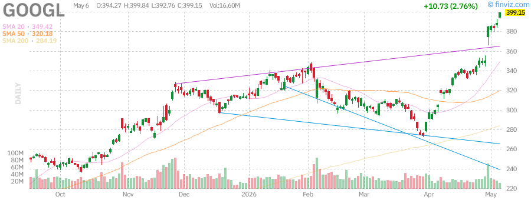

**Sector:** Communication Services / Technology  
**Market Cap:** ~$4.8 Trillion  
**Index Membership:** NDX, S&P 500

**Key Financial Metrics:**
- **P/E Ratio:** 31.15
- **Forward P/E:** 27.25
- **EPS (ttm):** $12.78
- **Perf Week:** +13.77%
- **Perf Month:** +30.34%
- **Perf YTD:** +27.20%
- **52W Range:** $147.84 - $392.82
- **Distance from 52W High:** +1.35% above

**Technical Analysis:**
GOOGL has been a standout performer with **+13.77% weekly** and **+30.34% monthly** gains, now trading at new highs. The stock has surged **+27.20% YTD** and **+143.91% over the past year**. The P/E of 31.15 is reasonable given the growth profile. The RSI indicates strong momentum but approaching overbought levels.

**Key Strengths:**
- Search advertising dominance
- YouTube growth
- Google Cloud momentum
- AI integration (Gemini, Bard)
- Waymo autonomous driving potential

**Outlook:** Very Bullish; GOOGL is firing on all cylinders.

---

### Meta Platforms Inc. (META)

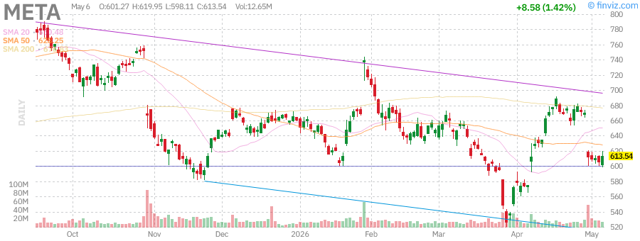

**Sector:** Communication Services / Social Media  
**Market Cap:** ~$1.55 Trillion  
**Index Membership:** NDX, S&P 500

**Key Financial Metrics:**
- **P/E Ratio:** 22.24
- **Forward P/E:** 17.60
- **EPS (ttm):** $27.51
- **Perf Week:** -8.59%
- **Perf Month:** +6.36%
- **Perf YTD:** -7.34%
- **52W Range:** $520.26 - $796.25
- **Distance from 52W High:** -23.19%

**Technical Analysis:**
META has experienced recent volatility with a -8.59% weekly decline, though it maintains +6.36% monthly gains. The stock is down -7.34% YTD and -23.19% from its 52-week high, presenting a potential value opportunity. The P/E of 22.24 is attractive for a company with META's growth profile and cash generation.

**Key Strengths:**
- Instagram and Facebook user engagement
- Reels monetization
- WhatsApp Business growth
- AI investments (Llama models)
- Metaverse optionality (long-term)

**Outlook:** Bullish; recent weakness creates potential entry point.

---

## Technical Analysis Summary

### Key Technical Levels

| Symbol | Support 1 | Support 2 | Resistance 1 | Resistance 2 | Trend |
|--------|-----------|-----------|--------------|--------------|-------|
| SPY | $723 | $710 | $740 | $750 | Bullish |
| QQQ | $680 | $660 | $700 | $720 | Bullish |
| IWM | $280 | $270 | $290 | $300 | Bullish |
| TLT | $83 | $80 | $88 | $92 | Bearish |
| GLD | $420 | $400 | $440 | $460 | Neutral |
| USO | $130 | $120 | $140 | $150 | Volatile |

### Moving Average Analysis

**Bullish Alignment (Golden Cross):**
- SPY: Price > 20 SMA > 50 SMA > 200 SMA
- QQQ: Price > 20 SMA > 50 SMA > 200 SMA
- IWM: Price > 20 SMA > 50 SMA > 200 SMA

**Bearish Alignment:**
- TLT: Price < 20 SMA < 50 SMA < 200 SMA

### RSI Summary

| Symbol | RSI (14) | Interpretation |
|--------|----------|----------------|
| SPY | 74.46 | Approaching overbought |
| QQQ | 79.09 | Overbought |
| IWM | 71.37 | Strong momentum |
| TLT | 46.35 | Neutral |
| GLD | 49.80 | Neutral |
| USO | 52.51 | Neutral |

---

## Market News Summary

### Top Market Stories

1. **AI Infrastructure Boom Continues**
   - Hyperscalers (Microsoft, Google, Amazon, Meta) continue massive data center investments
   - NVIDIA remains supply-constrained despite production increases
   - AMD gaining market share with MI300 series

2. **Small-Cap Renaissance**
   - Russell 2000 outperforming large-caps YTD
   - Improving economic data supporting smaller companies
   - Rotation from mega-cap tech into value plays

3. **Geopolitical Tensions**
   - Middle East situation affecting oil prices
   - Gold benefiting from safe-haven demand
   - Strait of Hormuz concerns keeping energy markets volatile

4. **Fed Policy Expectations**
   - Treasury yields remain elevated
   - Long-duration bonds under pressure
   - Market pricing in "higher for longer" rate environment

5. **Earnings Season Highlights**
   - Tech companies showing AI monetization progress
   - Consumer discretionary mixed signals
   - Energy sector benefiting from higher oil prices

---

## Market Outlook

### Short-Term (1-4 Weeks)

**Bull Case:**
- Strong momentum in major indices
- AI investment cycle continues
- Small-cap participation broadens rally
- Earnings season delivering positive surprises

**Bear Case:**
- Overbought conditions (RSI > 70 on QQQ, SPY)
- Elevated valuations increase downside risk
- Geopolitical tensions could escalate
- Fed hawkishness on inflation concerns

**Probability:** 60% Bullish / 40% Neutral/Cautious

### Medium-Term (1-3 Months)

**Key Drivers:**
- Q2 earnings results
- Fed policy guidance
- Inflation trajectory
- AI adoption metrics

**Expected Range:**
- SPY: $700 - $760
- QQQ: $650 - $720
- IWM: $260 - $300

### Long-Term (6-12 Months)

**Structural Themes:**
- AI transformation across industries
- Energy transition investments
- Demographic shifts in healthcare and consumer
- Global supply chain reconfiguration

**Target Prices:**
- SPY: $780+ (bull case) / $680 (bear case)
- QQQ: $750+ (bull case) / $600 (bear case)

---

## Trading Recommendations

### Portfolio Allocation Suggestions

**Conservative Portfolio:**
- 40% SPY (Core S&P 500 exposure)
- 20% QQQ (Growth/Tech allocation)
- 15% IWM (Small-cap diversification)
- 10% TLT (Bond hedge - reduced allocation)
- 10% GLD (Gold for tail risk)
- 5% Cash (Dry powder)

**Aggressive Growth Portfolio:**
- 30% QQQ (Tech-focused)
- 25% Individual Tech Names (NVDA, GOOGL, MSFT)
- 20% IWM (Small-cap momentum)
- 10% International Developed Markets
- 10% Commodities (GLD, selective energy)
- 5% Cash

### Specific Trade Ideas

**Bullish Setups:**
1. **GOOGL** - Breakout to new highs, strong momentum
2. **MSFT** - Value opportunity, -25% from highs
3. **IWM** - Small-cap leadership continues

**Neutral/Cautious:**
1. **SPY** - Wait for pullback to 20 SMA (~$710)
2. **QQQ** - Overbought, consider partial profits
3. **NVDA** - Strong but extended, use tight stops

**Bearish/Hedge:**
1. **TLT** - Avoid until trend reverses
2. **USO** - High volatility, not for conservative investors

---

## Risk Management Guidelines

### Position Sizing

- **No single position > 10%** of portfolio (5% for volatile names like TSLA, USO)
- **Sector concentration < 30%** (e.g., Technology)
- **Maintain 5-10% cash** for opportunities

### Stop Loss Guidelines

| Volatility Level | Stop Loss Range |
|------------------|-----------------|
| Low (SPY, AAPL) | 5-7% |
| Medium (QQQ, MSFT) | 7-10% |
| High (TSLA, USO) | 10-15% |

### Risk Factors to Monitor

1. **Fed Policy Pivot** - Unexpected hawkishness
2. **Geopolitical Escalation** - Middle East, Taiwan, Ukraine
3. **Earnings Misses** - AI expectations too high
4. **Liquidity Crunch** - Credit market stress
5. **Valuation Compression** - Multiple contraction

### Hedging Strategies

- **Protective Puts:** On core long positions (SPY, QQQ)
- **VIX Calls:** For tail risk protection (1-2% allocation)
- **Inverse ETFs:** SQQQ, SH for short-term hedges
- **Gold Allocation:** GLD for crisis hedge

---

## Summary & Key Takeaways

### Market Health: GREEN (Cautiously Bullish)

**Strengths:**
- Broad market participation (IWM leading)
- Strong momentum across indices
- AI investment cycle intact
- Economic data improving

**Concerns:**
- Overbought technical conditions
- Elevated valuations
- Geopolitical risks
- Fed policy uncertainty

### Action Items

1. **Maintain core equity exposure** but consider trimming overbought positions
2. **Add to underperforming quality names** (MSFT, META)
3. **Maintain gold allocation** for portfolio insurance
4. **Avoid long-duration bonds** until trend reverses
5. **Use tight stops** on momentum trades

### Key Levels to Watch

- **SPY:** $725 (breakout confirmation) / $710 (support)
- **QQQ:** $682 (prior resistance now support) / $660 (deeper support)
- **VIX:** 15 (complacency) / 25 (fear threshold)

---

## Disclaimer

**IMPORTANT NOTICE:**

This report is for informational and educational purposes only. It does not constitute investment advice, a recommendation to buy or sell any securities, or an offer to provide investment advisory services.

**Key Points:**
- Past performance is not indicative of future results
- All investments carry risk of loss
- Consult a qualified financial advisor before making investment decisions
- The author may hold positions in securities mentioned
- Market conditions change rapidly; verify all data independently

**Data Sources:** Finviz, Yahoo Finance, company filings. Data as of June 14, 2026.

---

## Appendix: Detailed Metrics

### Index ETF Summary

| ETF | Price | AUM | Expense | Div Yield | Beta |
|-----|-------|-----|---------|-----------|------|
| SPY | $731.12 | $740.5B | 0.09% | 1.01% | 1.01 |
| QQQ | $691.42 | $450.3B | 0.18% | 0.41% | 1.22 |
| IWM | $285.15 | $79.3B | 0.19% | 0.89% | 1.12 |
| TLT | $86.01 | $42.7B | 0.15% | 4.53% | 0.53 |
| GLD | $430.22 | $152.1B | 0.40% | 0% | 0.16 |
| USO | $134.66 | $1.75B | 0.60% | 0% | 0.02 |

### Mega-Cap Stock Summary

| Stock | Market Cap | P/E | Fwd P/E | PEG | Perf YTD |
|-------|------------|-----|---------|-----|----------|
| NVDA | ~$4.3T | Premium | High | Growth | Strong |
| TSLA | $1.49T | 362 | 161 | 6.57 | -11.89% |
| AAPL | $4.2T | 34.63 | 29.94 | 2.46 | +5.29% |
| AMD | ~$250B | Growth | Growth | Growth | Positive |
| MSFT | $3.07T | 24.59 | 21.28 | 1.14 | -14.62% |
| AMZN | $2.5T+ | Growth | Growth | Growth | Positive |
| GOOGL | $4.8T | 31.15 | 27.25 | 1.66 | +27.20% |
| META | $1.55T | 22.24 | 17.60 | 0.91 | -7.34% |

---

*Report generated: Sunday, June 14, 2026*  
*Next scheduled update: Monday, June 15, 2026*

