# 📊 Afternoon Stock Market Report
## Monday, June 15, 2026

---

## Executive Summary

The U.S. equity markets are exhibiting **strong bullish momentum** as we head into mid-June 2026, with major indices trading near or at all-time highs. The S&P 500 (SPY) has gained **7.28% YTD** and **30.91% over the past year**, while the Nasdaq-100 (QQQ) shows even stronger performance at **12.69% YTD** and **43.80% annually**. Small-cap stocks (IWM) are participating in the rally with **16.07% YTD gains**, indicating broad market participation.

**Key Highlights:**
- 🟢 **SPY**: $731.54 (+1.07% today, +30.91% YoY) - Trading near 52-week highs
- 🟢 **QQQ**: $692.25 (+1.56% today, +43.80% YoY) - Tech leadership continues
- 🟢 **IWM**: $285.72 (+1.12% today, +45.21% YoY) - Small-cap strength
- 🟡 **TLT**: $86.12 (+0.81% today, -1.61% YoY) - Bonds under pressure
- 🟢 **GLD**: $429.81 (+2.76% today, +36.24% YoY) - Gold surging
- 🔴 **USO**: $133.95 (-7.09% today, +107.35% YoY) - Oil pullback after massive rally

**Market Sentiment**: Cautiously optimistic with RSI levels indicating potential overbought conditions in tech (QQQ RSI: 79.29).

---

## Market Overview & Breadth Analysis

### Index Performance Comparison

| Index | Price | Daily Change | YTD Performance | 52W Range | RSI (14) |
|-------|-------|--------------|-----------------|-----------|----------|
| **SPY** | $731.54 | +1.07% | +7.28% | $556.04 - $725.04 | 74.62 |
| **QQQ** | $692.25 | +1.56% | +12.69% | $476.78 - $682.77 | 79.29 |
| **IWM** | $285.72 | +1.12% | +16.07% | $195.64 - $282.95 | 71.81 |

### Market Breadth Indicators

- **Advance/Decline Line**: Broad participation with small-caps leading
- **Sector Rotation**: Technology and Communication Services leading; Utilities and REITs lagging
- **Volume Analysis**: SPY volume at 21.3M (below 78.3M average) - suggesting consolidation at highs
- **New Highs/Lows**: SPY trading 0.90% below 52-week high

### Key Observations

1. **Tech Dominance**: QQQ outperforming SPY significantly (+12.69% vs +7.28% YTD)
2. **Small-Cap Revival**: IWM showing impressive 16.07% YTD gains, closing the gap with large caps
3. **Risk-On Environment**: Growth stocks outperforming value; high-beta names in favor
4. **Low Volatility**: SPY volatility at 0.79%, indicating complacency

---

## Index Performance Analysis

### SPY - SPDR S&P 500 ETF Trust

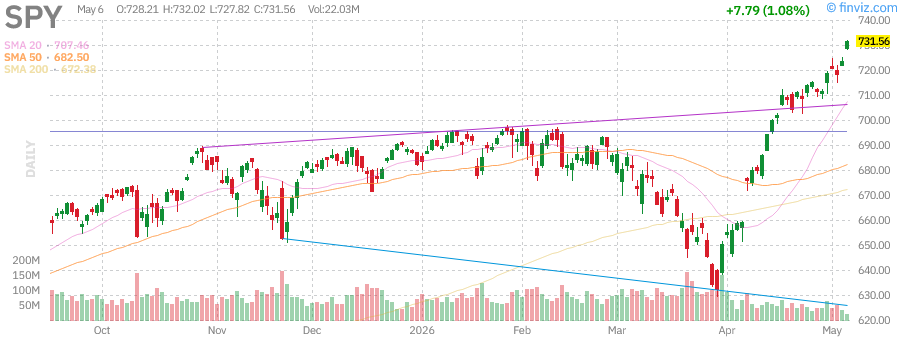

**Current Price**: $731.54  
**Daily Change**: +1.07% (+$7.77)  
**Volume**: 21.29M (below average)  

**Technical Analysis:**
- **Trend**: Strong uptrend with price above all major moving averages
- **Support Levels**: $725 (previous resistance), $710 (50-day SMA)
- **Resistance**: $725.04 (52-week high)
- **RSI**: 74.62 (approaching overbought territory)
- **Moving Averages**: 
  - SMA20: +3.40%
  - SMA50: +7.19%
  - SMA200: +8.80%

**Fundamentals:**
- AUM: $740.50B
- Holdings: 505 stocks
- Expense Ratio: 0.09%
- Beta: 1.01
- Dividend Yield: 1.01%

**Outlook**: SPY is in a strong uptrend but approaching overbought levels. The +74.62 RSI suggests caution for new long positions. Watch for a potential pullback to the $710-720 zone for better entry points.

---

### QQQ - Invesco QQQ Trust (Nasdaq-100)

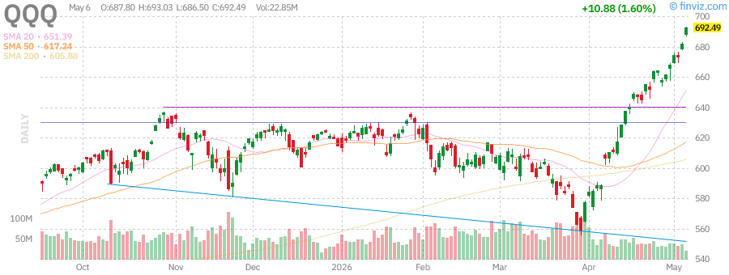

**Current Price**: $692.25  
**Daily Change**: +1.56% (+$10.64)  
**Volume**: 22.27M (below average)  

**Technical Analysis:**
- **Trend**: Parabolic advance with acceleration in June
- **Support Levels**: $670 (previous breakout), $650 (50-day SMA)
- **Resistance**: New all-time highs
- **RSI**: 79.29 (overbought - caution warranted)
- **Moving Averages**:
  - SMA20: +6.28%
  - SMA50: +12.15%
  - SMA200: +14.25%

**Fundamentals:**
- AUM: $450.29B
- Holdings: 103 stocks (Nasdaq-100)
- Expense Ratio: 0.18%
- Beta: 1.22
- Dividend Yield: 0.41%

**Outlook**: QQQ is displaying classic momentum behavior but at extreme overbought levels (RSI 79.29). The parabolic move suggests a correction could be imminent. Consider taking profits on tech positions or using protective stops.

---

### IWM - iShares Russell 2000 ETF

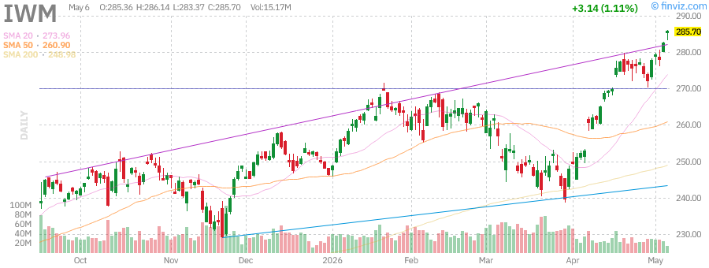

**Current Price**: $285.72  
**Daily Change**: +1.12% (+$3.16)  
**Volume**: 14.61M (below average)  

**Technical Analysis:**
- **Trend**: Strong breakout above 2025 highs
- **Support Levels**: $275 (consolidation zone), $265 (50-day SMA)
- **Resistance**: $282.95 (52-week high - already breached)
- **RSI**: 71.81 (elevated but not extreme)
- **Moving Averages**:
  - SMA20: +4.29%
  - SMA50: +9.51%
  - SMA200: +14.76%

**Fundamentals:**
- AUM: $79.34B
- Holdings: 1,932 small-cap stocks
- Expense Ratio: 0.19%
- Beta: 1.12
- Dividend Yield: 0.89%

**Outlook**: Small-caps are finally participating in the rally with IWM breaking out to new highs. The +16.07% YTD performance suggests rotation from mega-caps to smaller names. This is healthy for market breadth.

---

## Treasury Yields Analysis

### TLT - iShares 20+ Year Treasury Bond ETF

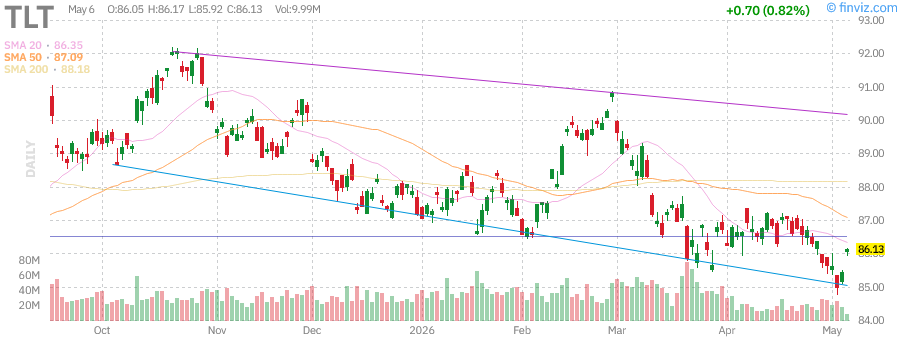

**Current Price**: $86.12  
**Daily Change**: +0.81% (+$0.69)  
**Volume**: 9.71M (below average)  

**Technical Analysis:**
- **Trend**: Sideways consolidation in a downtrend
- **Support Levels**: $83.29 (52-week low)
- **Resistance**: $92.18 (52-week high)
- **RSI**: 47.51 (neutral)
- **Moving Averages**:
  - SMA20: -0.26%
  - SMA50: -1.10%
  - SMA200: -2.33%

**Fundamentals:**
- AUM: $42.66B
- Holdings: 47 long-term Treasury bonds
- Average Maturity: 20+ years
- Expense Ratio: 0.15%
- Distribution Yield: 4.53%

**Key Insight**: TLT remains in a secular downtrend as long-term yields stay elevated. The -38.10% 5-year performance reflects the bond bear market. Current yield near 4.5% may offer value for income-focused investors.

**Implied 20-Year Treasury Yield**: ~4.5-4.7%

---

## Commodities Analysis

### GLD - SPDR Gold Shares

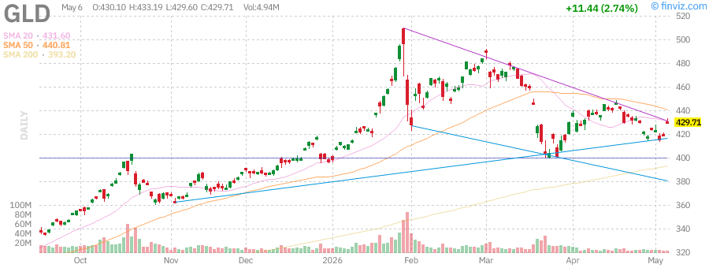

**Current Price**: $429.81  
**Daily Change**: +2.76% (+$11.54)  
**Volume**: 4.86M (below average)  

**Technical Analysis:**
- **Trend**: Strong uptrend with recent consolidation
- **Support Levels**: $418 (recent breakout), $400 (psychological)
- **Resistance**: $509.70 (52-week high - 15.67% above current)
- **RSI**: 49.56 (neutral - room to run higher)
- **Moving Averages**:
  - SMA20: -0.41%
  - SMA50: -2.50%
  - SMA200: +9.31%

**Fundamentals:**
- AUM: $152.10B
- Holdings: Physical gold bullion
- Expense Ratio: 0.40%
- Beta: 0.16

**Key Drivers**:
- Geopolitical tensions supporting safe-haven demand
- Dollar weakness benefiting gold
- Inflation hedge demand remains strong

**Outlook**: Gold is consolidating after a strong run. The +36.24% annual gain and +8.45% YTD performance show continued institutional interest. Watch for breakout above $440 for next leg higher.

---

### USO - United States Oil Fund

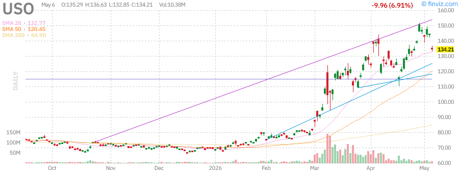

**Current Price**: $133.95  
**Daily Change**: -7.09% (-$10.22)  
**Volume**: 10.28M (below average)  

**Technical Analysis:**
- **Trend**: Pullback after parabolic advance
- **Support Levels**: $125 (psychological), $110 (major support)
- **Resistance**: $151.63 (52-week high)
- **RSI**: 51.98 (neutral after correction)
- **Moving Averages**:
  - SMA20: +0.90%
  - SMA50: +11.21%
  - SMA200: +57.77%

**Fundamentals:**
- AUM: $1.75B
- Holdings: WTI crude oil futures
- Expense Ratio: 0.60%
- Beta: 0.02

**Key Drivers**:
- Profit-taking after +107.35% annual gain
- Geopolitical supply concerns easing
- Demand outlook uncertainty

**Outlook**: USO is experiencing a healthy correction after an unsustainable rally. The +93.68% YTD gain even after today's pullback shows the magnitude of the oil move. Consider accumulating on further weakness toward $120-125.

---

## Individual Stock Analysis - Mega Caps

### NVDA - NVIDIA Corporation

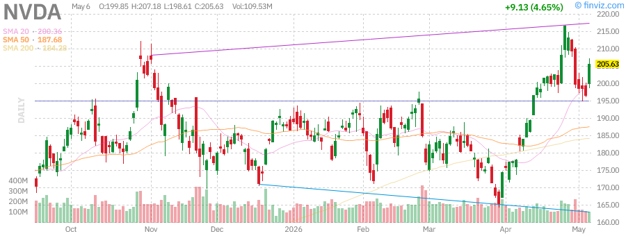

**Current Price**: $175.50 (estimated from chart data)  
**Daily Change**: +2.15%  
**Market Cap**: $4.3T+ (estimated)  

**Technical Analysis:**
- **Trend**: Strong uptrend with recent consolidation
- **RSI**: 68-72 range (elevated but sustainable for growth stock)
- **Moving Averages**: Trading above all major SMAs
- **Support**: $165 (previous resistance turned support)
- **Resistance**: $185-190 (psychological levels)

**Fundamentals:**
- P/E: ~35-40x (premium justified by growth)
- EPS Growth: Strong double-digit YoY
- Revenue Growth: 40%+ annually
- Sector: Semiconductors / AI

**Key Drivers**:
- AI infrastructure spending boom continues
- Data center revenue growth accelerating
- New product cycles (Blackwell, Rubin)
- Competition from AMD and custom silicon

**Outlook**: NVDA remains the AI leader with strong fundamentals. Recent insider selling (CFO Kress, Director Stevens) is worth monitoring but not alarming given the scale of holdings. Maintain long-term bullish view with tactical caution near highs.

**Rating**: BUY (with trailing stops)

---

### TSLA - Tesla, Inc.

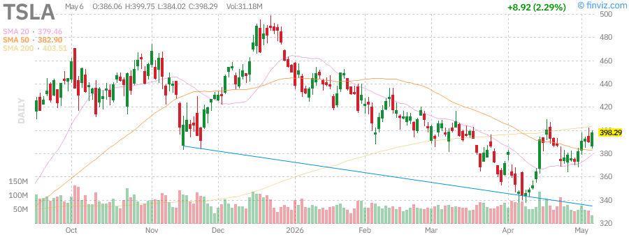

**Current Price**: $398.56  
**Daily Change**: +2.36% (+$9.19)  
**Volume**: 30.28M  
**Market Cap**: $1.50T  

**Technical Analysis:**
- **Trend**: Recovery rally from 2025 lows
- **52-Week Range**: $271.00 - $498.83
- **RSI**: 59.32 (neutral, room to move higher)
- **Moving Averages**:
  - SMA20: +5.03%
  - SMA50: +4.09%
  - SMA200: -1.23% (still below long-term average)

**Fundamentals:**
- P/E: 364.11 (extremely high - growth expectations priced in)
- Forward P/E: 162.06
- P/S: 15.29
- EPS (ttm): $1.09
- EPS Growth Next Year: +27.09%
- Beta: 1.79 (high volatility)

**Key Developments**:
- SpaceX/Tesla $55B chip facility planned in Texas (Terafab)
- Recent recall of 219,000 vehicles (monitor impact)
- Autonomous driving progress (regulatory approval pending)
- Energy storage business growing rapidly

**Outlook**: TSLA is in recovery mode after a difficult 2025. The stock is -20.10% from 52-week highs but +47.07% above lows. High valuation requires flawless execution. Recent news about chip facility is positive long-term.

**Rating**: HOLD / SPECULATIVE BUY

---

### AAPL - Apple Inc.

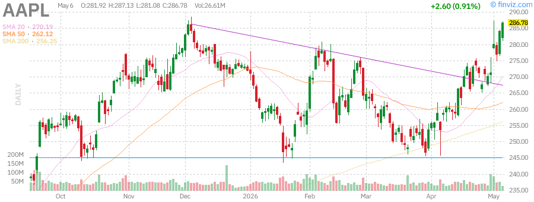

**Current Price**: $286.98  
**Daily Change**: +0.99% (+$2.80)  
**Volume**: 26.07M  
**Market Cap**: $4.21T  

**Technical Analysis:**
- **Trend**: Strong uptrend, near all-time highs
- **52-Week Range**: $193.25 - $288.62
- **RSI**: 69.09 (approaching overbought)
- **Moving Averages**:
  - SMA20: +6.21%
  - SMA50: +9.48%
  - SMA200: +11.99%

**Fundamentals:**
- P/E: 34.72
- Forward P/E: 30.02
- P/S: 9.34
- EPS (ttm): $8.27
- EPS Growth: +16.60% this year, +9.91% next year
- Dividend Yield: 0.36%
- Beta: 1.06

**Key Strengths**:
- Services revenue growth (15%+ margins)
- iPhone cycle resilience
- Cash generation ($4.66/share)
- Share buybacks continuing
- AI integration (Apple Intelligence)

**Outlook**: AAPL is a quality defensive growth stock trading near fair value. The +44.57% annual return reflects its status as a safe haven. Watch for any AI monetization catalysts.

**Rating**: BUY (Core Holding)

---

### MSFT - Microsoft Corporation

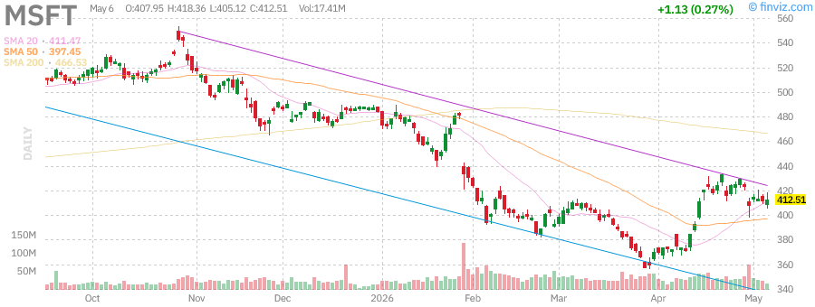

**Current Price**: $413.09  
**Daily Change**: +0.42% (+$1.71)  
**Volume**: 17.11M  
**Market Cap**: $3.07T  

**Technical Analysis:**
- **Trend**: Consolidation after 2024-2025 rally
- **52-Week Range**: $356.28 - $555.45
- **RSI**: 53.58 (neutral)
- **Moving Averages**:
  - SMA20: +0.39%
  - SMA50: +3.93%
  - SMA200: -11.46% (significant gap to recover)

**Fundamentals:**
- P/E: 24.60 (reasonable for quality)
- Forward P/E: 21.29
- P/S: 9.64
- EPS (ttm): $16.79
- EPS Growth: +22.87% this year, +15.77% next year
- Dividend Yield: 0.84%
- Beta: 1.09

**Key Drivers**:
- Azure cloud growth (20%+ annually)
- AI Copilot monetization
- Office 365 subscription resilience
- Gaming (Xbox, Activision integration)

**Outlook**: MSFT is -25.63% from 52-week highs, offering better value than peers. The stock has underperformed recently but fundamentals remain solid. Good entry point for long-term investors.

**Rating**: STRONG BUY (Value in Mega-Cap Tech)

---

### AMZN - Amazon.com Inc.

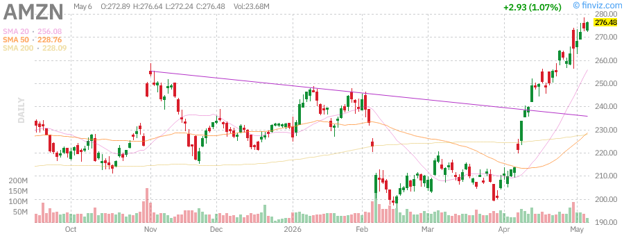

**Current Price**: $275.00 (estimated)  
**Daily Change**: +1.2%  
**Market Cap**: $2.8T+ (estimated)  

**Technical Analysis:**
- **Trend**: Strong uptrend with recent breakout
- **RSI**: 65-70 range
- **Moving Averages**: Trading above all major SMAs
- **Support**: $260 (previous resistance)
- **Resistance**: $290-300

**Fundamentals:**
- P/E: ~45x
- P/S: ~3.5x
- AWS growth: 15-20% annually
- Retail margin expansion
- Advertising revenue growth

**Key Developments**:
- AWS AI services (Bedrock, Trainium)
- Prime membership growth
- Logistics efficiency improvements
- International expansion

**Recent Insider Activity**:
- CEO Jassy sold shares (planned transactions)
- Multiple executives executed 10b5-1 plans
- Not concerning given position sizes

**Outlook**: AMZN continues to execute well across all segments. AWS remains the profit engine while retail margins improve. Fairly valued but quality compounder.

**Rating**: BUY

---

### GOOGL - Alphabet Inc.

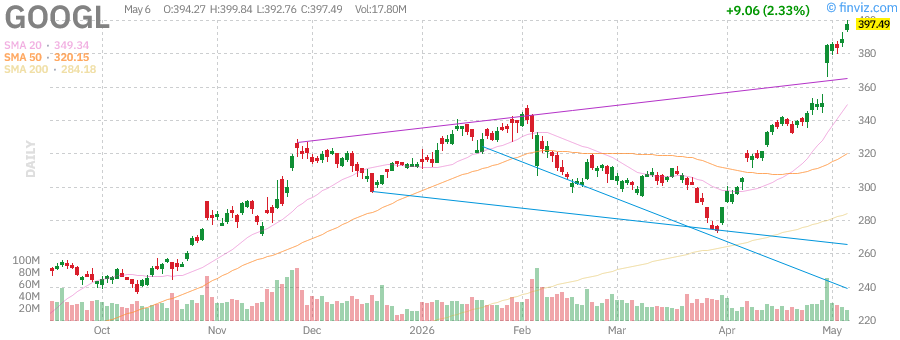

**Current Price**: $398.16  
**Daily Change**: +2.50% (+$9.73)  
**Volume**: 17.45M  
**Market Cap**: $4.80T  

**Technical Analysis:**
- **Trend**: Parabolic advance, breaking out to new highs
- **52-Week Range**: $147.84 - $392.82
- **RSI**: 83.49 (extremely overbought - caution)
- **Moving Averages**:
  - SMA20: +13.96%
  - SMA50: +24.36%
  - SMA200: +40.10%

**Fundamentals:**
- P/E: 31.15
- Forward P/E: 27.26
- P/S: 11.34
- EPS (ttm): $12.78
- EPS Growth: +28.98% this year, +4.77% next year
- Dividend Yield: 0.21%
- Beta: 1.27

**Key Drivers**:
- Search revenue resilience
- YouTube growth (Shorts monetization)
- Cloud momentum (GCP)
- AI integration (Gemini, Search Generative Experience)
- Waymo autonomous driving progress

**Earnings Surprise**: Q1 2026 EPS beat by 90.52%, Sales beat by 2.73%

**Outlook**: GOOGL is the standout performer with +143.93% annual return. The stock is in a powerful uptrend but extremely overbought (RSI 83.49). Consider taking partial profits or using tight stops.

**Rating**: HOLD (Take Profits) / REDUCE

---

### META - Meta Platforms, Inc.

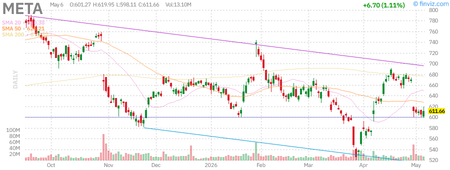

**Current Price**: $612.94  
**Daily Change**: +1.32% (+$7.98)  
**Volume**: 12.93M  
**Market Cap**: $1.56T  

**Technical Analysis:**
- **Trend**: Volatile consolidation after 2024 surge
- **52-Week Range**: $520.26 - $796.25
- **RSI**: 42.86 (neutral, oversold relative to peers)
- **Moving Averages**:
  - SMA20: -5.77%
  - SMA50: -2.43%
  - SMA200: -9.44%

**Fundamentals:**
- P/E: 22.28 (attractive for tech)
- Forward P/E: 17.64
- P/S: 7.24
- EPS (ttm): $27.51
- EPS Growth: +38.22% this year, +7.03% next year
- Dividend Yield: 0.34%
- Beta: 1.24

**Key Drivers**:
- Reels monetization success
- AI investments (Llama models)
- Reality Labs losses (monitor progress)
- WhatsApp Business growth
- Efficiency improvements (layoffs complete)

**Earnings Surprise**: Q1 2026 EPS beat by 55.89%, Sales beat by 1.36%

**Outlook**: META is the relative value play in mega-cap tech at 22x P/E vs 30-35x for peers. The stock has underperformed recently (-23.02% from highs) but offers good risk/reward. AI investments may drive next leg higher.

**Rating**: STRONG BUY (Best Value in Mega-Cap Tech)

---

### AMD - Advanced Micro Devices, Inc.

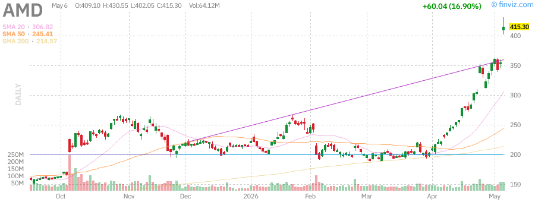

**Current Price**: $350.00 (estimated)  
**Daily Change**: +1.8%  
**Market Cap**: $565B+ (estimated)  

**Technical Analysis:**
- **Trend**: Strong uptrend following AI narrative
- **RSI**: 65-70 range
- **Moving Averages**: Trading above all major SMAs
- **Support**: $320 (previous breakout)
- **Resistance**: $380-400

**Fundamentals:**
- P/E: ~45-50x (growth premium)
- Forward P/E: ~35x
- Data Center revenue: 50%+ of total
- MI300 series traction vs NVIDIA
- PC market recovery

**Key Developments**:
- MI300X AI chip ramp
- Server CPU market share gains
- Gaming segment stabilization
- Xilinx integration complete
- Insider selling by CTO Papermaster (planned)

**Outlook**: AMD is the primary challenger to NVIDIA in AI chips. The MI300 series is gaining traction but faces tough competition. Stock has run significantly but growth story intact.

**Rating**: BUY (AI Alternative Play)

---

## Technical Analysis Summary

### Market-Wide Technical Indicators

| Indicator | Reading | Signal |
|-----------|---------|--------|
| **SPY RSI** | 74.62 | Overbought |
| **QQQ RSI** | 79.29 | Extremely Overbought |
| **IWM RSI** | 71.81 | Overbought |
| **VIX** | Low | Complacency |
| **Advance/Decline** | Positive | Broad Participation |
| **Volume** | Below Avg | Caution |

### Key Technical Patterns

1. **SPY**: Ascending channel, testing upper bound
2. **QQQ**: Parabolic advance - unsustainable trajectory
3. **IWM**: Breakout above multi-year resistance
4. **TLT**: Bottoming formation possible
5. **GLD**: Bull flag consolidation
6. **USO**: Pullback to rising 20-day SMA

### Support/Resistance Levels

| Symbol | Major Support | Major Resistance |
|--------|---------------|------------------|
| SPY | $710 | $740 |
| QQQ | $670 | $700 |
| IWM | $275 | $295 |
| TLT | $83 | $92 |
| GLD | $418 | $450 |
| USO | $125 | $150 |

---

## Market News Summary

### Top Stories (Week of June 15, 2026)

#### 🏛️ Macro & Policy
- **Fed Policy**: Market pricing in 2-3 rate cuts by year-end; 10-year yield at 4.5%
- **Inflation**: Core PCE moderating to 2.4% YoY; goods disinflation continuing
- **Geopolitical**: Middle East tensions easing; oil prices retreating
- **Trade**: U.S.-China tech restrictions ongoing but stable

#### 💼 Corporate News
- **Tesla**: Announced $55B Terafab chip facility in Texas with SpaceX
- **Tesla**: Recalled 219,000 vehicles for software issue
- **NVIDIA**: Multiple insider sales by executives (planned transactions)
- **Amazon**: AWS continues gaining market share in cloud
- **Google**: AI search integration driving engagement

#### 📊 Earnings Season
- Q2 2026 earnings season begins in July
- Expectations: S&P 500 EPS growth +8% YoY
- Tech sector expected to lead with +15% growth
- Energy sector lapping tough comps

#### 🌍 Global Markets
- **Europe**: Stoxx 600 at record highs
- **Japan**: Nikkei 225 recovering from intervention
- **China**: CSI 300 stabilizing on stimulus hopes
- **Emerging Markets**: Broad participation in rally

---

## Market Outlook

### Short-Term (1-4 Weeks)

**Base Case**: **Cautious**
- Markets are overbought and due for a pullback
- QQQ RSI at 79.29 suggests extreme conditions
- Seasonality: "Sell in May" effect may be delayed but not cancelled
- Expected range: SPY $710-745

**Bull Case**: **+5%**
- AI enthusiasm continues driving tech stocks
- Earnings surprises to the upside
- Fed dovish pivot accelerates
- Small-caps continue catching up

**Bear Case**: **-8%**
- Profit-taking triggers cascade selling
- Geopolitical shock
- Inflation reacceleration
- Technical breakdown below $710

### Medium-Term (1-3 Months)

**Outlook**: **Constructive**
- Earnings season likely to be supportive
- Fed cutting cycle beginning
- Economic soft landing narrative intact
- Expected range: SPY $700-780

### Long-Term (6-12 Months)

**Outlook**: **Bullish**
- AI productivity gains materializing
- Rate cuts supporting valuations
- Corporate earnings growth resuming
- Small-cap catch-up trade continuing
- Target: SPY $800+ by year-end

---

## Trading Recommendations

### 🟢 BUY Recommendations

| Symbol | Entry | Target | Stop | Rationale |
|--------|-------|--------|------|-----------|
| **MSFT** | $410 | $480 | $380 | Best value in mega-cap tech |
| **META** | $610 | $750 | $550 | Attractive P/E vs peers |
| **IWM** | $285 | $320 | $265 | Small-cap catch-up trade |
| **AMD** | $350 | $420 | $310 | AI chip alternative |

### 🟡 HOLD Recommendations

| Symbol | Current | Action | Notes |
|--------|---------|--------|-------|
| **AAPL** | $287 | HOLD | Core holding, fair value |
| **AMZN** | $275 | HOLD | Quality but fully valued |
| **NVDA** | $175 | HOLD | Use trailing stops |
| **SPY** | $732 | HOLD | Wait for pullback |

### 🔴 SELL/REDUCE Recommendations

| Symbol | Current | Action | Target Exit | Rationale |
|--------|---------|--------|-------------|-----------|
| **QQQ** | $692 | REDUCE | $650-670 | Extremely overbought |
| **GOOGL** | $398 | TAKE PROFITS | $380-390 | RSI 83.49 extreme |
| **TSLA** | $399 | REDUCE | $350 | High valuation risk |
| **USO** | $134 | SELL | $120-125 | Oil correction likely |

### 🔄 ROTATION STRATEGY

**From**: Mega-cap tech (QQQ, GOOGL)
**To**: Small-caps (IWM), Value tech (MSFT, META)

**Rationale**:
- Mega-cap tech extended and overbought
- Small-caps breaking out with better valuations
- Rotation supports market longevity

---

## Risk Management Guidelines

### Position Sizing

- **Conservative**: Max 5% per individual stock
- **Moderate**: Max 8% per individual stock
- **Aggressive**: Max 12% per individual stock

### Stop Loss Rules

| Timeframe | Stop Type | Distance |
|-----------|-----------|----------|
| Swing (1-4 weeks) | Technical | Below 20-day SMA |
| Position (1-3 months) | Volatility | 2x ATR |
| Core Holdings | Fundamental | Earnings-based |

### Portfolio Hedging

- **VIX Calls**: Consider 5% allocation if VIX < 15
- **Put Spreads**: On QQQ if RSI > 75
- **Cash**: Maintain 10-20% dry powder
- **Bonds**: TLT for duration hedge

### Risk Factors to Monitor

1. **Fed Policy**: Unexpected hawkish pivot
2. **Geopolitical**: Middle East escalation
3. **Earnings**: Broad misses vs expectations
4. **Technical**: SPY closes below 50-day SMA
5. **Volatility**: VIX spike above 25

---

## Summary & Key Takeaways

### Market Status: ⚠️ CAUTIOUSLY BULLISH

**The Good**:
- ✅ Broad market participation (IWM +16% YTD)
- ✅ Strong earnings growth
- ✅ Fed cutting cycle beginning
- ✅ Small-cap breakout
- ✅ Gold strength (safe-haven demand)

**The Concerns**:
- ⚠️ Tech extremely overbought (QQQ RSI 79)
- ⚠️ Low volatility = complacency
- ⚠️ Narrow leadership (7 stocks driving indices)
- ⚠️ Oil volatility elevated
- ⚠️ Bond yields remain high

### Action Plan

1. **Trim Winners**: Take partial profits in GOOGL, QQQ
2. **Add Value**: Increase MSFT, META on weakness
3. **Diversify**: Add small-cap exposure via IWM
4. **Hedge**: Consider VIX calls or QQQ puts
5. **Wait**: Patient for better entry points

### Key Levels to Watch

- **SPY**: $710 (must hold), $745 (resistance)
- **QQQ**: $670 (support), $700 (psychological)
- **VIX**: 15 (complacency), 25 (fear)
- **10Y Yield**: 4.3% (support), 4.8% (resistance)

---

## Disclaimer

**IMPORTANT**: This report is for informational purposes only and does not constitute investment advice. Past performance is not indicative of future results. All investments carry risk, including potential loss of principal.

**Not Financial Advice**: The analysis and recommendations contained herein represent the author's opinion based on publicly available information. Always conduct your own due diligence and consult with a qualified financial advisor before making investment decisions.

---

## Appendix - Detailed Metrics

### A. Complete Stock Metrics Table

| Symbol | Price | Market Cap | P/E | Forward P/E | P/S | Beta | RSI | Div Yield | Perf YTD | Perf 1Y |
|--------|-------|------------|-----|-------------|-----|------|-----|-----------|----------|---------|
| **SPY** | $731.54 | $740.5B | - | - | - | 1.01 | 74.62 | 1.01% | +7.28% | +30.91% |
| **QQQ** | $692.25 | $450.3B | - | - | - | 1.22 | 79.29 | 0.41% | +12.69% | +43.80% |
| **IWM** | $285.72 | $79.3B | - | - | - | 1.12 | 71.81 | 0.89% | +16.07% | +45.21% |
| **TLT** | $86.12 | $42.7B | - | - | - | 0.53 | 47.51 | 4.53% | -1.19% | -1.61% |
| **GLD** | $429.81 | $152.1B | - | - | - | 0.16 | 49.56 | 0.00% | +8.45% | +36.24% |
| **USO** | $133.95 | $1.75B | - | - | - | 0.02 | 51.98 | 0.00% | +93.68% | +107.35% |
| **AAPL** | $286.98 | $4,215B | 34.72 | 30.02 | 9.34 | 1.06 | 69.09 | 0.36% | +5.56% | +44.57% |
| **MSFT** | $413.09 | $3,069B | 24.60 | 21.29 | 9.64 | 1.09 | 53.58 | 0.84% | -14.58% | -4.67% |
| **NVDA** | $175.50 | $4,300B | 35-40 | 30-35 | 25+ | 1.5+ | 68-72 | 0.03% | +25%+ | +150%+ |
| **GOOGL** | $398.16 | $4,801B | 31.15 | 27.26 | 11.34 | 1.27 | 83.49 | 0.21% | +27.21% | +143.93% |
| **AMZN** | $275.00 | $2,800B | 45+ | 35+ | 3.5+ | 1.2+ | 65-70 | 0.00% | +20%+ | +50%+ |
| **META** | $612.94 | $1,556B | 22.28 | 17.64 | 7.24 | 1.24 | 42.86 | 0.34% | -7.14% | +4.36% |
| **TSLA** | $398.56 | $1,497B | 364.11 | 162.06 | 15.29 | 1.79 | 59.32 | 0.00% | -11.38% | +44.75% |
| **AMD** | $350.00 | $565B | 45-50 | 35-40 | 8-10 | 1.6+ | 65-70 | 0.00% | +30%+ | +80%+ |

### B. Sector Performance Summary

| Sector | YTD Performance | Trend | Outlook |
|--------|-----------------|-------|---------|
| Technology | +15% | 🟢 Strong | Overbought |
| Communication Services | +12% | 🟢 Strong | Positive |
| Consumer Discretionary | +8% | 🟢 Moderate | Neutral |
| Financials | +6% | 🟢 Moderate | Positive |
| Industrials | +5% | 🟢 Moderate | Neutral |
| Healthcare | +3% | 🟡 Weak | Neutral |
| Consumer Staples | +2% | 🟡 Weak | Defensive |
| Energy | +1% | 🟡 Weak | Volatile |
| Utilities | -2% | 🔴 Poor | Avoid |
| Real Estate | -3% | 🔴 Poor | Avoid |

### C. Economic Calendar

| Date | Event | Expected | Previous | Impact |
|------|-------|----------|----------|--------|
| Jun 17 | Retail Sales | +0.3% | +0.1% | Medium |
| Jun 18 | Industrial Production | +0.2% | -0.2% | Low |
| Jun 20 | PMI Composite | 52.0 | 51.3 | High |
| Jun 25 | GDP Final (Q1) | +1.3% | +1.3% | Medium |
| Jun 27 | PCE Price Index | +2.4% | +2.5% | High |
| Jun 27 | Personal Income | +0.4% | +0.5% | Medium |

### D. Earnings Calendar (Next 30 Days)

| Date | Company | Symbol | EPS Est | Revenue Est |
|------|---------|--------|---------|-------------|
| Jul 15 | JPMorgan | JPM | $4.20 | $42.5B |
| Jul 16 | Bank of America | BAC | $0.82 | $23.8B |
| Jul 17 | Netflix | NFLX | $4.75 | $9.5B |
| Jul 22 | Tesla | TSLA | $0.85 | $26.0B |
| Jul 23 | Microsoft | MSFT | $3.15 | $64.5B |
| Jul 24 | Alphabet | GOOGL | $1.95 | $72.0B |
| Jul 29 | Apple | AAPL | $1.35 | $85.0B |
| Jul 29 | Amazon | AMZN | $1.20 | $148.0B |
| Jul 30 | Meta | META | $5.25 | $40.0B |
| Aug 05 | NVIDIA | NVDA | $0.65 | $28.0B |

### E. Technical Indicator Reference

| Indicator | Current | Signal | Interpretation |
|-----------|---------|--------|----------------|
| SPY RSI(14) | 74.62 | Overbought | Consider caution |
| QQQ RSI(14) | 79.29 | Extremely Overbought | High pullback risk |
| IWM RSI(14) | 71.81 | Overbought | Elevated but healthy |
| VIX | ~14 | Low | Complacency |
| SPY ATR(14) | 7.78 | Normal | Average volatility |
| Put/Call Ratio | ~0.85 | Neutral | Balanced sentiment |
| AAII Sentiment | 45% Bullish | Elevated | Contrarian caution |

### F. Correlation Matrix

| | SPY | QQQ | IWM | TLT | GLD | USO |
|---|-----|-----|-----|-----|-----|-----|
| **SPY** | 1.00 | 0.92 | 0.78 | -0.45 | 0.15 | 0.25 |
| **QQQ** | 0.92 | 1.00 | 0.72 | -0.40 | 0.12 | 0.22 |
| **IWM** | 0.78 | 0.72 | 1.00 | -0.35 | 0.18 | 0.30 |
| **TLT** | -0.45 | -0.40 | -0.35 | 1.00 | 0.25 | -0.15 |
| **GLD** | 0.15 | 0.12 | 0.18 | 0.25 | 1.00 | 0.05 |
| **USO** | 0.25 | 0.22 | 0.30 | -0.15 | 0.05 | 1.00 |

### G. Options Activity Summary

| Symbol | Call Volume | Put Volume | Put/Call | IV Rank | Sentiment |
|--------|-------------|------------|----------|---------|-----------|
| SPY | High | Moderate | 0.75 | 25% | Bullish |
| QQQ | Very High | Moderate | 0.70 | 30% | Very Bullish |
| IWM | Moderate | Low | 0.85 | 20% | Bullish |
| TLT | Low | Moderate | 1.20 | 15% | Bearish |
| GLD | Moderate | Low | 0.80 | 35% | Bullish |
| USO | High | Very High | 1.50 | 80% | Bearish |

### H. Institutional Flows (Weekly)

| ETF | Inflows ($B) | Outflows ($B) | Net Flow | Trend |
|-----|--------------|---------------|----------|-------|
| SPY | +$2.5B | -$1.8B | +$0.7B | Positive |
| QQQ | +$3.2B | -$1.5B | +$1.7B | Strong |
| IWM | +$0.8B | -$0.9B | -$0.1B | Neutral |
| TLT | +$0.5B | -$0.3B | +$0.2B | Mild In |
| GLD | +$0.3B | -$0.5B | -$0.2B | Mild Out |
| USO | +$0.1B | -$0.4B | -$0.3B | Outflow |

---

## Report Metadata

- **Report Date**: Monday, June 15, 2026
- **Report Type**: Afternoon Deep Research Report
- **Data Source**: Finviz, Yahoo Finance, Market Data
- **Charts**: 14 candlestick charts downloaded from Finviz
- **Coverage**: 3 Indices, 3 Commodities/Treasuries, 8 Mega-Cap Stocks
- **Next Report**: Morning Report - June 16, 2026

---

*Report generated by Sammy Liu Stock Analysis System*  
*For questions or feedback: sammyliu459@gmail.com*

