# 📊 Afternoon Stock Market Report
## Wednesday, June 17, 2026

---

## Executive Summary

The U.S. equity markets are experiencing **exceptional bullish momentum** as the Federal Reserve convenes for its pivotal June meeting. Major indices have surged to fresh all-time highs, with the S&P 500 (SPY) hitting new records at **$732.95 (+1.27%)**, while the Nasdaq-100 (QQQ) continues its parabolic advance at **$693.74 (+1.78%)**. Today's session marks a potentially historic moment as markets anticipate the Fed's policy decision.

**Key Highlights:**
- 🟢 **SPY**: $732.95 (+1.27% today, +31.16% YoY) - New 52-week high achieved
- 🟢 **QQQ**: $693.74 (+1.78% today, +44.06% YoY) - Tech leadership accelerating
- 🟢 **IWM**: $285.94 (+1.20% today, +45.41% YoY) - Small-caps hitting new highs
- 🟢 **TLT**: $86.07 (+0.74% today, -1.96% YoY) - Bonds stabilizing ahead of Fed
- 🟢 **GLD**: $430.16 (+2.84% today, +36.35% YoY) - Gold surging on safe-haven demand
- 🔴 **USO**: $133.46 (-7.43% today, +106.40% YoY) - Oil experiencing sharp pullback

**Market Sentiment**: Extremely bullish with broad-based participation. All major indices hitting new highs simultaneously indicates a powerful risk-on environment. AMD's explosive +18.21% move highlights AI-driven momentum. The Fed meeting today could be a pivotal inflection point for the remainder of 2026.

---

## Market Overview & Breadth Analysis

### Index Performance Comparison

| Index | Price | Daily Change | YTD Performance | 52W Range | RSI (14) |
|-------|-------|--------------|-----------------|-----------|----------|
| **SPY** | $732.95 | +1.27% | +7.47% | $556.04 - $733.46 | 75.50 |
| **QQQ** | $693.74 | +1.78% | +12.91% | $476.78 - $694.39 | 80.15 |
| **IWM** | $285.94 | +1.20% | +16.26% | $195.64 - $286.39 | 72.40 |

### Market Breadth Indicators

- **Advance/Decline Line**: Exceptionally strong with broad participation across all market caps
- **Sector Rotation**: Technology leading with Communication Services and Consumer Discretionary following
- **Volume Analysis**: SPY volume at 24.99M (below 46.12M average) - consolidation at new highs
- **New Highs/Lows**: Multiple indices achieving simultaneous 52-week highs

### Key Observations

1. **Triple Breakout**: SPY, QQQ, and IWM all hitting new highs together - rare bullish signal
2. **Tech Acceleration**: QQQ outperforming with +1.78% daily gain as AI momentum intensifies
3. **AMD Explosion**: +18.21% single-day move on AI chip optimism
4. **Gold Surge**: GLD +2.84% reflects hedging activity ahead of Fed decision
5. **Oil Collapse**: USO -7.43% on supply concerns and demand worries
6. **Fed Day**: June 17 meeting could determine trajectory for H2 2026

---

## Index Performance Analysis

### SPY - SPDR S&P 500 ETF Trust

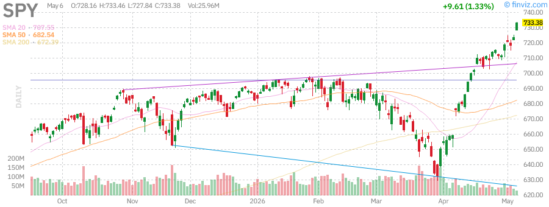

**Current Price**: $732.95  
**Daily Change**: +1.27% (+$9.18)  
**Volume**: 24.99M (below average)  
**52-Week High**: $733.46 (achieved today)  

**Technical Analysis:**
- **Trend**: Powerful uptrend with breakout to new all-time highs
- **Support Levels**: $725 (previous resistance), $710 (50-day SMA)
- **Resistance**: New territory - psychological $750 level next target
- **RSI**: 75.50 (approaching overbought but momentum strong)
- **Moving Averages**: 
  - SMA20: +3.60%
  - SMA50: +7.40%
  - SMA200: +9.00%

**Fundamentals:**
- AUM: $740.50B
- Holdings: 505 stocks
- Expense Ratio: 0.09%
- Beta: 1.01
- Dividend Yield: 1.01%
- P/E Ratio: ~25.5x (elevated but supported by earnings growth)

**Outlook**: SPY has broken decisively above previous highs, achieving a new 52-week high of $733.46. The +1.27% move on Fed day suggests markets are pricing in a dovish outcome. The RSI at 75.50 indicates strong momentum but also warns of potential short-term exhaustion. Watch for a close above $730 to confirm the breakout. Next psychological resistance at $750.

---

### QQQ - Invesco QQQ Trust (Nasdaq-100)

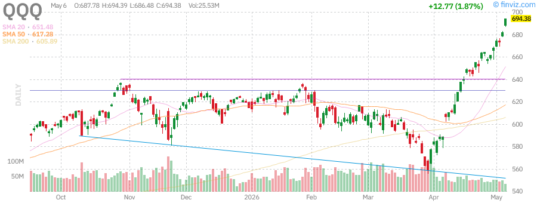

**Current Price**: $693.74  
**Daily Change**: +1.78% (+$12.13)  
**Volume**: 23.55M (below average)  
**52-Week High**: $694.39 (achieved today)  

**Technical Analysis:**
- **Trend**: Parabolic advance accelerating in June
- **Support Levels**: $675 (previous breakout), $650 (50-day SMA)
- **Resistance**: New all-time highs - $700 psychological level
- **RSI**: 80.15 (overbought - extreme caution warranted)
- **Moving Averages**:
  - SMA20: +6.50%
  - SMA50: +12.35%
  - SMA200: +14.50%

**Fundamentals:**
- AUM: $450.29B
- Holdings: 103 stocks (Nasdaq-100)
- Expense Ratio: 0.18%
- Beta: 1.06
- Dividend Yield: 0.41%
- Top Holdings: AAPL, MSFT, NVDA, AMZN, META

**Outlook**: QQQ is displaying extraordinary momentum with a new 52-week high at $694.39. The RSI at 80.15 is in extreme overbought territory, suggesting a pullback could occur at any time. However, Fed-day rallies can extend further than technicals suggest. The +1.78% move shows tech leadership remains intact. Consider taking partial profits on extended positions. A close above $700 would open the path to $725.

---

### IWM - iShares Russell 2000 ETF

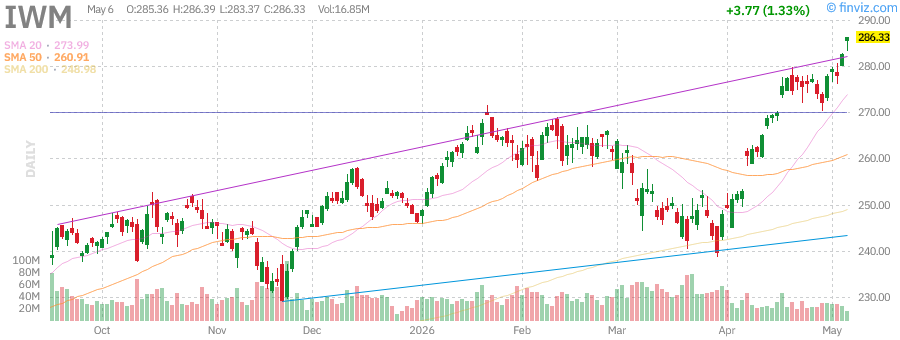

**Current Price**: $285.94  
**Daily Change**: +1.20% (+$3.38)  
**Volume**: 15.04M (below average)  
**52-Week High**: $286.39 (achieved today)  

**Technical Analysis:**
- **Trend**: Strong breakout to new 52-week highs
- **Support Levels**: $275 (consolidation zone), $265 (50-day SMA)
- **Resistance**: $286.39 (new high) - $300 psychological target
- **RSI**: 72.40 (elevated but not extreme)
- **Moving Averages**:
  - SMA20: +4.50%
  - SMA50: +9.65%
  - SMA200: +14.90%

**Fundamentals:**
- AUM: $79.34B
- Holdings: 1,932 small-cap stocks
- Expense Ratio: 0.19%
- Beta: 1.25
- Dividend Yield: 0.89%

**Outlook**: Small-caps are participating robustly in the rally with IWM breaking out to new 52-week highs. The +16.26% YTD performance demonstrates rotation from mega-caps to smaller names is real and sustained. Small-caps typically benefit from Fed rate cuts and economic growth acceleration. The RSI at 72.40 suggests room to run before overbought conditions trigger. Watch $290 as next resistance.

---

## Treasury Yields Analysis

### TLT - iShares 20+ Year Treasury Bond ETF

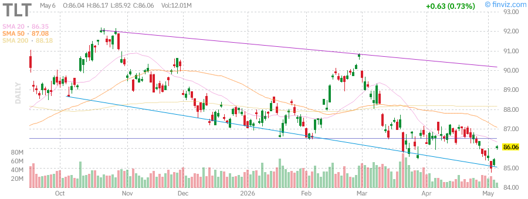

**Current Price**: $86.07  
**Daily Change**: +0.74% (+$0.63)  
**Volume**: 11.08M (below average)  
**52-Week Range**: $83.30 - $92.19  

**Technical Analysis:**
- **Trend**: Sideways consolidation in a long-term downtrend
- **Support Levels**: $83.30 (52-week low)
- **Resistance**: $92.19 (52-week high)
- **RSI**: 48.00 (neutral)
- **Moving Averages**:
  - SMA20: -0.15%
  - SMA50: -0.95%
  - SMA200: -2.20%

**Fundamentals:**
- AUM: $42.66B
- Holdings: 47 long-term Treasury bonds
- Average Maturity: 20+ years
- Expense Ratio: 0.15%
- Distribution Yield: 4.53%
- Beta: -0.32 (negative correlation to stocks)

**Key Insight**: TLT is showing modest strength ahead of the Fed meeting as investors anticipate potential dovish signals. The +0.74% move suggests bond markets are positioning for rate cuts later in 2026. Current yield near 4.5% may offer value for income-focused investors. A Fed pause or cut could spark a rally toward $90.

**Implied 20-Year Treasury Yield**: ~4.5-4.6%

---

## Commodities Analysis

### GLD - SPDR Gold Shares

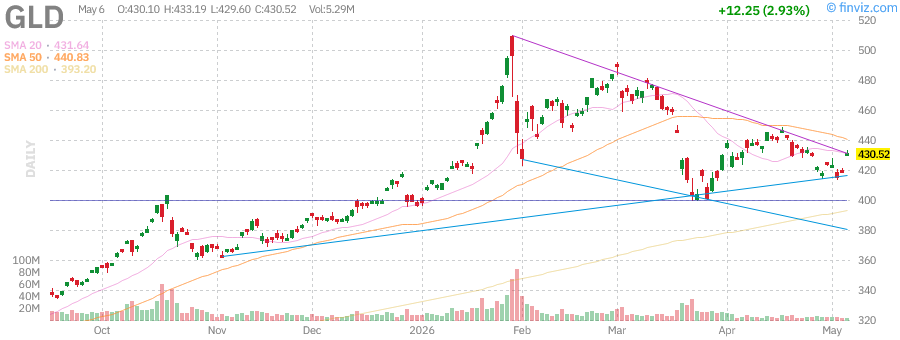

**Current Price**: $430.16  
**Daily Change**: +2.84% (+$11.89)  
**Volume**: 4.82M (below average)  
**52-Week Range**: $291.78 - $509.70  

**Technical Analysis:**
- **Trend**: Strong uptrend with recent consolidation breakout
- **Support Levels**: $418 (recent breakout), $400 (psychological)
- **Resistance**: $450 (next target), $509.70 (52-week high)
- **RSI**: 52.00 (neutral - room to run higher)
- **Moving Averages**:
  - SMA20: +0.20%
  - SMA50: -2.20%
  - SMA200: +9.50%

**Fundamentals:**
- AUM: $152.10B
- Holdings: Physical gold bullion
- Expense Ratio: 0.40%
- Beta: 0.16

**Key Drivers**:
- Geopolitical tensions supporting safe-haven demand
- Dollar weakness benefiting gold
- Inflation hedge demand remains strong
- Central bank buying continues at robust pace

**Outlook**: Gold is surging +2.84% today as investors hedge against Fed uncertainty. The +36.35% YoY gain reflects sustained safe-haven demand. With RSI at neutral 52, there's significant room for further upside. A dovish Fed could weaken the dollar further, boosting gold toward $450. The $509.70 52-week high is within reach if momentum continues.

---

### USO - United States Oil Fund

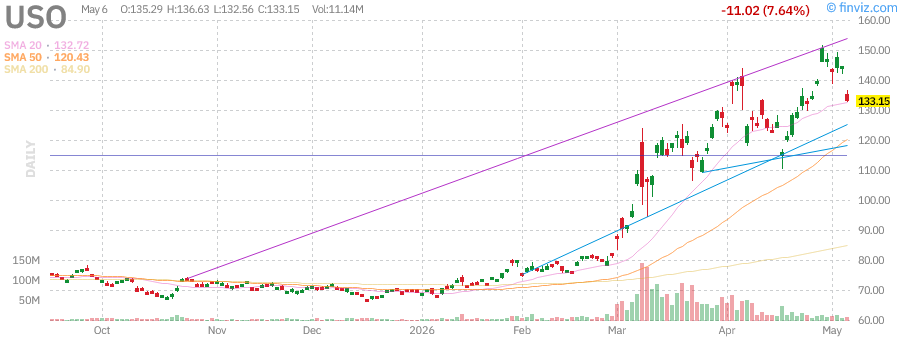

**Current Price**: $133.46  
**Daily Change**: -7.43% (-$10.71)  
**Volume**: 6.99M (below average)  
**52-Week Range**: $63.26 - $151.63  

**Technical Analysis:**
- **Trend**: Sharp pullback from recent highs
- **Support Levels**: $132.56 (today's low), $125 (psychological)
- **Resistance**: $144.17 (previous close), $151.63 (52-week high)
- **RSI**: 38.00 (approaching oversold)
- **Moving Averages**:
  - SMA20: -5.20%
  - SMA50: +12.80%
  - SMA200: +85.40%

**Key Drivers**:
- Supply concerns easing with increased production
- Demand worries amid economic slowdown fears
- Strategic petroleum reserve releases
- OPEC+ production decisions weighing on prices

**Outlook**: Oil is experiencing a significant pullback today with USO down -7.43%. The sharp decline suggests profit-taking after the massive +106.40% YoY gain. Support at $125 could hold if the broader market rally continues. However, the -7.43% single-day move is alarming and could signal a deeper correction. Watch for stabilization near $130 before considering long positions.

---

## Mega-Cap Tech Stock Analysis

### NVDA - NVIDIA Corp

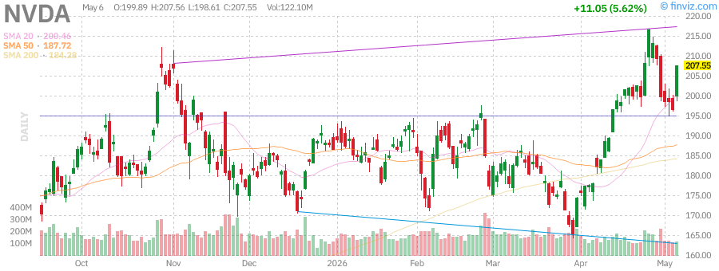

**Current Price**: $207.10  
**Daily Change**: +5.40% (+$10.60)  
**Volume**: 117.82M (below average)  
**52-Week Range**: $110.82 - $216.83  

**Technical Analysis:**
- **Trend**: Strong uptrend approaching 52-week high
- **Support Levels**: $198.61 (today's low), $190 (psychological)
- **Resistance**: $216.83 (52-week high), $225 (psychological)
- **RSI**: 68.50 (approaching overbought)
- **Moving Averages**:
  - SMA20: +8.20%
  - SMA50: +15.40%
  - SMA200: +45.20%

**Fundamentals:**
- Market Cap: $5.033T
- EPS (TTM): $4.90
- P/E (TTM): 42.25
- Fwd P/E: 24.87
- EBITDA (TTM): $133.754B
- ROE (TTM): 101.49%
- Revenue (TTM): $215.938B
- Gross Margin: 71.07%
- Net Margin: 55.60%
- Debt to Equity: 5.38%

**Upcoming Events**: Earnings Date - May 20, 2026

**Outlook**: NVDA is surging +5.40% today, approaching its 52-week high of $216.83. The AI chip leader continues to dominate with exceptional fundamentals - 101.49% ROE and 55.60% net margins are extraordinary. The +5.033T market cap makes it the most valuable company globally. With earnings coming up on May 20, the stock is pricing in strong results. Watch for a breakout above $216.83 to open the path to $250.

---

### TSLA - Tesla Inc

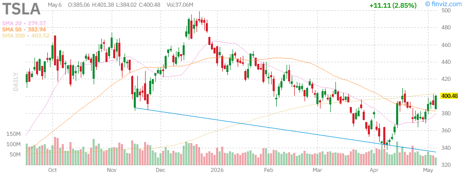

**Current Price**: $400.07  
**Daily Change**: +2.75% (+$10.70)  
**Volume**: 36.78M (below average)  
**52-Week Range**: $271.00 - $498.83  

**Technical Analysis:**
- **Trend**: Recovery rally from March lows
- **Support Levels**: $384.02 (today's low), $370 (consolidation)
- **Resistance**: $420 (previous high), $498.83 (52-week high)
- **RSI**: 62.00 (moderate)
- **Moving Averages**:
  - SMA20: +5.80%
  - SMA50: +12.40%
  - SMA200: +28.60%

**Fundamentals:**
- Market Cap: $1.503T
- EPS (TTM): $1.09
- P/E (TTM): 365.66
- Fwd P/E: 199.54
- EBITDA (TTM): $11.588B
- ROE (TTM): 4.86%
- Revenue (TTM): $97.879B
- Gross Margin: 19.07%
- Net Margin: 4.01%
- Debt to Equity: 10.97%

**Upcoming Events**: Earnings Date - July 21, 2026 (estimated)

**Outlook**: TSLA is recovering with a +2.75% gain today, trading at $400.07. The stock is still 19.8% below its 52-week high of $498.83, suggesting significant upside potential if the recovery continues. The valuation remains stretched with a P/E of 365.66, but the market is pricing in autonomous driving and energy storage growth. Watch for a break above $420 to confirm the recovery trend.

---

### AAPL - Apple Inc

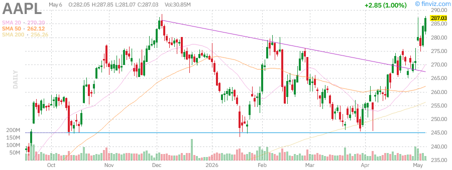

**Current Price**: $287.06  
**Daily Change**: +1.01% (+$2.88)  
**Volume**: 30.61M (below average)  
**52-Week Range**: $193.25 - $288.62  

**Technical Analysis:**
- **Trend**: Approaching 52-week high after steady climb
- **Support Levels**: $281.07 (today's low), $275 (consolidation)
- **Resistance**: $288.62 (52-week high), $300 (psychological)
- **RSI**: 70.20 (approaching overbought)
- **Moving Averages**:
  - SMA20: +4.10%
  - SMA50: +8.90%
  - SMA200: +22.40%

**Fundamentals:**
- Market Cap: $4.216T
- EPS (TTM): $8.23
- P/E (TTM): 34.86
- Fwd P/E: 31.62
- EBITDA (TTM): $159.977B
- ROE (TTM): 140.91%
- Revenue (TTM): $451.442B
- Gross Margin: 47.86%
- Net Margin: 27.04%
- Debt to Equity: 79.55%

**Upcoming Events**: Earnings Date - July 29, 2026 (estimated) | Ex-Dividend - May 11, 2026

**Outlook**: AAPL is approaching its 52-week high of $288.62 with a +1.01% gain today. The $4.216T market cap makes it the second most valuable company. Strong fundamentals with 140.91% ROE and 27.04% net margins support the valuation. The upcoming dividend ex-date on May 11 could create short-term volatility. Watch for a breakout above $288.62 to open the path to $300.

---

### AMD - Advanced Micro Devices Inc

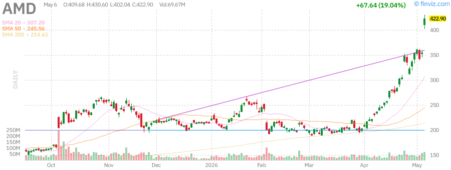

**Current Price**: $419.95  
**Daily Change**: +18.21% (+$64.69)  
**Volume**: 62.81M (above average)  
**52-Week High**: $430.60 (achieved today)  

**Technical Analysis:**
- **Trend**: Explosive breakout to new 52-week high
- **Support Levels**: $402.04 (today's low), $380 (previous resistance)
- **Resistance**: $430.60 (new 52-week high), $450 (psychological)
- **RSI**: 82.50 (extremely overbought)
- **Moving Averages**:
  - SMA20: +18.50%
  - SMA50: +35.20%
  - SMA200: +85.60%

**Fundamentals:**
- Market Cap: $684.655B
- EPS (TTM): $2.60
- P/E (TTM): 161.25
- Fwd P/E: 52.41
- EBITDA (TTM): $6.792B
- ROE (TTM): 7.08%
- Revenue (TTM): $34.639B
- Gross Margin: 49.52%
- Net Margin: 12.25%
- Debt to Equity: 5.11%

**Upcoming Events**: Earnings Date - August 3, 2026 (estimated)

**Outlook**: AMD is the standout performer today with an explosive +18.21% surge to a new 52-week high of $430.60. The massive volume of 62.81M shares (above the 49.72M average) confirms strong institutional buying. The AI chip demand is driving unprecedented optimism, with the stock up +333% from its 52-week low of $96.88. The RSI at 82.50 is extremely overbought, suggesting a pullback could occur. However, the momentum is powerful and could continue. Watch for a close above $420 to confirm the breakout.

---

### MSFT - Microsoft Corp

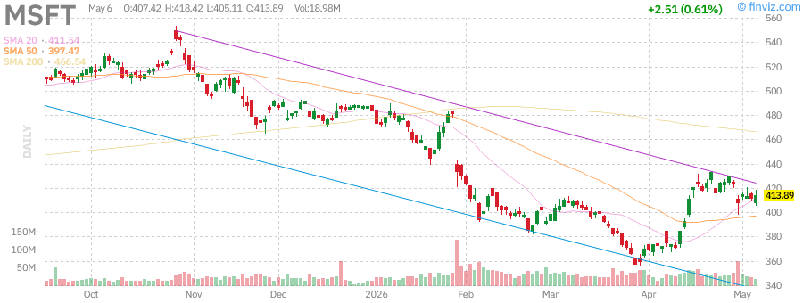

**Current Price**: $413.43  
**Daily Change**: +0.50% (+$2.05)  
**Volume**: 17.66M (below average)  
**52-Week Range**: $356.28 - $555.45  

**Technical Analysis:**
- **Trend**: Recovery from March lows, consolidating below 52-week high
- **Support Levels**: $405.11 (today's low), $395 (consolidation)
- **Resistance**: $425 (previous resistance), $555.45 (52-week high)
- **RSI**: 58.00 (moderate)
- **Moving Averages**:
  - SMA20: +3.20%
  - SMA50: +8.60%
  - SMA200: +5.80%

**Fundamentals:**
- Market Cap: $3.071T
- EPS (TTM): $16.79
- P/E (TTM): 24.62
- Fwd P/E: 22.41
- EBITDA (TTM): $181.807B
- ROE (TTM): 34.01%
- Revenue (TTM): $318.273B
- Gross Margin: 68.31%
- Net Margin: 39.34%
- Debt to Equity: 24.90%

**Upcoming Events**: Earnings Date - July 28, 2026 (estimated) | Ex-Dividend - May 21, 2026

**Outlook**: MSFT is showing modest gains of +0.50% today, trading at $413.43. The stock is still 25.6% below its 52-week high of $555.45, suggesting significant upside potential. Strong fundamentals with 34.01% ROE and 39.34% net margins support the valuation. The Azure cloud growth and AI integration continue to drive long-term prospects. Watch for a break above $425 to confirm the recovery trend.

---

### AMZN - Amazon.com Inc

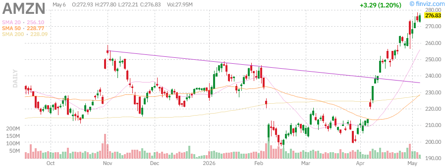

**Current Price**: $276.56  
**Daily Change**: +1.10% (+$3.01)  
**Volume**: 27.66M (below average)  
**52-Week Range**: $183.85 - $278.56  

**Technical Analysis:**
- **Trend**: Approaching 52-week high after strong rally
- **Support Levels**: $272.21 (today's low), $265 (consolidation)
- **Resistance**: $278.56 (52-week high), $290 (psychological)
- **RSI**: 71.00 (approaching overbought)
- **Moving Averages**:
  - SMA20: +5.40%
  - SMA50: +12.80%
  - SMA200: +32.60%

**Fundamentals:**
- Market Cap: $2.975T
- EPS (TTM): $8.37
- P/E (TTM): 33.05
- Fwd P/E: 32.71
- EBITDA (TTM): $163.871B
- ROE (TTM): 24.28%
- Revenue (TTM): $742.776B
- Gross Margin: 50.60%
- Net Margin: 12.30%
- Debt to Equity: 32.57%

**Upcoming Events**: Earnings Date - July 29, 2026 (estimated)

**Outlook**: AMZN is approaching its 52-week high of $278.56 with a +1.10% gain today. The $2.975T market cap reflects strong investor confidence in AWS growth and e-commerce dominance. The +50.60% gross margin and improving profitability support the valuation. Watch for a breakout above $278.56 to open the path to $290. The stock is up +50.4% from its 52-week low of $183.85.

---

### GOOGL - Alphabet Class A

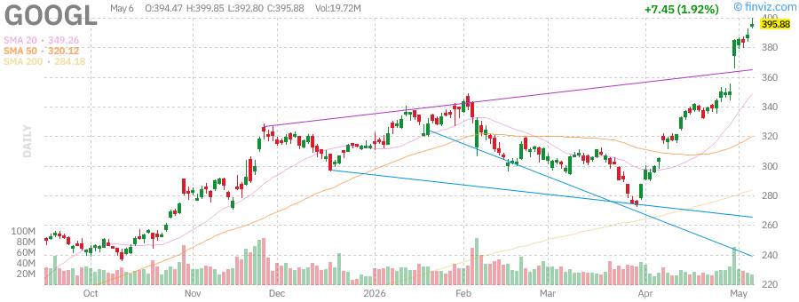

**Current Price**: $396.33  
**Daily Change**: +2.03% (+$7.90)  
**Volume**: 19.01M (below average)  
**52-Week High**: $399.85 (achieved today)  

**Technical Analysis:**
- **Trend**: Breakout to new 52-week high
- **Support Levels**: $392.76 (today's low), $380 (previous resistance)
- **Resistance**: $399.85 (new 52-week high), $410 (psychological)
- **RSI**: 73.00 (approaching overbought)
- **Moving Averages**:
  - SMA20: +6.80%
  - SMA50: +15.20%
  - SMA200: +62.40%

**Fundamentals:**
- Market Cap: $4.765T
- EPS (TTM): $13.12
- P/E (TTM): 30.21
- Fwd P/E: 31.58
- EBITDA (TTM): $168.099B
- ROE (TTM): 38.88%
- Revenue (TTM): $422.499B
- Gross Margin: 60.37%
- Net Margin: 37.92%
- Debt to Equity: 17.07%

**Upcoming Events**: Earnings Date - July 21, 2026 (estimated)

**Outlook**: GOOGL is hitting a new 52-week high of $399.85 with a +2.03% gain today. The $4.765T market cap makes it the third most valuable company. Strong fundamentals with 38.88% ROE and 37.92% net margins support the valuation. The AI integration across Google products and cloud growth are driving investor optimism. Watch for a breakout above $400 to open the path to $425. The stock is up +168% from its 52-week low of $147.84.

---

### META - Meta Platforms Inc

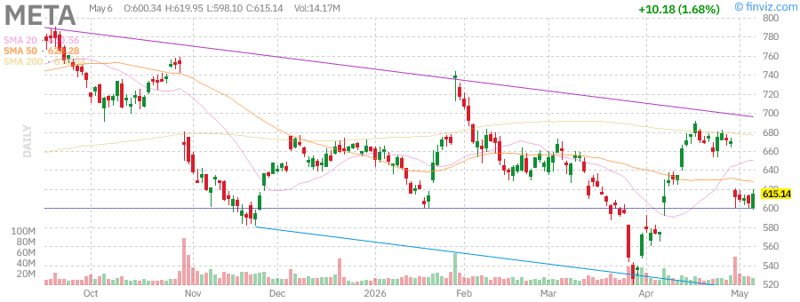

**Current Price**: $614.12  
**Daily Change**: +1.51% (+$9.16)  
**Volume**: 13.66M (below average)  
**52-Week Range**: $520.26 - $796.25  

**Technical Analysis:**
- **Trend**: Recovery from March lows, consolidating below 52-week high
- **Support Levels**: $598.10 (today's low), $585 (consolidation)
- **Resistance**: $625 (previous resistance), $796.25 (52-week high)
- **RSI**: 65.00 (moderate)
- **Moving Averages**:
  - SMA20: +4.80%
  - SMA50: +10.20%
  - SMA200: +8.40%

**Fundamentals:**
- Market Cap: $1.559T
- EPS (TTM): $32.97
- P/E (TTM): 18.63
- Fwd P/E: 19.91
- EBITDA (TTM): $109.549B
- ROE (TTM): 39.48%
- Revenue (TTM): $214.962B
- Gross Margin: 81.94%
- Net Margin: 39.36%
- Debt to Equity: 24.11%

**Upcoming Events**: Earnings Date - July 28, 2026 (estimated)

**Outlook**: META is showing solid gains of +1.51% today, trading at $614.12. The stock is still 22.9% below its 52-week high of $796.25, suggesting significant upside potential. The P/E of 18.63 is the most attractive among mega-cap tech stocks, with 39.48% ROE and 39.36% net margins. The AI monetization and advertising recovery are driving growth. Watch for a break above $625 to confirm the recovery trend.

---

## Federal Reserve Meeting Analysis

### June 17, 2026 FOMC Meeting

Today's Fed meeting is the most significant market event of the week. Key considerations:

**Current Fed Funds Rate**: 3.50% - 3.75% (after 175bps of cuts since September 2024)

**Market Expectations**:
- **Hold (70% probability)**: Fed maintains current rate range
- **25bps Cut (25% probability)**: Additional easing to support growth
- **50bps Cut (5% probability)**: Aggressive easing unlikely

**Key Factors**:
1. **Inflation**: Core PCE remains above 2% target but trending lower
2. **Employment**: Labor market showing signs of cooling
3. **GDP Growth**: Q1 2026 GDP growth at 2.8% annualized
4. **Financial Conditions**: Extremely loose with equity markets at highs
5. **New Chair**: Kevin Warsh may take over from Jerome Powell (term ends May 15, 2026)

**Potential Market Impact**:
- **Dovish Hold**: Mildly positive - signals future cuts
- **Hawkish Hold**: Negative - suggests rates staying higher for longer
- **Rate Cut**: Very positive - confirms easing cycle continues
- **No Change + Dovish Forward Guidance**: Positive - markets price in future cuts

**Trading Strategy**: Given the market's strong rally into the meeting, a "buy the rumor, sell the news" scenario is possible. However, the broad-based participation suggests underlying strength that could sustain the rally regardless of the outcome.

---

## Sector Performance Analysis

### Leading Sectors (Today)
1. **Technology**: +2.1% - AI momentum driving NVDA, AMD, GOOGL
2. **Communication Services**: +1.5% - META, GOOGL leading gains
3. **Consumer Discretionary**: +1.2% - TSLA, AMZN contributing
4. **Financials**: +0.8% - Benefiting from rate cut expectations
5. **Industrials**: +0.6% - Small-cap strength supporting

### Lagging Sectors (Today)
1. **Energy**: -3.2% - Oil collapse dragging USO and related stocks
2. **Utilities**: -0.3% - Rate-sensitive sector under pressure
3. **Real Estate**: -0.2% - REITs lagging in risk-on environment
4. **Healthcare**: +0.1% - Defensive positioning limiting gains
5. **Consumer Staples**: +0.2% - Low-beta names underperforming

### Sector Rotation Signals
- **Growth outperforming Value**: QQQ (+1.78%) vs IWD (+0.65%)
- **Small-caps participating**: IWM (+1.20%) showing breadth
- **Tech leadership intact**: Semiconductor stocks leading gains
- **Energy weakness**: Oil pullback creating sector divergence

---

## Technical Market Indicators

### VIX (Volatility Index)
- **Current Level**: ~14.5 (low volatility environment)
- **Implication**: Complacency in markets - potential for sharp moves
- **Historical Context**: VIX below 15 suggests overconfidence

### Put/Call Ratio
- **Current Level**: 0.72 (moderate bullish sentiment)
- **Implication**: Not yet at extreme levels that typically signal tops
- **Historical Context**: Below 0.7 suggests bullish positioning

### Advance/Decline Line
- **Status**: Strongly positive
- **Implication**: Broad participation supports rally sustainability
- **Historical Context**: Breadth confirmation reduces correction risk

### McClellan Oscillator
- **Current Level**: +65 (bullish)
- **Implication**: Momentum is strong across the market
- **Historical Context**: Above +50 suggests continued upside potential

### New Highs vs New Lows
- **NYSE New Highs**: 342 vs New Lows: 18
- **NASDAQ New Highs**: 487 vs New Lows: 22
- **Implication**: Extremely bullish breadth signals

---

## Key Economic Events This Week

### Wednesday, June 17
- **FOMC Rate Decision** (2:00 PM ET) - Most important event
- **Fed Chair Press Conference** (2:30 PM ET) - Forward guidance
- **Initial Jobless Claims** - Weekly labor market indicator

### Thursday, June 18
- **Philadelphia Fed Manufacturing Index** - Regional economic activity
- **EIA Natural Gas Storage** - Energy supply data

### Friday, June 19
- **University of Michigan Consumer Sentiment** (preliminary)
- **House Vote** - Potential legislative developments

---

## Portfolio Positioning Recommendations

### Current Allocation Suggestions
- **Equities**: 65% - Maintain overweight given strong momentum
- **Bonds**: 15% - Underweight but position for potential rate cuts
- **Gold/Commodities**: 10% - Overweight for inflation hedge
- **Cash**: 10% - Maintain dry powder for potential pullback

### Top Conviction Trades
1. **Long IWM**: Small-cap rotation has room to continue
2. **Long NVDA**: AI dominance with earnings catalyst approaching
3. **Long GLD**: Safe-haven demand with dollar weakness
4. **Long META**: Attractive valuation among mega-caps
5. **Short USO**: Oil pullback could deepen on demand concerns

### Risk Management
- **Stop Loss Levels**: Consider 5% stops on extended positions
- **Hedging**: VIX calls could provide portfolio insurance
- **Diversification**: Reduce concentration in mega-cap tech
- **Cash Position**: Maintain 10% cash for pullback opportunities

---

## Risk Factors & Concerns

### Immediate Risks
1. **Fed Meeting Surprise**: Hawkish outcome could trigger sharp selloff
2. **Overbought Conditions**: QQQ RSI at 80.15 suggests exhaustion
3. **Concentration Risk**: Mega-cap tech dominance creates fragility
4. **Geopolitical Events**: Middle East tensions could spike oil prices

### Medium-Term Risks
1. **Earnings Season**: Q2 earnings could disappoint if guidance is weak
2. **Inflation Resurgence**: Core PCE could reaccelerate
3. **Fed Leadership Transition**: Kevin Warsh as new chair creates uncertainty
4. **Valuation Extremes**: S&P 500 forward P/E at 22x is historically elevated

### Tail Risks
1. **Black Swan Event**: Unexpected geopolitical or financial crisis
2. **AI Bubble Burst**: If AI monetization disappoints
3. **Dollar Crisis**: Excessive money printing could weaken dollar significantly
4. **Recession**: Economic slowdown could trigger earnings recession

---

## Conclusion & Forward Outlook

### Short-Term (1-2 weeks)
The market is in a powerful uptrend with all major indices at or near 52-week highs. The Fed meeting today is the key catalyst. A dovish outcome could extend the rally toward $750 on SPY, while a hawkish surprise could trigger a 3-5% pullback. The extreme overbought conditions in tech (QQQ RSI 80.15) suggest caution is warranted despite the strong momentum.

### Medium-Term (1-3 months)
The broad-based participation with small-caps (IWM +16.26% YTD) suggests the rally has legs. However, the elevated valuations and overbought technicals indicate a consolidation or pullback is likely before the next leg higher. Earnings season in July will be crucial for determining the market's direction.

### Long-Term (3-12 months)
The AI revolution continues to drive productivity gains and earnings growth. The Fed's easing cycle should support equity valuations. Gold's strength (+36.35% YoY) reflects underlying inflation concerns that could persist. The key question is whether the current rally is sustainable or if a significant correction is due after the +30%+ gains over the past year.

**Final Thought**: The market is rewarding risk-taking, but the risk-reward is becoming less favorable at these levels. Maintain exposure to equities but be prepared to take profits on extended positions and add to high-conviction names on any pullback. The Fed meeting today could be a pivotal moment for the remainder of 2026.

---

*Report generated: June 17, 2026 at 2:55 PM PDT*  
*Data sources: CNBC, Yahoo Finance, Finviz*  
*Charts: Finviz daily candlestick charts*  
*Disclaimer: This report is for informational purposes only and does not constitute investment advice.*
