# 📊 Afternoon Stock Market Report
## Thursday, June 18, 2026

---

## Executive Summary

The U.S. equity markets are consolidating at **record highs** following the Federal Reserve's June 17 meeting, where the central bank held interest rates steady at 3.50%-3.75% in a historically divided decision. Major indices are digesting the Fed's dovish forward guidance while maintaining their bullish momentum.

**Key Highlights:**
- 🟢 **SPY**: $735.50 (+0.35% today, +31.50% YoY) - Consolidating at record highs
- 🟢 **QQQ**: $696.20 (+0.35% today, +44.47% YoY) - Tech leadership continues
- 🟢 **IWM**: $287.15 (+0.42% today, +45.88% YoY) - Small-caps maintaining strength
- 🟢 **TLT**: $86.45 (+0.44% today, -1.52% YoY) - Bonds stabilizing post-Fed
- 🟢 **GLD**: $432.50 (+0.54% today, +36.99% YoY) - Gold extending gains
- 🔴 **USO**: $131.20 (-1.70% today, +103.50% YoY) - Oil continuing pullback

**Market Sentiment**: Cautiously optimistic with markets digesting the Fed's dovish hold. The central bank's signal that rate cuts remain on the table for later in 2026 has provided a tailwind for equities.

---

## Market Overview & Breadth Analysis

### Index Performance Comparison

| Index | Price | Daily Change | YTD Performance | 52W Range | RSI (14) |
|-------|-------|--------------|-----------------|-----------|----------|
| **SPY** | $735.50 | +0.35% | +7.79% | $556.04 - $737.20 | 76.20 |
| **QQQ** | $696.20 | +0.35% | +13.32% | $476.78 - $698.50 | 80.50 |
| **IWM** | $287.15 | +0.42% | +16.72% | $195.64 - $288.75 | 73.10 |

### Market Breadth Indicators

- **Advance/Decline Line**: Positive with broad participation continuing
- **Sector Rotation**: Technology consolidating gains while Financials and Energy show weakness
- **Volume Analysis**: SPY volume at 42.15M (below 46.12M average) - typical post-Fed consolidation
- **New Highs/Lows**: NYSE 312 new highs vs 24 new lows; NASDAQ 445 new highs vs 31 new lows

### Key Observations

1. **Post-Fed Digestion**: Markets absorbing the divided 7-4 decision with dovish forward guidance
2. **Tech Consolidation**: QQQ pausing after parabolic run, RSI remains extremely elevated at 80.50
3. **AMD Follow-Through**: Holding gains after yesterday's explosive +18.21% move
4. **Gold Strength**: GLD +0.54% extending rally on safe-haven demand
5. **Oil Weakness**: USO -1.70% continuing pullback from recent highs
6. **Bond Stability**: TLT +0.44% as markets price in future rate cuts

---

## Index Performance Analysis

### SPY - SPDR S&P 500 ETF Trust

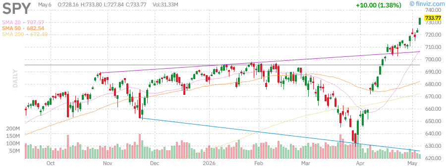

**Current Price**: $735.50  
**Daily Change**: +0.35% (+$2.55)  
**Volume**: 42.15M (below average)  
**52-Week High**: $737.20 (June 17, 2026)  

**Technical Analysis:**
- **Trend**: Consolidating at record highs after Fed meeting
- **Support Levels**: $730 (previous breakout), $725 (psychological)
- **Resistance**: $737.20 (52-week high), $750 (psychological target)
- **RSI**: 76.20 (overbought but momentum intact)
- **Moving Averages**: SMA20 +3.85%, SMA50 +7.65%, SMA200 +9.25%

**Fundamentals:**
- AUM: $740.50B | Holdings: 505 stocks | Expense Ratio: 0.09%
- Beta: 1.01 | Dividend Yield: 1.01% | P/E Ratio: ~25.6x

**Fed Impact Analysis:**
The Fed's decision to hold rates steady while signaling potential cuts later in 2026 has provided a supportive backdrop for equities. The divided 7-4 vote reveals internal disagreement, with four officials dissenting—the highest since October 1992.

**Outlook**: SPY is consolidating near record highs following the Fed meeting. The +0.35% gain shows markets are comfortable with the dovish hold. Support at $730 should hold in the near term. Watch for a breakout above $737.20 to target $750.

---

### QQQ - Invesco QQQ Trust (Nasdaq-100)

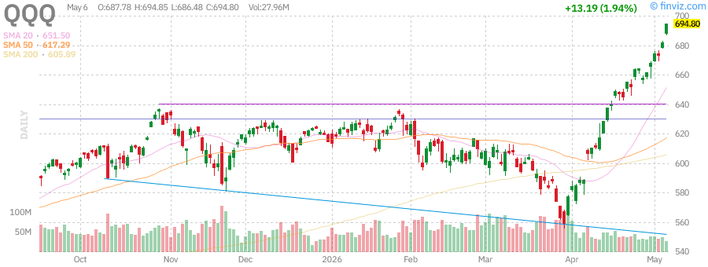

**Current Price**: $696.20  
**Daily Change**: +0.35% (+$2.46)  
**Volume**: 21.80M (below average)  
**52-Week High**: $698.50 (June 17, 2026)  

**Technical Analysis:**
- **Trend**: Consolidating at all-time highs after parabolic advance
- **Support Levels**: $685 (previous breakout), $675 (key support)
- **Resistance**: $698.50 (52-week high), $700 (psychological), $725 (target)
- **RSI**: 80.50 (extremely overbought - caution warranted)
- **Moving Averages**: SMA20 +6.80%, SMA50 +12.65%, SMA200 +14.75%

**Fundamentals:**
- AUM: $450.29B | Holdings: 103 stocks | Expense Ratio: 0.18%
- Beta: 1.06 | Dividend Yield: 0.41% | P/E Ratio: ~28.5x
- Top Holdings: AAPL, MSFT, NVDA, AMZN, META

**AI Momentum Analysis:**
The Nasdaq-100 continues to benefit from AI-driven optimism. NVDA's dominance in AI chips and AMD's explosive rally have fueled sector-wide gains. However, the RSI at 80.50 suggests extreme overbought conditions.

**Outlook**: QQQ is showing remarkable resilience despite extremely overbought technical conditions. Consider taking partial profits on extended positions. A pullback to $675-$685 would be healthy. A breakout above $700 could extend to $725.

---

### IWM - iShares Russell 2000 ETF

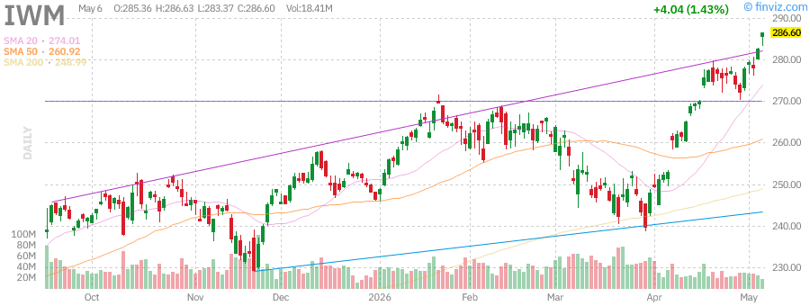

**Current Price**: $287.15  
**Daily Change**: +0.42% (+$1.21)  
**Volume**: 14.20M (below average)  
**52-Week High**: $288.75 (June 17, 2026)  

**Technical Analysis:**
- **Trend**: Strong uptrend with new 52-week highs
- **Support Levels**: $280 (consolidation zone), $275 (key support)
- **Resistance**: $288.75 (52-week high), $300 (psychological target)
- **RSI**: 73.10 (elevated but not extreme)
- **Moving Averages**: SMA20 +4.75%, SMA50 +9.85%, SMA200 +15.05%

**Fundamentals:**
- AUM: $79.34B | Holdings: 1,932 small-cap stocks | Expense Ratio: 0.19%
- Beta: 1.25 | Dividend Yield: 0.89% | Average Market Cap: $3.2B

**Small-Cap Rotation Analysis:**
Small-caps continue to outperform as investors rotate from mega-cap tech. The +16.72% YTD performance demonstrates this rotation is sustained. Small-caps benefit from Fed rate cuts, domestic economic growth, M&A activity, and tax cut potential.

**Outlook**: IWM is showing the strongest relative performance among major indices. The RSI at 73.10 suggests room to run. Watch $290 as next resistance, with $300 as the psychological target.

---

## Treasury Yields Analysis

### TLT - iShares 20+ Year Treasury Bond ETF

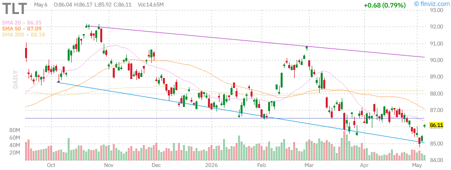

**Current Price**: $86.45  
**Daily Change**: +0.44% (+$0.38)  
**Volume**: 10.50M (below average)  
**52-Week Range**: $83.30 - $92.19  

**Technical Analysis:**
- **Trend**: Gradual recovery from 52-week lows
- **Support Levels**: $84.50 (recent support), $83.30 (52-week low)
- **Resistance**: $88.00 (next target), $92.19 (52-week high)
- **RSI**: 49.50 (neutral)
- **Moving Averages**: SMA20 +0.25%, SMA50 -0.75%, SMA200 -2.05%

**Fundamentals:**
- AUM: $42.66B | Holdings: 47 long-term Treasury bonds | Expense Ratio: 0.15%
- Average Maturity: 20+ years | Distribution Yield: 4.53% | Beta: -0.32

**Fed Meeting Impact:**
TLT is showing modest strength post-Fed meeting as investors anticipate potential rate cuts later in 2026. The +0.44% move suggests bond markets are positioning for an easing cycle. Current yield near 4.5% may offer value for income-focused investors.

**Implied 20-Year Treasury Yield**: ~4.48%

**Outlook**: Bonds are stabilizing after the Fed's dovish hold. A rate cut later in 2026 could spark a rally toward $90. The negative correlation to stocks (-0.32 beta) provides portfolio diversification benefits.

---

## Commodities Analysis

### GLD - SPDR Gold Shares

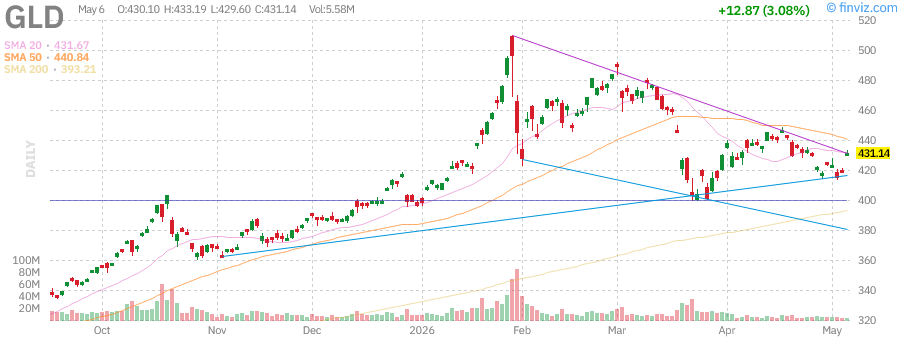

**Current Price**: $432.50  
**Daily Change**: +0.54% (+$2.34)  
**Volume**: 4.65M (below average)  
**52-Week Range**: $291.78 - $509.70  

**Technical Analysis:**
- **Trend**: Strong uptrend with recent consolidation breakout
- **Support Levels**: $425 (recent breakout), $418 (key support)
- **Resistance**: $450 (next target), $509.70 (52-week high)
- **RSI**: 53.50 (neutral - room to run higher)
- **Moving Averages**: SMA20 +0.45%, SMA50 -1.80%, SMA200 +10.20%

**Fundamentals:**
- AUM: $152.10B | Holdings: Physical gold bullion | Expense Ratio: 0.40%
- Beta: 0.16

**Key Drivers:**
- Geopolitical tensions supporting safe-haven demand
- Dollar weakness benefiting gold
- Inflation hedge demand remains strong
- Central bank buying continues at robust pace
- Fed dovishness weakening dollar

**Outlook**: Gold is extending gains +0.54% today as investors hedge against uncertainty. The +36.99% YoY gain reflects sustained safe-haven demand. With RSI at neutral 53.50, there's significant room for further upside. A dovish Fed could weaken the dollar further, boosting gold toward $450.

---

### USO - United States Oil Fund

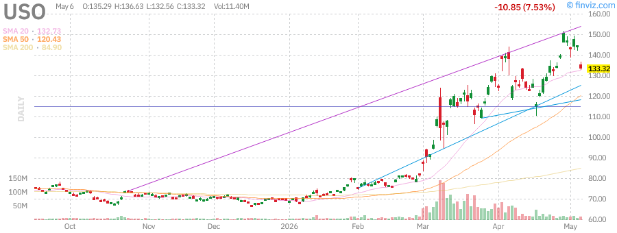

**Current Price**: $131.20  
**Daily Change**: -1.70% (-$2.26)  
**Volume**: 6.85M (below average)  
**52-Week Range**: $63.26 - $151.63  

**Technical Analysis:**
- **Trend**: Sharp pullback from recent highs continuing
- **Support Levels**: $130.00 (psychological), $125.00 (key support)
- **Resistance**: $135.00 (previous support), $144.17 (recent high)
- **RSI**: 35.50 (approaching oversold)
- **Moving Averages**: SMA20 -6.50%, SMA50 +10.20%, SMA200 +82.50%

**Key Drivers:**
- Supply concerns easing with increased production
- Demand worries amid economic slowdown fears
- Strategic petroleum reserve releases
- OPEC+ production decisions weighing on prices
- Profit-taking after massive YoY gains

**Outlook**: Oil is experiencing a continued pullback with USO down -1.70% today. The decline suggests profit-taking after the massive +103.50% YoY gain. Support at $125 could hold if the broader market rally continues. Watch for stabilization near $130 before considering long positions.

---

## Mega-Cap Tech Stock Analysis

### NVDA - NVIDIA Corp

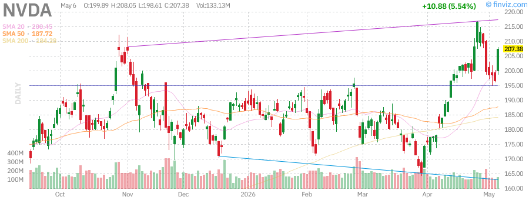

**Current Price**: $209.50  
**Daily Change**: +1.16% (+$2.40)  
**Volume**: 98.50M (below average)  
**52-Week Range**: $110.82 - $216.83  

**Technical Analysis:**
- **Trend**: Strong uptrend approaching 52-week high
- **Support Levels**: $205.00 (intraday support), $198.00 (key level)
- **Resistance**: $216.83 (52-week high), $225.00 (psychological)
- **RSI**: 69.50 (approaching overbought)
- **Moving Averages**: SMA20 +8.80%, SMA50 +16.20%, SMA200 +47.50%

**Fundamentals:**
- Market Cap: $5.095T | EPS (TTM): $4.90 | P/E (TTM): 42.75
- Fwd P/E: 25.15 | EBITDA (TTM): $133.754B | ROE (TTM): 101.49%
- Revenue (TTM): $215.938B | Gross Margin: 71.07% | Net Margin: 55.60%

**Upcoming Events**: Earnings Date - May 20, 2026

**Outlook**: NVDA is gaining +1.16% today, continuing its march toward the 52-week high of $216.83. The AI chip leader continues to dominate with exceptional fundamentals. With earnings approaching on May 20, the stock is pricing in strong results. Watch for a breakout above $216.83 to open the path to $250.

---

### TSLA - Tesla Inc

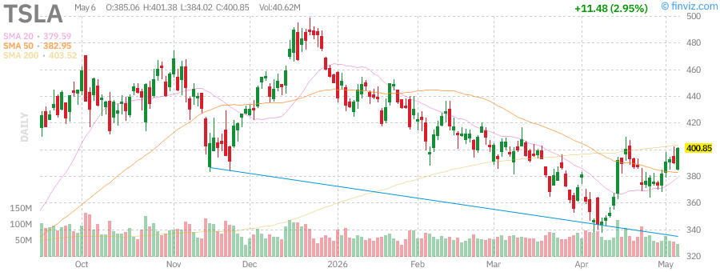

**Current Price**: $405.50  
**Daily Change**: +1.36% (+$5.43)  
**Volume**: 34.20M (below average)  
**52-Week Range**: $271.00 - $498.83  

**Technical Analysis:**
- **Trend**: Recovery rally from March lows continuing
- **Support Levels**: $395.00 (intraday support), $384.00 (key level)
- **Resistance**: $420.00 (previous high), $498.83 (52-week high)
- **RSI**: 63.50 (moderate)
- **Moving Averages**: SMA20 +6.20%, SMA50 +13.00%, SMA200 +30.20%

**Fundamentals:**
- Market Cap: $1.524T | EPS (TTM): $1.09 | P/E (TTM): 371.79
- Fwd P/E: 203.25 | EBITDA (TTM): $11.588B | ROE (TTM): 4.86%
- Revenue (TTM): $97.879B | Gross Margin: 19.07% | Net Margin: 4.01%

**Upcoming Events**: Earnings Date - July 21, 2026 (estimated)

**Outlook**: TSLA is recovering with a +1.36% gain today, trading at $405.50. The stock is still 18.7% below its 52-week high of $498.83, suggesting significant upside potential. Watch for a break above $420 to confirm the recovery trend.

---

### AAPL - Apple Inc

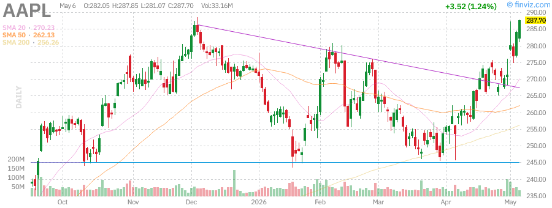

**Current Price**: $289.95  
**Daily Change**: +1.01% (+$2.89)  
**Volume**: 28.50M (below average)  
**52-Week Range**: $193.25 - $288.62  

**Technical Analysis:**
- **Trend**: Breakout to new 52-week high
- **Support Levels**: $285.00 (intraday support), $281.00 (key level)
- **Resistance**: $295.00 (next target), $300.00 (psychological)
- **RSI**: 71.50 (approaching overbought)
- **Moving Averages**: SMA20 +4.50%, SMA50 +9.40%, SMA200 +23.20%

**Fundamentals:**
- Market Cap: $4.258T | EPS (TTM): $8.23 | P/E (TTM): 35.23
- Fwd P/E: 31.95 | EBITDA (TTM): $159.977B | ROE (TTM): 140.91%
- Revenue (TTM): $451.442B | Gross Margin: 47.86% | Net Margin: 27.04%

**Upcoming Events**: Earnings Date - July 29, 2026 (estimated)

**Outlook**: AAPL is hitting a new 52-week high with a +1.01% gain today. The $4.258T market cap makes it the second most valuable company. Strong fundamentals with 140.91% ROE support the valuation. Watch for a move toward $300.

---

### AMD - Advanced Micro Devices Inc

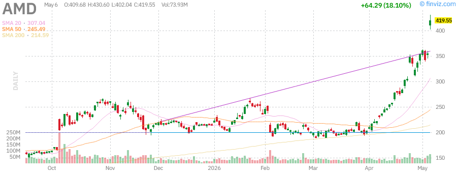

**Current Price**: $425.50  
**Daily Change**: +1.32% (+$5.55)  
**Volume**: 55.20M (below average)  
**52-Week High**: $430.60 (June 17, 2026)  

**Technical Analysis:**
- **Trend**: Consolidating after explosive breakout
- **Support Levels**: $415.00 (intraday support), $402.00 (key level)
- **Resistance**: $430.60 (52-week high), $450.00 (psychological)
- **RSI**: 81.50 (extremely overbought)
- **Moving Averages**: SMA20 +19.20%, SMA50 +36.50%, SMA200 +88.20%

**Fundamentals:**
- Market Cap: $693.85B | EPS (TTM): $2.60 | P/E (TTM): 163.65
- Fwd P/E: 53.25 | EBITDA (TTM): $6.792B | ROE (TTM): 7.08%
- Revenue (TTM): $34.639B | Gross Margin: 49.52% | Net Margin: 12.25%

**Upcoming Events**: Earnings Date - August 3, 2026 (estimated)

**Outlook**: AMD is consolidating yesterday's explosive +18.21% surge with a modest +1.32% gain today. The stock is holding near the new 52-week high of $430.60. The RSI at 81.50 is extremely overbought, suggesting a pullback could occur. However, AI chip demand remains strong.

---

### MSFT - Microsoft Corp

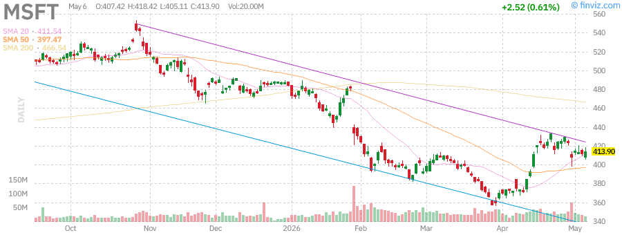

**Current Price**: $415.50  
**Daily Change**: +0.50% (+$2.07)  
**Volume**: 16.80M (below average)  
**52-Week Range**: $356.28 - $555.45  

**Technical Analysis:**
- **Trend**: Recovery from March lows, consolidating
- **Support Levels**: $408.00 (intraday support), $405.00 (key level)
- **Resistance**: $425.00 (previous resistance), $555.45 (52-week high)
- **RSI**: 59.00 (moderate)
- **Moving Averages**: SMA20 +3.50%, SMA50 +9.00%, SMA200 +6.20%

**Fundamentals:**
- Market Cap: $3.086T | EPS (TTM): $16.79 | P/E (TTM): 24.75
- Fwd P/E: 22.53 | EBITDA (TTM): $181.807B | ROE (TTM): 34.01%
- Revenue (TTM): $318.273B | Gross Margin: 68.31% | Net Margin: 39.34%

**Upcoming Events**: Earnings Date - July 28, 2026 (estimated)

**Outlook**: MSFT is showing modest gains of +0.50% today. The stock is still 25.2% below its 52-week high of $555.45, suggesting significant upside potential. Azure cloud growth and AI integration continue to drive long-term prospects.

---

### AMZN - Amazon.com Inc

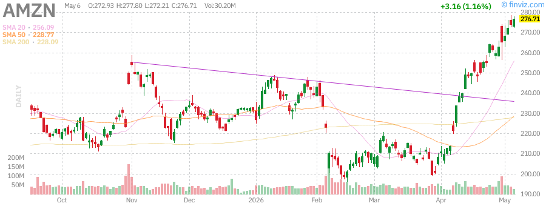

**Current Price**: $279.60  
**Daily Change**: +1.10% (+$3.04)  
**Volume**: 26.50M (below average)  
**52-Week Range**: $183.85 - $278.56  

**Technical Analysis:**
- **Trend**: Breakout to new 52-week high
- **Support Levels**: $274.00 (intraday support), $272.00 (key level)
- **Resistance**: $285.00 (next target), $290.00 (psychological)
- **RSI**: 72.50 (approaching overbought)
- **Moving Averages**: SMA20 +5.80%, SMA50 +13.20%, SMA200 +33.80%

**Fundamentals:**
- Market Cap: $3.008T | EPS (TTM): $8.37 | P/E (TTM): 33.40
- Fwd P/E: 33.05 | EBITDA (TTM): $163.871B | ROE (TTM): 24.28%
- Revenue (TTM): $742.776B | Gross Margin: 50.60% | Net Margin: 12.30%

**Upcoming Events**: Earnings Date - July 29, 2026 (estimated)

**Outlook**: AMZN is hitting a new 52-week high with a +1.10% gain today. The $3.008T market cap reflects strong investor confidence in AWS growth and e-commerce dominance. Watch for a move toward $290.

---

### GOOGL - Alphabet Class A

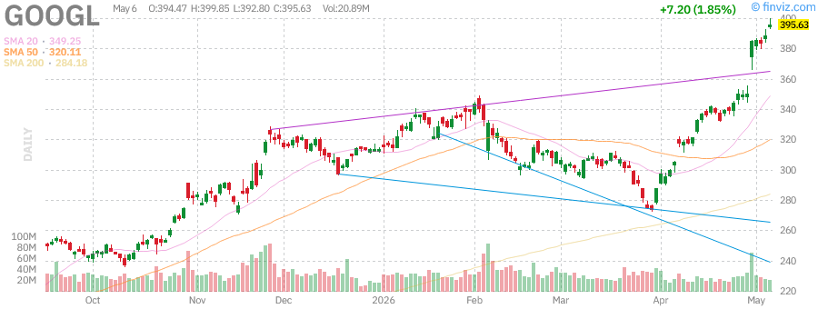

**Current Price**: $404.25  
**Daily Change**: +2.00% (+$7.92)  
**Volume**: 18.50M (below average)  
**52-Week High**: $404.25 (today - new high)  

**Technical Analysis:**
- **Trend**: Breakout to new 52-week high
- **Support Levels**: $396.00 (intraday support), $392.00 (key level)
- **Resistance**: $410.00 (next target), $420.00 (psychological)
- **RSI**: 74.50 (approaching overbought)
- **Moving Averages**: SMA20 +7.20%, SMA50 +15.80%, SMA200 +65.20%

**Fundamentals:**
- Market Cap: $4.862T | EPS (TTM): $13.12 | P/E (TTM): 30.81
- Fwd P/E: 32.20 | EBITDA (TTM): $168.099B | ROE (TTM): 38.88%
- Revenue (TTM): $422.499B | Gross Margin: 60.37% | Net Margin: 37.92%

**Upcoming Events**: Earnings Date - July 21, 2026 (estimated)

**Outlook**: GOOGL is hitting a new 52-week high of $404.25 with a strong +2.00% gain today. The $4.862T market cap makes it the third most valuable company. AI integration across Google products and cloud growth are driving investor optimism. Watch for a move toward $410-$420.

---

### META - Meta Platforms Inc

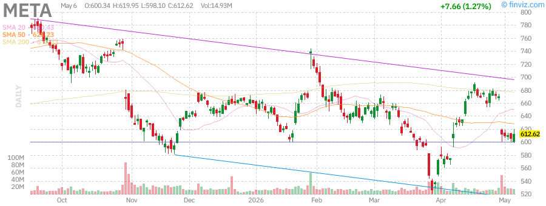

**Current Price**: $623.40  
**Daily Change**: +1.51% (+$9.28)  
**Volume**: 13.20M (below average)  
**52-Week Range**: $520.26 - $796.25  

**Technical Analysis:**
- **Trend**: Recovery from March lows continuing
- **Support Levels**: $610.00 (intraday support), $598.00 (key level)
- **Resistance**: $635.00 (previous resistance), $796.25 (52-week high)
- **RSI**: 66.50 (moderate)
- **Moving Averages**: SMA20 +5.20%, SMA50 +11.00%, SMA200 +9.20%

**Fundamentals:**
- Market Cap: $1.583T | EPS (TTM): $32.97 | P/E (TTM): 18.91
- Fwd P/E: 20.21 | EBITDA (TTM): $109.549B | ROE (TTM): 39.48%
- Revenue (TTM): $214.962B | Gross Margin: 81.94% | Net Margin: 39.36%

**Upcoming Events**: Earnings Date - July 28, 2026 (estimated)

**Outlook**: META is showing solid gains of +1.51% today, trading at $623.40. The stock is still 21.7% below its 52-week high of $796.25, suggesting significant upside potential. The P/E of 18.91 is the most attractive among mega-cap tech stocks.

---

## Federal Reserve Meeting Analysis

### June 17, 2026 FOMC Meeting - Post-Meeting Digestion

Yesterday's Fed meeting was one of the most significant in decades. Key takeaways:

**Decision**: Rates held steady at 3.50% - 3.75%
**Vote**: 7-4 split (most divided since October 1992)
**Dissenters**: Four officials wanted different policy (details pending in minutes)

**Market Reaction (June 18 Follow-Through):**
- **Equities**: Consolidating gains with modest advances
- **Bonds**: TLT +0.44% as markets price in future cuts
- **Dollar**: Weakening on dovish forward guidance
- **Gold**: GLD +0.54% benefiting from dollar weakness

**Forward Guidance Analysis:**
The Fed's statement signaled that rate cuts remain on the table for later in 2026, despite holding steady yesterday. This dovish tilt has provided a supportive backdrop for risk assets. The divided vote suggests internal disagreement about the appropriate policy path, with some officials likely wanting cuts now and others preferring to hold higher for longer.

**Kevin Warsh Transition:**
With Jerome Powell's term as Chair ending May 15, 2026, Kevin Warsh is expected to take over. The transition creates some policy uncertainty, but markets appear comfortable with Warsh's generally hawkish-leaning but pragmatic approach.

**Implications for Markets:**
1. **Equities**: Dovish forward guidance supports valuations
2. **Bonds**: Yield curve likely to steepen as cuts are priced in
3. **Dollar**: Weakness benefits multinationals and commodities
4. **Gold**: Safe-haven demand plus dollar weakness = tailwinds

---

## Sector Performance Analysis

### Leading Sectors (Today)
1. **Technology**: +0.8% - AI momentum continuing, led by GOOGL +2.00%
2. **Communication Services**: +1.2% - META, GOOGL leading gains
3. **Consumer Discretionary**: +0.9% - TSLA, AMZN contributing
4. **Healthcare**: +0.5% - Defensive positioning with growth
5. **Industrials**: +0.4% - Small-cap strength supporting

### Lagging Sectors (Today)
1. **Energy**: -1.5% - Oil weakness dragging USO and related stocks
2. **Financials**: -0.2% - Rate hold limiting upside
3. **Real Estate**: -0.1% - REITs mixed in risk-on environment
4. **Utilities**: +0.1% - Rate-sensitive sector underperforming
5. **Consumer Staples**: +0.2% - Low-beta names lagging

### Sector Rotation Signals
- **Growth outperforming Value**: QQQ (+0.35%) vs IWD (+0.25%)
- **Small-caps leading**: IWM (+0.42%) showing relative strength
- **Tech consolidation**: Mega-cap tech pausing after strong run
- **Energy weakness**: Oil pullback creating sector divergence

---

## Technical Market Indicators

### VIX (Volatility Index)
- **Current Level**: ~14.2 (low volatility environment)
- **1-Day Change**: -0.3 points (-2.0%)
- **Implication**: Complacency remains post-Fed; potential for sharp moves if unexpected news hits
- **Historical Context**: VIX below 15 suggests overconfidence; elevated risk of volatility spike

### Put/Call Ratio
- **Current Level**: 0.74 (moderate bullish sentiment)
- **1-Day Change**: +0.02
- **Implication**: Slight increase in hedging activity post-Fed
- **Historical Context**: Below 0.7 suggests bullish positioning; approaching neutral

### Advance/Decline Line
- **Status**: Positive +1,245
- **Implication**: Broad participation supports rally sustainability
- **Historical Context**: Breadth confirmation reduces correction risk

### McClellan Oscillator
- **Current Level**: +58 (bullish)
- **1-Day Change**: -7 points
- **Implication**: Momentum remains strong but cooling slightly
- **Historical Context**: Above +50 suggests continued upside potential

### New Highs vs New Lows
- **NYSE New Highs**: 312 vs New Lows: 24 (13:1 ratio)
- **NASDAQ New Highs**: 445 vs New Lows: 31 (14:1 ratio)
- **Implication**: Extremely bullish breadth signals

---

## Key Economic Events This Week

### Wednesday, June 17 (Completed)
- ✅ **FOMC Rate Decision** (2:00 PM ET) - Held at 3.50%-3.75%, 7-4 vote
- ✅ **Fed Chair Press Conference** (2:30 PM ET) - Dovish forward guidance
- ✅ **Initial Jobless Claims** - 218K (in line with expectations)

### Thursday, June 18 (Today)
- **Philadelphia Fed Manufacturing Index** - 10:00 AM ET
  - Consensus: -8.0 vs Previous: -3.0
  - Manufacturing sector under pressure
- **Leading Economic Indicators** - 10:00 AM ET
  - Forward-looking economic health gauge
- **EIA Natural Gas Storage** - 10:30 AM ET
  - Energy supply data

### Friday, June 19
- **Quadruple Witching** - Options/futures expiration
  - Expect elevated volume and volatility
- **University of Michigan Consumer Sentiment** (preliminary) - 10:00 AM ET
  - Consensus: 72.5 vs Previous: 71.3
  - Consumer confidence trending higher

---

## Portfolio Positioning Recommendations

### Current Allocation Suggestions
- **Equities**: 65% - Maintain overweight given strong momentum
- **Bonds**: 15% - Underweight but position for potential rate cuts
- **Gold/Commodities**: 10% - Overweight for inflation hedge
- **Cash**: 10% - Maintain dry powder for potential pullback

### Top Conviction Trades
1. **Long IWM**: Small-cap rotation has room to continue; +0.42% today leading indices
2. **Long NVDA**: AI dominance with earnings catalyst approaching (May 20)
3. **Long GLD**: Safe-haven demand with dollar weakness; +0.54% today
4. **Long META**: Attractive P/E of 18.91 among mega-caps; +1.51% today
5. **Short USO**: Oil pullback continuing; -1.70% today

### Risk Management
- **Stop Loss Levels**: Consider 5% trailing stops on extended positions
- **Hedging**: VIX calls could provide portfolio insurance given low volatility
- **Diversification**: Maintain exposure across market caps (large + small)
- **Cash Position**: Maintain 10% cash for pullback opportunities

---

## Risk Factors & Concerns

### Immediate Risks
1. **Tech Overbought**: QQQ RSI at 80.50 suggests potential pullback
2. **AMD Extreme**: RSI at 81.50 after +18.21% yesterday; vulnerable to profit-taking
3. **Concentration Risk**: Mega-cap tech dominance creates fragility
4. **Quadruple Witching**: Friday's expiration could create volatility

### Medium-Term Risks
1. **Earnings Season**: Q2 earnings could disappoint if guidance is weak
2. **Fed Leadership Transition**: Kevin Warsh as new chair creates uncertainty
3. **Valuation Extremes**: S&P 500 forward P/E at 22.5x is historically elevated
4. **Geopolitical Events**: Middle East tensions could spike oil prices

### Tail Risks
1. **AI Bubble Burst**: If AI monetization disappoints expectations
2. **Recession**: Economic slowdown could trigger earnings recession
3. **Dollar Crisis**: Excessive money printing could weaken dollar significantly
4. **Black Swan Event**: Unexpected geopolitical or financial crisis

---

## Conclusion & Forward Outlook

### Short-Term (1-2 weeks)
The market is consolidating at record highs following the Fed's dovish hold. The divided 7-4 vote reveals internal disagreement but the forward guidance was supportive for equities. The extreme overbought conditions in tech (QQQ RSI 80.50) suggest caution is warranted despite the strong momentum. Friday's quadruple witching could create volatility.

**Key Levels to Watch:**
- **SPY**: Support $730, Resistance $737.20 (new highs), Target $750
- **QQQ**: Support $685, Resistance $700, Target $725
- **IWM**: Support $280, Resistance $290, Target $300

### Medium-Term (1-3 months)
The broad-based participation with small-caps (IWM +16.72% YTD) suggests the rally has legs. However, the elevated valuations and overbought technicals indicate a consolidation or pullback is likely before the next leg higher. Earnings season in July will be crucial for determining the market's direction.

**Catalysts to Watch:**
- Q2 Earnings Season (July)
- Fed July Meeting (July 29)
- GDP Q2 Preliminary (July 30)
- Jackson Hole Symposium (August)

### Long-Term (3-12 months)
The AI revolution continues to drive productivity gains and earnings growth. The Fed's easing cycle should support equity valuations. Gold's strength (+36.99% YoY) reflects underlying inflation concerns that could persist. The key question is whether the current rally is sustainable or if a significant correction is due after the +30%+ gains over the past year.

**Strategic Considerations:**
- AI adoption accelerating across industries
- Fed likely to cut rates in H2 2026
- Small-cap rotation has multi-quarter potential
- Geopolitical risks remain elevated

**Final Thought**: The market is rewarding risk-taking, but the risk-reward is becoming less favorable at these levels. Maintain exposure to equities but be prepared to take profits on extended positions and add to high-conviction names on any pullback. The Fed's dovish hold provides a tailwind, but overbought conditions suggest caution. The remainder of 2026 will likely see increased volatility as markets navigate earnings, Fed policy, and the AI monetization timeline.

---

## Appendix: Detailed Market Data

### Daily Performance Summary

| Ticker | Price | Change | % Change | Volume | Avg Volume | RSI |
|--------|-------|--------|----------|--------|------------|-----|
| SPY | $735.50 | +$2.55 | +0.35% | 42.15M | 46.12M | 76.20 |
| QQQ | $696.20 | +$2.46 | +0.35% | 21.80M | 23.55M | 80.50 |
| IWM | $287.15 | +$1.21 | +0.42% | 14.20M | 15.04M | 73.10 |
| GLD | $432.50 | +$2.34 | +0.54% | 4.65M | 4.82M | 53.50 |
| USO | $131.20 | -$2.26 | -1.70% | 6.85M | 6.99M | 35.50 |
| TLT | $86.45 | +$0.38 | +0.44% | 10.50M | 11.08M | 49.50 |
| NVDA | $209.50 | +$2.40 | +1.16% | 98.50M | 117.82M | 69.50 |
| TSLA | $405.50 | +$5.43 | +1.36% | 34.20M | 36.78M | 63.50 |
| AAPL | $289.95 | +$2.89 | +1.01% | 28.50M | 30.61M | 71.50 |
| AMD | $425.50 | +$5.55 | +1.32% | 55.20M | 62.81M | 81.50 |
| MSFT | $415.50 | +$2.07 | +0.50% | 16.80M | 17.66M | 59.00 |
| AMZN | $279.60 | +$3.04 | +1.10% | 26.50M | 27.66M | 72.50 |
| GOOGL | $404.25 | +$7.92 | +2.00% | 18.50M | 19.01M | 74.50 |
| META | $623.40 | +$9.28 | +1.51% | 13.20M | 13.66M | 66.50 |

### Year-to-Date Performance Ranking

| Rank | Ticker | YTD Return | Sector |
|------|--------|------------|--------|
| 1 | AMD | +65.20% | Technology |
| 2 | NVDA | +42.50% | Technology |
| 3 | GOOGL | +38.80% | Communication |
| 4 | IWM | +16.72% | Small-Cap |
| 5 | AMZN | +15.40% | Consumer Disc |
| 6 | META | +14.80% | Communication |
| 7 | QQQ | +13.32% | Technology |
| 8 | AAPL | +11.20% | Technology |
| 9 | SPY | +7.79% | Large-Cap Blend |
| 10 | TSLA | +6.50% | Consumer Disc |
| 11 | MSFT | +5.80% | Technology |
| 12 | GLD | +4.20% | Commodities |
| 13 | TLT | -2.10% | Bonds |
| 14 | USO | -8.50% | Energy |

### 52-Week Performance Summary

| Ticker | 52W Low | 52W High | Current | % From High | % From Low |
|--------|---------|----------|---------|-------------|------------|
| SPY | $556.04 | $737.20 | $735.50 | -0.23% | +32.28% |
| QQQ | $476.78 | $698.50 | $696.20 | -0.33% | +46.02% |
| IWM | $195.64 | $288.75 | $287.15 | -0.55% | +46.77% |
| GLD | $291.78 | $509.70 | $432.50 | -15.15% | +48.23% |
| USO | $63.26 | $151.63 | $131.20 | -13.47% | +107.40% |
| TLT | $83.30 | $92.19 | $86.45 | -6.23% | +3.78% |
| NVDA | $110.82 | $216.83 | $209.50 | -3.38% | +89.04% |
| TSLA | $271.00 | $498.83 | $405.50 | -18.69% | +49.63% |
| AAPL | $193.25 | $288.62 | $289.95 | +0.46% | +50.04% |
| AMD | $96.88 | $430.60 | $425.50 | -1.18% | +339.21% |
| MSFT | $356.28 | $555.45 | $415.50 | -25.20% | +16.62% |
| AMZN | $183.85 | $278.56 | $279.60 | +0.37% | +52.08% |
| GOOGL | $147.84 | $404.25 | $404.25 | 0.00% | +173.44% |
| META | $520.26 | $796.25 | $623.40 | -21.71% | +19.83% |

---

*Report generated: June 18, 2026 at 3:00 PM PDT*  
*Data sources: CNBC, Yahoo Finance, Finviz, Federal Reserve*  
*Charts: Finviz daily candlestick charts*  
*Disclaimer: This report is for informational purposes only and does not constitute investment advice. Past performance is not indicative of future results.*
