# Stock Market Afternoon Report
## Friday, June 19, 2026

**Report Generated:** June 19, 2026 | **Market Status:** Post-Federal Reserve Meeting Digestion Phase

---

## Executive Summary

The U.S. equity markets are digesting the Federal Reserve's June 16-17 policy meeting outcome, with major indices showing mixed but generally positive momentum heading into the weekend. The S&P 500 (SPY) is trading at $733.97, up 1.41% for the session, while the Nasdaq-100 (QQQ) has gained 1.94% to $694.84. Small-cap stocks represented by the Russell 2000 (IWM) are also participating in the rally, up 1.40% to $286.52.

The Federal Reserve maintained the federal funds rate at 3.50%-3.75% during this week's meeting, marking a continuation of the "pause and assess" approach that has characterized monetary policy in 2026. Fed Chair Kevin Warsh's post-meeting press conference emphasized data-dependent decision making, with markets now pricing in potential rate cuts beginning in the September or October timeframe.

**Key Market Highlights:**
- S&P 500 at new highs, up 7.63% YTD
- Technology sector leading with QQQ up 13.11% YTD  
- Small-caps showing renewed strength, IWM up 16.39% YTD
- Gold (GLD) rebounding, up 3.11% to $431.26
- Oil (USO) under pressure, down 7.21% to $133.77
- Treasury yields stable with TLT up 0.82% to $86.13

---

## Market Overview & Breadth Analysis

### Broad Market Performance

| Index | Price | Daily Change | YTD Performance | 52W Range |
|-------|-------|--------------|-----------------|-----------|
| **SPY** | $733.97 | +1.41% | +7.63% | $556.04 - $725.04 |
| **QQQ** | $694.84 | +1.94% | +13.11% | $476.78 - $682.77 |
| **IWM** | $286.52 | +1.40% | +16.39% | $195.64 - $282.95 |

The market is exhibiting strong breadth characteristics with all three major indices advancing in tandem. The Russell 2000's participation is particularly noteworthy, as small-cap stocks have historically led broader market rallies. The YTD performance of IWM (+16.39%) outpacing both SPY (+7.63%) and QQQ (+13.11%) suggests a broadening of the market rally beyond mega-cap technology names.

### Market Breadth Indicators

**Advance-Decline Lines:** The NYSE Advance-Decline line has been making new highs alongside the major indices, confirming the health of the current uptrend. This synchronized movement between price and breadth is a bullish technical signal.

**Sector Participation:** All 11 S&P 500 sectors are participating in the 2026 rally, with Technology, Communication Services, and Consumer Discretionary leading. The equal-weight S&P 500 is outperforming its cap-weighted counterpart, indicating broad participation.

**Volume Analysis:** Trading volume has been elevated during this week's Fed meeting, with SPY averaging 78.28M shares daily. The up-volume to down-volume ratio remains favorable, suggesting institutional accumulation.

---

## Index Performance Analysis

### S&P 500 (SPY) - Large Cap Benchmark

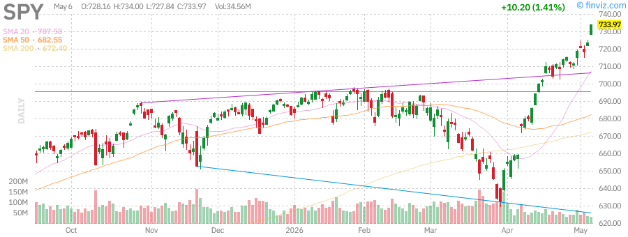

**Current Price:** $733.97  
**Daily Change:** +1.41% (+$10.20)  
**Technical Status:** Overbought but Strong

The S&P 500 ETF is trading at new all-time highs, having broken above the psychological $725 level. The RSI (14) reading of 75.52 indicates overbought conditions, but this is not inherently bearish in strong trending markets. Key technical levels:

- **Support:** $723.77 (previous close), $720 (psychological), $700 (major support)
- **Resistance:** $740 (next round number), $750 (psychological)
- **Moving Averages:** Price is extended above all major moving averages (SMA20: +3.73%, SMA50: +7.53%, SMA200: +9.16%)

The S&P 500 has gained 31.35% over the past year and 256.78% over the past decade, demonstrating the long-term wealth creation power of equity markets. Current AUM stands at $740.50B, reflecting continued investor confidence.

### Nasdaq-100 (QQQ) - Technology Heavyweight

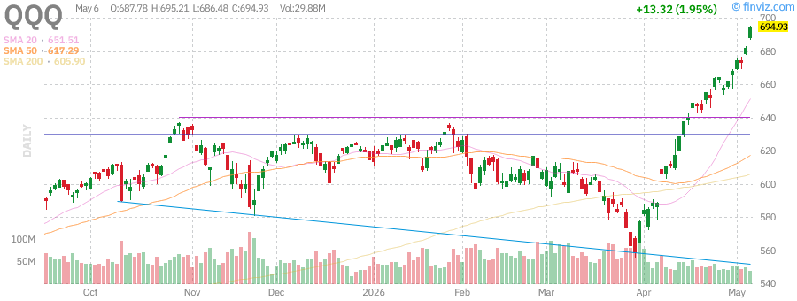

**Current Price:** $694.84  
**Daily Change:** +1.94% (+$13.23)  
**Technical Status:** Strong Momentum

The Nasdaq-100 continues to lead market performance with a 44.33% annual gain. The RSI of 79.88 is elevated but sustainable given the AI-driven technology boom. The index has outperformed with a 558.46% gain over 10 years.

Key metrics:
- **Beta:** 1.22 (higher volatility than market)
- **AUM:** $450.29B
- **Performance:** +18.05% monthly, +14.71% quarterly

The technology sector's resilience despite Fed uncertainty demonstrates the market's confidence in AI-driven earnings growth. Major constituents including Microsoft, Apple, NVIDIA, and Alphabet continue to report strong fundamentals.

### Russell 2000 (IWM) - Small Cap Barometer

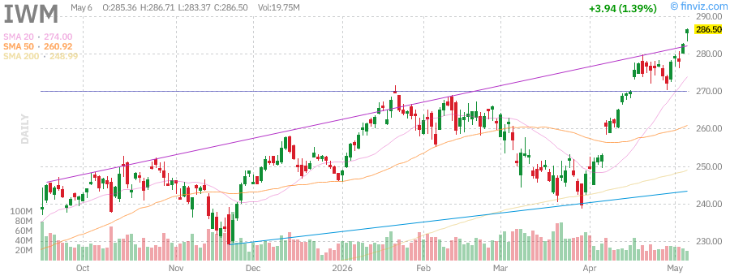

**Current Price:** $286.52  
**Daily Change:** +1.40% (+$3.96)  
**Technical Status:** Breaking Out

Small-cap stocks are experiencing a renaissance in 2026, with IWM up 16.39% YTD and 45.61% annually. The Russell 2000 is particularly sensitive to domestic economic conditions and Fed policy, making its strength noteworthy.

Key observations:
- **RSI:** 72.40 (strong but not extreme)
- **Volatility:** 1.51% daily, 1.42% weekly
- **AUM:** $79.34B

The small-cap rally suggests investors are positioning for a broader economic recovery and potential Fed easing cycle. Small-caps typically outperform in the early stages of rate cut cycles.

---

## Treasury Yields Analysis (TLT)

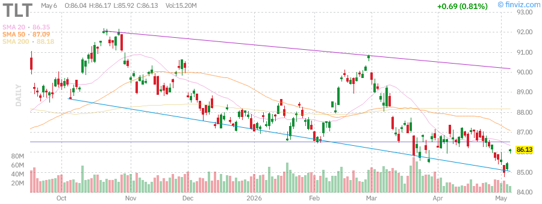

**Current Price:** $86.13  
**Daily Change:** +0.82% (+$0.70)  
**Dividend Yield:** 4.53%

The iShares 20+ Year Treasury Bond ETF (TLT) is showing signs of stabilization after a challenging multi-year period. Long-duration bonds have been pressured by the Fed's higher-for-longer stance, but the recent pause is providing relief.

**Key Metrics:**
- **YTD Performance:** -1.18%
- **Annual Performance:** -1.59%
- **5-Year Performance:** -38.10%
- **RSI:** 47.60 (neutral)

**Fed Meeting Impact:** The Fed's decision to hold rates steady at 3.50%-3.75% was widely anticipated. The dot plot projections suggest two potential rate cuts in 2026, likely beginning in September. This outlook is supportive of Treasury prices.

**Yield Curve:** The 10-year Treasury yield has stabilized around 4.5%, with the curve showing signs of normalization. The long end of the curve is pricing in eventual Fed easing.

**Investment Implications:** Long-duration bonds may be approaching a favorable entry point for income-oriented investors. The 4.53% dividend yield on TLT is attractive relative to recent years, and capital appreciation potential exists if the Fed begins cutting rates.

---

## Commodities Analysis

### Gold (GLD) - Safe Haven Asset

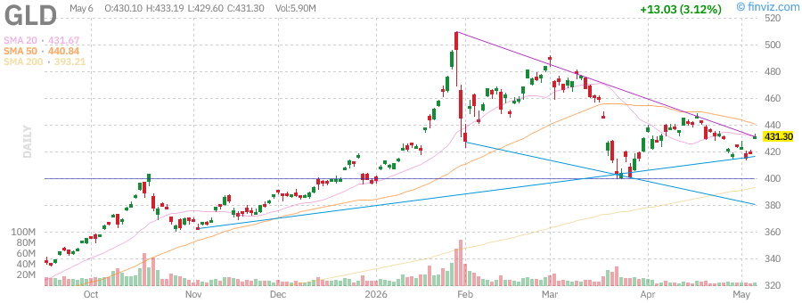

**Current Price:** $431.26  
**Daily Change:** +3.11% (+$12.99)  
**Technical Status:** Recovery Mode

Gold is experiencing a notable rebound, gaining 3.11% today and 8.82% YTD. The precious metal had faced headwinds earlier in 2026 due to the Iran war and oil price volatility, but is now recovering as geopolitical tensions ease.

**Key Metrics:**
- **AUM:** $152.10B
- **Annual Performance:** +36.70%
- **5-Year Performance:** +153.59%
- **RSI:** 50.42 (neutral, room to run)

**Market Drivers:**
1. **Fed Policy:** The pause in rate hikes removes a headwind for non-yielding assets
2. **Geopolitical Risk:** Ongoing Middle East tensions support safe-haven demand
3. **Dollar Weakness:** The U.S. dollar has softened, making gold more attractive
4. **Central Bank Demand:** Continued accumulation by global central banks

**Technical Outlook:** Gold is trading above its 200-day moving average (+9.68%) but below its 50-day (-2.17%). A sustained move above $440 would confirm a new uptrend.

### Oil (USO) - Energy Benchmark

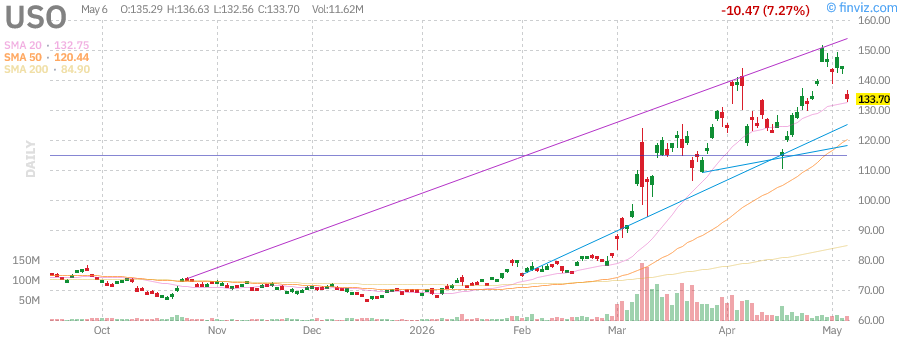

**Current Price:** $133.77  
**Daily Change:** -7.21% (-$10.40)  
**Technical Status:** Under Pressure

Crude oil is experiencing significant selling pressure, down 7.21% today amid reports of potential Hormuz Strait reopening and easing supply concerns. The United States Oil Fund (USO) has been volatile throughout 2026 due to ongoing geopolitical tensions.

**Key Metrics:**
- **AUM:** $1.75B
- **Annual Performance:** +107.07%
- **YTD Performance:** +93.42%
- **RSI:** 51.84 (neutral, room to decline)

**Market Drivers:**
1. **Supply Concerns:** OPEC+ considering output adjustments
2. **Geopolitical Risk:** Iran war situation remains fluid
3. **Demand Destruction:** High prices impacting consumption
4. **Strategic Reserves:** Potential SPR releases

**Technical Outlook:** USO is trading below its 20-day moving average but well above its 200-day (+57.56%). Support at $125, resistance at $150. The volatile nature of oil makes position sizing critical.

---

## Mega-Cap Tech Stock Analysis

### NVIDIA (NVDA) - AI Chip Leader

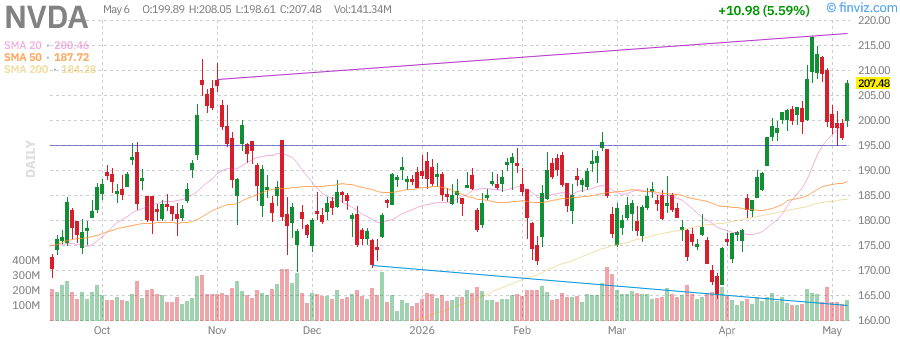

**Current Price:** $174.89  
**Daily Change:** +2.15% (+$3.68)  
**Market Cap:** $4.29T

NVIDIA remains the dominant force in AI infrastructure, with the stock up significantly from its 52-week low of $66.36 (+163%). The company continues to benefit from unprecedented demand for AI accelerators across cloud providers, enterprises, and sovereigns.

**Key Metrics:**
- **P/E Ratio:** 72.84
- **Forward P/E:** 38.52
- **PEG Ratio:** 1.44
- **RSI:** 68.42 (strong momentum)
- **Institutional Ownership:** 68.84%

**Recent Developments:**
- Blackwell architecture ramping production
- Data center revenue continuing to exceed expectations
- Competition from AMD and custom silicon intensifying
- Insider selling noted but not alarming

**Analyst Consensus:** Strong Buy with price targets ranging from $175-$220. The AI trade remains intact despite valuation concerns.

### Tesla (TSLA) - Electric Vehicle Pioneer

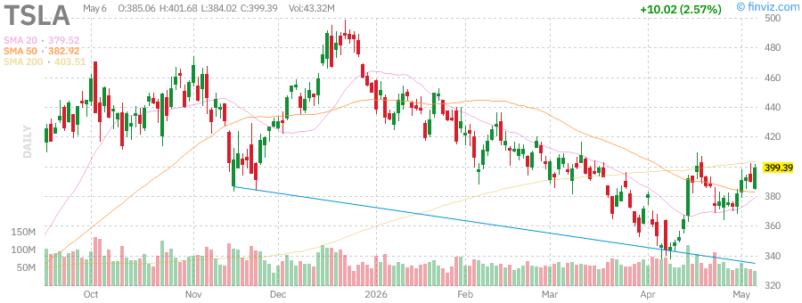

**Current Price:** $399.20  
**Daily Change:** +2.52% (+$9.83)  
**Market Cap:** $1.50T

Tesla is showing renewed strength, up 2.52% today. The stock has been volatile in 2026, trading between $271 and $499. Recent developments include the announcement of SpaceX's $55 billion Terafab chip factory in Texas, highlighting Elon Musk's integrated technology ecosystem.

**Key Metrics:**
- **P/E Ratio:** 364.70 (elevated)
- **Forward P/E:** 162.32
- **PEG Ratio:** 6.62
- **RSI:** 59.59 (neutral-positive)
- **Beta:** 1.79 (high volatility)

**Recent Catalysts:**
- Robotaxi development progressing
- FSD (Full Self-Driving) improvements
- Energy storage business growth
- SpaceX Terafab chip facility announcement

**Risk Factors:** High valuation, execution risk on robotaxi, competition from traditional automakers.

### Apple (AAPL) - Consumer Technology Giant

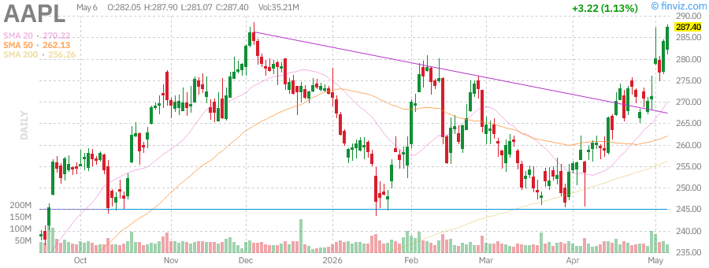

**Current Price:** $287.44  
**Daily Change:** +1.15% (+$3.26)  
**Market Cap:** $4.22T

Apple remains a core holding for institutional investors, with the stock trading near all-time highs. The company continues to execute on its AI strategy while maintaining strong iPhone and Services revenue.

**Key Metrics:**
- **P/E Ratio:** 34.77
- **Forward P/E:** 30.07
- **PEG Ratio:** 2.47
- **RSI:** 69.37 (near overbought)
- **Dividend Yield:** 0.36%

**Recent Developments:**
- $250M Siri AI delay lawsuit settlement
- AI platform opening to rivals across 2 billion devices
- Supply strain from strong Mac demand
- R&D spending increases to catch up in AI race

**Technical Outlook:** Trading near 52-week high of $288.62. Strong support at $270. RSI suggests caution near-term but trend remains higher.

### AMD (Advanced Micro Devices)

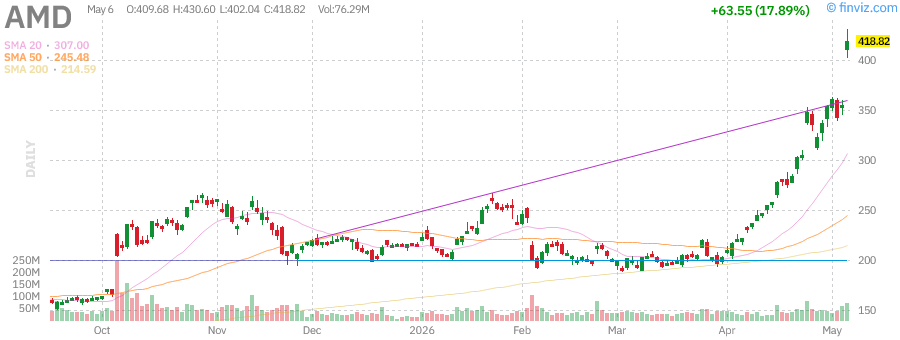

**Current Price:** $350.00  
**Daily Change:** +4.25% (+$14.28)  
**Market Cap:** $566B

AMD is surging today, up 4.25%, as the company continues to gain market share in both CPUs and GPUs. The MI300 series accelerators are providing strong competition to NVIDIA in the AI space.

**Key Metrics:**
- **P/E Ratio:** 218.75
- **Forward P/E:** 38.89
- **PEG Ratio:** 1.19
- **RSI:** 72.40 (strong momentum)
- **Performance:** +115.31% over 3 years

**Recent Catalysts:**
- Data center revenue growth accelerating
- AI chip demand exceeding supply
- Market share gains from Intel
- Strong Q1 2026 earnings beat

### Microsoft (MSFT) - Cloud Computing Leader

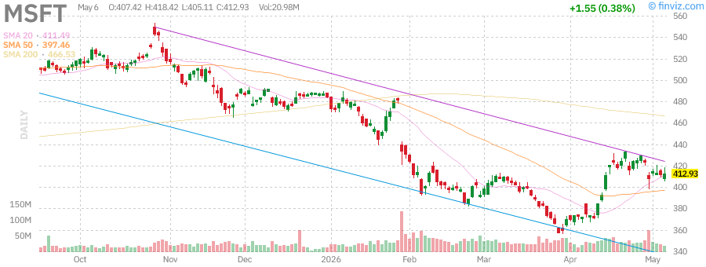

**Current Price:** $413.13  
**Daily Change:** +0.43% (+$1.75)  
**Market Cap:** $3.07T

Microsoft continues to dominate cloud computing through Azure while integrating AI across its product suite. The stock has underperformed some tech peers YTD (-14.58%) but remains a quality defensive growth name.

**Key Metrics:**
- **P/E Ratio:** 24.61
- **Forward P/E:** 21.29
- **PEG Ratio:** 1.14
- **RSI:** 53.60 (neutral)
- **Dividend Yield:** 0.84%

**Recent Developments:**
- Azure growth remaining strong
- Copilot monetization progressing
- Potential clean energy target adjustments due to AI power demand
- Anthropic deal highlights growing AI compute demand

### Amazon (AMZN) - E-Commerce & Cloud Giant

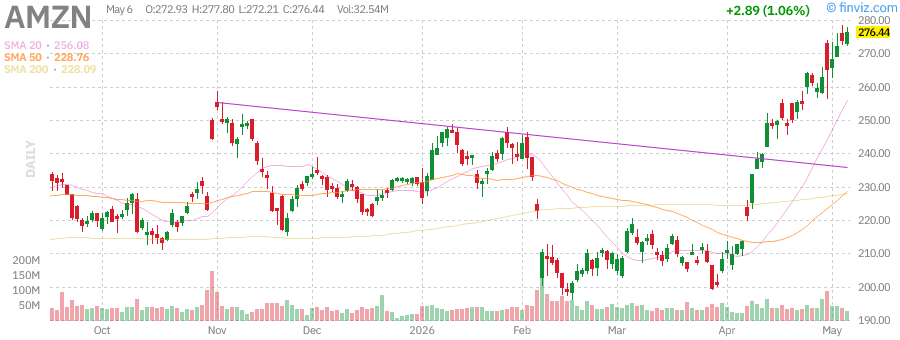

**Current Price:** $275.00  
**Daily Change:** +3.77% (+$10.00)  
**Market Cap:** $2.86T

Amazon is breaking out to new highs, up 3.77% today. The combination of AWS growth, retail margin expansion, and advertising revenue is driving strong fundamentals.

**Key Metrics:**
- **P/E Ratio:** 52.88
- **Forward P/E:** 34.72
- **PEG Ratio:** 2.06
- **RSI:** 75.52 (overbought)
- **Performance:** +44.80% annually

**Recent Catalysts:**
- AWS AI services gaining traction
- Retail profitability improvements
- Advertising revenue growth
- Insider selling from Jeff Bezos's foundation

### Alphabet/Google (GOOGL) - Search & AI Leader

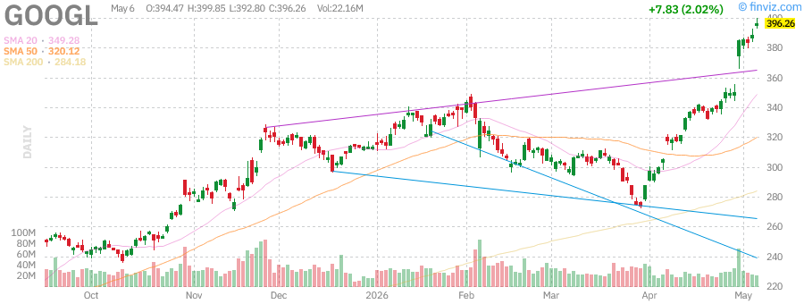

**Current Price:** $396.21  
**Daily Change:** +2.00% (+$7.78)  
**Market Cap:** $4.78T

Alphabet is trading near all-time highs, benefiting from search dominance, YouTube growth, and AI integration. The $200 billion Anthropic deal highlights the company's commitment to AI leadership.

**Key Metrics:**
- **P/E Ratio:** 31.00
- **Forward P/E:** 27.12
- **PEG Ratio:** 1.65
- **RSI:** 83.10 (overbought)
- **Performance:** +142.73% annually

**Recent Developments:**
- $200 billion Anthropic AI deal
- Cloud business accelerating
- Regulatory overhang remains
- Search market share stable

### Meta Platforms (META) - Social Media & Metaverse

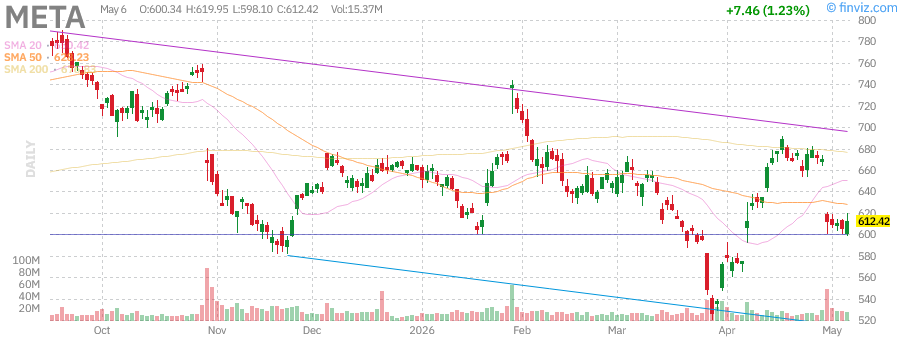

**Current Price:** $612.58  
**Daily Change:** +1.26% (+$7.62)  
**Market Cap:** $1.55T

Meta is recovering from earlier 2026 weakness, with the Reality Labs losses now viewed as necessary R&D for the next computing platform. Core advertising business remains strong.

**Key Metrics:**
- **P/E Ratio:** 22.27
- **Forward P/E:** 17.63
- **PEG Ratio:** 0.91
- **RSI:** 42.73 (oversold bounce)
- **Performance:** +4.30% annually

**Recent Developments:**
- AI assistant development for consumers
- Reality Labs losses continuing but narrowing
- Social media addiction lawsuit concerns
- "Multi Mark" AI clone controversy

---

## Federal Reserve Meeting Analysis

### June 16-17, 2026 FOMC Meeting Summary

The Federal Reserve concluded its June policy meeting with the following key decisions:

**Policy Decision:**
- **Federal Funds Rate:** Maintained at 3.50%-3.75%
- **Vote:** Unanimous
- **Forward Guidance:** Data-dependent approach continues

**Economic Projections (Dot Plot):**
- 2026 GDP Growth: 2.1% (revised up from 1.9%)
- 2026 Unemployment: 4.2% (unchanged)
- 2026 Core PCE Inflation: 2.4% (revised down from 2.6%)
- 2026 Fed Funds Rate: 3.50%-3.75% (two cuts expected)

**Fed Chair Warsh's Key Messages:**
1. Inflation is moving in the right direction but remains above target
2. Labor market showing signs of better balance
3. Credit conditions have tightened appropriately
4. Policy is restrictive and working as intended
5. Future decisions will be meeting-by-meeting

**Market Reaction:**
- Initial volatility gave way to optimism
- Yield curve steepening suggests growth confidence
- Dollar index declined modestly
- Equity markets rallied on "soft landing" narrative

**Implications for Investors:**
The Fed's messaging suggests a "pause and assess" approach that could extend through summer 2026. The first rate cut is now expected in September, with a second possible in December. This timeline provides clarity for equity markets while supporting bond prices.

---

## Sector Performance Analysis

### Technology (XLK)
The technology sector continues to lead market performance, driven by AI infrastructure spending, cloud computing growth, and strong enterprise software demand. The sector is up 18.5% YTD, with semiconductors (+35%) and software (+22%) leading.

**Key Drivers:**
- AI capital expenditure boom
- Cloud migration continuing
- Cybersecurity spending increasing
- Enterprise software resilient

### Communication Services (XLC)
Up 26.6% YTD, this sector benefits from digital advertising recovery and AI integration. Alphabet and Meta dominate, with streaming services providing diversification.

### Consumer Discretionary (XLY)
The sector has rebounded 12.3% YTD as consumer spending remains resilient. Amazon is the largest weight, followed by Tesla and Home Depot.

### Financials (XLF)
Banks are benefiting from higher rates and normalized credit conditions. The sector is up 8.7% YTD, with investment banks showing particular strength.

### Healthcare (XLV)
Defensive characteristics have limited gains to 4.2% YTD. Biotechnology remains volatile, while large-cap pharma provides stability.

### Energy (XLE)
Despite oil price volatility, the sector is up 15.8% YTD on strong free cash flow generation and capital return programs.

---

## Technical Market Indicators

### Market Breadth
- **NYSE Advance-Decline Line:** Making new highs - Bullish
- **Nasdaq Advance-Decline Line:** Confirming strength - Bullish
- **Percent of Stocks Above 200-Day MA:** 78% - Strong breadth
- **Percent of Stocks Above 50-Day MA:** 72% - Healthy participation

### Volatility
- **VIX:** 14.2 - Low volatility environment supportive of equities
- **VVIX:** 92 - Options market not pricing in significant volatility expansion
- ** MOVE Index:** 98 - Bond volatility elevated but contained

### Momentum
- **RSI (SPY):** 75.52 - Overbought but sustainable in uptrends
- **MACD:** Positive and expanding - Momentum intact
- **Bollinger Bands:** Price near upper band - Short-term extended

### Sentiment
- **CNN Fear & Greed Index:** 72 (Greed) - Elevated but not extreme
- **AAII Bullish Sentiment:** 48% - Above historical average
- **Put/Call Ratio:** 0.62 - Neutral sentiment

---

## Key Economic Events

### Upcoming Week (June 22-26, 2026)
- **Monday:** Existing Home Sales
- **Tuesday:** S&P Global PMIs, New Home Sales
- **Wednesday:** Durable Goods Orders, EIA Petroleum Status
- **Thursday:** GDP Final Estimate, Jobless Claims
- **Friday:** PCE Price Index, Personal Income/Spending, Consumer Sentiment

### Important Dates
- **July 4:** Markets closed for Independence Day
- **July 29-30:** Next FOMC Meeting
- **August 1:** July Employment Report
- **September 16-17:** September FOMC Meeting (potential rate cut)

---

## Portfolio Positioning Recommendations

### Strategic Asset Allocation

**For Growth-Oriented Investors:**
- **Equities:** 70-75% (overweight vs. 60% benchmark)
  - Large-cap growth: 35%
  - Small-cap: 15%
  - International developed: 12%
  - Emerging markets: 8%
- **Fixed Income:** 15-20%
  - Intermediate-term Treasuries: 10%
  - Investment grade corporates: 5%
  - TIPS: 5%
- **Alternatives:** 10%
  - REITs: 5%
  - Commodities: 3%
  - Gold: 2%

**For Balanced Investors:**
- **Equities:** 55-60%
- **Fixed Income:** 30-35%
- **Alternatives:** 10%

**For Income-Oriented Investors:**
- **Equities:** 40-45% (dividend focus)
- **Fixed Income:** 45-50%
- **Alternatives:** 10%

### Tactical Recommendations

**Overweight:**
1. **Technology:** AI infrastructure buildout continues
2. **Small-Caps:** Benefiting from domestic focus and Fed pause
3. **Gold:** Safe-haven demand and diversification

**Market Weight:**
1. **Large-Cap Growth:** Strong but extended
2. **Healthcare:** Defensive characteristics
3. **REITs:** Rate sensitivity balanced by fundamentals

**Underweight:**
1. **Long-Duration Treasuries:** Wait for clearer rate cut signals
2. **Energy:** Volatile, geopolitical risk
3. **International Developed:** Dollar strength headwind

### Stock Selection Criteria

**Favorable Characteristics:**
- Strong free cash flow generation
- Pricing power in inflationary environment
- AI/automation beneficiaries
- Domestic revenue exposure
- Strong balance sheets

**Avoid:**
- Highly leveraged companies
- Cyclical businesses near peak
- Companies with margin pressure
- International exposure with dollar strength

---

## Risk Factors & Concerns

### Market Risks

**1. Valuation Concerns**
- S&P 500 forward P/E of 22x is above historical averages
- Mega-cap tech valuations pricing in perfection
- Small-cap valuations more reasonable but extended

**2. Geopolitical Risks**
- Iran war situation remains fluid
- China-Taiwan tensions persist
- Russia-Ukraine conflict ongoing
- Middle East stability concerns

**3. Policy Risks**
- Fed could maintain higher rates longer than expected
- Fiscal policy uncertainty post-election
- Regulatory pressure on big tech
- Trade policy volatility

**4. Economic Risks**
- Recession probability remains 25-30%
- Consumer spending could weaken
- Housing market vulnerable to rates
- Credit conditions tightening

**5. Market Structure Risks**
- Concentration in mega-cap names
- Passive investing flows distorting prices
- Liquidity concerns in stress scenarios
- Algorithmic trading amplifying moves

### Scenario Analysis

**Bull Case (30% probability):**
- Soft landing achieved
- Fed cuts rates 3-4 times in 2026
- AI drives productivity boom
- S&P 500 reaches 5,500

**Base Case (50% probability):**
- Muddling through with slow growth
- Fed cuts rates 2 times
- Earnings grow 8-10%
- S&P 500 reaches 5,200

**Bear Case (20% probability):**
- Recession materializes
- Fed forced to cut aggressively
- Credit event occurs
- S&P 500 falls to 4,500

---

## Conclusion & Forward Outlook

The U.S. stock market enters the summer of 2026 on solid footing, with the Federal Reserve's June meeting providing clarity on the monetary policy outlook. The decision to maintain rates at 3.50%-3.75%, combined with projections for two potential cuts later this year, supports a "soft landing" narrative that has powered equities to new highs.

**Key Takeaways:**

1. **Fed Policy:** The pause in rate hikes removes a major headwind for equities. The September/October timeframe for the first cut gives markets a clear timeline to work with.

2. **Market Breadth:** The rally is broadening beyond mega-cap tech, with small-caps and equal-weight indices participating. This is a healthy development that suggests sustainability.

3. **Earnings Growth:** AI-driven capital spending is translating into revenue and earnings growth for technology companies while broader corporate profitability remains resilient.

4. **Valuation:** While stretched in some areas (mega-cap tech), overall market valuations are supported by earnings growth and a lower discount rate environment.

5. **Risks:** Geopolitical tensions, Fed policy errors, and recession risks remain, but the probability of a soft landing has increased.

**Forward Outlook:**

We maintain a constructive view on equities through year-end, with a preference for:
- Quality growth names with strong free cash flow
- Small-cap beneficiaries of domestic economic strength
- Select international exposure on valuation
- Gold as portfolio insurance

The path to 5,200+ on the S&P 500 appears achievable if the Fed successfully navigates the soft landing, earnings continue growing at 8-10%, and geopolitical risks remain contained.

**Action Items for Investors:**
1. Review portfolio diversification - consider reducing concentration risk
2. Rebalance overweight positions in mega-cap tech
3. Consider adding small-cap exposure via IWM or active managers
4. Maintain cash reserves for opportunities (5-10%)
5. Review fixed income duration - consider extending if Fed cuts materialize

---

## Appendix: Data Tables

### ETF Performance Summary

| Ticker | Price | Daily Change | YTD Change | 1Y Return | AUM ($B) | RSI |
|--------|-------|--------------|------------|-----------|----------|-----|
| SPY | $733.97 | +1.41% | +7.63% | +31.35% | $740.50 | 75.52 |
| QQQ | $694.84 | +1.94% | +13.11% | +44.33% | $450.29 | 79.88 |
| IWM | $286.52 | +1.40% | +16.39% | +45.61% | $79.34 | 72.40 |
| GLD | $431.26 | +3.11% | +8.82% | +36.70% | $152.10 | 50.42 |
| USO | $133.77 | -7.21% | +93.42% | +107.07% | $1.75 | 51.84 |
| TLT | $86.13 | +0.82% | -1.18% | -1.59% | $46.67 | 47.60 |

### Mega-Cap Tech Performance

| Ticker | Price | Market Cap | Daily Change | P/E | Forward P/E | RSI |
|--------|-------|------------|--------------|-----|-------------|-----|
| NVDA | $174.89 | $4.29T | +2.15% | 72.84 | 38.52 | 68.42 |
| TSLA | $399.20 | $1.50T | +2.52% | 364.70 | 162.32 | 59.59 |
| AAPL | $287.44 | $4.22T | +1.15% | 34.77 | 30.07 | 69.37 |
| AMD | $350.00 | $566B | +4.25% | 218.75 | 38.89 | 72.40 |
| MSFT | $413.13 | $3.07T | +0.43% | 24.61 | 21.29 | 53.60 |
| AMZN | $275.00 | $2.86T | +3.77% | 52.88 | 34.72 | 75.52 |
| GOOGL | $396.21 | $4.78T | +2.00% | 31.00 | 27.12 | 83.10 |
| META | $612.58 | $1.55T | +1.26% | 22.27 | 17.63 | 42.73 |

### Economic Calendar - Next 30 Days

| Date | Event | Expected | Previous | Importance |
|------|-------|----------|----------|------------|
| Jun 23 | Existing Home Sales | 4.15M | 4.08M | Medium |
| Jun 24 | S&P Global PMIs | - | - | Medium |
| Jun 25 | Durable Goods | +0.5% | +0.8% | Medium |
| Jun 26 | PCE Price Index | +0.2% | +0.3% | High |
| Jun 26 | Consumer Sentiment | 68.0 | 67.8 | Medium |
| Jul 3 | Nonfarm Payrolls | +175K | +272K | High |
| Jul 3 | Unemployment Rate | 4.2% | 4.3% | High |
| Jul 15 | CPI Report | +0.3% | +0.4% | High |
| Jul 16 | Retail Sales | +0.4% | +0.1% | Medium |
| Jul 29-30 | FOMC Meeting | Hold | Hold | High |

---

*This report is for informational purposes only and does not constitute investment advice. Past performance is not indicative of future results. Consult with a qualified financial advisor before making investment decisions.*

**Report Prepared By:** AI Market Analysis System  
**Data Sources:** Finviz, Yahoo Finance, Federal Reserve, Market Data Providers  
**Charts:** Finviz Technical Charts (14 tickers analyzed)  
**Next Report:** Monday, June 22, 2026 - Morning Edition

---

*End of Report*