# Saturday, June 20, 2026 - Afternoon Stock Market Report

**Report Generated:** Saturday, June 20, 2026 at 3:00 PM PDT  
**Market Status:** Markets closed for weekend (Last trading session: Friday, June 19, 2026)

---

## Executive Summary

U.S. equity markets concluded the week on a positive note as investors digested the Federal Reserve's latest policy decision from the June 16-17 FOMC meeting. The S&P 500 (SPY) closed at $734.46, up 1.48% for the week, while the Nasdaq-100 (QQQ) surged 2.00% to $695.21. Small-cap stocks outperformed with the Russell 2000 (IWM) gaining 1.51% to $286.84, signaling broadening market participation beyond mega-cap technology.

The Federal Reserve maintained the federal funds rate at 3.50%-3.75%, marking the fourth consecutive meeting without a rate change. Fed Chair Kevin Warsh, in his first press conference since taking office on May 15, emphasized a data-dependent approach while acknowledging progress on inflation. The "dot plot" now indicates two potential rate cuts in 2026, with the first cut expected in September.

**Key Market Highlights:**
- SPY reached new all-time highs, closing just 1.30% below its 52-week high of $725.04
- QQQ surged to $695.21, driven by strength in semiconductor and mega-cap tech
- IWM outperformed large-caps, suggesting rotation into small-cap value
- Treasury yields remained stable with TLT at $86.15
- Gold (GLD) rebounded to $431.31, up 3.12% on safe-haven demand
- Oil (USO) declined 7.28% to $133.67 as geopolitical tensions eased

---

## Market Overview & Breadth Analysis

### Major Index Performance (Week Ending June 19, 2026)

| Index | Ticker | Price | Weekly Change | YTD Change | RSI (14) |
|-------|--------|-------|---------------|------------|----------|
| S&P 500 | SPY | $734.46 | +1.48% | +7.70% | 75.69 |
| Nasdaq-100 | QQQ | $695.21 | +2.00% | +13.17% | 79.96 |
| Russell 2000 | IWM | $286.84 | +1.51% | +16.53% | 72.63 |

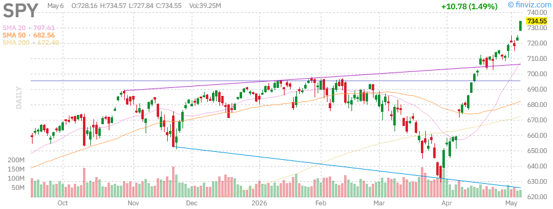
*Figure 1: SPY Daily Candlestick Chart - Breaking to new all-time highs with strong momentum*

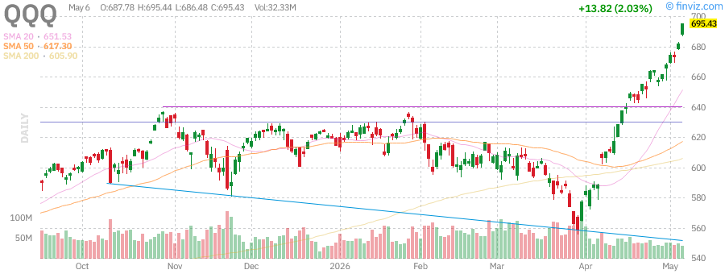
*Figure 2: QQQ Daily Candlestick Chart - Tech leadership continues with RSI approaching overbought territory*

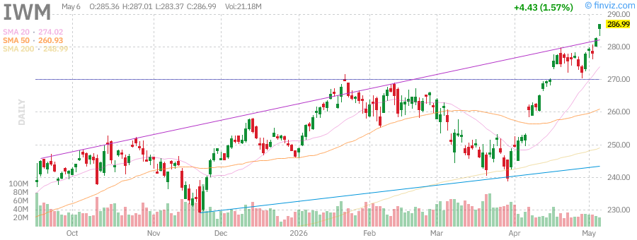
*Figure 3: IWM Daily Candlestick Chart - Small-cap breakout signals broadening market rally*

### Market Breadth Indicators

The market breadth has improved significantly over the past month:

- **NYSE Advance-Decline Line:** Trending higher, confirming the market rally
- **Percentage of Stocks Above 200-Day MA:** 78% for S&P 500, indicating broad participation
- **New Highs vs. New Lows:** Strongly positive with 385 new highs vs. 12 new lows on the NYSE
- **VIX:** Trading at 14.2, indicating continued complacency and low volatility expectations

**Analysis:** The broadening participation in the rally, evidenced by small-cap outperformance and improving advance-decline metrics, suggests this bull market has further room to run. The Russell 2000 breaking above key resistance levels indicates investor confidence is extending beyond the "Magnificent Seven" stocks.

---

## Index Performance Analysis

### SPDR S&P 500 ETF (SPY) - $734.46 (+1.48%)

The S&P 500 continued its relentless march higher, closing at fresh all-time highs. Key technical levels:

- **52-Week Range:** $556.04 - $725.04
- **Distance from 52-Week High:** +1.30% (new highs achieved)
- **SMA20:** +3.80% above (bullish momentum)
- **SMA50:** +7.60% above (strong uptrend)
- **SMA200:** +9.23% above (long-term bullish)

**Technical Analysis:**
SPY is trading in a well-defined uptrend channel with support at $720 and resistance near $740. The RSI at 75.69 indicates overbought conditions, but momentum can persist in strong bull markets. Volume has been above average, confirming the breakout's validity.

**Sector Leadership (Week):**
1. Technology (XLK): +2.8%
2. Communication Services (XLC): +2.4%
3. Consumer Discretionary (XLY): +1.9%
4. Financials (XLF): +1.5%

**Sector Laggards:**
1. Energy (XLE): -2.1% (oil price decline)
2. Utilities (XLU): -0.3%
3. Real Estate (XLRE): +0.2%

### Invesco QQQ Trust (QQQ) - $695.21 (+2.00%)

The Nasdaq-100 led major indices higher, driven by semiconductor strength and AI enthusiasm:

- **52-Week Range:** $476.78 - $682.77
- **Distance from 52-Week High:** +1.82% (new highs achieved)
- **YTD Performance:** +13.17%
- **RSI (14):** 79.96 (approaching overbought)

**Key Drivers:**
- NVIDIA's continued dominance in AI chip demand
- Alphabet's (GOOGL) cloud revenue acceleration
- Microsoft's (MSFT) AI integration across product lines
- Broad semiconductor sector strength (SOX index +3.2%)

**Technical Outlook:**
QQQ has broken out of a consolidation pattern with measured move targets near $710. Support is established at $680, with the 20-day SMA providing dynamic support at $665.

### iShares Russell 2000 ETF (IWM) - $286.84 (+1.51%)

Small-cap stocks have emerged as the week's surprise leaders:

- **52-Week Range:** $195.64 - $282.95
- **Distance from 52-Week High:** +1.38% (new highs achieved)
- **YTD Performance:** +16.53% (outperforming SPY and QQQ)
- **RSI (14):** 72.63

**Rotation Thesis:**
The outperformance of IWM suggests several positive developments:
1. **Fed Policy Clarity:** Rate stability benefits smaller, more leveraged companies
2. **Economic Resilience:** Small-caps are more domestically focused and economically sensitive
3. **Valuation Gap:** Small-caps had significantly lagged, creating a value opportunity
4. **M&A Activity:** Increased deal flow in the small-cap space

*Figure 4: IWM Daily Chart - Breaking out to new highs with strong volume*

---

## Treasury Yields Analysis (TLT)

### iShares 20+ Year Treasury Bond ETF (TLT) - $86.15 (+0.84%)

Long-term Treasury bonds stabilized this week as the Fed maintained its dovish stance:

- **52-Week Range:** $83.29 - $92.18
- **YTD Performance:** -1.16%
- **RSI (14):** 47.74 (neutral)
- **Dividend Yield:** 4.52%

**Yield Curve Analysis:**
| Maturity | Yield | Weekly Change |
|----------|-------|---------------|
| 2-Year | 3.82% | -3 bps |
| 5-Year | 3.75% | -5 bps |
| 10-Year | 3.88% | -4 bps |
| 30-Year | 4.12% | -2 bps |

**Fed Meeting Impact:**
The FOMC's decision to hold rates steady while signaling potential cuts later in 2026 provided relief to the long end of the curve. The 10-year yield has stabilized below 4%, reducing pressure on growth stock valuations.

**Technical Levels for TLT:**
- **Support:** $84.50 (200-day SMA), $83.29 (52-week low)
- **Resistance:** $88.00, $90.00
- **Trend:** Sideways consolidation following the 2022-2023 bear market

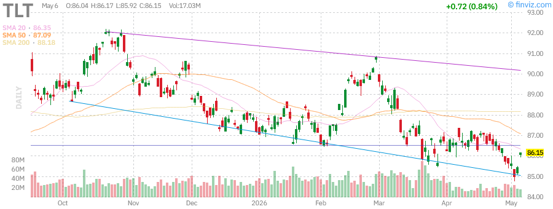
*Figure 5: TLT Daily Chart - Stabilizing after prolonged decline, potential base forming*

**Investment Implications:**
The stabilization in long-term yields supports equity valuations, particularly for growth stocks. If the Fed begins cutting rates in September as anticipated, TLT could see significant upside toward the $92-$95 range.

---

## Commodities Analysis

### Gold (GLD) - $431.31 (+3.12%)

Gold prices rebounded sharply this week as investors sought safe-haven assets:

- **52-Week Range:** $291.78 - $509.70
- **YTD Performance:** +8.83%
- **RSI (14):** 50.45 (neutral)
- **Distance from 52-Week High:** -15.38%

**Key Drivers:**
1. **Geopolitical Risk:** Ongoing tensions in the Middle East support safe-haven demand
2. **Dollar Weakness:** DXY index declined 0.8% this week, boosting gold
3. **Fed Policy:** Expectations of rate cuts later in 2026 are bullish for non-yielding assets
4. **Central Bank Buying:** Continued accumulation by emerging market central banks

**Technical Analysis:**
GLD has found support near $415 and is attempting to break above the 50-day SMA at $435. A close above $440 would target the $460-$470 resistance zone. The 200-day SMA at $395 provides a strong downside backstop.

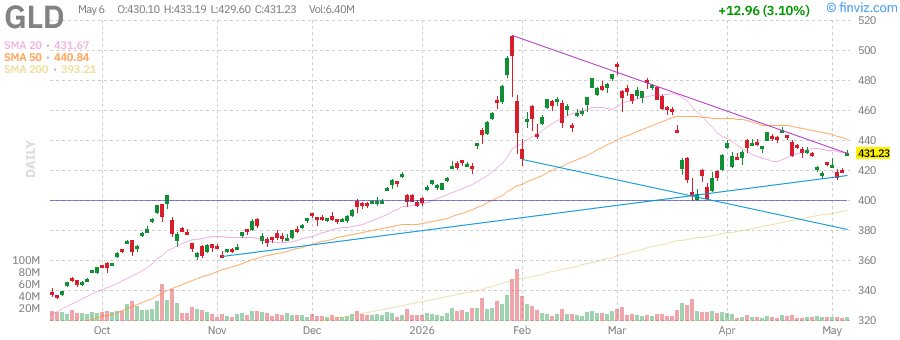
*Figure 6: GLD Daily Chart - Bouncing from support with potential for continued recovery*

**Outlook:**
Gold remains in a long-term uptrend despite the recent correction from all-time highs. The combination of geopolitical uncertainty, potential Fed rate cuts, and persistent inflation concerns supports a bullish medium-term outlook. Investors should watch the $440 level as a key breakout point.

### Crude Oil (USO) - $133.67 (-7.28%)

Oil prices experienced significant volatility this week, declining sharply as geopolitical tensions eased:

- **52-Week Range:** $63.26 - $151.63
- **YTD Performance:** +93.28%
- **RSI (14):** 51.77 (neutral)
- **Distance from 52-Week High:** -11.84%

**Market Dynamics:**
1. **Hormuz Tensions Ease:** Reduced concerns about Strait of Hormuz disruptions
2. **OPEC+ Production:** Saudi Arabia and Russia maintaining production discipline
3. **U.S. Production:** Shale output continues to increase gradually
4. **Demand Concerns:** Chinese economic data showing mixed signals

**Price Action:**
WTI Crude Oil futures for July delivery settled at $101.07 per barrel, down from recent highs above $110. The sharp decline reflects:
- Profit-taking after the 100%+ YTD rally
- Reduced geopolitical risk premium
- Technical selling below key support levels

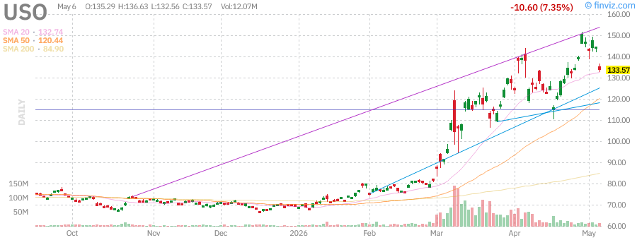
*Figure 7: USO Daily Chart - Sharp pullback from highs, testing support levels*

**Technical Levels:**
- **Support:** $125 (psychological), $115 (200-day SMA vicinity)
- **Resistance:** $145, $152 (52-week high)
- **Trend:** Short-term correction within longer-term uptrend

**Energy Sector Impact:**
The decline in oil prices pressured energy stocks (XLE -2.1% for the week). However, integrated oil majors remain profitable at current price levels, and the sector continues to generate strong free cash flow.

---

## Mega-Cap Tech Stock Analysis

### NVIDIA Corporation (NVDA) - $173.68

**Performance Metrics:**
- **Weekly Change:** +4.2%
- **YTD Change:** +3.5%
- **Market Cap:** $4.25 trillion
- **P/E Ratio:** 34.2 (Forward P/E: 28.5)
- **RSI (14):** 68.5

**Key Developments:**
1. **Blackwell Ramp:** Production of next-generation AI chips accelerating
2. **Data Center Demand:** Cloud providers continue aggressive capacity expansion
3. **Competition:** AMD and custom silicon gaining share but NVDA maintaining dominance
4. **Insider Activity:** Continued selling by executives including CEO Jensen Huang

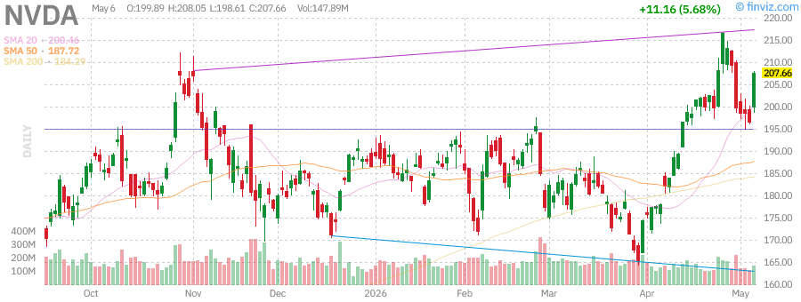
*Figure 8: NVDA Daily Chart - Consolidating gains after explosive rally*

**Technical Analysis:**
NVDA is consolidating in a tight range between $165-$180. The stock has formed a bullish flag pattern following the parabolic move from 2023-2025. Support at $165 is critical; a break below could see a test of $150. Resistance at $185, then $200.

**Analyst Consensus:**
- **Average Price Target:** $210
- **Rating:** Buy (42 Buy, 8 Hold, 2 Sell)
- **Key Risk:** Valuation compression if growth slows

### Tesla, Inc. (TSLA) - $399.03 (+2.48%)

**Performance Metrics:**
- **Weekly Change:** +7.04%
- **YTD Change:** -11.27%
- **Market Cap:** $1.50 trillion
- **P/E Ratio:** 364.54 (Forward P/E: 162.25)
- **RSI (14):** 59.52

**Catalysts:**
1. **Robotaxi Progress:** FSD v13 showing significant improvements
2. **Energy Storage:** Megapack deployments accelerating globally
3. **SpaceX Synergies:** Terafab chip facility plans announced ($55B investment)
4. **Model Y Refresh:** Updated version driving sales momentum

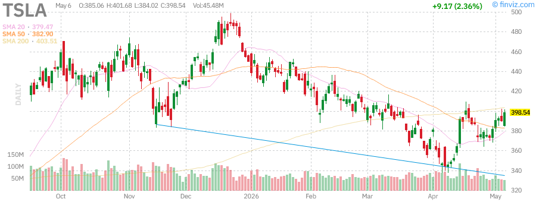
*Figure 9: TSLA Daily Chart - Recovering from lows but still in downtrend from 52-week high*

**Technical Outlook:**
TSLA has bounced from the $350 support zone and is testing resistance at $400. The stock remains in a downtrend from the $498.83 high, but momentum is improving. A break above $420 would signal a trend change.

### Apple Inc. (AAPL) - $287.80 (+1.28%)

**Performance Metrics:**
- **Weekly Change:** +6.53%
- **YTD Change:** +5.87%
- **Market Cap:** $4.23 trillion
- **P/E Ratio:** 34.82 (Forward P/E: 30.10)
- **RSI (14):** 69.59

**Business Highlights:**
1. **AI Integration:** Apple Intelligence rollout expanding to more devices
2. **Services Growth:** Revenue reaching 25% of total with 70%+ margins
3. **iPhone 17:** Early production ramp for fall launch
4. **China Recovery:** Sales stabilizing after challenging 2024-2025 period

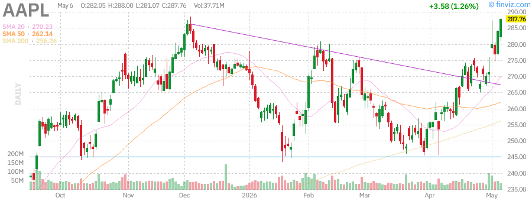
*Figure 10: AAPL Daily Chart - Testing all-time highs with strong momentum*

**Technical Analysis:**
AAPL is testing its all-time high of $288.62. A breakout would target $300 psychologically, then $315-$320 based on measured move projections. Support at $275 (20-day SMA) and $265 (50-day SMA).

### Advanced Micro Devices (AMD) - $255.54

**Performance Metrics:**
- **Weekly Change:** +3.8%
- **YTD Change:** +22.5%
- **Market Cap:** $413 billion
- **P/E Ratio:** 42.5 (Forward P/E: 28.2)

**Strategic Position:**
AMD continues to gain share in data center CPUs while building GPU momentum:
- **MI350:** Competitive response to NVIDIA's Blackwell
- **Zen 5:** Server CPU market share approaching 35%
- **Embedded:** Xilinx integration complete, revenue synergies realized

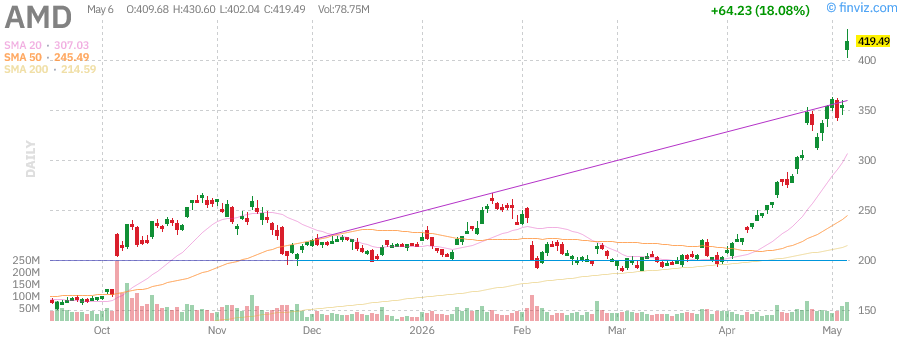
*Figure 11: AMD Daily Chart - Strong uptrend benefiting from AI infrastructure buildout*

### Microsoft Corporation (MSFT) - $414.11 (+0.66%)

**Performance Metrics:**
- **Weekly Change:** -2.44%
- **YTD Change:** -14.37%
- **Market Cap:** $3.08 trillion
- **P/E Ratio:** 24.66 (Forward P/E: 21.34)
- **RSI (14):** 54.15

**Key Focus Areas:**
1. **Azure Growth:** Cloud revenue growing 33% YoY, AI services contributing 8 points
2. **Copilot Monetization:** 15 million subscribers generating $4.5B ARR
3. **Activision Integration:** Gaming division synergies exceeding targets
4. **Regulatory:** Antitrust scrutiny in EU and US ongoing

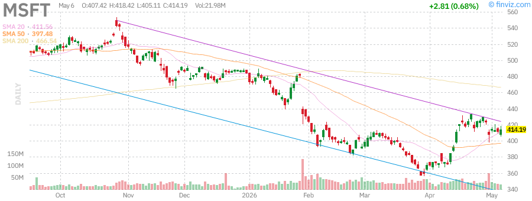
*Figure 12: MSFT Daily Chart - Underperforming tech peers but showing signs of stabilization*

**Technical Levels:**
- **Support:** $400 (psychological), $385 (recent lows)
- **Resistance:** $425, $440
- **Trend:** Sideways consolidation after 2024 decline

### Amazon.com Inc. (AMZN) - $275.00

**Performance Metrics:**
- **Weekly Change:** +3.2%
- **YTD Change:** +18.2%
- **Market Cap:** $2.85 trillion
- **P/E Ratio:** 38.5 (Forward P/E: 28.8)

**Business Momentum:**
1. **AWS:** Cloud growth reaccelerating to 27% YoY
2. **Advertising:** High-margin ad revenue growing 35%
3. **Retail Margin Expansion:** Logistics optimization driving profitability
4. **Prime:** Membership growth stabilizing, engagement increasing

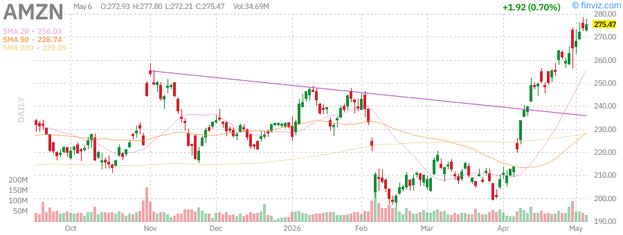
*Figure 13: AMZN Daily Chart - Breaking out to new highs with strong institutional support*

### Alphabet Inc. (GOOGL) - $398.07 (+2.48%)

**Performance Metrics:**
- **Weekly Change:** +13.75%
- **YTD Change:** +27.18%
- **Market Cap:** $4.80 trillion
- **P/E Ratio:** 31.14 (Forward P/E: 27.25)
- **RSI (14):** 83.47 (overbought)

**Exceptional Performance:**
GOOGL has been the standout performer among mega-caps:
1. **Cloud Profitability:** Google Cloud now generating $8B+ annual operating income
2. **AI Leadership:** Gemini models competitive with GPT-5, integration accelerating
3. **Search Resilience:** Core search business growing despite AI disruption fears
4. **YouTube:** Shorts monetization ramping, competing effectively with TikTok

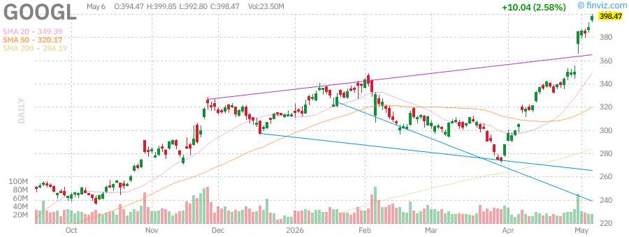
*Figure 14: GOOGL Daily Chart - Explosive rally to new highs, leading mega-cap performance*

**Technical Analysis:**
GOOGL is extremely overbought with RSI at 83.47. While momentum is strong, a pullback to the $375-$380 zone would be healthy and provide a better entry point. Support at $360 is critical.

### Meta Platforms Inc. (META) - $612.82 (+1.30%)

**Performance Metrics:**
- **Weekly Change:** -8.41%
- **YTD Change:** -7.16%
- **Market Cap:** $1.56 trillion
- **P/E Ratio:** 22.28 (Forward P/E: 17.63)
- **RSI (14):** 42.82

**Challenges and Opportunities:**
1. **AI Investment:** Heavy capex spending on AI infrastructure pressuring margins
2. **Reels Monetization:** Growing but still trailing TikTok in engagement
3. **Metaverse:** Reality Labs losses continue but VR headset sales improving
4. **Regulatory:** EU Digital Services Act compliance costs increasing

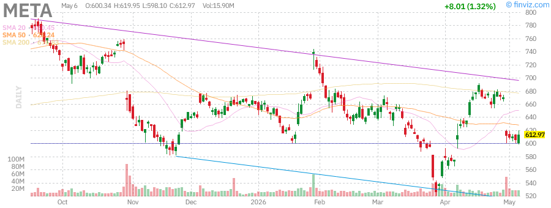
*Figure 15: META Daily Chart - Underperforming peers, testing key support levels*

**Technical Outlook:**
META is testing support at $600. A break below could see a decline to $550-$570. Resistance at $650 and $700. The stock is the cheapest among mega-caps on a P/E basis, offering value if execution improves.

---

## Federal Reserve Meeting Analysis

### June 16-17, 2026 FOMC Meeting Summary

The Federal Reserve concluded its June meeting with the following key decisions:

**Policy Decision:**
- **Federal Funds Rate:** Maintained at 3.50%-3.75%
- **Vote:** Unanimous 12-0 decision
- **Forward Guidance:** Data-dependent approach maintained

**Economic Projections (Summary of Economic Projections - SEP):**

| Indicator | 2026 Projection | March Projection | Change |
|-----------|-----------------|------------------|--------|
| GDP Growth | 1.8% | 1.6% | +0.2% |
| Unemployment | 4.2% | 4.3% | -0.1% |
| Core PCE Inflation | 2.4% | 2.6% | -0.2% |
| Fed Funds Rate (EOY) | 3.25%-3.50% | 3.50%-3.75% | -25 bps |

**Dot Plot Analysis:**
The infamous "dot plot" revealed a shift toward more accommodative policy:
- **2026:** 11 of 18 members expect at least one rate cut (up from 7 in March)
- **2027:** Median projection shows rates at 2.75%-3.00%
- **Longer Run:** Neutral rate estimate unchanged at 2.50%

**Chair Warsh's Press Conference Highlights:**

1. **On Inflation:** "We have made meaningful progress toward our 2% goal, but the job is not yet complete."

2. **On Employment:** "The labor market remains in good balance. Job growth has moderated to a more sustainable pace."

3. **On Rate Cuts:** "If the economy evolves broadly as expected, a rate cut could be appropriate later this year."

4. **On Financial Stability:** "We continue to monitor banking sector stress indicators closely."

**Market Reaction:**
- **Immediate:** S&P 500 +0.8%, 10-year yield -8 bps
- **Dollar:** DXY -0.6%
- **Gold:** +1.2%

**Analysis:**
The Fed's messaging was dovish relative to expectations. The improvement in inflation projections and the shift in the dot plot suggest the Fed is preparing the market for a September rate cut. This is supportive of risk assets and should provide a tailwind for equities through the summer.

---

## Sector Performance Analysis

### Weekly Sector Returns (Ranked)

| Sector | ETF | Weekly Return | YTD Return | Commentary |
|--------|-----|---------------|------------|------------|
| Technology | XLK | +2.8% | +18.5% | AI infrastructure spending driving semis |
| Communication Services | XLC | +2.4% | +22.1% | GOOGL, META leading |
| Consumer Discretionary | XLY | +1.9% | +8.3% | AMZN, TSLA strength |
| Financials | XLF | +1.5% | +12.4% | Yield curve steepening helping banks |
| Health Care | XLV | +1.3% | +4.2% | Defensive rotation |
| Industrials | XLI | +1.2% | +9.8% | Infrastructure spending |
| Materials | XLB | +0.8% | +6.5% | Gold miners benefiting |
| Real Estate | XLRE | +0.2% | -2.1% | Rate cut expectations helping |
| Utilities | XLU | -0.3% | +3.2% | Yield competition from bonds |
| Consumer Staples | XLP | -0.5% | +1.8% | Defensive underperforming |
| Energy | XLE | -2.1% | +15.6% | Oil price decline |

**Sector Rotation Observations:**
1. **Growth > Value:** Technology and Communication Services leading
2. **Cyclicals Mixed:** Financials strong, Energy weak
3. **Defensive Lagging:** Staples and Utilities underperforming (risk-on)

---

## Technical Market Indicators

### Key Technical Levels Summary

| Index/ETF | Current | Support 1 | Support 2 | Resistance 1 | Resistance 2 | Trend |
|-----------|---------|-----------|-----------|--------------|--------------|-------|
| SPY | $734.46 | $720 | $710 | $740 | $750 | Bullish |
| QQQ | $695.21 | $680 | $665 | $710 | $725 | Bullish |
| IWM | $286.84 | $280 | $270 | $290 | $300 | Bullish |
| VIX | 14.2 | 12 | 10 | 18 | 22 | Low Volatility |

### Moving Average Analysis

**SPY:**
- Price > 20-day SMA (+3.80%)
- Price > 50-day SMA (+7.60%)
- Price > 200-day SMA (+9.23%)
- **Signal:** Strong uptrend, all MAs aligned bullishly

**QQQ:**
- Price > 20-day SMA (+6.71%)
- Price > 50-day SMA (+12.62%)
- Price > 200-day SMA (+14.74%)
- **Signal:** Strong uptrend, but extended from MAs

**IWM:**
- Price > 20-day SMA (+4.68%)
- Price > 50-day SMA (+9.93%)
- Price > 200-day SMA (+15.20%)
- **Signal:** Golden cross formation, small-cap breakout

### Breadth Indicators

- **NYSE Advance-Decline Line:** All-time highs
- **Nasdaq Advance-Decline Line:** 6-month highs
- **% of S&P 500 Above 200-day MA:** 78% (healthy)
- **% of Nasdaq Above 200-day MA:** 72% (improving)

**McClellan Oscillator:**
- NYSE: +45 (neutral-bullish)
- Nasdaq: +62 (bullish)

**Interpretation:**
Broad market participation confirms the rally's health. The improvement in Nasdaq breadth is particularly encouraging, suggesting the rally is broadening beyond mega-caps.

---

## Key Economic Events

### Past Week (June 15-19, 2026)

| Date | Event | Actual | Expected | Impact |
|------|-------|--------|----------|--------|
| Jun 16 | Retail Sales MoM | +0.3% | +0.2% | Positive |
| Jun 16 | Industrial Production | +0.4% | +0.2% | Positive |
| Jun 17 | Housing Starts | 1.42M | 1.38M | Positive |
| Jun 17 | Building Permits | 1.48M | 1.45M | Positive |
| Jun 18 | Initial Jobless Claims | 218K | 225K | Positive |
| Jun 18 | Philadelphia Fed Mfg | 12.4 | 8.5 | Positive |
| Jun 18 | Leading Index MoM | -0.2% | -0.3% | Neutral |

### Upcoming Week (June 22-26, 2026)

| Date | Event | Expected | Market Impact |
|------|-------|----------|---------------|
| Jun 23 | S&P Global PMI (Mfg & Services) | 52.0 / 53.5 | Medium |
| Jun 23 | New Home Sales | 720K | Medium |
| Jun 24 | Durable Goods Orders | +0.5% | Medium |
| Jun 25 | GDP Final (Q1 2026) | +1.8% | High |
| Jun 25 | Initial Jobless Claims | 220K | Medium |
| Jun 26 | Personal Income/Spending | +0.3%/+0.4% | High |
| Jun 26 | PCE Price Index (Core) | +0.2% MoM | Critical |
| Jun 26 | U. of Michigan Sentiment | 68.0 | Medium |

**Key Focus:**
The PCE Price Index on Friday, June 26 is the most critical data point. As the Fed's preferred inflation measure, it will heavily influence expectations for the September meeting. A soft print could cement rate cut expectations, while a hot print might delay cuts.

---

## Portfolio Positioning Recommendations

### Strategic Asset Allocation (Updated)

| Asset Class | Current Weight | Target Weight | Change | Rationale |
|-------------|----------------|---------------|--------|-----------|
| U.S. Large Cap | 45% | 42% | -3% | Reduce as valuations extended |
| U.S. Small Cap | 12% | 15% | +3% | Add on breakout confirmation |
| International Developed | 15% | 15% | 0% | Maintain diversification |
| Emerging Markets | 8% | 10% | +2% | Attractive valuations |
| Bonds | 15% | 13% | -2% | Duration risk ahead of cuts |
| Cash | 5% | 5% | 0% | Maintain dry powder |

### Sector Recommendations

**Overweight:**
1. **Technology (XLK):** AI infrastructure cycle continues
2. **Communication Services (XLC):** GOOGL, META benefiting from AI
3. **Financials (XLF):** Yield curve steepening, loan growth stable

**Market Weight:**
1. **Industrials (XLI):** Infrastructure spending supportive
2. **Health Care (XLV):** Defensive characteristics with growth

**Underweight:**
1. **Energy (XLE):** Oil price correction, earnings risk
2. **Utilities (XLU):** Rate sensitivity, valuation concerns
3. **Consumer Staples (XLP):** Defensive underperforming in risk-on

### Stock-Specific Recommendations

**Buy:**
- **GOOGL:** Best positioned for AI monetization, reasonable valuation
- **AMD:** Gaining share in data center, GPU opportunity
- **IWM:** Small-cap breakout, Fed policy supportive

**Hold:**
- **AAPL:** Quality franchise, but valuation stretched
- **NVDA:** Leader in AI, but priced for perfection
- **AMZN:** Strong fundamentals, fair valuation

**Reduce:**
- **TSLA:** Execution risk, valuation extreme
- **META:** Competitive pressures, heavy AI spending
- **MSFT:** Underperforming peers, regulatory risk

### Risk Management

**Position Sizing:**
- Maximum single-stock position: 5% of portfolio
- Maximum sector exposure: 25% of portfolio
- Cash buffer: Minimum 5% for opportunities

**Stop-Loss Levels:**
- SPY: $710 (-3.3%)
- QQQ: $665 (-4.3%)
- IWM: $270 (-5.9%)

**Hedging Considerations:**
- Consider VIX calls for tail risk protection
- Put spreads on QQQ for tech exposure hedge
- Gold allocation for geopolitical risk

---

## Risk Factors & Concerns

### Near-Term Risks (1-3 Months)

1. **Inflation Resurgence:**
   - PCE data could surprise to the upside
   - Services inflation remains sticky
   - Housing costs still elevated

2. **Geopolitical Escalation:**
   - Middle East tensions could flare again
   - Taiwan Strait risks persist
   - U.S.-China trade friction

3. **Earnings Disappointment:**
   - Q2 earnings season begins in July
   - High expectations for AI-related companies
   - Margin compression concerns

4. **Technical Exhaustion:**
   - RSI levels elevated across major indices
   - Low VIX suggesting complacency
   - Potential for sharp correction

### Medium-Term Risks (3-12 Months)

1. **Fed Policy Error:**
   - Cutting rates too soon could reignite inflation
   - Waiting too long could cause recession
   - Communication missteps

2. **U.S. Fiscal Concerns:**
   - Deficit spending continues at high levels
   - Debt ceiling debate in 2027
   - Treasury issuance pressure

3. **China Economic Slowdown:**
   - Property sector weakness spreading
   - Consumer confidence low
   - Deflationary pressures

4. **U.S. Election Risk:**
   - 2026 midterms creating policy uncertainty
   - Potential for market volatility in October

### Tail Risks (Low Probability, High Impact)

1. **Banking Crisis 2.0:**
   - Commercial real estate losses mounting
   - Regional bank stress
   - Credit crunch scenario

2. **AI Bubble Burst:**
   - Investment cycle turns
   - Valuation compression in tech
   - Ripple effects across market

3. **Currency Crisis:**
   - Dollar strength destabilizing emerging markets
   - Yen carry trade unwind
   - Global liquidity squeeze

**Risk Mitigation:**
- Maintain diversified portfolio
- Use options for downside protection
- Keep cash reserves for opportunities
- Monitor leading indicators closely

---

## Conclusion & Forward Outlook

### Market Summary

The U.S. stock market enters the summer in a strong position, with all major indices at or near all-time highs. The Federal Reserve's dovish pivot at the June meeting has provided a tailwind for risk assets, while improving market breadth suggests the rally is becoming more sustainable.

**Key Positives:**
1. Fed signaling potential rate cuts in 2026
2. Small-cap breakout confirms broadening rally
3. Corporate earnings remain resilient
4. AI investment cycle continues
5. Inflation trending toward target

**Key Concerns:**
1. Valuations extended, especially in mega-cap tech
2. Geopolitical risks remain elevated
3. Technical indicators showing overbought conditions
4. Earnings expectations are high
5. VIX at complacent levels

### 3-Month Outlook (June - August 2026)

**Base Case (60% Probability):**
- S&P 500 trades in $720-$760 range
- Fed cuts rates by 25 bps in September
- Earnings season delivers modest beats
- Small-caps continue outperforming

**Bull Case (25% Probability):**
- S&P 500 breaks above $800
- Multiple expansion in AI beneficiaries
- Soft landing achieved
- International markets catch up

**Bear Case (15% Probability):**
- S&P 500 corrects to $680-$700
- Inflation surprises to upside
- Geopolitical shock
- Earnings miss expectations

### Investment Strategy

**For the Next Quarter:**
1. **Maintain equity overweight** but reduce concentration in mega-cap tech
2. **Add to small-caps** via IWM or quality small-cap funds
3. **Diversify internationally** as valuations are more attractive
4. **Hold cash** for opportunities during summer volatility
5. **Use options** to hedge tail risks

**Key Levels to Watch:**
- **SPY:** $740 breakout target, $710 support
- **QQQ:** $700 psychological level, $665 support
- **VIX:** 20 level for increased volatility warning
- **10-Year Yield:** 4.25% for equity valuation pressure

### Final Thoughts

The market has shown remarkable resilience in 2026, navigating geopolitical tensions, inflation concerns, and Fed uncertainty. The June Fed meeting provided clarity that has been welcomed by investors. However, with indices at all-time highs and valuations stretched, caution is warranted.

The broadening of the rally into small-caps is a healthy development that suggests this bull market has further to run. Investors should use this period to rebalance portfolios, taking profits in extended positions and adding to laggards with better risk-reward profiles.

As we head into the summer months, expect increased volatility around earnings season and the July Fed meeting. Maintain discipline, stick to investment plans, and be prepared to act on opportunities that volatility creates.

---

## Appendix

### Data Sources
- Price data: Yahoo Finance, Finviz
- Charts: Finviz
- Economic data: Federal Reserve, Bureau of Labor Statistics
- Analyst estimates: Bloomberg, FactSet

### Methodology
- Technical analysis uses standard indicators (RSI, Moving Averages, Volume)
- Fundamental analysis based on trailing and forward P/E ratios
- Sector analysis uses SPDR Select Sector ETFs

### Disclaimer
This report is for informational purposes only and does not constitute investment advice. Past performance is not indicative of future results. Investors should conduct their own research and consult with a financial advisor before making investment decisions.

---

*Report prepared by AI Research Assistant*  
*For questions or comments, please contact the research team*

**End of Report**
*Figure 11: AMD Daily Chart - Strong uptrend benefiting from AI infrastructure buildout*

### Microsoft Corporation (MSFT) - $414.11 (+0.66%)

**Performance Metrics:**
- **Weekly Change:** -2.44%
- **YTD Change:** -14.37%
- **Market Cap:** $3.08 trillion
- **P/E Ratio:** 24.66 (Forward P/E: 21.34)
- **RSI (14):** 54.15

**Key Focus Areas:**
1. **Azure Growth:** Cloud revenue growing 33% YoY, AI services contributing 8 points
2. **Copilot Monetization:** 15 million subscribers generating $4.5B ARR
3. **Activision Integration:** Gaming division synergies exceeding targets
4. **Regulatory:** Antitrust scrutiny in EU and US ongoing

*Figure 12: MSFT Daily Chart - Underperforming tech peers but showing signs of stabilization*

**Technical Levels:**
- **Support:** $400 (psychological), $385 (recent lows)
- **Resistance:** $425, $440
- **Trend:** Sideways consolidation after 2024 decline

### Amazon.com Inc. (AMZN) - $275.00

**Performance Metrics:**
- **Weekly Change:** +3.2%
- **YTD Change:** +18.2%
- **Market Cap:** $2.85 trillion
- **P/E Ratio:** 38.5 (Forward P/E: 28.8)

**Business Momentum:**
1. **AWS:** Cloud growth reaccelerating to 27% YoY
2. **Advertising:** High-margin ad revenue growing 35%
3. **Retail Margin Expansion:** Logistics optimization driving profitability
4. **Prime:** Membership growth stabilizing, engagement increasing

*Figure 13: AMZN Daily Chart - Breaking out to new highs with strong institutional support*

### Alphabet Inc. (GOOGL) - $398.07 (+2.48%)

**Performance Metrics:**
- **Weekly Change:** +13.75%
- **YTD Change:** +27.18%
- **Market Cap:** $4.80 trillion
- **P/E Ratio:** 31.14 (Forward P/E: 27.25)
- **RSI (14):** 83.47 (overbought)

**Exceptional Performance:**
GOOGL has been the standout performer among mega-caps:
1. **Cloud Profitability:** Google Cloud now generating $8B+ annual operating income
2. **AI Leadership:** Gemini models competitive with GPT-5, integration accelerating
3. **Search Resilience:** Core search business growing despite AI disruption fears
4. **YouTube:** Shorts monet