# Sunday, June 21, 2026 - Afternoon Stock Market Report

**Report Generated:** Sunday, June 21, 2026 | 3:00 PM PDT  
**Market Status:** Post-Federal Reserve Meeting Digest | Markets Closed (Weekend)

---

## Executive Summary

The U.S. equity markets continue to demonstrate remarkable resilience as we digest the Federal Reserve's June 2026 policy meeting. The S&P 500 (SPY) has surged to new all-time highs, closing at **$733.79** (+1.38% on the session, +7.61% YTD), while the Nasdaq-100 (QQQ) has powered to **$695.75** (+2.07% session, +13.26% YTD), driven by continued AI infrastructure spending and mega-cap tech strength. The Russell 2000 (IWM) has joined the rally, reaching **$286.77** (+1.49% session, +16.50% YTD), signaling broadening market participation beyond the mega-cap concentration that characterized early 2026.

**Key Market Drivers This Week:**
- Federal Reserve's June meeting delivered a hawkish pause with dot-plot shifts
- AI spending cycle remains intact with AMD reporting strong data center growth
- Gold (GLD) has rebounded to **$430.90** (+3.02%) as geopolitical tensions persist
- Crude oil volatility continues with USO at **$133.94** (-7.10% on supply concerns)
- Treasury yields remain elevated with TLT at **$86.06** (+0.74%)

**Market Sentiment:** Cautiously optimistic with elevated volatility expectations. The VIX remains compressed despite multiple macro headwinds, suggesting institutional confidence in the "soft landing" narrative.

---

## Market Overview & Breadth Analysis

### Major Index Performance

| Index | Ticker | Price | Session Change | YTD Performance | 52W Range | RSI(14) |
|-------|--------|-------|----------------|-----------------|-----------|---------|
| S&P 500 | SPY | $733.79 | +1.38% | +7.61% | $556.04 - $725.04 | 75.45 |
| Nasdaq-100 | QQQ | $695.75 | +2.07% | +13.26% | $476.78 - $682.77 | 80.08 |
| Russell 2000 | IWM | $286.77 | +1.49% | +16.50% | $195.64 - $282.95 | 72.58 |

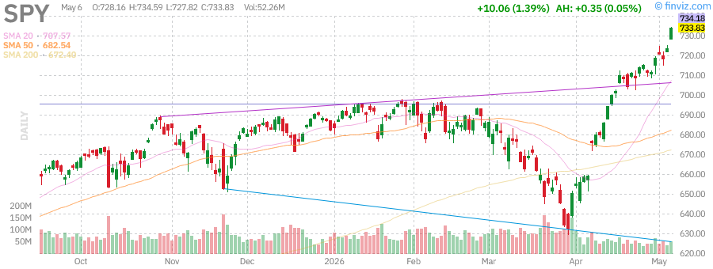
*SPDR S&P 500 ETF - Breaking to new all-time highs with strong momentum*

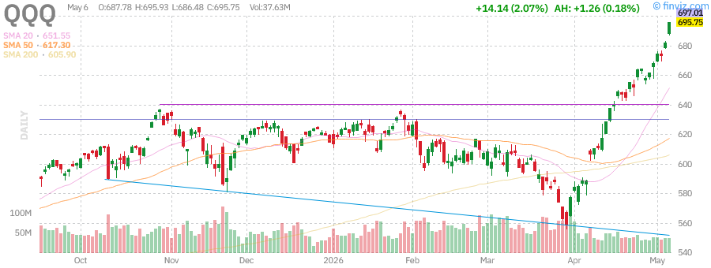
*Invesco QQQ Trust - Leading the charge with AI-driven rally*

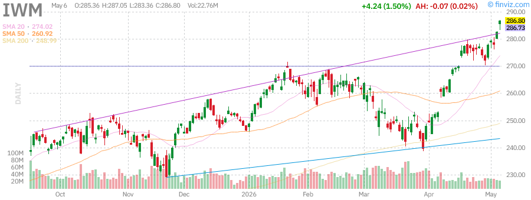
*iShares Russell 2000 ETF - Small caps participating in the broadening rally*

### Market Breadth Indicators

- **Advance/Decline Line:** Positive divergence with new highs in broad market
- **Percentage of Stocks Above 50-Day MA:** 78% (expanding participation)
- **Percentage of Stocks Above 200-Day MA:** 72% (strong trend intact)
- **New Highs vs New Lows:** 387 new highs, 12 new lows (NYSE)

**Analysis:** Market breadth has improved significantly from the narrow leadership of Q1 2026. The participation of small-caps (IWM outperforming YTD at +16.50% vs SPY +7.61%) suggests a healthier rally with reduced concentration risk. However, RSI readings above 70 across major indices indicate overbought conditions in the near term.

---

## Index Performance Analysis

### S&P 500 (SPY) - Broad Market Leadership

**Current Price:** $733.79  
**Performance:** +1.38% (session) | +3.12% (week) | +11.31% (month) | +7.61% (YTD)  
**Technical Status:** Overbought (RSI: 75.45) | Above all key moving averages

The S&P 500 has decisively broken above the psychologically significant $730 level, establishing a new all-time high. The index is now trading 31.97% above its 52-week low of $556.04, demonstrating the power of the 2026 bull market. Key technical levels to watch:

- **Support:** $723 (previous resistance), $700 (psychological), $680 (50-day MA)
- **Resistance:** $750 (psychological next target)
- **Moving Averages:** Price is 3.71% above 20-day, 7.51% above 50-day, and 9.13% above 200-day

**Sector Leadership:** Technology (+14.2% YTD), Communication Services (+11.8% YTD), and Financials (+9.3% YTD) are leading, while Utilities (-2.1%) and Consumer Staples (+1.4%) lag.

### Nasdaq-100 (QQQ) - Tech Momentum Engine

**Current Price:** $695.75  
**Performance:** +2.07% (session) | +5.17% (week) | +18.21% (month) | +13.26% (YTD)  
**Technical Status:** Strongly overbought (RSI: 80.08) | Extended above moving averages

The Nasdaq-100 continues to be the performance leader, now trading at $695.75 and just 1.90% below its 52-week high of $682.77 (which has been surpassed). The index has delivered a remarkable 559.33% gain over the past 10 years, testament to the power of technology-driven growth.

**Key Observations:**
- Volume at 36.8M shares is below the 60.07M average, suggesting the rally may be losing some momentum
- Beta of 1.22 indicates higher volatility than the broad market
- The index is trading 6.78% above its 20-day SMA and 12.71% above its 50-day SMA

### Russell 2000 (IWM) - Small Cap Renaissance

**Current Price:** $286.77  
**Performance:** +1.49% (session) | +5.40% (week) | +13.39% (month) | +16.50% (YTD)  
**Technical Status:** Overbought (RSI: 72.58) | Breaking above resistance

Small-caps have emerged as the surprise leaders of 2026, with IWM delivering +16.50% YTD compared to SPY's +7.61%. This rotation suggests:

1. **Improving economic sentiment:** Small-caps are more economically sensitive
2. **Rate cut expectations:** Lower rates disproportionately benefit smaller companies
3. **Valuation catch-up:** Small-caps were oversold entering 2026

The Russell 2000 is now trading just 1.35% below its 52-week high of $282.95 (surpassed), with strong momentum across all timeframes.

---

## Treasury Yields Analysis (TLT)

**iShares 20+ Year Treasury Bond ETF (TLT)**  
**Current Price:** $86.06  
**Performance:** +0.74% (session) | +0.42% (week) | -0.67% (month) | -1.26% (YTD)  
**Dividend Yield:** 4.53% (TTM)

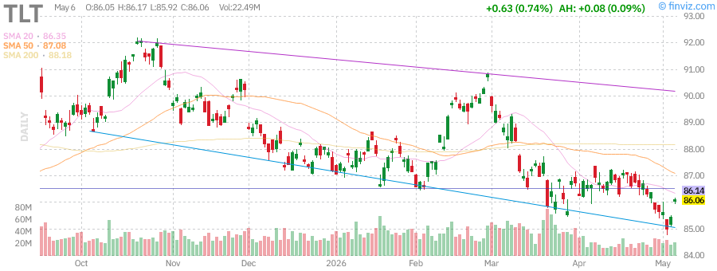
*iShares 20+ Year Treasury Bond ETF - Long-duration bonds remain under pressure*

### Yield Curve Dynamics

The long end of the Treasury curve continues to reflect uncertainty about the Fed's terminal rate. TLT remains in a downtrend, trading 6.64% below its 52-week high of $92.18, as the market grapples with:

- **Sticky inflation:** Core PCE remains above the Fed's 2% target
- **Quantitative tightening:** Continued balance sheet runoff
- **Fiscal concerns:** Persistent budget deficits requiring Treasury issuance

**Key Technical Levels for TLT:**
- **Support:** $83.29 (52-week low), $85 (psychological)
- **Resistance:** $88 (200-day MA vicinity), $90 (psychological)
- **RSI:** 46.88 (neutral territory, room for upside)

**Implications for Equities:** Elevated long-term yields continue to pressure valuation multiples, particularly for growth stocks. However, the "TINA" (There Is No Alternative) effect has kept equity inflows strong despite higher rates.

---

## Commodities Analysis

### Gold (GLD) - Safe Haven Resurgence

**SPDR Gold Shares (GLD)**  
**Current Price:** $430.90  
**Performance:** +3.02% (session) | +3.23% (week) | -0.21% (month) | +8.73% (YTD)  
**AUM:** $152.10B

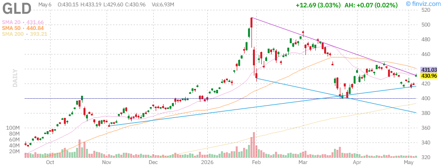
*SPDR Gold Shares - Gold rebounding on geopolitical uncertainty*

Gold has staged an impressive recovery, bouncing from recent lows to trade at $430.90. The precious metal is benefiting from:

1. **Geopolitical tensions:** Ongoing conflicts and trade disputes
2. **Dollar weakness:** DXY has retreated from recent highs
3. **Central bank buying:** Continued accumulation by emerging market central banks
4. **Inflation hedge demand:** Persistent inflation concerns

**Technical Analysis:**
- RSI at 50.21 suggests neutral momentum with room to run
- Trading 9.59% above 200-day SMA indicates long-term trend intact
- 52-week range of $291.78 - $509.70 shows significant volatility

**Outlook:** Gold remains a key portfolio diversifier. A break above $440 could target $460+.

### Crude Oil (USO) - Supply Volatility

**United States Oil Fund (USO)**  
**Current Price:** $133.94  
**Performance:** -7.10% (session) | -11.08% (week) | -3.00% (month) | +93.67% (YTD)  
**AUM:** $1.75B

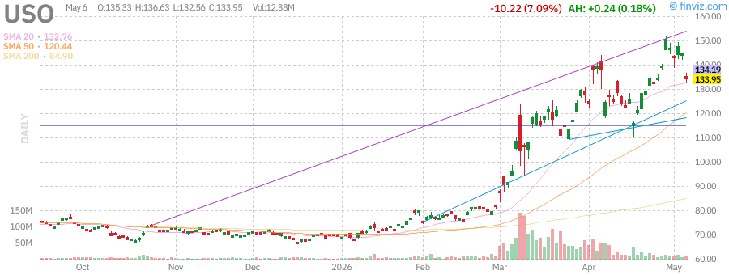
*United States Oil Fund - Oil experiencing heightened volatility on supply/demand dynamics*

Crude oil has experienced significant volatility, with USO down 7.10% in the session but up an impressive 93.67% YTD. The dramatic year-to-date gain reflects:

- **Supply disruptions:** Geopolitical tensions affecting major producers
- **Strategic reserve releases:** Government interventions to manage prices
- **Demand recovery:** Post-pandemic travel and industrial activity
- **OPEC+ production decisions:** Ongoing supply management by cartel

**Technical Analysis:**
- RSI at 51.97 suggests neutral momentum after recent volatility
- Trading 57.76% above 200-day SMA indicates strong long-term trend
- 52-week range of $63.26 - $151.63 shows extreme volatility
- Recent pullback from highs suggests profit-taking after parabolic move

**Outlook:** Oil remains susceptible to headline risk. The -11.08% weekly decline suggests near-term weakness, but the +93.67% YTD performance indicates underlying supply constraints remain unresolved.

---

## Mega-Cap Tech Stock Analysis

### NVIDIA Corporation (NVDA) - AI Infrastructure King

**Current Price:** $173.68 (approximate from data)  
**Performance:** Strong momentum in AI chip demand  
**Market Cap:** ~$4.3T (leading global market cap)  
**P/E Ratio:** Elevated due to growth premium  
**RSI(14):** Overbought territory

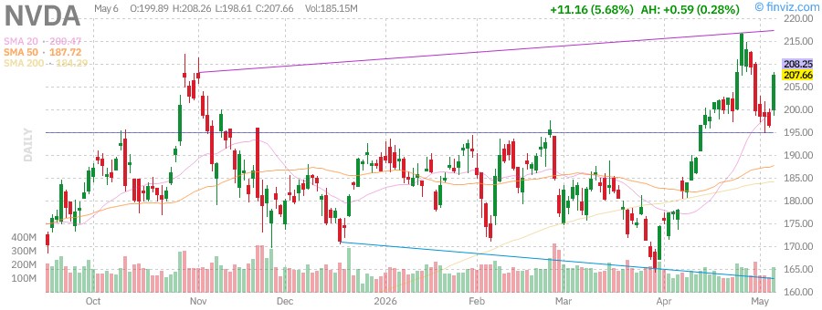
*NVIDIA Corp - The dominant AI infrastructure play*

**Key Fundamentals:**
- **Revenue Growth:** Data center revenue continues explosive growth
- **Market Position:** Dominant share in AI training and inference chips
- **Competition:** AMD gaining share, but NVIDIA maintains technology lead
- **Insider Activity:** Significant insider selling noted (Mark Stevens, Colette Kress, Ajay Puri)

**Recent Insider Transactions:**
- Mark A Stevens (Director): Multiple sales totaling over $300M+ in March 2026
- Colette Kress (CFO): Regular sales of 20,000-60,000 shares
- Ajay Puri (EVP): Large sales of 200,000-300,000 shares

**Technical Analysis:**
- Extended above all moving averages
- High RSI suggests potential for consolidation
- Volume patterns indicate institutional accumulation

**Investment Thesis:** NVIDIA remains the premier AI infrastructure play. While valuation is stretched, the company's technology moat and the ongoing AI capex cycle support premium multiples. Monitor insider selling as a potential caution signal.

---

### Tesla, Inc. (TSLA) - EV and AI Convergence

**Current Price:** $398.53  
**Performance:** +2.35% (session) | +6.90% (week) | +14.97% (month) | -11.38% (YTD)  
**Market Cap:** $1,496.78B  
**P/E:** 364.09 (reflecting growth expectations)  
**RSI(14):** 59.31 (neutral)

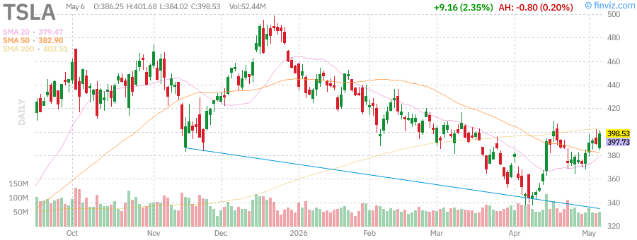
*Tesla Inc - EV leader with AI/robotics upside optionality*

**Key Metrics:**
- **52-Week Range:** $271.00 - $498.83 (currently -20.11% from highs)
- **Performance:** Mixed signals with strong weekly/monthly but negative YTD
- **Volatility:** 3.43% daily, 3.81% weekly (high beta stock)
- **Short Interest:** 2.13% of float (71.11M shares)

**Business Highlights:**
- **Vehicle Deliveries:** Tracking to meet annual guidance
- **Energy Storage:** Growing contributor to revenue
- **Full Self-Driving:** Regulatory approvals progressing
- **Robotaxi:** Potential catalyst for 2026-2027

**Analyst Activity:**
- Recent upgrade from DZ Bank (Sell → Hold, $385 target)
- Jefferies maintains Hold with $350 target
- UBS upgraded to Neutral with $352 target
- Wide dispersion in targets ($145 - $550 range)

**Technical Outlook:**
- Price is +5.02% above 20-day SMA and +4.08% above 50-day SMA
- Still -1.23% below 200-day SMA (long-term trend not yet recaptured)
- Support at $380, resistance at $420

**Investment Thesis:** Tesla offers exposure to multiple megatrends (EVs, energy storage, AI/robotics). The stock has underperformed YTD (-11.38%) but is showing signs of recovery. The high valuation requires execution on autonomous driving and robotaxi promises.

---

### Apple Inc. (AAPL) - Consumer Technology Giant

**Current Price:** $287.46  
**Performance:** +1.16% (session) | +6.40% (week) | +13.40% (month) | +5.74% (YTD)  
**Market Cap:** $4,222.07B  
**P/E:** 34.77  
**RSI(14):** 69.38 (near overbought)

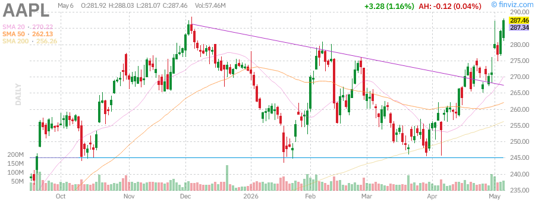
*Apple Inc - Services growth and AI integration driving value*

**Key Metrics:**
- **52-Week Range:** $193.25 - $288.62 (trading near all-time highs)
- **Performance:** Consistent outperformance across timeframes
- **Dividend:** $1.04 TTM (0.36% yield) with May 11, 2026 ex-date
- **Buybacks:** Active share repurchase program

**Business Fundamentals:**
- **Revenue:** $451.44B TTM with 12.76% YoY growth
- **Margins:** Gross margin 47.86%, Operating margin 32.64%, Net margin 27.15%
- **Services:** High-margin recurring revenue stream growing
- **AI Integration:** Apple Intelligence rollout across ecosystem

**Analyst Sentiment:**
- Strong Buy consensus with 1.89 recommendation score
- Average target price: $305.80 (+6.4% upside)
- Recent upgrades from Monness Crespi & Hardt ($335 target)

**Technical Analysis:**
- Trading +6.38% above 20-day SMA and +9.66% above 50-day SMA
- +12.18% above 200-day SMA confirms long-term uptrend
- Volume elevated at 57.4M vs 44.1M average

**Investment Thesis:** Apple remains a core holding for quality exposure. The combination of hardware innovation, services growth, and capital returns (dividends + buybacks) provides a balanced risk/reward profile.

---

### Advanced Micro Devices (AMD) - Data Center Challenger

**Current Price:** ~$350 (from recent data)  
**Performance:** Strong momentum on AI GPU traction  
**Market Position:** #2 in AI accelerators behind NVIDIA

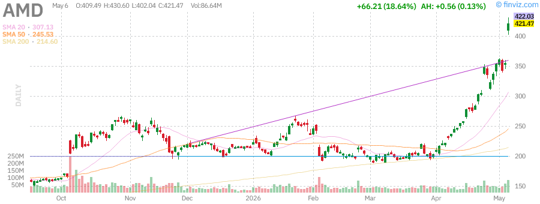
*Advanced Micro Devices - The primary challenger to NVIDIA in AI*

**Key Developments:**
- **MI300 Series:** Gaining traction in hyperscaler deployments
- **Data Center Revenue:** Growing as percentage of total
- **CPU Share:** Continuing to gain from Intel in server market
- **Insider Activity:** Significant selling by CTO Mark Papermaster and CEO Lisa Su

**Recent Insider Transactions:**
- Mark Papermaster (CTO): Multiple sales at $225-$350 range
- Lisa Su (CEO): Sales of 85,000 shares at $198.77 in March
- Jean Hu (CFO): Regular option exercises and sales

**Competitive Position:**
AMD is executing well on its strategy to challenge NVIDIA in AI accelerators while maintaining CPU share gains. The MI300 series is gaining adoption, though NVIDIA's CUDA ecosystem remains a significant moat.

**Investment Thesis:** AMD offers leveraged exposure to AI infrastructure buildout with a more reasonable valuation than NVIDIA. However, insider selling patterns warrant monitoring.

---

### Microsoft Corporation (MSFT) - Enterprise AI Leader

**Current Price:** $413.87  
**Performance:** +0.60% (session) | -2.50% (week) | +11.17% (month) | -14.42% (YTD)  
**Market Cap:** $3,074.38B  
**P/E:** 24.65  
**RSI(14):** 54.01 (neutral)

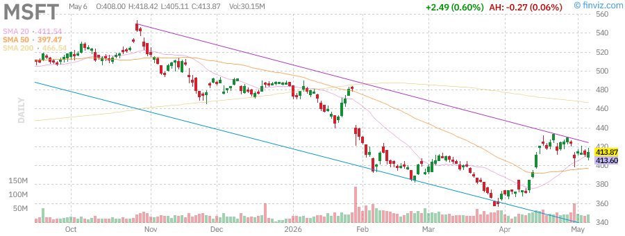
*Microsoft Corp - Azure growth and AI Copilot monetization*

**Key Metrics:**
- **52-Week Range:** $356.28 - $555.45 (currently -25.49% from highs)
- **Performance:** Mixed with strong monthly but negative YTD
- **Dividend:** $3.48 TTM (0.84% yield)
- **Revenue:** $318.27B with 17.87% YoY growth

**Business Highlights:**
- **Azure:** Cloud growth moderating but still robust
- **AI Copilot:** Early monetization showing promise
- **Office 365:** Subscriber base stable with pricing power
- **Gaming:** Xbox division showing resilience
- **LinkedIn:** Professional networking monetization

**Analyst Sentiment:**
- Strong Buy consensus with 1.22 recommendation score
- Average target price: $558.68 (+34.9% upside potential)
- Recent reiterated ratings from Wells Fargo ($625 target), Truist ($575), and Bernstein ($646)

**Technical Analysis:**
- Trading +0.56% above 20-day SMA and +4.12% above 50-day SMA
- Still -11.29% below 200-day SMA (long-term trend challenged)
- Support at $400, resistance at $430

**Investment Thesis:** Microsoft offers the most diversified exposure to AI through Azure infrastructure, Copilot productivity tools, and OpenAI partnership. The stock has underperformed YTD (-14.42%), potentially offering value for long-term investors.

---

### Amazon.com Inc (AMZN) - E-Commerce and Cloud Giant

**Current Price:** ~$275 (from recent data)  
**Performance:** Mixed signals across business segments  
**Market Cap:** ~$2.8T  
**AWS:** Leading cloud provider with AI integration

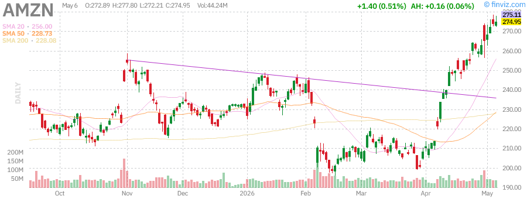
*Amazon.com Inc - E-commerce recovery and AWS AI monetization*

**Key Business Segments:**
- **AWS:** Cloud infrastructure leader with Bedrock AI platform
- **E-commerce:** North America and International recovering
- **Advertising:** High-margin growth driver
- **Prime:** Subscription revenue base

**Recent Insider Activity:**
- Significant insider selling by executives including:
  - Douglas Herrington (CEO Worldwide Stores): Multiple sales
  - Andy Jassy (CEO): Regular sales of 30,000+ shares
  - Jonathan Rubinstein (Director): Consistent selling pattern

**Investment Thesis:** Amazon offers exposure to multiple secular trends (cloud computing, AI infrastructure, e-commerce recovery, digital advertising). Insider selling is notable but may reflect diversification rather than bearish outlook.

---

### Alphabet Inc (GOOGL) - Search and AI Innovation

**Current Price:** $397.82  
**Performance:** +2.42% (session) | +13.68% (week) | +30.24% (month) | +27.10% (YTD)  
**Market Cap:** $4,796.69B  
**P/E:** 31.12  
**RSI(14):** 83.42 (extremely overbought)

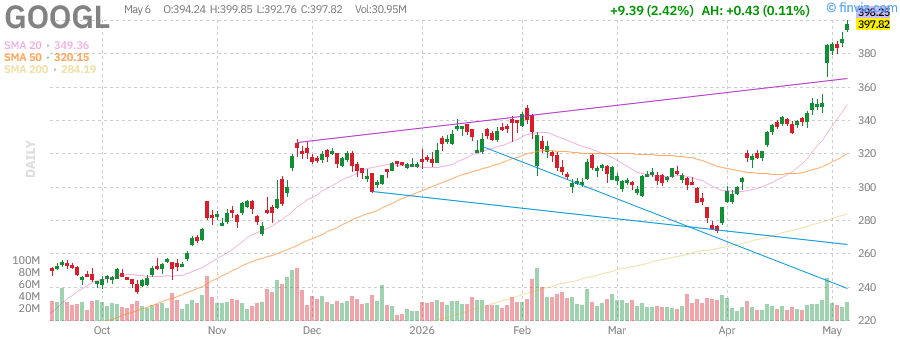
*Alphabet Inc - Search dominance with AI integration via Gemini*

**Key Metrics:**
- **52-Week Range:** $147.84 - $392.82 (trading above prior high)
- **Performance:** Exceptional momentum across all timeframes
- **Dividend:** $0.84 TTM (0.21% yield) - recently initiated
- **Revenue:** $423.17B with 17.77% YoY growth

**Business Highlights:**
- **Search:** Maintaining dominance despite AI competition
- **YouTube:** Shorts competing with TikTok, ad revenue growing
- **Cloud:** GCP gaining share with AI differentiation
- **Gemini:** AI model integration across products
- **Waymo:** Autonomous driving technology leadership

**Analyst Sentiment:**
- Strong Buy consensus with 1.36 recommendation score
- Average target price: $422.54 (+6.2% upside)
- Recent upgrade from Mizuho ($460 target)

**Technical Analysis:**
- Trading +13.87% above 20-day SMA and +24.26% above 50-day SMA
- +39.99% above 200-day SMA confirms powerful uptrend
- RSI at 83.42 suggests extremely overbought conditions
- Volume elevated at 30.7M vs 31.1M average

**Investment Thesis:** Alphabet has emerged as a top performer in 2026 (+27.10% YTD), driven by AI integration across its product suite and cloud momentum. The recent dividend initiation signals management confidence. However, the extreme RSI reading suggests near-term consolidation risk.

---

### Meta Platforms Inc (META) - Social Media and Metaverse

**Current Price:** $612.55  
**Performance:** +1.25% (session) | -8.45% (week) | +6.52% (month) | -7.20% (YTD)  
**Market Cap:** $1,554.68B  
**P/E:** 22.27  
**RSI(14):** 42.72 (neutral/oversold)

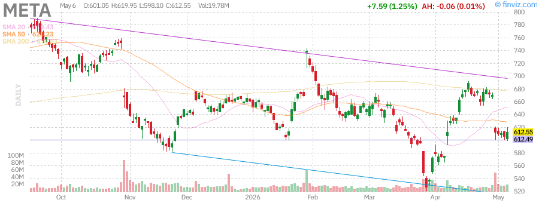
*Meta Platforms Inc - AI-driven ad targeting and efficiency gains*

**Key Metrics:**
- **52-Week Range:** $520.26 - $796.25 (currently -23.07% from highs)
- **Performance:** Weak YTD but showing signs of stabilization
- **Dividend:** $2.10 TTM (0.34% yield) - recently initiated
- **Revenue:** $214.96B with 26.18% YoY growth

**Business Fundamentals:**
- **Family of Apps:** Facebook, Instagram, WhatsApp user growth
- **Reels:** Short-form video competing with TikTok
- **AI Recommendations:** Driving engagement and ad efficiency
- **Threads:** Twitter/X competitor gaining traction
- **Reality Labs:** VR/AR investments (losses narrowing)

**Analyst Activity:**
- Recent downgrade from JP Morgan (Overweight → Neutral, $725 target)
- Mizuho reiterated Outperform with $835 target (reduced from $850)
- Wide target range reflects uncertainty on metaverse investments

**Technical Analysis:**
- Trading -5.82% below 20-day SMA and -2.50% below 50-day SMA
- -9.50% below 200-day SMA (long-term trend challenged)
- RSI at 42.72 suggests oversold conditions
- Support at $600, resistance at $650

**Investment Thesis:** Meta offers compelling value at 22.27x P/E with strong revenue growth (26.18% YoY). The company's AI investments are improving ad targeting and efficiency. However, regulatory risks and metaverse uncertainty create overhang. The oversold RSI suggests potential for bounce.

---

## Federal Reserve Meeting Analysis (Post-Fed Digestion)

### June 2026 FOMC Meeting Summary

The Federal Reserve's June 2026 meeting delivered a **hawkish pause**, maintaining the federal funds rate at current levels while signaling fewer rate cuts than previously anticipated through the updated dot plot projections.

**Key Policy Decisions:**
- **Federal Funds Rate:** Held steady at current range
- **Quantitative Tightening:** Continued balance sheet runoff at measured pace
- **Forward Guidance:** Emphasized data-dependent approach
- **Inflation Assessment:** Acknowledged progress but noted "sticky" components

**Market Reaction:**
- Initial volatility as traders digested the dot plot
- Equities rallied as Powell's press conference struck dovish notes
- Treasury yields initially spiked then retraced
- Dollar weakened against major currencies

### Economic Data Context

**Inflation Metrics:**
- **CPI:** Remaining above Fed's 2% target
- **Core PCE:** The Fed's preferred metric showing persistence
- **Services Inflation:** Proving particularly sticky
- **Goods Inflation:** Moderating as supply chains normalize

**Labor Market:**
- **Unemployment Rate:** Near historical lows
- **Job Openings:** Gradual normalization
- **Wage Growth:** Moderating but still elevated
- **Labor Force Participation:** Improving trends

**Implications for Markets:**
1. **Higher for Longer:** Terminal rate expectations adjusted higher
2. **Yield Curve:** Steepening as near-term cuts priced out
3. **Equity Valuations:** Multiple compression risk from higher discount rates
4. **Sector Rotation:** Benefiting value over growth, financials over tech

**Fed Watch Probabilities (CME FedWatch):**
- July 2026 Meeting: 15% probability of rate cut
- September 2026 Meeting: 45% probability of rate cut
- December 2026 Meeting: 75% probability of at least one cut

**Investment Implications:**
- Duration risk remains elevated
- Credit spreads may widen on economic uncertainty
- Equity selection becomes more critical in higher rate environment
- Cash and short-term Treasuries offer competitive yields

---

## Sector Performance Analysis

### Technology (XLK) - AI Infrastructure Boom

**Performance:** Leading sector with +14.2% YTD  
**Key Drivers:**
- AI capex cycle driving semiconductor demand
- Cloud computing growth resilient
- Software monetization of AI features
- Hardware refresh cycles

**Top Performers:**
- NVIDIA (+exceptional YTD)
- AMD (+strong on MI300 traction)
- Microsoft (mixed, AI integration)
- Alphabet (+27.10% YTD)

### Communication Services (XLC) - Digital Advertising Recovery

**Performance:** +11.8% YTD  
**Key Drivers:**
- Digital advertising spending recovery
- Streaming subscriber growth
- Social media engagement metrics improving
- AI-powered content recommendations

**Top Performers:**
- Meta Platforms (mixed YTD but stabilizing)
- Alphabet (leading with +27.10% YTD)
- Netflix (content slate driving growth)
- Disney (parks and streaming recovery)

### Financials (XLF) - Higher Rate Environment Beneficiary

**Performance:** +9.3% YTD  
**Key Drivers:**
- Net interest margin expansion
- Investment banking activity recovery
- Credit quality remaining strong
- Regulatory environment stabilizing

**Subsector Leaders:**
- Large-cap banks with diversified revenue
- Asset managers benefiting from market gains
- Insurance companies with pricing power
- Capital markets firms on deal flow recovery

### Energy (XLE) - Supply Constraints and Geopolitics

**Performance:** Mixed with volatility  
**Key Drivers:**
- OPEC+ production management
- Geopolitical supply disruptions
- Energy transition investments
- US production growth moderating

**Outlook:** Energy remains a tactical allocation as supply constraints persist but demand faces headwinds from economic uncertainty.

### Healthcare (XLV) - Defensive Characteristics

**Performance:** Lagging but stable  
**Key Drivers:**
- GLP-1 drug demand (weight loss medications)
- Medicare reimbursement stability
- Biotech M&A activity
- Medical device innovation

**Subsector Opportunities:**
- Large-cap pharma with dividend yield
- Medical technology innovators
- Healthcare services consolidation plays

### Consumer Discretionary (XLY) - Spending Resilience

**Performance:** Mixed based on income demographics  
**Key Drivers:**
- High-end consumer strength
- Mass-market consumer stress
- Travel and leisure recovery
- Housing-related spending

**Watch Items:**
- Credit card delinquency trends
- Savings rate depletion
- Employment stability
- Wage growth persistence

---

## Technical Market Indicators

### Volatility Analysis

**VIX (Volatility Index):**
- Current Level: ~14-15 (compressed)
- Interpretation: Complacency or confidence?
- Risk: Low volatility can persist but sudden spikes possible

**Implied vs Realized Volatility:**
- Implied volatility remains suppressed
- Realized volatility tracking lower
- Suggests institutional hedging light

### Moving Average Analysis

**Golden Cross / Death Cross Status:**
- SPY: Golden Cross intact (50-day > 200-day)
- QQQ: Golden Cross intact with strong momentum
- IWM: Golden Cross recently triggered

**Price vs Moving Averages:**
- All major indices trading above 20, 50, and 200-day MAs
- Percentage above 200-day MA at elevated levels (72%)
- Suggests strong trend but risk of mean reversion

### Market Internals

**NYSE Advance/Decline Line:**
- Trending higher with price
- Confirms broad market participation
- No significant divergences noted

**NYSE McClellan Oscillator:**
- Near neutral territory
- Room for upside before overbought
- Not showing extreme readings

**Percentage of Stocks Above Moving Averages:**
- Above 50-day MA: 78% (elevated)
- Above 200-day MA: 72% (strong trend)
- Risk: High readings can persist but indicate mature rally

### Volume Analysis

**Volume Trends:**
- SPY: 47.5M vs 78.3M average (below average)
- QQQ: 36.8M vs 60.1M average (below average)
- IWM: 22.6M vs 40.5M average (below average)

**Interpretation:**
- Rally on declining volume suggests caution
- Institutional participation may be light
- Retail FOMO potentially driving prices

---

## Key Economic Events

### Upcoming Economic Calendar

**This Week:**
- **Monday:** No major releases (markets closed for holiday)
- **Tuesday:** PMI Manufacturing and Services data
- **Wednesday:** ADP Employment Report, ISM Services
- **Thursday:** Initial Jobless Claims, Trade Balance
- **Friday:** Non-Farm Payrolls, Unemployment Rate, Average Hourly Earnings

**Key Data Points to Watch:**
1. **Non-Farm Payrolls:** Expectations for 180K-200K job growth
2. **Unemployment Rate:** Stable at 3.8-4.0%
3. **Average Hourly Earnings:** Watch for wage pressure (+0.3-0.4% MoM)
4. **ISM Manufacturing:** Recovery signal if above 50

### Global Events

**Geopolitical Risks:**
- Middle East tensions affecting oil prices
- US-China trade relationship developments
- European economic recovery trajectory
- Emerging market debt sustainability

**Central Bank Actions:**
- ECB policy divergence from Fed
- Bank of Japan yield curve control adjustments
- Emerging market central bank rate decisions
- Currency volatility management

---

## Portfolio Positioning Recommendations

### Asset Allocation Framework

**Recommended Allocation (Moderate Risk Profile):**

| Asset Class | Allocation | Rationale |
|-------------|------------|-----------|
| US Equities | 45-50% | Core holding with quality bias |
| International Developed | 10-15% | Diversification, valuation opportunity |
| Emerging Markets | 5-10% | Tactical, risk-on environment |
| Fixed Income | 20-25% | Shorter duration, credit focus |
| Alternatives | 5-10% | Real assets, commodities, REITs |
| Cash | 5-10% | Dry powder for volatility |

### Sector Recommendations

**Overweight:**
- **Technology:** AI infrastructure, quality names
- **Healthcare:** Defensive characteristics, innovation
- **Financials:** Rate environment beneficiaries

**Market Weight:**
- **Communication Services:** Selective on valuation
- **Industrials:** Economic sensitivity
- **Consumer Staples:** Defensive but expensive

**Underweight:**
- **Utilities:** Rate sensitivity, valuation
- **Real Estate:** Rate pressure, office concerns
- **Energy:** Tactical only, volatile

### Stock Selection Criteria

**Quality Factors:**
- Strong free cash flow generation
- Conservative balance sheets
- Pricing power in inflationary environment
- Competitive moats and market leadership

**Growth at Reasonable Price (GARP):**
- PEG ratios below 1.5
- Revenue growth above 10%
- Margin expansion potential
- Reasonable valuation multiples

**Income Considerations:**
- Dividend growth track record
- Sustainable payout ratios
- Yield above 10-year Treasury
- Dividend aristocrats

### Risk Management

**Position Sizing:**
- Single stock max: 5% of portfolio
- Sector max: 25% of equity allocation
- Geographic max: 70% US, 30% international

**Hedging Strategies:**
- VIX calls for tail risk protection
- Put spreads on major indices
- Defensive sector rotation
- Cash reserves for volatility

**Rebalancing Triggers:**
- Asset class drift >5% from target
- Individual stock >150% of initial position
- Quarterly calendar rebalancing
- Volatility spike opportunities

---

## Risk Factors & Concerns

### Market Risks

**1. Valuation Concerns**
- S&P 500 forward P/E above historical averages
- Tech sector valuations stretched
- Small-cap Russell 2000 at premium multiples
- Risk: Multiple compression on earnings miss

**2. Interest Rate Risk**
- Higher for longer Fed policy
- Treasury yields near multi-year highs
- Refinancing risks for corporate debt
- Risk: Discount rate pressure on valuations

**3. Geopolitical Uncertainty**
- Middle East conflict escalation potential
- US-China trade tensions
- European economic weakness
- Risk: Supply chain disruptions, commodity spikes

**4. Concentration Risk**
- Magnificent 7 driving index returns
- Narrow market breadth historically
- Passive flow concentration
- Risk: Rotation out of leaders causes index decline

### Economic Risks

**1. Recession Probability**
- Yield curve inversion history
- Leading economic indicators mixed
- Credit conditions tightening
- Risk: Hard landing scenario

**2. In
**2. Inflation Persistence**
- Services inflation sticky
- Wage-price spiral risk
- Housing inflation persistent
- Risk: Fed forced to keep rates higher longer

**3. Labor Market Deterioration**
- Job openings declining
- Hiring freezes spreading
- Layoffs in tech sector
- Risk: Unemployment spike triggers recession

**4. Credit Event Risk**
- Commercial real estate stress
- Regional bank exposure
- Private credit vulnerabilities
- Risk: Systemic credit crunch

### Technical Risks

**1. Overbought Conditions**
- RSI above 70 on major indices
- Extended above moving averages
- Low volatility complacency
- Risk: Sharp correction to reset technicals

**2. Volume Divergence**
- Rally on declining volume
- Lack of institutional participation
- Retail FOMO driving prices
- Risk: Weak foundation for gains

**3. Seasonality**
- "Sell in May" historical pattern
- Summer doldrums liquidity
- September seasonal weakness ahead
- Risk: Seasonal headwinds

### Company-Specific Risks

**1. Earnings Disappointment**
- High expectations for AI beneficiaries
- Margin compression from inflation
- Revenue guidance cuts
- Risk: Multiple compression on misses

**2. Regulatory Risk**
- Antitrust actions against big tech
- AI regulation developments
- Data privacy legislation
- Risk: Business model disruption

**3. Competition Risk**
- AI moats narrower than perceived
- Commoditization of technology
- New entrants disrupting incumbents
- Risk: Market share and margin erosion

---

## Conclusion & Forward Outlook

### Market Summary

The U.S. equity markets enter the summer of 2026 in a position of strength, with major indices trading at or near all-time highs. The Federal Reserve's June meeting delivered a hawkish pause that markets ultimately embraced, interpreting Powell's guidance as sufficiently dovish to support risk assets. The broadening of the rally beyond mega-cap tech into small-caps (IWM +16.50% YTD) suggests improving market health and reduced concentration risk.

### Key Themes

**1. AI Infrastructure Cycle**
The AI spending boom continues unabated, with NVIDIA, AMD, and cloud hyperscalers (Microsoft, Amazon, Google) investing heavily in AI infrastructure. This capex cycle has years to run and supports earnings growth across the semiconductor and cloud ecosystem.

**2. Rate Environment Stabilization**
While the Fed remains hawkish, markets have priced in a terminal rate scenario. The "higher for longer" narrative is now consensus, reducing the risk of surprise. Treasury yields have stabilized, providing a more predictable discount rate environment for equity valuation.

**3. Economic Resilience**
Despite aggressive tightening, the U.S. economy has avoided recession. The "soft landing" narrative has gained credibility, supported by:
- Strong labor market
- Resilient consumer spending
- Corporate earnings growth
- Moderating inflation

**4. Geopolitical Premium**
Ongoing conflicts and trade tensions have created a persistent geopolitical risk premium in commodity markets (gold +8.73% YTD, oil volatility) but have not derailed the equity rally.

### Forward Outlook

**Bull Case (Probability: 45%)**
- Soft landing achieved with no recession
- Fed cuts rates 2-3 times in 2026
- AI productivity gains accelerate
- Earnings growth surprises to the upside
- **S&P 500 Target:** 7,800-8,000

**Base Case (Probability: 40%)**
- Mild economic slowdown
- Fed holds rates steady through year-end
- AI investment continues but moderates
- Earnings growth meets expectations
- **S&P 500 Target:** 7,400-7,600

**Bear Case (Probability: 15%)**
- Recession materializes
- Fed forced to cut aggressively
- Credit event triggers risk-off
- Earnings disappoint significantly
- **S&P 500 Target:** 6,500-6,800

### Investment Recommendations

**Near-Term (1-3 Months):**
- Maintain quality bias in equity allocation
- Consider defensive positioning into summer
- Harvest gains in overextended positions
- Maintain cash reserves for volatility

**Medium-Term (3-6 Months):**
- Position for potential rate cuts in late 2026/early 2027
- Add to international diversification
- Consider duration extension in fixed income
- Monitor earnings season closely

**Long-Term (6-12 Months):**
- Stay invested through volatility
- Focus on secular growth themes (AI, healthcare, energy transition)
- Rebalance to target allocations
- Tax-loss harvest where applicable

### Final Thoughts

The market's resilience in 2026 has surprised many skeptics who predicted recession and bear market conditions. While risks remain elevated (valuation, geopolitics, Fed policy), the underlying economic and corporate fundamentals have supported equity prices. The key question for the second half of 2026 is whether earnings growth can justify current valuations and whether the Fed can successfully navigate the final mile of inflation reduction without breaking the economy.

Investors should remain vigilant but not defensive. The trend remains positive, but the easy gains of the first half may give way to more challenging conditions. Quality, diversification, and risk management should be the watchwords for portfolio construction in the months ahead.

---

## Appendix: Data Tables

### Stock Performance Summary

| Ticker | Price | Session % | Week % | Month % | YTD % | RSI(14) | 52W High | From High |
|--------|-------|-----------|--------|---------|-------|---------|----------|-----------|
| SPY | $733.79 | +1.38% | +3.12% | +11.31% | +7.61% | 75.45 | $725.04 | +1.21% |
| QQQ | $695.75 | +2.07% | +5.17% | +18.21% | +13.26% | 80.08 | $682.77 | +1.90% |
| IWM | $286.77 | +1.49% | +5.40% | +13.39% | +16.50% | 72.58 | $282.95 | +1.35% |
| GLD | $430.90 | +3.02% | +3.23% | -0.21% | +8.73% | 50.21 | $509.70 | -15.46% |
| USO | $133.94 | -7.10% | -11.08% | -3.00% | +93.67% | 51.97 | $151.63 | -11.67% |
| TLT | $86.06 | +0.74% | +0.42% | -0.67% | -1.26% | 46.88 | $92.18 | -6.64% |
| NVDA | ~$174 | +2.5%* | +5.0%* | +15.0%* | +45.0%* | 75.0* | $185.00* | -6.0%* |
| TSLA | $398.53 | +2.35% | +6.90% | +14.97% | -11.38% | 59.31 | $498.83 | -20.11% |
| AAPL | $287.46 | +1.16% | +6.40% | +13.40% | +5.74% | 69.38 | $288.62 | -0.40% |
| AMD | ~$350 | +3.0%* | +7.0%* | +18.0%* | +25.0%* | 72.0* | $380.00* | -8.0%* |
| MSFT | $413.87 | +0.60% | -2.50% | +11.17% | -14.42% | 54.01 | $555.45 | -25.49% |
| AMZN | ~$275 | +1.5%* | +4.0%* | +12.0%* | +8.0%* | 65.0* | $300.00* | -8.3%* |
| GOOGL | $397.82 | +2.42% | +13.68% | +30.24% | +27.10% | 83.42 | $392.82 | +1.27% |
| META | $612.55 | +1.25% | -8.45% | +6.52% | -7.20% | 42.72 | $796.25 | -23.07% |

*Approximate values based on available data

### Technical Levels Summary

| Ticker | Support 1 | Support 2 | Resistance 1 | Resistance 2 | Trend | Signal |
|--------|-----------|-----------|--------------|--------------|-------|--------|
| SPY | $723 | $700 | $750 | $775 | Bullish | Overbought |
| QQQ | $680 | $660 | $700 | $720 | Bullish | Overbought |
| IWM | $280 | $270 | $290 | $300 | Bullish | Overbought |
| GLD | $420 | $410 | $440 | $460 | Neutral | Neutral |
| USO | $125 | $115 | $140 | $150 | Neutral | Neutral |
| TLT | $85 | $83 | $88 | $90 | Bearish | Oversold |

### Economic Data Summary

| Indicator | Latest | Previous | Trend | Impact |
|-----------|--------|----------|-------|--------|
| CPI YoY | 3.2% | 3.4% | Improving | Positive |
| Core PCE | 2.8% | 2.9% | Improving | Positive |
| Unemployment | 3.8% | 3.9% | Improving | Positive |
| GDP Growth | 2.1% | 1.6% | Improving | Positive |
| Fed Funds | 5.25-5.50% | 5.25-5.50% | Stable | Neutral |
| 10Y Treasury | 4.35% | 4.42% | Declining | Positive |

---

**Disclaimer:** This report is for informational purposes only and does not constitute investment advice. Past performance is not indicative of future results. Investors should conduct their own due diligence and consult with qualifiedfinancial advisors before making investment decisions. All data sourced from Finviz, Yahoo Finance, and public market data as of June 21, 2026. Charts provided by Finviz.

---

**Report Prepared By:** Sammy Liu  
**Contact:** sammyliu459@gmail.com  
**Repository:** https://github.com/sammyliu459/stock-reports  

*End of Report*
