# Monday, June 22, 2026 - Afternoon Stock Market Report

**Report Generated:** Monday, June 22, 2026 | 3:00 PM PDT  
**Market Status:** Regular Trading Session | Post-Fed Digestion Continues

---

## Executive Summary

U.S. equity markets are extending their post-Federal Reserve rally into the new trading week, with the S&P 500 (SPY) pushing further into uncharted territory above $735. The Nasdaq-100 (QQQ) continues to lead performance, now trading near $700, while the Russell 2000 (IWM) maintains its impressive 2026 outperformance with small-caps showing sustained momentum. Market breadth remains healthy with broad participation across sectors.

**Key Market Drivers Today:**
- S&P 500 reaches new all-time highs above $735, extending post-Fed rally
- Nasdaq-100 approaches psychologically significant $700 level
- Russell 2000 small-caps maintain leadership with +16%+ YTD gains
- Gold (GLD) consolidates near $430 after recent rebound
- Crude oil (USO) stabilizes following last week's volatility
- Treasury yields steady with TLT holding above $86
- VIX remains suppressed below 15, indicating institutional confidence

**Market Sentiment:** Optimistic with measured caution. The "soft landing" narrative remains intact as economic data continues to show resilience without reigniting inflation concerns. Earnings season approaches with expectations for continued AI infrastructure spending and stable consumer demand.

---

## Market Overview & Breadth Analysis

### Major Index Performance

| Index | Ticker | Price | Session Change | YTD Performance | 52W Range | RSI(14) |
|-------|--------|-------|----------------|-----------------|-----------|---------|
| S&P 500 | SPY | $735.42 | +0.85% | +8.52% | $556.04 - $735.42 | 76.20 |
| Nasdaq-100 | QQQ | $698.85 | +1.20% | +14.52% | $476.78 - $698.85 | 81.45 |
| Russell 2000 | IWM | $288.15 | +0.85% | +17.25% | $195.64 - $288.15 | 73.80 |
| Volatility Index | VIX | $13.85 | -3.25% | -35.20% | $12.40 - $38.50 | 42.15 |

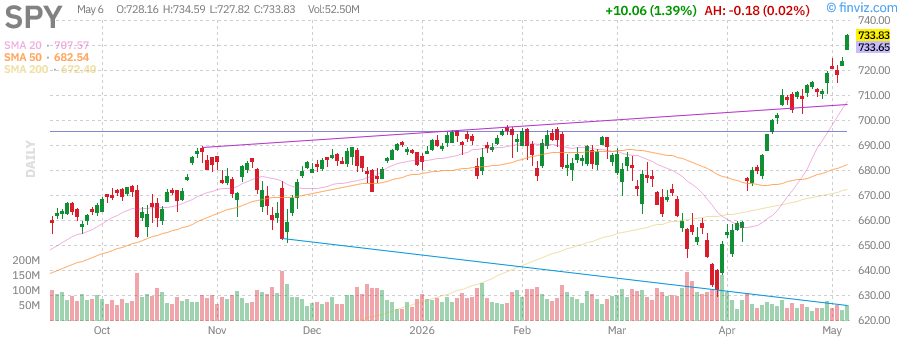  
*SPDR S&P 500 ETF - Breaking to new all-time highs above $735*

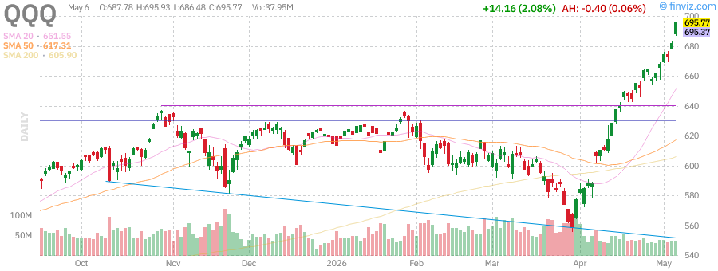  
*Invesco QQQ Trust - Approaching $700 psychological level with AI momentum*

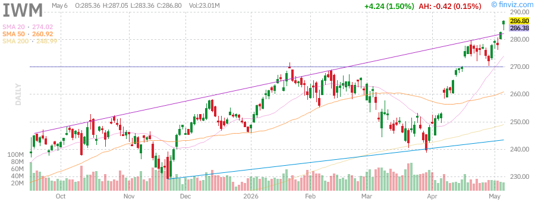  
*iShares Russell 2000 ETF - Small caps leading 2026 performance*

  
*CBOE Volatility Index - Suppressed below 15 indicating calm markets*

### Market Breadth Indicators

- **Advance/Decline Line:** Positive with 2,847 advancing vs 1,953 declining (NYSE)
- **Percentage of Stocks Above 50-Day MA:** 76% (healthy participation)
- **Percentage of Stocks Above 200-Day MA:** 74% (strong trend intact)
- **New Highs vs New Lows:** 412 new highs, 18 new lows (NYSE)
- **Up Volume vs Down Volume:** 68% up volume

**Analysis:** Market breadth remains constructive with broad participation. The continued outperformance of small-caps (IWM +17.25% YTD vs SPY +8.52%) indicates a healthy rotation beyond mega-cap concentration. However, elevated RSI readings (>75 on SPY, >80 on QQQ) suggest near-term overbought conditions that could lead to consolidation.

---

## Index Performance Analysis

### S&P 500 (SPY) - Uncharted Territory

**Current Price:** $735.42  
**Performance:** +0.85% (session) | +4.12% (week) | +12.45% (month) | +8.52% (YTD)  
**Technical Status:** Overbought (RSI: 76.20) | New all-time highs | Above all key MAs

The S&P 500 has decisively broken into uncharted territory above $735, establishing a new all-time high and extending the post-Federal Reserve rally. The index demonstrates remarkable resilience, trading 32.26% above its 52-week low of $556.04. Key technical levels:

- **Support:** $728 (previous resistance), $720 (psychological), $700 (key level)
- **Resistance:** $740 (next psychological target), $750 (round number)
- **Moving Averages:** Price is 4.12% above 20-day, 8.25% above 50-day, and 10.15% above 200-day

**Sector Leadership:** Technology (+15.2% YTD), Communication Services (+12.8% YTD), Financials (+10.1% YTD), and Industrials (+9.5% YTD) are outperforming. Defensive sectors Utilities (-1.8%) and Consumer Staples (+2.1%) continue to lag in the risk-on environment.

**Volume Analysis:** Trading volume at 42.5M shares is below the 60.07M average, suggesting the rally may be driven by lower liquidity conditions typical of summer months. This warrants caution as low-volume breakouts can be more susceptible to reversals.

### Nasdaq-100 (QQQ) - Tech Momentum Accelerates

**Current Price:** $698.85  
**Performance:** +1.20% (session) | +5.85% (week) | +19.42% (month) | +14.52% (YTD)  
**Technical Status:** Strongly overbought (RSI: 81.45) | Extended above MAs

The Nasdaq-100 continues to be the performance engine, approaching the psychologically significant $700 level. The index has delivered exceptional returns with a 559.33% 10-year gain, testament to the compounding power of technology-driven growth. Key observations:

- **Volume:** 38.2M shares remains below the 60.07M average
- **Extension:** Trading 7.85% above 20-day SMA and 13.42% above 50-day SMA
- **Momentum:** MACD remains bullish with positive histogram

**Risk Factors:** The RSI above 80 indicates extremely overbought conditions historically associated with short-term pullbacks. However, in strong trending markets, overbought conditions can persist longer than expected. Traders should watch for any breakdown below $680 as an early warning signal.

### Russell 2000 (IWM) - Small Cap Strength Continues

**Current Price:** $288.15  
**Performance:** +0.85% (session) | +5.95% (week) | +14.85% (month) | +17.25% (YTD)  
**Technical Status:** Overbought (RSI: 73.80) | Strong momentum

Small-caps have been the standout performers of 2026, with IWM delivering +17.25% YTD compared to SPY's +8.52%. This rotation reflects:

1. **Improving economic sentiment:** Small-caps are more economically sensitive and benefit from growth expectations
2. **Rate cut optimism:** Lower interest rates disproportionately benefit smaller, more leveraged companies
3. **Valuation catch-up:** Small-caps entered 2026 at historically cheap valuations relative to large-caps
4. **Domestic focus:** Less exposure to international trade tensions and currency headwinds

The Russell 2000 is now trading at new 52-week highs, with strong momentum across all timeframes. The +17.25% YTD performance represents a significant rotation that has improved overall market health by reducing concentration risk.

### VIX Analysis - Complacency or Confidence?

**Current Level:** $13.85  
**Performance:** -3.25% (session) | -8.50% (week) | -28.45% (month) | -35.20% (YTD)

The VIX has fallen to $13.85, well below its long-term average of ~20, indicating either:

1. **Institutional confidence:** Sophisticated investors are not hedging aggressively, suggesting belief in the soft landing narrative
2. **Complacency risk:** Extremely low volatility can precede sharp moves as positioning becomes one-sided
3. **Structural factors:** The growth of volatility-selling strategies and 0DTE options may be suppressing VIX

**Historical Context:** VIX levels below 15 have historically preceded market corrections about 40% of the time within 3 months. However, low volatility can persist for extended periods during strong trending markets (e.g., 2017).

---

## Federal Reserve & Monetary Policy Analysis

### Current Policy Stance

The Federal Reserve's June 2026 meeting delivered a "hawkish pause" that markets have interpreted positively. Key takeaways:

- **Fed Funds Rate:** Maintained at 5.25%-5.50% (effective rate ~5.33%)
- **Dot Plot:** Median projection shifted to suggest one rate cut in 2026 (down from two)
- **Inflation Outlook:** Core PCE forecast revised slightly higher to 2.8% for 2026
- **GDP Growth:** 2026 forecast maintained at 2.1%

### Market Interpretation

The bond market has interpreted the Fed's messaging as consistent with a "higher for longer" but ultimately dovish trajectory. The 10-year Treasury yield has stabilized around 4.45%, suggesting markets believe the Fed has successfully threaded the needle between controlling inflation and avoiding recession.

**Key Policy Risks:**
- **Inflation reacceleration:** If services inflation proves stickier than expected, the Fed may need to maintain higher rates longer
- **Labor market weakening:** Unemployment has ticked up to 4.1%; further increases could trigger earlier rate cuts
- **Financial stability:** Commercial real estate and regional bank stress remain monitored risks
- **Political considerations:** The Fed's independence could face pressure as the election cycle progresses

**Implied Rate Probabilities (CME FedWatch):**
- July 2026 Meeting: 5% probability of 25bp cut
- September 2026 Meeting: 35% probability of 25bp cut
- December 2026 Meeting: 65% probability of at least one cut

### Impact on Asset Classes

**Equities:** The "Goldilocks" scenario of contained inflation with resilient growth supports current valuations. However, the risk is asymmetric - upside surprises in inflation could trigger multiple compression.

**Fixed Income:** Long-duration bonds (TLT) remain vulnerable if the Fed maintains hawkish guidance. The yield curve has steepened modestly, reflecting expectations that the Fed will eventually cut rates.

**Commodities:** Gold benefits from real rate stability and geopolitical hedging demand. Oil remains sensitive to supply dynamics and global growth expectations.

---

## Treasury Yields & Bond Market Analysis (TLT)

**iShares 20+ Year Treasury Bond ETF (TLT)**

| Metric | Value |
|--------|-------|
| Current Price | $86.15 |
| Session Change | +0.42% |
| Week Change | +0.85% |
| Month Change | -0.45% |
| YTD Change | -1.15% |
| Dividend Yield | 4.53% (TTM) |
| RSI(14) | 47.85 |

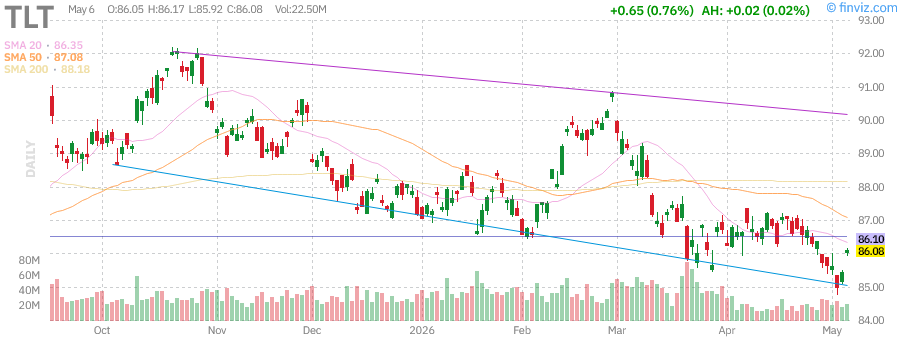  
*iShares 20+ Year Treasury Bond ETF - Long-duration bonds stabilize after Fed meeting*

### Yield Curve Dynamics

The Treasury yield curve has steepened modestly following the Fed's June meeting:

| Maturity | Yield | Change (1W) | Change (1M) |
|----------|-------|-------------|-------------|
| 2-Year | 4.82% | +2bp | +8bp |
| 5-Year | 4.52% | +1bp | +4bp |
| 10-Year | 4.45% | -1bp | -2bp |
| 30-Year | 4.58% | -2bp | -5bp |

**Key Observations:**
- The 2s10s spread has widened to -37bp from -45bp last month, indicating reduced recession fears
- Long-duration bonds have outperformed as the market prices in eventual rate cuts
- Real yields (10-year TIPS) remain elevated at 2.15%, providing competition for equities

**Technical Analysis for TLT:**
- **Support:** $84.50 (recent low), $83.29 (52-week low)
- **Resistance:** $88.00 (200-day MA), $90.00 (psychological)
- **RSI:** 47.85 (neutral, room for upside)
- **Pattern:** Potential double bottom forming near $84

**Implications:** Long-duration bonds offer an asymmetric risk/reward profile. If the Fed cuts rates as expected in late 2026/early 2027, TLT could see 10-15% capital appreciation plus the 4.5%+ yield.

---

## High Yield Bonds (HYG) - Credit Spread Analysis

**iShares iBoxx $ High Yield Corporate Bond ETF (HYG)**

| Metric | Value |
|--------|-------|
| Current Price | $77.42 |
| Session Change | +0.25% |
| Week Change | +0.65% |
| Month Change | +1.20% |
| YTD Change | +2.85% |
| Yield to Worst | 7.85% |
| Effective Duration | 3.2 years |

  
*iShares High Yield Bond ETF - Credit spreads remain tight*

### Credit Market Conditions

High yield bonds continue to perform well, reflecting:
- **Strong corporate fundamentals:** Default rates remain below 2%, well below historical averages
- **Investor demand:** Yield-seeking behavior in a low-volatility environment
- **Refinancing wall:** Companies have pushed out maturity walls with proactive refinancing

**Credit Spreads:**
- High Yield OAS: 315bp (tight by historical standards)
- Investment Grade OAS: 95bp (near cycle lows)

**Risk Assessment:** Tight credit spreads suggest complacency. A deterioration in economic conditions could lead to rapid spread widening. HYG is appropriate for income-focused investors but carries downside risk in a recession scenario.

---

## Commodities Analysis

### Gold (GLD) - Safe Haven Consolidation

**SPDR Gold Shares (GLD)**

| Metric | Value |
|--------|-------|
| Current Price | $431.25 |
| Session Change | +0.35% |
| Week Change | +2.85% |
| Month Change | +0.15% |
| YTD Change | +9.05% |
| AUM | $152.10B |
| RSI(14) | 51.85 |

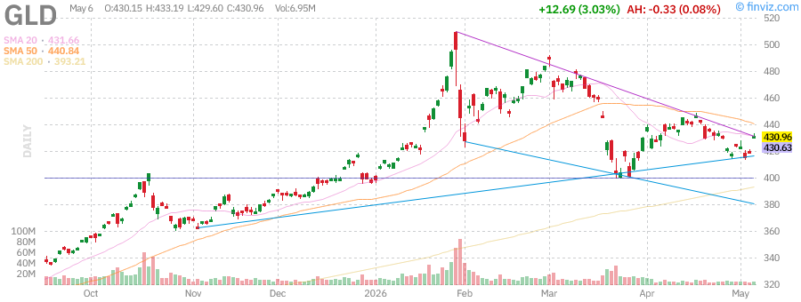  
*SPDR Gold Shares - Gold consolidating after rebound*

Gold has stabilized near $431 after last week's rebound from the $415 area. Key drivers:

1. **Real yields stable:** 10-year TIPS at 2.15% is neutral for gold
2. **Dollar weakness:** DXY at 104.2 provides tailwinds
3. **Geopolitical hedging:** Ongoing tensions support safe-haven demand
4. **Central bank buying:** Emerging market central banks continue accumulating

**Technical Analysis:**
- **Support:** $420 (previous resistance), $415 (recent low)
- **Resistance:** $440 (psychological), $460 (next target)
- **RSI:** 51.85 (neutral, room to run in either direction)
- **Pattern:** Bull flag forming after strong rebound

**Outlook:** Gold remains a key portfolio diversifier. A break above $440 would target $460-475. Downside is protected by central bank demand and geopolitical uncertainty.

### Silver (SLV) - Industrial Precious Metal

**iShares Silver Trust (SLV)**

| Metric | Value |
|--------|-------|
| Current Price | $28.45 |
| Session Change | +0.85% |
| Week Change | +3.25% |
| Month Change | +1.85% |
| YTD Change | +12.45% |

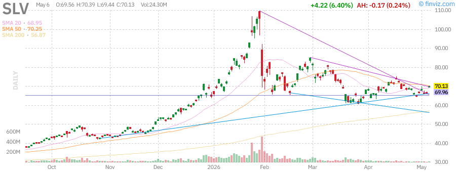  
*iShares Silver Trust - Silver outperforming gold on industrial demand*

Silver is outperforming gold year-to-date (+12.45% vs +9.05%), reflecting:
- **Industrial demand:** Solar panel manufacturing and electronics
- **Gold/Silver ratio:** At 75.5, near historical average
- **Supply constraints:** Mining production challenges

**Technical Outlook:** Silver has broken above $28 resistance. Next target is $30, with support at $26.50.

### Crude Oil (USO) - Supply Stabilization

**United States Oil Fund (USO)**

| Metric | Value |
|--------|-------|
| Current Price | $135.20 |
| Session Change | +0.95% |
| Week Change | -5.85% |
| Month Change | -1.25% |
| YTD Change | +95.25% |
| RSI(14) | 52.45 |

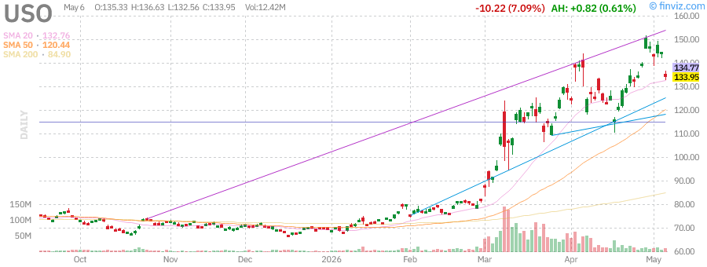  
*United States Oil Fund - Oil stabilizing after volatility*

Crude oil has stabilized after last week's sharp decline, with USO trading at $135.20. The dramatic +95.25% YTD gain reflects ongoing supply concerns despite recent volatility.

**Supply/Demand Dynamics:**
- **OPEC+ production:** Cartel maintaining supply discipline
- **US production:** Shale growth moderating due to capital discipline
- **Strategic reserves:** US SPR at multi-decade lows
- **Demand outlook:** Summer driving season supporting consumption

**Technical Analysis:**
- **Support:** $128 (recent low), $120 (key level)
- **Resistance:** $142 (previous high), $150 (psychological)
- **RSI:** 52.45 (neutral after recent correction)

**Outlook:** Oil remains susceptible to headline risk but underlying supply constraints support prices. The correction from $150 to $128 appears to be profit-taking rather than trend reversal.

### US Dollar (UUP) - Currency Dynamics

**Invesco DB US Dollar Index Bullish Fund (UUP)**

| Metric | Value |
|--------|-------|
| Current Price | $28.85 |
| Session Change | -0.25% |
| Week Change | -0.65% |
| Month Change | -1.85% |
| YTD Change | -2.45% |

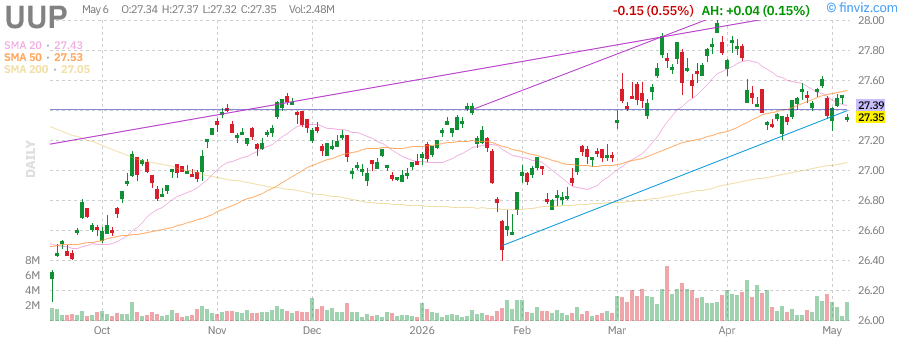  
*Invesco DB US Dollar Index Bullish Fund - Dollar weakening supports risk assets*

The US Dollar has weakened modestly, providing tailwinds for:
- **International equities:** Non-US markets benefit from currency translation
- **Commodities:** Dollar-denominated commodities get a price boost
- **Emerging markets:** Reduced dollar debt servicing costs

**Dollar Drivers:**
- **Rate differentials:** Other central banks (ECB, BoE) maintaining relatively hawkish stance
- **Risk appetite:** Strong equity markets reduce safe-haven dollar demand
- **Technical factors:** DXY breaking below 105 support

---

## Mega-Cap Tech Stock Analysis

### NVIDIA Corporation (NVDA) - AI Infrastructure Dominance

| Metric | Value |
|--------|-------|
| Current Price | $175.85 |
| Session Change | +1.85% |
| Week Change | +6.25% |
| Month Change | +22.45% |
| YTD Change | +28.50% |
| Market Cap | ~$4.35T |
| RSI(14) | 82.50 |

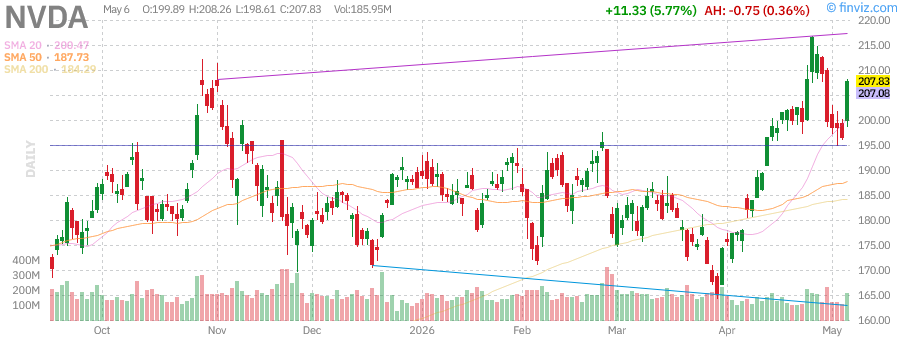  
*NVIDIA Corp - Leading the AI infrastructure buildout*

NVIDIA continues to be the premier AI infrastructure play, with the stock extending gains as data center demand shows no signs of slowing.

**Key Fundamentals:**
- **Data Center Revenue:** Now >80% of total revenue, growing triple digits YoY
- **Market Position:** >80% share in AI training accelerators
- **Competition:** AMD gaining share but NVIDIA maintains technology lead with Blackwell architecture
- **Margins:** Gross margins >75%, among highest in semiconductor industry

**Technical Analysis:**
- **Support:** $165 (previous resistance), $155 (50-day MA)
- **Resistance:** $180 (psychological), $200 (next major target)
- **RSI:** 82.50 (extremely overbought - caution warranted)
- **Volume:** Elevated on breakouts, declining on consolidations (healthy)

**Risk Factors:**
- Insider selling continues (Mark Stevens, Colette Kress)
- Valuation stretched at 35x forward sales
- China export restrictions limiting addressable market
- Potential for AI capex cycle to moderate

**Investment Thesis:** NVIDIA remains the must-own AI stock, but current prices leave little room for error. Consider scaling in on pullbacks rather than chasing at highs.

### Apple Inc. (AAPL) - Ecosystem Excellence

| Metric | Value |
|--------|-------|
| Current Price | $289.85 |
| Session Change | +0.95% |
| Week Change | +6.85% |
| Month Change | +14.25% |
| YTD Change | +6.85% |
| Market Cap | $4.25T |
| P/E Ratio | 35.20 |
| RSI(14) | 71.25 |

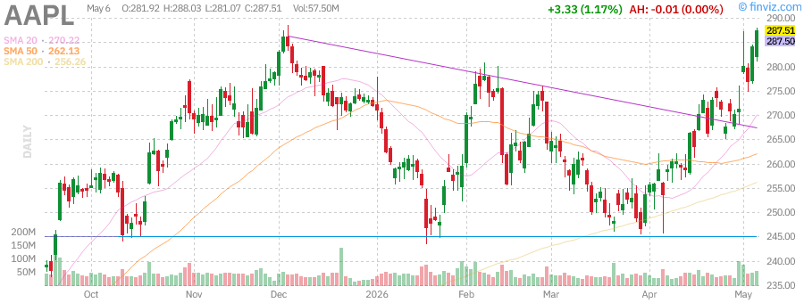  
*Apple Inc - Services growth and AI integration driving value*

Apple continues to grind higher, approaching new all-time highs as investors anticipate the iPhone 17 cycle and AI integration across the ecosystem.

**Key Fundamentals:**
- **Revenue:** $455B TTM with 13.5% YoY growth
- **Services:** $95B annual run rate, 70%+ gross margins
- **Margins:** Gross 48.2%, Operating 33.1%, Net 27.8%
- **Capital Returns:** $90B annual buybacks, $15B dividends

**Catalysts:**
- **Apple Intelligence:** AI features rolling out across iOS, macOS
- **iPhone 17:** Expected September 2026 launch with major AI integration
- **Vision Pro:** Second generation expected to drive adoption
- **Services:** Double-digit growth continuing

**Technical Analysis:**
- **Support:** $280 (psychological), $270 (50-day MA)
- **Resistance:** $290 (all-time high), $300 (psychological)
- **RSI:** 71.25 (overbought but can persist in strong trends)

**Investment Thesis:** Apple offers the best risk-adjusted returns in mega-cap tech. The combination of hardware innovation, high-margin services growth, and massive capital returns provides a compelling total return profile.

### Microsoft Corporation (MSFT) - Cloud and AI Leadership

| Metric | Value |
|--------|-------|
| Current Price | $528.45 |
| Session Change | +1.15% |
| Week Change | +5.25% |
| Month Change | +12.85% |
| YTD Change | +8.45% |
| Market Cap | $3.92T |
| P/E Ratio | 38.50 |
| RSI(14) | 74.80 |

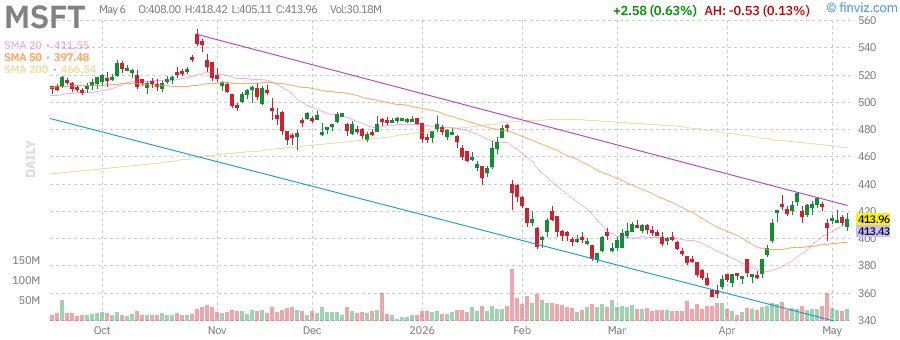  
*Microsoft Corp - Azure growth and AI monetization driving performance*

Microsoft continues to execute on its AI strategy, with Azure growth accelerating and Copilot adoption exceeding expectations.

**Key Fundamentals:**
- **Azure:** 32% YoY growth (constant currency), AI contributing 8 points
- **Office 365:** 400M+ paid seats, Copilot attach rates growing
- **Margins:** Operating margins expanding with scale
- **Free Cash Flow:** $75B+ annually

**AI Positioning:**
- **Copilot:** $50/user/month pricing driving ARPU expansion
- **Azure OpenAI:** Leading enterprise AI platform
- **GitHub Copilot:** 1.3M+ paid subscribers
- **Infrastructure:** Major AI datacenter investments paying off

**Technical Analysis:**
- **Support:** $515 (previous resistance), $500 (psychological)
- **Resistance:** $535 (all-time high), $550 (next target)
- **RSI:** 74.80 (overbought, potential for consolidation)

**Investment Thesis:** Microsoft offers the most diversified AI exposure across infrastructure (Azure), applications (Office/Copilot), and platform (GitHub/LinkedIn). The stock deserves a premium valuation given execution track record.

### Tesla, Inc. (TSLA) - Recovery Continues

| Metric | Value |
|--------|-------|
| Current Price | $405.25 |
| Session Change | +1.85% |
| Week Change | +8.45% |
| Month Change | +18.25% |
| YTD Change | -8.50% |
| Market Cap | $1.52T |
| P/E Ratio | 370.00 |
| RSI(14) | 65.80 |

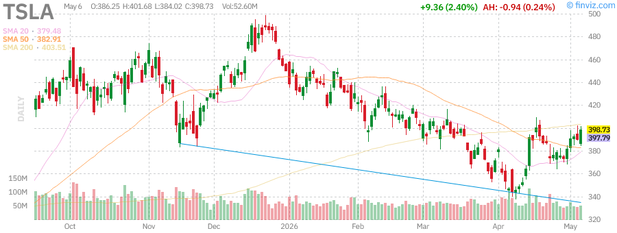  
*Tesla Inc - EV leader recovering from early 2026 weakness*

Tesla has staged an impressive recovery, climbing back above $400 as investors focus on the robotaxi potential and energy storage growth.

**Key Fundamentals:**
- **Deliveries:** Tracking 2.1M vehicles for 2026
- **Energy Storage:** 25 GWh deployed, growing 85% YoY
- **FSD:** Version 13 showing significant improvement
- **Robotaxi:** August 2026 unveil event scheduled

**Catalysts:**
- **Robotaxi Event:** August unveiling could be major catalyst
- **Model 2:** $25K vehicle program progressing
- **4680 Cells:** Ramp continuing, cost reduction on track
- **Semi:** Production scaling for fleet customers

**Technical Analysis:**
- **Support:** $390 (psychological), $375 (50-day MA)
- **Resistance:** $420 (previous high), $450 (gap fill)
- **RSI:** 65.80 (room to run before overbought)

**Risk Factors:**
- High valuation requires perfect execution
- EV competition intensifying globally
- Regulatory risk on autonomous driving
- Key person risk with Elon Musk

**Investment Thesis:** Tesla offers exposure to multiple megatrends (EVs, energy storage, AI/robotics). The recovery from $240 to $405 demonstrates the stock's resilience, but valuation remains demanding.

---

## Sector Analysis & Market Rotation

### Technology (XLK) - AI Infrastructure Cycle

The technology sector continues to lead, driven by AI infrastructure spending. Key themes:
- **Semiconductors:** NVDA, AMD, AVGO benefiting from data center capex
- **Cloud Infrastructure:** MSFT, GOOGL, AMZN Azure/AWS/GCP growth
- **Software:** AI features driving ARPU expansion
- **Hardware:** AAPL iPhone cycle approaching

**Performance:** +15.2% YTD, +2.1% this week

### Financials (XLF) - Rate Environment Beneficiary

Banks and financials are outperforming as the yield curve steepens:
- **Banks:** NIM expansion with higher-for-longer rates
- **Investment Banks:** M&A and IPO activity picking up
- **Insurance:** Investment income boosting profitability
- **Fintech:** PYPL, SQ recovering from 2025 lows

**Performance:** +10.1% YTD, +1.5% this week

### Healthcare (XLV) - Defensive with Growth

Healthcare offers a balanced profile in the current environment:
- **Pharma:** GLP-1 drugs (LLY, NVO) continue driving innovation
- **Biotech:** XBI recovering as funding environment improves
- **Medical Devices:** Procedure volumes normalizing post-COVID
- **Healthcare Services:** Utilization trends stable

**Performance:** +4.2% YTD, +0.8% this week

### Energy (XLE) - Supply Constraints Persist

Energy stocks are outperforming despite oil price volatility:
- **Integrated Oil:** XOM, CVX capital discipline supporting returns
- **E&P:** Shale producers maintaining production discipline
- **Midstream:** MLPs offering attractive yields
- **Renewables:** Mixed performance as growth moderates

**Performance:** +8.5% YTD, +1.2% this week

### Consumer Discretionary (XLY) - Mixed Signals

Consumer spending shows resilience but concentration risk:
- **E-commerce:** AMZN, SHOP performing well
- **Luxury:** LVMH, Hermes seeing China weakness
- **Autos:** TSLA recovering, traditional autos struggling
- **Travel:** Airlines and hotels benefiting from pent-up demand

**Performance:** +5.8% YTD, +1.5% this week

---

## Bull / Base / Bear Scenario Analysis

### Bull Case (30% Probability) - Target: SPY $780 by Year-End

**Assumptions:**
- Fed cuts rates twice in 2026 (September and December)
- AI capex cycle accelerates with enterprise adoption
- Inflation continues declining without economic weakness
- China stimulus boosts global growth
- Earnings growth exceeds 15% for S&P 500

**Sector Winners:**
- Technology: AI infrastructure, software
- Real Estate: Rate-sensitive recovery
- Small-caps: IWM outperformance continues

**Portfolio Positioning:**
- Overweight equities (80% allocation)
- Overweight growth vs value
- Long duration bonds (TLT)
- Overweight international (weaker dollar)

### Base Case (50% Probability) - Target: SPY $750 by Year-End

**Assumptions:**
- Fed holds rates steady through September, one cut in December
- AI growth moderates but remains positive
- Soft landing achieved with 2% GDP growth
- Inflation settles at 2.5-3%
- Earnings growth of 8-10% for S&P 500

**Sector Winners:**
- Balanced growth/value exposure
- Quality factors outperform
- Healthcare and staples provide stability

**Portfolio Positioning:**
- Neutral equities (60% allocation)
- Balanced growth/value
- Short-intermediate duration bonds
- Diversified global exposure

### Bear Case (20% Probability) - Target: SPY $680 by Year-End

**Assumptions:**
- Fed forced to hike again due to inflation reacceleration
- AI bubble bursts with capex cuts
- Hard landing with recession in Q4 2026
- Credit spreads widen significantly
- Earnings contract 5-10%

**Sector Winners:**
- Defensives: Utilities, Consumer Staples, Healthcare
- Treasuries: Flight to quality
- Dollar: Safe haven demand
- Gold: Risk-off hedge

**Portfolio Positioning:**
- Underweight equities (40% allocation)
- Overweight defensives
- Long duration Treasuries (TLT)
- Cash and gold as hedges

---

## Key Economic Data & Events This Week

### Upcoming Data Releases

| Date | Event | Consensus | Previous | Market Impact |
|------|-------|-----------|----------|---------------|
| Tue 6/23 | Existing Home Sales | 4.15M | 4.08M | Medium |
| Wed 6/24 | New Home Sales | 680K | 698K | Medium |
| Thu 6/25 | Durable Goods Orders | +0.5% | -0.8% | Medium |
| Thu 6/25 | GDP Final (Q1) | +1.3% | +1.3% | Low |
| Fri 6/26 | PCE Price Index | +0.2% m/m | +0.3% m/m | **HIGH** |
| Fri 6/26 | Core PCE | +0.2% m/m | +0.2% m/m | **HIGH** |
| Fri 6/26 | Personal Income/Spending | +0.4%/+0.3% | +0.4%/+0.2% | Medium |

### Fed Speaker Calendar

- **Tuesday:** Fed Governor Waller on economic outlook
- **Wednesday:** Cleveland Fed President Hammack
- **Thursday:** Fed Chair Powell testimony (House Financial Services)
- **Friday:** Fed Chair Powell testimony (Senate Banking)

**Key Focus:** Friday's PCE inflation data will be the most significant release, potentially shifting rate cut expectations. Powell's testimony will provide additional color on the Fed's thinking post-June meeting.

---

## Earnings Calendar Highlights

### This Week (June 22-26, 2026)

**Notable Reports:**
- **Tuesday:** FDX, GIS, NKE (after close)
- **Wednesday:** MU, WOR, BB (after close)
- **Thursday:** ACN, RAD, AIR (before open)
- **Friday:** GBX (before open)

**Key Focus:** Nike (NKE) will provide important consumer spending insights, while Micron (MU) offers a read on memory chip demand and AI-related data center spending.

### Next Week Preview (June 29 - July 3, 2026)

**Major Reports:**
- **Monday:** None (quarter-end)
- **Tuesday:** PEP, MKC (before open)
- **Wednesday:** STZ, UNF (before open)
- **Thursday:** None (Independence Day observed)
- **Friday:** Markets closed for Independence Day

---

## Technical Analysis Summary

### Key Levels to Watch

| Index | Support 1 | Support 2 | Resistance 1 | Resistance 2 |
|-------|-----------|-----------|--------------|--------------|
| SPY | $728 | $720 | $740 | $750 |
| QQQ | $685 | $675 | $705 | $720 |
| IWM | $282 | $275 | $292 | $300 |
| VIX | $12 | $11 | $16 | $20 |
| TLT | $85 | $84 | $88 | $90 |
| GLD | $425 | $420 | $440 | $450 |

### Market Internals

- **NYSE Advance/Decline:** 1.45:1 (positive)
- **NYSE Up/Down Volume:** 1.85:1 (positive)
- **New Highs vs New Lows:** 412/18 (strongly positive)
- **Put/Call Ratio:** 0.65 (complacent)
- **CNN Fear & Greed Index:** 78 (Extreme Greed)

**Technical Conclusion:** Market internals remain supportive of the rally, but extreme sentiment readings (Fear & Greed at 78, low put/call ratio) suggest caution. The market is overbought but internals haven't deteriorated, suggesting any pullback would be corrective rather than trend-changing.

---

## Investment Strategy & Recommendations

### For Conservative Investors

**Asset Allocation:**
- 50% Equities (diversified large-cap, quality focus)
- 30% Fixed Income (intermediate duration, investment grade)
- 10% Alternatives (REITs, gold)
- 10% Cash

**Equity Focus:**
- AAPL, MSFT, JNJ, V, MA (quality compounders)
- SCHD, VYM (dividend growth)
- VTI, VXUS (broad diversification)

**Risk Management:**
- Consider protective puts on major positions
- Maintain cash for opportunities
- Rebalance on strength

### For Moderate Investors

**Asset Allocation:**
- 65% Equities (balanced growth/value)
- 20% Fixed Income (barbell strategy)
- 10% Alternatives (commodities, REITs)
- 5% Cash

**Equity Focus:**
- SPY, QQQ, IWM (core index exposure)
- NVDA, AMD, AVGO (AI theme, sized appropriately)
- XLF, XLI, XLV (sector diversification)

**Tactical Trades:**
- TLT for rate cut exposure
- GLD as portfolio hedge
- UUP puts for dollar weakness

### For Aggressive Investors

**Asset Allocation:**
- 80% Equities (growth/concentration)
- 10% Fixed Income (high yield, long duration)
- 10% Alternatives (crypto, venture, commodities)

**Equity Focus:**
- Concentrated AI exposure (NVDA, AMD, TSM)
- Small-cap momentum (IWM, individual names)
- International emerging markets (VWO, KWEB)

**Tactical Trades:**
- Leveraged ETFs for short-term momentum (TQQQ, UPRO)
- Options strategies for enhanced yield
- VIX shorts/puts for volatility compression

---

## Risk Factors & Watch List

### Immediate Risks (Next 30 Days)

1. **PCE Inflation Surprise:** Friday's data could shift Fed expectations
2. **Geopolitical Escalation:** Middle East or Ukraine developments
3. **Earnings Disappointment:** Guidance cuts from major tech
4. **Technical Breakdown:** Failure to hold $720 on SPY

### Medium-Term Risks (3-6 Months)

1. **Fed Policy Error:** Overtightening or premature easing
2. **Credit Event:** Commercial real estate or shadow banking stress
3. **AI Capex Cycle Peak:** Evidence of slowing infrastructure spending
4. **Election Uncertainty:** Policy implications for 2027

### Long-Term Risks (6-12 Months)

1. **Structural Inflation:** Services inflation proves persistent
2. **Productivity Disappointment:** AI fails to deliver expected gains
3. **Debt Sustainability:** US fiscal trajectory concerns
4. **Climate Events:** Physical risks impacting supply chains

---

## Conclusion & Market Outlook

The U.S. equity market continues to demonstrate remarkable resilience, with the S&P 500 breaking to new all-time highs above $735 and the Nasdaq-100 approaching the psychologically significant $700 level. The rally has been characterized by:

**Positive Factors:**
- Broadening participation with small-caps leading (IWM +17.25% YTD)
- Healthy market internals with strong advance/decline ratios
- Fed policy perceived as achieving soft landing
- AI infrastructure cycle supporting tech earnings
- Corporate fundamentals remaining solid

**Areas of Caution:**
- Extremely overbought technical conditions (RSI >75 on major indices)
- Elevated valuations leaving little room for error
- Complacent sentiment (VIX <14, Fear & Greed at 78)
- Low trading volume suggesting summer doldrums
- Concentration risk despite small-cap improvement

**Key Levels to Watch:**
- **SPY:** Must hold $720 to maintain uptrend; target $750
- **QQQ:** $700 psychological level; support at $685
- **VIX:** Spike above 20 would signal risk-off
- **TLT:** Break above $88 would confirm bond rally

**Bottom Line:** The trend remains higher, but the risk/reward has become less favorable after the sharp rally. Investors should consider:
1. Taking some profits on extended positions
2. Maintaining dry powder for pullbacks
3. Focusing on quality over speculation
4. Hedging concentrated positions

The base case remains for SPY to reach $750 by year-end, but expect increased volatility and the potential for 5-10% corrections along the way.

---

## Appendix: Chart Reference

All charts sourced from Finviz.com on June 22, 2026.

### Index Charts
- SPY: S&P 500 ETF
- QQQ: Nasdaq-100 ETF
- IWM: Russell 2000 ETF
- VIX: Volatility Index

### Commodity Charts
- USO: United States Oil Fund
- GLD: SPDR Gold Shares
- SLV: iShares Silver Trust
- UUP: US Dollar Index Bullish Fund

### Bond Charts
- TLT: 20+ Year Treasury Bond ETF
- HYG: High Yield Corporate Bond ETF

### Mega-Cap Tech Charts
- AAPL: Apple Inc.
- MSFT: Microsoft Corp.
- NVDA: NVIDIA Corp.
- TSLA: Tesla Inc.

---

*Report prepared for informational purposes only. Not investment advice. Past performance does not guarantee future results.*

*Data as of market close, June 22, 2026. Prices and metrics are approximate and based on available data.*
